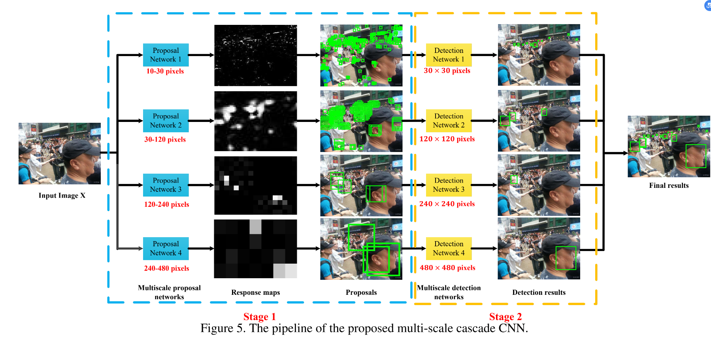

WIDER FACE: A Face Detection Benchmark


# 0 Abstract
Face detection is one of the most studied topics in the computer vision community. Much of the progresses have been made by the availability of face detection benchmark datasets. We show that there is a gap between current face detection performance and the real world requirements. To facilitate future face detection research, we introduce the WIDER FACE dataset1 , which is 10 times larger than existing datasets. The dataset contains rich annotations, including occlusions, poses, event categories, and face bounding boxes. Faces in the proposed dataset are extremely challenging due to large variations in scale, pose and occlusion, as shown in Fig. 1. Furthermore, we show that WIDER FACE dataset is an effective training source for face detection. We benchmark several representative detection systems, providing an overview of state-of-the-art performance and propose a solution to deal with large scale variation. Finally, we discuss common failure cases that worth to be further investigated.

人脸检测是计算机视觉社区中研究最多的主题之一。人脸检测基准数据集的可用性已取得了许多进展。我们表明，当前的人脸检测性能与实际需求之间存在差距。为了促进将来的面部检测研究，我们引入了WIDER FACE数据集1，它是现有数据集的10倍。数据集包含**丰富的注释**，包括**遮挡、姿势、事件类别和面部边界框**。如图1所示，由于比例尺，姿势和遮挡的较大变化，建议数据集中的人脸极具挑战性。此外，我们证明WIDER FACE数据集是有效的人脸检测训练源。我们对几个代表性的检测系统进行了基准测试，提供了最新性能的概述，并提出了应对大规模变化的解决方案。最后，我们讨论了值得进一步调查的常见故障案例。


# 1. Introduction

Face detection is a critical step to all facial analysis algorithms, including face alignment, face recognition, face verification, and face parsing. Given an arbitrary image, the goal of face detection is to determine the presence of faces in the image and, if present, return the image location and extent of each face [27]. While this appears as an effortless task for human, it is a very difficult task for computers. The challenges associated with face detection can be attributed to variations in pose, scale, facial expression, occlusion, and lighting condition, as shown in Fig. 1. Face detection has made significant progress after the seminal work by Viola and Jones [21]. Modern face detectors can easily detect near frontal faces and are widely used in real world applications, such as digital camera and electronic photo album. Recent research [2, 14, 17, 24, 28] in this area focuses on the unconstrained scenario, where a number of intricate factors such as extreme pose, exaggerated expressions, and large portion of occlusion can lead to large visual variations in face appearance. 

```
album           n. 相簿；唱片集；集邮簿；签名纪念册
intricate       adj. 复杂的；错综的，缠结的
```
人脸检测是所有人脸分析算法（包括人脸对齐，人脸识别，人脸验证和人脸解析）的关键步骤。给定任意图像，面部检测的目标是确定图像中是否存在面部，如果存在，则返回每个面部的图像位置和范围[27]。尽管这对于人类来说似乎是一项轻松的任务，但对于计算机而言却是非常困难的任务。如图1所示，与面部检测相关的挑战可以归因于**姿势、比例、面部表情、遮挡和光照条件的变化**。在Viola和Jones [21]的开创性工作之后，面部检测取得了重大进展。 ]。现代的面部检测器可以轻松检测正面的面部，并已广泛用于现实应用中，例如数码相机和电子相册。该领域的最新研究[2、14、17、24、28]专注于不受约束的场景，在这种场景中，许多复杂的因素（例如极端的姿势，夸张的表情以及大部分遮挡可能导致面部外观出现较大的视觉变化） 。


Publicly available benchmarks such as FDDB [11], AFW [30], PASCAL FACE [23], have contributed to spurring interest and progress in face detection research. However, as algorithm performance improves, more challenging datasets are needed to trigger progress and to inspire novel ideas. Current face detection datasets typically contain a few thousand faces, with limited variations in pose, scale, facial expression, occlusion, and background clutter, making it difficult to assess for real world performance. As we will demonstrate, the limitations of datasets have partially contributed to the failure of some algorithms in coping with heavy occlusion, small scale, and atypical pose.

```
spurring            vt. 鼓动，激励；使更快发生；加速（spur 的现在分词）
spur                n. 马刺；鞭策；山嘴；（公路或铁路的）支线；骨刺
                    v. 用踢马刺驱马前进；激励；促进；紧贴主干剪短（副梢)
trigger             n. 扳机；起因，引起反应的事；触发器，引爆装置
                    v. 触发，引起；开动（装置）
```

诸如FDDB [11]，AFW [30]，PASCAL FACE [23]等公开可用的基准有助于激发人们对面部检测研究的兴趣和进展。 但是，随着算法性能的提高，需要更多具有挑战性的数据集来触发进度并激发新颖的想法。 当前的面部检测数据集通常包含数千个面部，其姿势/比例/面部表情/遮挡和背景杂乱的变化有限，因此很难评估真实世界的性能。 正如我们将证明的那样，数据集的局限性在某种程度上导致了某些算法在应对重度遮挡，小比例尺和非典型姿势方面的失败。


In this work, we make three contributions. (1) We introduce a large-scale face detection dataset called WIDER FACE. It consists of 32, 203 images with 393, 703 labeled faces, which is 10 times larger than the current largest face detection dataset [12]. The faces vary largely in appearance, pose, and scale, as shown in Fig. 1. In order to quantify different types of errors, we annotate multiple attributes: occlusion, pose, and event categories, which allows in depth analysis of existing algorithms. (2) We show an example of using WIDER FACE through proposing a multi-scale two-stage cascade framework, which uses divide and conquer strategy to deal with large scale variations. Within this framework, a set of convolutional networks with various size of input are trained to deal with faces with a specific range of scale. (3) We benchmark four representative algorithms [17, 21, 24, 28], either obtained directly from the original authors or reimplemented using open-source codes. We evaluate these algorithms on different settings and analyze conditions in which existing methods fail.

在这项工作中，我们做出了三点贡献。 
（1）我们介绍了一个称为WIDER FACE的大规模人脸检测数据集。它由32张，203张图像和393张，703张带标签的面部组成，比当前最大的面部检测数据集[10]大10倍。这些面孔的外观，姿势和比例有很大不同，如图1所示。为了量化不同类型的错误，我们注释了多个属性：遮挡，姿势和事件类别，这允许对现有算法进行深度分析。 
（2）通过提出一个多尺度的两阶段级联框架，展示了使用WIDER FACE的示例，该框架使用分而治之的策略来处理大规模的变化。在此框架内，训练了一组具有各种输入大小的卷积网络，以处理特定比例范围的人脸。 
（3）我们对四种代表性算法[17、21、24、28]进行基准测试，这些算法可以直接从原始作者那里获得，也可以使用开放源代码重新实现。我们在不同的设置下评估这些算法，并分析现有方法失败的情况。


# 2. Related Work

Brief review of recent face detection methods: Face
detection has been studied for decades in the computer
vision literature. Modern face detection algorithms can
be categorized into four categories: cascade based methods [2, 10, 15, 16, 21], part based methods [19, 23, 30],
channel feature based methods [25, 24], and neural network
based methods [6, 14, 25, 28]. Here we highlight a few notable studies. A detailed survey can be found in [27, 29].
The seminal work by Viola and Jones [21] introduces integral image to compute Haar-like features in constant time.
These features are then used to learn AdaBoost classifier
with cascade structure for face detection. Various later studies follow a similar pipeline. Among those variants, SURF
cascade [15] achieves competitive performance. Chen et
al. [2] learn face detection and alignment jointly in the same
cascade framework and obtain promising detection performance.

```
literature          n. 文学；文献；文艺；著作
```

简要回顾一下最近的面部检测方法：面部检测已经在计算机中研究了数十年视觉文献。 现代人脸检测算法可以分为四类：**基于级联的方法**[2、10、15、16、21]，**基于部分的方法**[19、23、30]，**基于通道特征的方法**[25，24]和**基于神经网络方法**[6，14，25，28]。 在这里，我们重点介绍一些值得注意的研究。 详细的调查可以在[27，29]中找到。Viola和Jones [21]的开创性工作引入了积分图像，以在恒定时间内计算类似Haar的特征。然后使用这些功能来学习AdaBoost分类器具有用于人脸检测的级联结构。 以后的各种研究也遵循类似的流程。 在这些变体中，SURF级联[15]实现了竞争性能。 陈等等 [2]一起学习人脸检测和对齐级联框架并获得有希望的检测性能。


One of the well-known part based methods is deformable part models (DPM) [7]. Deformable part models define face as a collection of parts and model the connections of parts through Latent Support Vector Machine. The part based methods are more robust to occlusion compared with cascade-based methods. A recent study [17] demonstrates state-of-the art performance with just a vanilla DPM, achieving better results than more sophisticated DPM variants [23, 30]. Aggregated channel feature (ACF) is first proposed by Dollar et al. [3] to solve pedestrian detection. Later on, Yang et al. [24] applied this idea on face detection. In particular, features such as gradient histogram, integral histogram, and color channels are combined and used to learn boosting classifier with cascade structure. Recent studies [14, 28] show that face detection can be further improved by using deep learning, leveraging the high capacity of deep convolutional networks. We anticipate that the new WIDER FACE data can benefit deep convolutional network that typically requires large amount of data for training.

```
vanilla         n. 香子兰，香草
                adj. 香草味的
sophisticate    v. 弄复杂；使变得世故；曲解；（老练地）讲话
                adj. 老于世故的
                n. 久经世故的人；精通时尚和文化的人
pedestrian      adj. 徒步的；缺乏想像力的
                n. 行人；步行者
aggregate       n. 合计；集合体；总计；集料
                adj. 聚合的；集合的；合计的
                v. 集合；聚集；合计
```

一种基于零件的著名方法是可变形零件模型（DPM）[7]。可变形零件模型将面定义为零件的集合，并通过潜在支持向量机对零件的连接进行建模。与基于级联的方法相比，基于零件的方法在遮挡方面更强大。最近的一项研究[17]展示了仅使用普通DPM的最新性能，比更复杂的DPM变体[23，30]取得了更好的结果。 Dollar等人首先提出了聚合信道特征（ACF）。 [3]解决行人检测。后来，杨等人。 [24]将此思想应用于人脸检测。特别地，诸如梯度直方图，整体直方图和颜色通道之类的特征被组合并用于学习具有级联结构的增强分类器。最近的研究[14，28]表明，通过使用深度学习，并利用深度卷积网络的高容量，可以进一步改善人脸检测。我们预计，新的WIDER FACE数据可以使通常需要大量数据进行训练的深度卷积网络受益。


Existing datasets: We summarize some of the well-known face detection datasets in Table 1. AFW [30], FDDB [11], and PASCAL FACE [23] datasets are most widely used in face detection. The AFW dataset is built using Flickr images. It has 205 images with 473 labeled faces. For each face, annotations include a rectangular bounding box, 6 landmarks and the pose angles. The FDDB dataset contains the annotations for 5, 171 faces in a set of 2, 845 images. PASCAL FACE consists of 851 images and 1, 341 annotated faces. Compared with AFW, FDDB, and PASCAL FACE datasets, the AFLW [13] dataset is used as training source for face detection. AFLW dataset contains 21, 997 images and 25, 993 annotated faces with 21 landmarks for each face. IJB-A [12] is proposed for face detection and face recognition. IJB-A contains 24, 327 images and 49, 759 faces. MALF is the first face detection dataset that supports fine-gained evaluation. MALF [26] consists of 5, 250 images and 11, 931 faces. The FDDB dataset has helped driving recent advances in face detection. However, it is collected from the Yahoo! news website which biases toward celebrity faces. The AFW and PASCAL FACE datasets contain only a few hundred images and has limited variations in face appearance and background clutter. The IJB-A and AFLW datasets have large quantity of labeled data; however, occlusion and pose are not annotated. The MAFL dataset labels fine-grained face attributes such as occlusion, pose and expression. The number of images and faces are relatively small. Due to the limited variations in existing datasets, the performance of recent face detection algorithms saturates on current face detection benchmarks. For instance, on AFW, the best performance is 97.2% AP; on FDDB, the highest recall is 91.74%; on PASCAL FACE, the best result is 92.11% AP. The best few algorithms have only marginal difference.


现有数据集：我们在表1中总结了一些著名的面部检测数据集。AFW[30]，FDDB [11]和PASCAL FACE [23]数据集在面部检测中使用最广泛。 
**AFW**数据集是使用Flickr图像构建的。它具有205张带有473个标记面部的图像。对于每个面孔，注释都包括一个矩形边界框，6个界标和姿势角度。 
**FDDB**数据集包含2个845图像集中的5个171个面的注释。 
**PASCAL FACE**由851张图像和1,341张带注释的面孔组成。
**AFLW** ：与AFW，FDDB和PASCAL FACE数据集相比，**AFLW** [13]数据集被用作面部检测的训练源。 AFLW数据集包含21张997张图像和25张993张带注释的面部，每个面部都有21个界标。
**IJB-A** [12]被提议用于人脸检测和人脸识别。 IJB-A包含24、327张图像和49、759张脸。 
**MALF**是第一个支持精细评估的面部检测数据集。马尔夫[26]包含5,250张图像和11,931张脸。 

FDDB数据集帮助推动了面部检测的最新进展。但是，它是从Yahoo!收集的。偏向名人面孔的新闻网站。 AFW和PASCAL FACE数据集仅包含几百张图像，并且面部外观和背景杂乱程度的变化有限。 IJB-A和AFLW数据集具有大量标记数据。但是，没有注释遮挡和姿势。 MAFL数据集标记了细粒度的面部属性，例如遮挡，姿势和表情。图像和面部的数量相对较少。由于现有数据集的变化有限，因此最新的面部检测算法的性能在当前的面部检测基准上达到饱和。例如，在AFW上，最佳性能是AP的97.2％。在FDDB上，最高召回率为91.74％；在PASCAL FACE上，最佳结果是92.11％AP。最好的几种算法只有边际差异。

# 3. WIDER FACE Dataset
## 3.1. Overview


To our knowledge, WIDER FACE dataset is currently  the largest face detection dataset, of which images are selected from the publicly available WIDER dataset [22]. We choose 32, 203 images and label 393, 703 faces with a high degree of variability in scale, pose and occlusion as depicted in Fig. 1. WIDER FACE dataset is organized based on 60 event classes. For each event class, we randomly select 40%/10%/50% data as training, validation and testing sets. Here, we specify two training/testing scenarios: 
* Scenario-Ext: A face detector is trained using any external data, and tested on the WIDER FACE test partition. 
* Scenario-Int: A face detector is trained using WIDER FACE training/validation partitions, and tested on WIDER FACE test partition.

据我们所知，WIDER FACE数据集是目前最大的面部检测数据集，其图像是从可公开获得的WIDER数据集中选择的[22]。 我们选择32、203张图像，并在393、703张标注的比例，姿势和遮挡高度可变的面部，如图1所示。WIDER FACE数据集基于60个事件类别进行组织。 对于每个事件类别，我们随机选择40％/ 10％/ 50％数据作为训练，验证和测试集。 在这里，我们指定了两种训练/测试方案：
* Scenario-Ext： 使用任何外部数据训练面部检测器，并在WIDER FACE测试分区上进行测试。
* Scenario-Int： 使用WIDER FACE训练/验证分区对人脸检测器进行训练，并在WIDER FACE测试分区上进行测试。


We adopt the same evaluation metric employed in the PASCAL VOC dataset [5]. Similar to MALF [26] and Caltech [4] datasets, we do not release bounding box ground truth for the test images. Users are required to submit final prediction files, which we shall proceed to evaluate.

我们采用PASCAL VOC数据集[5]中采用的相同评估指标。 与MALF [26]和Caltech [4]数据集相似，我们不发布测试图像的边框真值。 用户需要提交最终的预测文件，我们将对其进行评估。


## 3.2. Data Collection

**Collection methodology.**
WIDER FACE dataset is a subset of the WIDER dataset [22]. The images in WIDER were collected in the following three steps: 1) Event categories were defined and chosen following the Large Scale Ontology for Multimedia (LSCOM) [18], which provides around 1, 000 concepts relevant to video event analysis. 2) Images are retrieved using search engines like Google and Bing. For each category, 1, 000-3, 000 images were collected. 3) The data were cleaned by manually examining all the images and filtering out images without human face. Then, similar images in each event category were removed to ensure large diversity in face appearance. A total of 32,203 images are eventually included in the WIDER FACE dataset.


**Annotation policy.**
We label the bounding boxes for all the recognizable faces in the WIDER FACE dataset. The bounding box is required to tightly contain the forehead, chin, and cheek, as shown in Fig. 2. If a face is occluded, we still label it with a bounding box but with an estimation on the scale of occlusion. Similar to the PASCAL VOC dataset [5], we assign an ‘Ignore’ flag to any face which is very difficult to be recognized due to low resolution and small scale (10 pixels or less). After annotating the face bounding boxes, we further annotate the following attributes: pose (typical, atypical) and occlusion level (partial, heavy). Each annotation is labeled by one annotator and cross-checked by two different people.


**收集方法。**
WIDER FACE数据集是WIDER数据集的子集[22]。 WIDER中的图像通过以下三个步骤收集：1）根据大型多媒体本体（LSCOM）[18]定义和选择事件类别，该类别提供了大约1，000个与视频事件分析相关的概念。 2）使用Google和Bing等搜索引擎检索图像。对于每个类别，收集了1,000-3,000张图像。 3）通过手动检查所有图像并过滤掉没有人脸的图像来清理数据。然后，删除每个事件类别中的相似图像，以确保面部外观具有较大的多样性。最终，WIDER FACE数据集中总共包含32,203张图像。


**注释政策。**
我们在WIDER FACE数据集中为所有可识别的面标记边界框。如图2所示，要求边框必须紧紧地容纳额头，下巴和脸颊。如果遮挡了面部，我们仍将边框标记为边框，但要估计遮挡的范围。与PASCAL VOC数据集[5]相似，我们为任何分辨率低且比例较小（小于或等于10像素）的人脸都分配了“忽略”标志。在对面部边界框进行注释之后，我们进一步对以下属性进行注释：姿势（典型，非典型）和遮挡级别（局部，较重）。每个注释由一个注释器标记，并由两个不同的人进行交叉检查。


## 3.3. Properties of WIDER FACE
WIDER FACE dataset is challenging due to large variations in scale, occlusion, pose, and background clutter. These factors are essential to establishing the requirements for a real world system. To quantify these properties, we use generic object proposal approaches [1, 20, 31], which are specially designed to discover potential objects in an image (face can be treated as an object). Through measuring the number of proposals vs. their detection rate of faces, we can have a preliminary assessment on the difficulty of a dataset and potential detection performance. In the following assessments, we adopt EdgeBox [31] as object proposal, which has good performance in both accuracy and efficiency as evaluated in [9].

WIDER FACE数据集因比例，遮挡，姿势和背景杂波的巨大差异而具有挑战性。 这些因素对于建立现实系统的要求至关重要。 为了量化这些属性，我们使用通用的对象建议方法[1、20、31]，这些方法专门用于发现图像中的潜在对象（可以将面部视为对象）。 通过测量提议的数量及其面孔检测率，我们可以对数据集的难度和潜在的检测性能进行初步评估。 在以下评估中，我们采用EdgeBox [31]作为对象建议，如[9]中所评估的那样，它在准确性和效率上都具有良好的性能。


Overall. Fig. 3(a) shows that WIDER FACE has a much
lower detection rate compared with other face detection
datasets. The results suggest that WIDER FACE is a more
challenging face detection benchmark compared to existing datasets. Following the principles in KITTI [8] and
MALF [26] datasets, we define three levels of difficulty:
‘Easy’, ‘Medium’, ‘Hard’ based on the detection rate of
EdgeBox [31], as shown in the Fig. 3(a). The average recall
rates for these three levels are 92%, 76%, and 34%, respectively, with 8, 000 proposal per image.
Scale. We group the faces by their image size (height in pixels) into three scales: small (between 10-50 pixels), medium
(between 50-300 pixels), large (over 300 pixels). We make
this division by considering the detection rate of generic object proposal and human performance. As can be observed
from Fig 3(b), the large and medium scales achieve high
detection rate (more than 90%) with 8, 000 proposals per
image. For the small scale, the detection rates consistently
stay below 30% even we increase the proposal number to
10, 000.
Occlusion. Occlusion is an important factor for evaluating the face detection performance. Similar to a recent
study [26], we treat occlusion as an attribute and assign
faces into three categories: no occlusion, partial occlusion,
and heavy occlusion. Specifically, we select 10% faces
as exemplars. Each exemplar face is annotated with two
bounding boxes that denote the visible and full face extent.
We compute the fraction of occlusion as one minus the visible face area divided by total face area. A face is defined
as ‘partially occluded’ if 1%-30% of the total face area is
occluded. A face with occluded area over 30% is labeled as
‘heavily occluded’. We ask annotator to measure the fraction of occlusion region for each face based on the exemplars in each occlusion category. Fig. 2 shows some examples of partial/heavy occlusions. Fig. 3(c) shows that the
detection rate decreases as occlusion level increases. The
detection rates of faces with partial or heavy occlusions are below 50% with 8, 000 proposals.
Pose. Similar to occlusion, we define two pose deformation levels, namely typical and atypical. Fig. 2 shows some
faces of typical and atypical pose. Face is annotated as atypical under two conditions: either the roll or pitch degree is
larger than 30-degree; or the yaw is larger than 90-degree.
Fig. 3(d) suggests that faces with atypical poses are much
harder to be detected.
Event. Different events are typically associated with different scenes. WIDER FACE contains 60 event categories covering a large number of scenes in the real world, as shown
in Fig. 1 and Fig. 2. To evaluate the influence of event to
face detection, we characterize each event with three factors: scale, occlusion, and pose. For each factor we compute the detection rate for the specific event class and then
rank the detection rate in an ascending order. Based on the
rank, events are divided into three partitions: easy (41-60
classes), medium (21-40 classes) and hard (1-20 classes).
We show the partitions based on scale in Fig. 4.
Effective training source. As shown in the Table 1, existing datasets such as FDDB, AFW, and PASCAL FACE do
not provide training data. Face detection algorithms tested
on these datasets are frequently trained with ALFW [13],
which is designed for face landmark localization. However,
there are two problems. First, ALFW omits annotations of
many faces with a small scale, low resolution, and heavy
occlusion. Second, the background in ALFW dataset is relatively clean. As a result, many face detection approaches
resort to generate negative samples from other datasets such
as PASCAL VOC dataset. In contrast, all recognizable faces
are labeled in the WIDER FACE dataset. Because of its
event-driven nature, WIDER FACE dataset has a large number of scenes with diverse background, making it possible as
a good training source with both positive and negative samples. We demonstrate the effectiveness of WIDER FACE as
a training source in Sec. 5.2.


# 4. Multi-scale Detection Cascade
We wish to establish a solid baseline for WIDER FACE dataset. As we have shown in Table 1, WIDER FACE contains faces with a large range of scales. Fig. 3(b) further shows that faces with a height between 10-50 pixels only achieve a proposal detection rate of below 30%. In order to deal with the high degree of variability in scale, we propose a multi-scale two-stage cascade framework and employ a divide and conquer strategy. Specifically, we train a set of face detectors, each of which only deals with faces in a relatively small range of scales. Each face detector consists of two stages. The first stage generates multi-scale proposals from a fully-convolutional network. The second stage is a multi-task convolutional network that generates face and non-face prediction of the candidate windows obtained from the first stage, and simultaneously predicts for face location. The pipeline is shown in Fig. 5. The two main steps are explained as follow2.

我们希望为WIDER FACE数据集建立坚实的基线。 如表1所示，“ WIDER FACE”包含具有大比例尺范围的人脸。 图3（b）进一步显示，高度在10到50像素之间的人脸只能达到30％以下的提议检测率。 为了应对规模的高度可变性，我们提出了一种多尺度的两阶段级联框架，并采用了分而治之的策略。 具体来说，我们训练了一组面部检测器，每个检测器仅处理相对较小比例范围内的面部。 每个脸部检测器都包括两个阶段。 第一阶段从完全卷积的网络生成多尺度建议。 第二阶段是多任务卷积网络，该网络生成从第一阶段获得的候选窗口的人脸和非人脸预测，并同时预测人脸位置。 管道如图5所示。两个主要步骤解释如下。


**Multi-scale proposal.**
In this step, we joint train a set of fully convolutional networks for face classification and scale classification. We first group faces into four categories by their image size, as shown in the Table 2 (each row in the table represents a category). For each group, we further divide it into three subclasses. Each network is trained with image patches with the size of their upper bound scale. For example, Network 1 and Network 2 are trained with 30×30 and 120×120 image patches, respectively. We align a face at the center of an image patch as positive sample and assign a scale class label based on the predefined scale subclasses in each group. For negative samples, we randomly cropped patches from the training images. The patches should have an intersection-over-union (IoU) of smaller than 0.5 with any of the positive samples. We assign a value 1 as the scale class for negative samples, which will have no contribution to the gradient during training. 

We take Network 2 as an example. Let {xi}Ni=1 be a set of image patches where ∀xi ∈ R 120×120. We denote the face class label as {yfi }Ni=1 and the label of a scale class as {ysj i }Ni=1, where j ∈ {1, 2, 3} denote the three scale classes. We minimize the following loss L = PNi=1 ℓ(yfi , xi) + PNi=1 Pj∈{1,2,3} ℓ(ysj i , xi), where ℓ is the cross entropy loss. This loss function can be optimized using the stochastic gradient descent with back-propagation.

在这一步骤中，我们联合训练了一组全卷积网络用于面部分类和尺度分类。如表2所示，我们首先将面孔按图像大小分为四个类别（表中的每一行代表一个类别）。对于每个组，我们进一步将其分为三个子类。每个网络都接受了具有其上限比例尺大小的图像补丁的训练。例如，分别用30×30和120×120图像块训练网络1和网络2。我们将人脸对准图像补丁中心作为正样本，并根据每组中预定义的比例子类分配比例类标签。对于负样本，我们从训练图像中随机裁剪了补丁。斑块与任何正样本的交并比（IoU）均应小于0.5。我们为负样本分配-1作为比例等级，在训练过程中不会对梯度产生影响。

我们以网络2为例。令${\{x_i\}}^N_{i = 1}$是一组图像块，其中$∀x_i∈R^{120×120}$。我们将面部类别标签表示为$\{y^f_i\}^N_{i=1}$，将比例等级标签标记为$\{y^{s_j}_i\} N_{i = 1}$，其中$j\in \{1,2,3\}$表示三个比例等级。我们使以下损失最小化：
$$L = \sum^N_{i=1} \ell (y^f_i,x_i) + \sum^N_{i=1} \sum_{j\in{1,2,3}}\ell(y^{s_j}_i，x_i)$$
，其中$\ell$ 是交叉熵损失。可以使用带有反向传播的随机梯度下降来优化此损失函数。

**Face detection**.
The prediction of proposed windows from the previous stage is refined in this stage. For each scale category, we refine these proposals by joint training face classification and bounding box regression using the same CNN structure in the previous stage with the same input size. For face classification, a proposed window is assigned with a positive label if the IoU between it and the ground truth bounding box is larger than 0.5; otherwise it is negative. For bounding box regression, each proposal is predicted a position of its nearest ground truth bounding box. If the proposed window is a false positive, the CNN outputs a vector of [ 1, 1, 1, 1]. We adopt the Euclidean loss and cross-entropy loss for bounding box regression and face classification, respectively.

在此阶段中，将完善从上一阶段提出的建议窗口的预测。 对于每个规模类别，我们通过联合训练人脸分类和边界框回归（使用上一阶段中相同的CNN结构和相同的输入大小）来完善这些建议。 对于**人脸分类**，如果建议的窗口与地面真值边界框之间的IoU大于0.5，则为该窗口分配正标签。 否则为负。 对于**边界框回归**，每个提案都将预测其最接近的地面真实边界框的位置。 如果建议的窗口为假阳性，则CNN输出[-1，-1，-1，-1]的向量。 我们分别采用**欧几里得损失**和**交叉熵损失**进行边界框回归和人脸分类。


# 5. Experimental Results

## 5.1. Benchmarks

As we discussed in Sec. 2, face detection algorithms can
be broadly grouped into four representative categories. For
each class, we pick one algorithm as a baseline method. We
select VJ [21], ACF [24], DPM [17], and Faceness [28] as
baselines. The VJ [21], DPM [17], and Faceness [28] detectors are either obtained from the authors or from open
source library (OpenCV). The ACF [24] detector is reimplemented using the open source code. We adopt the ScenarioExt here (see Sec. 3.1), that is, these detectors were trained
by using external datasets and are used ‘as is’ without
re-training them on WIDER FACE. We employ PASCAL
VOC [5] evaluation metric for the evaluation. Following
previous work [17], we conduct linear transformation for
each method to fit the annotation of WIDER FACE.

### Overall. 
In this experiment, we employ the evaluation setting mentioned in Sec. 3.3. The results are shown in Fig. 6
(a.1)-(a.3). Faceness [28] outperforms other methods on
three subsets, with DPM [17] and ACF [24] as marginal
second and third. For the easy set, the average precision
(AP) of most methods are over 60%, but none of them surpasses 75%. The performance drops 10% for all methods
on the medium set. The hard set is even more challenging.
The performance quickly decreases, with an AP below 30%
for all methods. To trace the reasons of failure, we examine
performance on varying subsets of the data.
Scale. As described in Sec. 3.3, we group faces according
to the image height: small (10-50 pixels), medium (50-300
pixels), and large (300 or more pixels) scales. Fig. 6 (b.1)-
(b.3) show the results for each scale on un-occluded faces
only. For the large scale, DPM and Faceness obtain over
80% AP. At the medium scale, Faceness achieves the best
relative result but the absolute performance is only 70% AP.
The results of small scale are abysmal: none of the algorithms is able to achieve more than 12% AP. This shows
that current face detectors are incapable to deal with faces
of small scale.
Occlusion. Occlusion handling is a key performance metric for any face detectors. In Fig. 6 (c.1)-(c.3), we show the
impact of occlusion on detecting faces with a height of at
least 30 pixels. As mentioned in Sec. 3.3, we classify faces
into three categories: un-occluded, partially occluded (1%-
30% area occluded) and heavily occluded (over 30% area
occluded). With partial occlusion, the performance drops
significantly. The maximum AP is only 26.5% achieved by
Faceness. The performance further decreases in the heavy
occlusion setting. The best performance of baseline methods drops to 14.4%. It is worth noting that Faceness and
DPM, which are part based models, already perform relatively better than other methods on occlusion handling.
Pose. As discussed in Sec. 3.3, we assign a face pose as

atypical if either the roll or pitch degree is larger than 30-
degree; or the yaw is larger than 90-degree. Otherwise a
face pose is classified as typical. We show results in Fig. 6
(d.1)-(d.2). Faces which are un-occluded and with a scale
larger than 30 pixels are used in this experiment. The performance clearly degrades for atypical pose. The best performance is achieved by Faceness, with a recall below 20%.
The results suggest that current face detectors are only capable of dealing with faces with out-of-plane rotation and a
small range of in-plane rotation.
Summary. Among the four baseline methods, Faceness
tends to outperform the other methods. VJ performs
poorly on all settings. DPM gains good performance on
medium/large scale and occlusion. ACF outperforms DPM
on small scale, no occlusion and typical pose settings. However, the overall performance is poor on WIDER FACE,
suggesting a large room of improvement.
## 5.2. WIDER FACE as an Effective Training Source
In this experiment, we demonstrate the effectiveness of
WIDER FACE dataset as a training source. We adopt
Scenario-Int here (see Sec. 3.1). We train ACF and Faceness 3 on WIDER FACE to conduct this experiment. These
two algorithms have shown relatively good performance on
WIDER FACE previous benchmarks (see Sec. 5.1). Faces
with a scale larger than 30 pixels in the training set are used
to retrain both methods. We train the ACF detector using the same training parameters as the baseline ACF. The
negative samples are generated from the training images.
For the Faceness detector, we first employ models shared
by the authors to generate face proposals from the WIDER
FACE training set. After that, we train the classifier with
the same procedure described in [28]. We test these models (denoted as ACF-WIDER and Faceness-WIDER) on the
WIDER FACE testing set and the FDDB dataset.
WIDER FACE. As shown in Fig. 7, the retrained models
perform consistently better than the baseline models. The
average AP improvement of retrained ACF detector is 5.4%
in comparison to baseline ACF detector. For the Faceness,
the retrained Faceness model obtain 4.2% improvement on
the WIDER hard test set.
FDDB. We further evaluate the retrained models on the
FDDB dataset. Similar to the WIDER FACE dataset, the
retrained models achieve improvement in comparison to the
baseline methods. The retrained ACF detector achieves a
recall rate of 87.48%, outperforms the baseline ACF by a
considerable margin of 1.4%. The retrained Faceness detector obtains a high recall rate of 91.78%. The recall rate
improvement of the retrained Faceness detector is 0.8% in
comparison to the baseline Faceness detector. It worth noting that the retrained Faceness detector performs much better than the baseline Faceness detector when the number of
false positive is less than 300.
Event. We evaluate the baseline methods on each event
class individually and report the results in Table 3. Faces
with a height larger than 30 pixels are used in this experiment. We compare the accuracy of Faceness and ACF models retrained on WIDER FACE training set with the baseline
Faceness and ACF. With the help of WIDER FACE dataset,
accuracies on 56 out of 60 event categories have been improved. It is interesting to observe that the accuracy obtained highly correlates with the difficulty levels specified
in Sec. 3.3 (also refer to Fig. 4). For example, the best performance on “Festival” which is assigned as a hard class is
no more than 46% AP.

## 5.3. Evaluation of Multi-scale Detection Cascade
In this experiment we evaluate the effectiveness of the
proposed multi-scale cascade algorithm. Apart from the
ACF-WIDER and Faceness-WIDER models (Sec. 5.2), we
establish a baseline based on a “Two-stage CNN”. This
model differs to our multi-scale cascade model in the way
it handles multiple face scales. Instead of having multiple
networks targeted for different scales, the two-stage CNN
adopts a more typical approach. Specifically, its first stage
consists only a single network to perform face classification.
During testing, an image pyramid that encompasses different scales of a test image is fed to the first stage to generate
multi-scale face proposals. The second stage is similar to
our multi-scale cascade model – it performs further refinement on proposals by simultaneous face classification and
bounding box regression.
We evaluate the multi-scale cascade CNN and baseline
methods on WIDER Easy/Medium/Hard subsets. As shown
in Fig. 8, the multi-scale cascade CNN obtains 8.5% AP improvement on the WIDER Hard subset compared to the retrained Faceness, suggesting its superior capability in handling faces with different scales. In particular, having multiple networks specialized on different scale range is shown
effective in comparison to using a single network to handle multiple scales. In other words, it is difficult for a single network to handle large appearance variations caused
by scale. For the WIDER Medium subset, the multi-scale
cascade CNN outperforms other baseline methods with a
considerable margin. All models perform comparably on
the WIDER Easy subset.


# 6. Conclusion
We have proposed a large, richly annotated WIDER
FACE dataset for training and evaluating face detection algorithms. We benchmark four representative face detection
methods. Even considering an easy subset (typically with
faces of over 50 pixels height), existing state-of-the-art algorithms reach only around 70% AP, as shown in Fig. 8.
With this new dataset, we wish to encourage the community to focusing on some inherent challenges of face detection – small scale, occlusion, and extreme poses. These
factors are ubiquitous in many real world applications. For
instance, faces captured by surveillance cameras in public
spaces or events are typically small, occluded, and with
atypical poses. These faces are arguably the most interesting yet crucial to detect for further investigation.
Acknowledgement This work is partially supported by SenseTime Group Limited, the Hong Kong Innovation and Technology
Support Programme, the General Research Fund sponsored by the
Research Grants Council of the Kong Kong SAR (CUHK 416312),
and the National Natural Science Foundation of China (61503366,
91320101, 61472410; Corresponding author: Ping Luo).