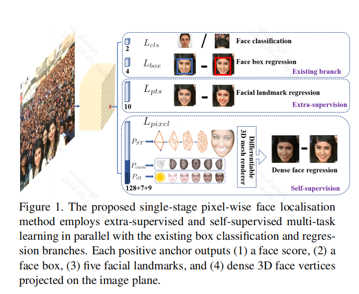
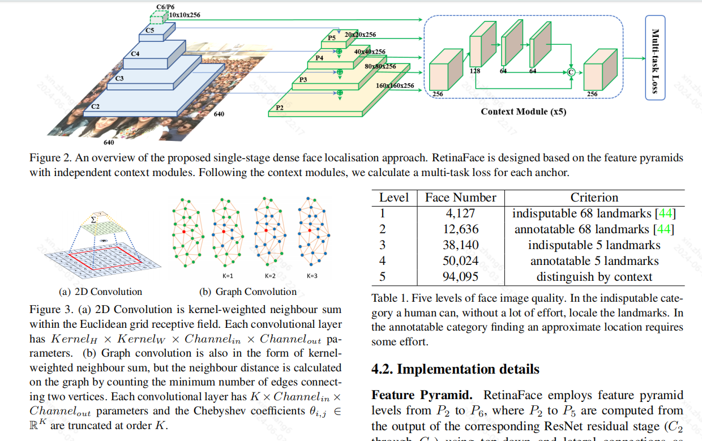

arXiv:1905.00641v2 [cs.CV] 4 May 2019

# 0 Abstract

Though tremendous strides have been made in uncontrolled face detection, accurate and efficient face localisation in the wild remains an open challenge. This paper presents a robust single-stage face detector, named RetinaFace, which performs pixel-wise face localisation on various scales of faces by taking advantages of joint extra-supervised and self-supervised multi-task learning. Specifically, We make contributions in the following five aspects: (1) We manually annotate five facial landmarks on the WIDER FACE dataset and observe significant improvement in hard face detection with the assistance of this extra supervision signal. (2) We further add a self-supervised mesh decoder branch for predicting a pixel-wise 3D shape face information in parallel with the existing supervised branches. (3) On the WIDER FACE hard test set, RetinaFace outperforms the state of the art average precision (AP) by 1.1% (achieving AP equal to 91.4%). (4) On the IJB-C test set, RetinaFace enables state of the art methods (ArcFace) to improve their results in face verification (TAR=89.59% for FAR=1e-6). (5) By employing light-weight backbone networks, RetinaFace can run real-time on a single CPU core for a VGA-resolution image. Extra annotations and code have been made available at: https://github.com/deepinsight/ insightface/tree/master/RetinaFace.

尽管在非受控人脸检测方面已经取得了巨大进步，但是如何在野外实现准确、高效的人脸定位仍然是一个悬而未决的挑战。本文提出了一种鲁棒的单阶段人脸检测器 RetinaFace，它利用联合额外监督和自监督多任务学习，在不同尺度的人脸上执行像素级人脸定位。具体来说，我们在以下五个方面做出了贡献：
（1）我们在 WIDER FACE 数据集上手动注释了五个人脸特征点，并观察到在额外监督信号的帮助下，硬人脸检测的效果显著改善。
（2）我们进一步添加了一个自监督网格解码器分支，用于与现有的监督分支并行，预测像素级的 3D 形状人脸信息。
（3）在 WIDER FACE 硬测试集上，RetinaFace 的表现比现有技术的平均精度（AP）高出 1.1%（实现 AP 等于 91.4%）。 
（4）在 IJB-C 测试集上，RetinaFace 使最先进的方法（ArcFace）能够提高人脸验证的结果（TAR=89.59%，FAR=1e-6）。
（5）通过使用轻量级主干网络，RetinaFace 可以在单个 CPU 核心上实时运行 VGA 分辨率图像。
额外的注释和代码已在以下网址提供：https://github.com/deepinsight/insightface/tree/master/RetinaFace。

# 1. Introduction
Automatic face localisation is the prerequisite step of facial image analysis for many applications such as facial attribute (e.g. expression [64] and age [38]) and facial identity recognition [45, 31, 55, 11]. A narrow definition of face localisation may refer to traditional face detection [53, 62], which aims at estimating the face bounding boxes without any scale and position prior. Nevertheless, in this paper we refer to a broader definition of face localisation which includes face detection [39], face alignment [13], pixelwise face parsing [48] and 3D dense correspondence regression [2, 12]. That kind of dense face localisation provides
accurate facial position information for all different scales.

自动人脸定位是人脸图像分析的先决步骤，可用于人脸属性（例如表情 [64] 和年龄 [38]）和人脸身份识别 [45, 31, 55, 11] 等许多应用。人脸定位的狭义定义可能指传统的人脸检测 [53, 62]，其目的是在没有任何尺度和位置先验的情况下估计人脸边界框。然而，在本文中，我们引用了人脸定位的更广泛定义，其中包括人脸检测 [39]、人脸对齐 [13]、像素级人脸解析 [48] 和 3D 密集对应回归 [2, 12]。这种密集的人脸定位为所有不同尺度提供了准确的人脸位置信息。

Inspired by generic object detection methods [16, 43, 30, 41, 42, 28, 29], which embraced all the recent advances in deep learning, face detection has recently achieved remarkable progress [23, 36, 68, 8, 49]. Different from generic object detection, face detection features smaller ratio variations (from 1:1 to 1:1.5) but much larger scale variations (from several pixels to thousand pixels). The most recent state-of-the-art methods [36, 68, 49] focus on singlestage [30, 29] design which densely samples face locations and scales on feature pyramids [28], demonstrating promising performance and yielding faster speed compared to twostage methods [43, 63, 8]. Following this route, we improve the single-stage face detection framework and propose a state-of-the-art dense face localisation method by exploiting multi-task losses coming from strongly supervised and self-supervised signals. Our idea is examplified in Fig. 1.

受通用物体检测方法 [16, 43, 30, 41, 42, 28, 29] 的启发，人脸检测最近取得了显著进展 [23, 36, 68, 8, 49]，这些方法囊括了深度学习的所有最新进展。
与通用物体检测不同，人脸检测的比例变化较小（从 1:1 到 1:1.5），但尺度变化大得多（从几个像素到数千个像素）。
最新的先进方法 [36, 68, 49] 专注于单阶段 [30, 29] 设计，该设计对人脸位置进行密集采样，并在特征金字塔 [28] 上进行缩放，与两阶段方法 [43, 63, 8] 相比，该方法表现出良好的性能，并且速度更快。
按照这条路线，我们改进了单阶段人脸检测框架，并提出了一种最先进的密集人脸定位方法，该方法利用了来自强监督和自监督信号的多任务损失。我们的想法在图 1 中得到了说明。

Typically, face detection training process contains both classification and box regression losses [16]. Chen et al. [6] proposed to combine face detection and alignment in a joint cascade framework based on the observation that aligned face shapes provide better features for face classification. Inspired by [6], MTCNN [66] and STN [5] simultaneously detected faces and five facial landmarks. Due to training data limitation, JDA [6], MTCNN [66] and STN [5] have not verified whether tiny face detection can benefit from the extra supervision of five facial landmarks. One of the questions we aim at answering in this paper is whether we can push forward the current best performance (90.3% [67]) on the WIDER FACE hard test set [60] by using extra supervision signal built of five facial landmarks.

通常，人脸检测训练过程包含分类和框回归损失[16]。
Chen 等人[6]提出在联合级联框架中结合人脸检测和对齐，因为对齐的人脸形状可以为人脸分类提供更好的特征。
受[6]的启发，MTCNN[66]和STN[5]同时检测人脸和五个面部特征点。
由于训练数据的限制，JDA[6]、MTCNN[66]和STN[5]尚未验证微小人脸检测是否能从五个面部特征点的额外监督中受益。
我们在本文中旨在回答的问题之一是，我们是否可以通过使用由五个面部特征点构建的额外监督信号来推进WIDER FACE难测试集[60]上目前的最佳性能（90.3%[67]）。

In Mask R-CNN [20], the detection performance is significantly improved by adding a branch for predicting an object mask in parallel with the existing branch for bounding box recognition and regression. That confirms that dense pixel-wise annotations are also beneficial to improve detection. Unfortunately, for the challenging faces of WIDER FACE it is not possible to conduct dense face annotation (either in the form of more landmarks or semantic segments). Since supervised signals cannot be easily obtained, the question is whether we can apply unsupervised methods to further improve face detection.

在 Mask R-CNN [20] 中，通过在现有的边界框识别和回归分支中并行添加预测对象掩码的分支，检测性能得到了显著提升。
这证实了密集的像素级注释也有利于提高检测效果。
不幸的是，对于 WIDER FACE 的具有挑战性的面孔，无法进行密集的面部注释（无论是以更多标志点还是语义片段的形式）。
由于监督信号不容易获得，问题是我们是否可以应用无监督方法来进一步改善人脸检测。

In FAN [56], an anchor-level attention map is proposed to improve the occluded face detection. Nevertheless, the proposed attention map is quite coarse and does not contain semantic information. Recently, self-supervised 3D morphable models [14, 51, 52, 70] have achieved promising 3D face modelling in-the-wild. Especially, Mesh Decoder [70] achieves over real-time speed by exploiting graph convolutions [10, 40] on joint shape and texture. However, the main challenges of applying mesh decoder [70] into the single-stage detector are: (1) camera parameters are hard to estimate accurately, and (2) the joint latent shape and texture representation is predicted from a single feature vector (1 × 1 Conv on feature pyramid) instead of the RoI pooled feature, which indicates the risk of feature shift. In this paper, we employ a mesh decoder [70] branch through self-supervision learning for predicting a pixel-wise 3D face shape in parallel with the existing supervised branches. 

在 FAN [56] 中，提出了一种锚点级注意图来改进遮挡人脸检测。
然而，所提出的注意图非常粗糙并且不包含语义信息。
最近，自监督 3D 可变形模型 [14，51，52，70] 已经在野外实现了有希望的 3D 人脸建模。
特别是，网格解码器 [70] 通过利用联合形状和纹理的图卷积 [10，40] 实现了超实时速度。
然而，将网格解码器 [70] 应用于单级检测器的主要挑战是：（1）相机参数难以准确估计，（2）联合潜在形状和纹理表示是从单个特征向量（特征金字塔上的 1×1 卷积）而不是 RoI 池化特征预测的，这表明存在特征偏移的风险。
在本文中，我们通过自监督学习采用网格解码器 [70] 分支，与现有的监督分支并行预测逐像素的 3D 人脸形状。

To summarise, our key contributions are:
• Based on a single-stage design, we propose a novel pixel-wise face localisation method named RetinaFace, which employs a multi-task learning strategy to simultaneously predict face score, face box, five facial landmarks, and 3D position and correspondence of each facial pixel.
• On the WIDER FACE hard subset, RetinaFace outperforms the AP of the state of the art two-stage method (ISRN [67]) by 1.1% (AP equal to 91.4%).
• On the IJB-C dataset, RetinaFace helps to improve ArcFace’s [11] verification accuracy (with TAR equal to 89.59% when FAR=1e-6). This indicates that better
face localisation can significantly improve face recognition.
• By employing light-weight backbone networks, RetinaFace can run real-time on a single CPU core for a VGA-resolution image.
• Extra annotations and code have been released to facilitate future research.

总结一下，我们的主要贡献是：
• 基于单阶段设计，我们提出了一种新颖的像素级人脸定位方法 RetinaFace，该方法采用多任务学习策略同时预测人脸得分、人脸框、五个人脸标志以及每个人脸像素的 3D 位置和对应关系。
• 在 WIDER FACE 硬子集上，RetinaFace 的表现比最先进的两阶段方法 (ISRN [67]) 的 AP 高出 1.1%（AP 等于 91.4%）。
• 在 IJB-C 数据集上，RetinaFace 有助于提高 ArcFace 的 [11] 验证准确率（当 FAR=1e-6 时，TAR 等于 89.59%）。这表明更好的人脸定位可以显著提高人脸识别率。
• 通过采用轻量级主干网络，RetinaFace 可以在单个 CPU 核心上实时运行 VGA 分辨率图像。
• 已发布额外的注释和代码以方便未来的研究。

# 2. Related Work

Image pyramid v.s. feature pyramid: 
The sliding-window paradigm, in which a classifier is applied on a dense image grid, can be traced back to past decades. The milestone work of Viola-Jones [53] explored cascade chain to reject false face regions from an image pyramid with real-time efficiency, leading to the widespread adoption of such scale-invariant face detection framework [66, 5]. Even though the sliding-window on image pyramid was the leading detection paradigm [19, 32], with the emergence of feature pyramid [28], sliding-anchor [43] on multi-scale feature maps [68, 49], quickly dominated face detection.

图像金字塔与特征金字塔：
滑动窗口范式（将分类器应用于密集图像网格）可以追溯到过去的几十年。Viola-Jones [53] 的里程碑式工作探索了级联链，以实时效率从图像金字塔中剔除虚假人脸区域，从而导致了这种尺度不变人脸检测框架的广泛采用 [66, 5]。尽管图像金字塔上的滑动窗口是领先的检测范式 [19, 32]，但随着特征金字塔 [28] 的出现，多尺度特征图 [68, 49] 上的滑动锚 [43] 迅速主导了人脸检测。

Two-stage v.s. single-stage: 
Current face detection methods have inherited some achievements from generic object detection approaches and can be divided into two categories: two-stage methods (e.g. Faster R-CNN [43, 63, 72]) and single-stage methods (e.g. SSD [30, 68] and RetinaNet [29, 49]). Two-stage methods employed a “proposal and refinement” mechanism featuring high localisation accuracy. By contrast, single-stage methods densely sampled face locations and scales, which resulted in extremely unbalanced positive and negative samples during training. To handle this imbalance, sampling [47] and re-weighting [29] methods were widely adopted. Compared to two-stage methods, single-stage methods are more efficient and have higher recall rate but at the risk of achieving a higher false positive rate and compromising the localisation accuracy.

两阶段与单阶段：
目前的人脸检测方法继承了通用物体检测方法的一些成果，可以分为两类：两阶段方法（例如 Faster R-CNN [43、63、72]）和单阶段方法（例如 SSD [30、68] 和 RetinaNet [29、49]）。两阶段方法采用“提议和细化”机制，具有较高的定位精度。相比之下，单阶段方法对人脸位置和尺度进行密集采样，导致训练期间正负样本极不平衡。为了处理这种不平衡，采样 [47] 和重新加权 [29] 方法被广泛采用。与两阶段方法相比，单阶段方法效率更高，召回率更高，但存在实现更高假阳性率和损害定位精度的风险。

Context Modelling: 
To enhance the model’s contextual reasoning power for capturing tiny faces [23], SSH [36] and PyramidBox [49] applied context modules on feature pyramids to enlarge the receptive field from Euclidean grids. To enhance the non-rigid transformation modelling capacity of CNNs, deformable convolution network (DCN) [9, 74] employed a novel deformable layer to model geometric transformations. The champion solution of the WIDER Face Challenge 2018 [33] indicates that rigid (expansion) and non-rigid (deformation) context modelling are complementary and orthogonal to improve the performance of face detection.

上下文建模：为了增强模型捕捉微小人脸的上下文推理能力 [23]，SSH [36] 和 PyramidBox [49] 在特征金字塔上应用了上下文模块，以扩大欧几里得网格的接受域。为了增强 CNN 的非刚性变换建模能力，**可变形卷积网络 (DCN)** [9, 74] 采用了一种新颖的可变形层来建模几何变换。WIDER Face Challenge 2018 的冠军解决方案 [33] 表明，刚性（扩展）和非刚性（变形）上下文建模是互补和正交的，可以提高人脸检测的性能。

Multi-task Learning: 
Joint face detection and alignment is widely used [6, 66, 5] as aligned face shapes provide better features for face classification. In Mask R-CNN [20], the detection performance was significantly improved by adding a branch for predicting an object mask in parallel with the existing branches. Densepose [1] adopted the architecture of Mask-RCNN to obtain dense part labels and coordinates within each of the selected regions. Nevertheless, the dense regression branch in [20, 1] was trained by supervised learning. In addition, the dense branch was a small FCN applied to each RoI to predict a pixel-to-pixel dense mapping.

多任务学习：
联合人脸检测和对齐被广泛使用 [6, 66, 5]，因为对齐的人脸形状为人脸分类提供了更好的特征。在 Mask R-CNN [20] 中，通过在现有分支的同时添加一个用于预测对象掩码的分支，检测性能得到了显著改善。Densepose [1] 采用了 Mask-RCNN 的架构来获得每个选定区域内的密集部分标签和坐标。尽管如此，[20, 1] 中的密集回归分支是通过监督学习训练的。此外，密集分支是一个小型 FCN，应用于每个 RoI，以预测像素到像素的密集映射。

# 3. RetinaFace
## 3.1. Multi-task Loss

For any training anchor i, we minimise the following
multi-task loss:
$$
L = L_{cls}(p_i, p^∗_i) + λ_1 p^∗_i L_{box}(t_i, t^∗_i) + λ_2 p^∗_i L_{pts}(l_i, l_i^*) + λ_3 p^∗_i L_{pixel}.
$$

(1) Face classification loss $L_{cls}(p_i, p^∗_i)$ , where $p_i$ is the predicted probability of anchor i being a face and $p^∗_i$ is 1 for the positive anchor and 0 for the negative anchor. The classification loss $L_{cls}$ is the softmax loss for binary classes(face/not face). 

(2) Face box regression loss $L_{box}(t_i, t^∗_i)$, where $t_i = \{t_x, t_y, t_w, t_h\}_i$ and $t^∗_i = {t^∗_x, t^∗_y, t^∗_w, t^∗_h}_i$ represent the coordinates of the predicted box and ground-truth box associated with the positive anchor. We follow [16] to normalise the box regression targets (i.e. centre location, width and height) and use $L_{box}(t_i, t^∗_i) = R(t_i − t^∗_i)$, where R is the robust loss function ($smooth-L_1$) defined in [16].

(3) Facial landmark regression loss $L_{pts}(l_i, l_i^∗)$, where $l_i =\{l_{x1}, l_{y1}, . . . , l_x5, l_y5 \}_i$ and $l_i^∗ = \{l^∗_x1, l^∗_y1, . . . , l^∗_x5, l^∗_y5\}_i$ represent the predicted five facial landmarks and groundtruth associated with the positive anchor. Similar to the box centre regression, the five facial landmark regression also employs the target normalisation based on the anchor centre.

(4) Dense regression loss $L_{pixel}$ (refer to Eq. 3). The loss-balancing parameters $λ_1-λ_3$ are set to 0.25, 0.1 and
0.01, which means that we increase the significance of better box and landmark locations from supervision signals.

(1) 人脸分类损失 $L_{cls}(p_i, p^∗_i)$，其中 $p_i$ 是锚点 i 为人脸的预测概率，$p^∗_i$ 对于正锚点为 1，对于负锚点为 0。分类损失 $L_{cls}$ 是二分类（人脸/非人脸）的 softmax 损失。

(2) 人脸框回归损失 $L_{box}(t_i, t^∗_i)$，其中 $t_i = \{t_x, t_y, t_w, t_h\}_i$ 和 $t^∗_i = {t^∗_x, t^∗_y, t^∗_w, t^∗_h}_i$ 表示与正锚点相关的预测框和真实框的坐标。我们按照 [16] 规范化框回归目标（即中心位置、宽度和高度），并使用 $L_{box}(t_i, t^∗_i) = R(t_i − t^∗_i)$，其中 R 是 [16] 中定义的稳健损失函数 ($smooth-L_1$)。

(3) 面部标志回归损失 $L_{pts}(l_i, l_i^∗)$，其中 $l_i =\{l_{x1}, l_{y1}, . . . , l_x5, l_y5 \}_i$ 和 $l_i^∗ = \{l^∗_x1, l^∗_y1, . . . , l^∗_x5, l^∗_y5\}_i$ 表示与正锚点相关的预测的五个面部标志点和地面实况。与框中心回归类似，五个面部标志点回归也采用基于锚中心的目标归一化。

（4）密集回归损失 $L_{pixel}$（参见公式 3）。损失平衡参数 $λ_1-λ_3$ 设置为 0.25、0.1 和
0.01，这意味着我们增加了来自监督信号的更好框和标志点位置的重要性。

## 3.2. Dense Regression Branch
### Mesh Decoder. 
We directly employ the mesh decoder (mesh convolution and mesh up-sampling) from [70, 40], which is a graph convolution method based on fast localised spectral filtering [10]. In order to achieve further acceleration, we also use a joint shape and texture decoder similarly to the method in [70], contrary to [40] which only decoded shape.

### 网格解码器。
我们直接采用 [70, 40] 中的网格解码器（网格卷积和网格上采样），这是一种基于快速局部谱滤波 [10] 的图卷积方法。为了进一步加速，我们还使用类似于 [70] 中的方法的联合形状和纹理解码器，而 [40] 只解码形状。

Below we will briefly explain the concept of graph convolutions and outline why they can be used for fast decoding. As illustrated in Fig. 3(a), a 2D convolutional operation is a “kernel-weighted neighbour sum” within the Euclidean grid receptive field. Similarly, graph convolution also employs the same concept as shown in Fig. 3(b). However, the neighbour distance is calculated on the graph by counting the minimum number of edges connecting two vertices. We follow [70] to define a coloured face mesh $G = (V, E)$, where $V ∈ R^{n×6}$ is a set of face vertices containing the joint shape and texture information, and $E ∈ {0, 1}^{n×n}$ is a sparse adjacency matrix encoding the connection status between vertices. The graph Laplacian is defined as $L = D − E ∈ R^{n×n}$ where $D ∈ R^{n×n}$ is a diagonal matrix with $D_{ii} = \sum_j E_{ij}$ .

下面我们将简单解释图卷积的概念，并概述它们可用于快速解码的原因。如图 3（a）所示，2D 卷积运算是欧几里得网格感受野内的“核加权邻域和”。类似地，图卷积也采用相同的概念，如图 3（b）所示。然而，邻域距离是通过计算连接两个顶点的最小边数在图上计算的。我们按照 [70] 定义一个有色面网格 $G=(V, E)$，其中 $V ∈ R^{n×6}$ 是一组包含关节形状和纹理信息的面顶点，$E ∈ {0, 1}^{n×n}$ 是一个稀疏邻接矩阵，对顶点之间的连接状态进行编码。图拉普拉斯定义为 $L = D − E ∈ R^{n×n}$，其中 $D ∈ R^{n×n}$ 是一个对角矩阵，且 $D_{ii} = \sum_j E_{ij}$ 。

Following [10, 40, 70], the graph convolution with kernel $g_θ$ can be formulated as a recursive Chebyshev polynomial
truncated at order K,
$$
y = g_θ(L)x = \sum^{K−1}_{k=0} θ_k T_k(\hat L)x, (2)
$$
where $θ ∈ R^K$ is a vector of Chebyshev coefficients and $T_k(\hat L) ∈ R^{n×n}$ is the Chebyshev polynomial of order k evaluated at the scaled Laplacian $\hat L$. Denoting $\overline x_k = T_k(\hat L)x ∈ R^n$ , we can recurrently compute $\overline x_k = 2 \hat L \overline x_{k−1} − \overline x_{k−2}$ with $\overline x_0 = x$ and $\overline x_1 = \hat L x$. The whole filtering operation is extremely efficient including K sparse matrix-vector multiplications and one dense matrix-vector multiplication $y = g_θ(L)x = [\overline x_0, . . . , \overline x_{K−1}]θ$.

### Differentiable Renderer.
After we predict the shape and texture parameters $P_{ST} ∈ R^{128}$, we employ an efficient differentiable 3D mesh renderer [14] to project a colouredmesh $D_{P_{ST}}$ onto a 2D image plane with camera parameters $P_{cam} = [x_c, y_c, z_c, x'_c , y'_c , z'_c , f_c]$ (i.e. camera location, camera pose and focal length) and illumination parameters $P_{ill} = [x_l , y_l , z_l , r_l , g_l , b_l , r_a, g_a, b_a]$ (i.e. location of point light source, colour values and colour of ambient lighting).

### Dense Regression Loss.
Once we get the rendered 2D face $R(D_{P_{ST}} , P_{cam}, P_{ill})$, we compare the pixel-wise difference of the rendered and the original 2D face using the following function: 
$$
L_{pixel} = \frac 1 {W ∗ H}  \sum^W_i \sum^H_j \left \| R(D_{P_{ST}} , P_{cam}, P_{ill})_{i,j}− I^∗_{i,j} \right \| 1
$$
, (3)

where W and H are the width and height of the anchor crop $I^∗_{i,j}$ , respectively.

