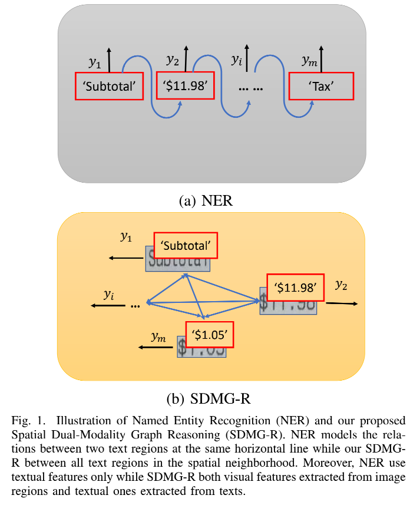
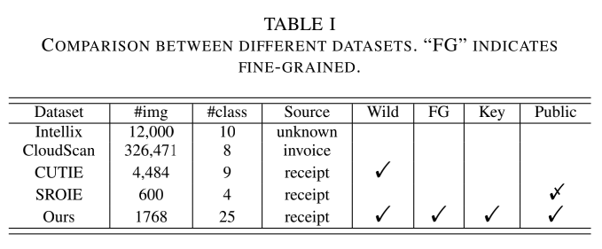
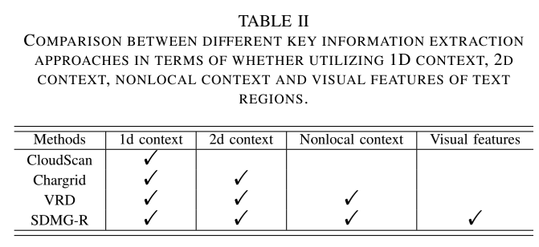
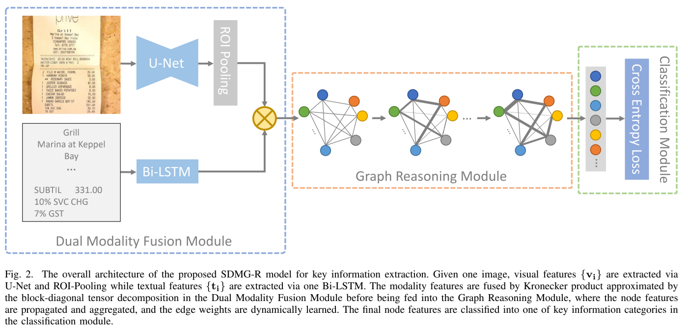

Spatial Dual-Modality Graph Reasoning for Key Information Extraction

关键信息提取的空间双模态图推理

_____

# 0 摘要

Abstract—Key information extraction from document images is of paramount importance in office automation. Conventional template matching based approaches fail to generalize well to document images of unseen templates, and are not robust against text recognition errors. In this paper, we propose an end-to-end Spatial Dual-Modality Graph Reasoning method (SDMGR) to extract key information from unstructured document images. We model document images as dual-modality graphs, nodes of which encode both the visual and textual features of detected text regions, and edges of which represent the spatial relations between neighboring text regions. The key information extraction is solved by iteratively propagating messages along graph edges and reasoning the categories of graph nodes. In order to roundly evaluate our proposed method as well as boost the future research, we release a new dataset named WildReceipt, which is collected and annotated tailored for the evaluation of key information extraction from document images of unseen templates in the wild. It contains 25 key information categories, a total of about 69000 text boxes, and is about 2 times larger than the existing public datasets. Extensive experiments validate that all information including visual features, textual features and spatial relations can benefit key information extraction. It has been shown that SDMGR can effectively extract key information from document images of unseen templates, and obtain new state-of-the-art results on the recent popular benchmark SROIE and our WildReceipt. Our code and dataset will be publicly released.

摘要：
从文档图像中提取关键信息在办公自动化中至关重要。
传统的基于模板匹配的方法不能很好地泛化到未见过模板的文档图像，并且对文本识别错误也没有鲁棒性。
在本文中，我们提出了一种端到端的空间双模态图推理方法（SDMGR）来从非结构化文档图像中提取关键信息。
我们将文档图像建模为**双模态图**，其**节点**编码检测到的文本区域的视觉和文本特征，其**边缘**表示相邻文本区域之间的空间关系。
关键信息提取是通过沿图边迭代传播消息并推理图节点的类别来解决的。
为了全面评估我们提出的方法并促进未来的研究，我们发布了一个名为 WildReceipt 的新数据集，该数据集是为评估从野外看不见的模板的文档图像中提取关键信息而量身定制的。
它包含 25 个关键信息类别，总共约 69000 个文本框，比现有公共数据集大约 2 倍。
大量实验验证了包括视觉特征、文本特征和空间关系在内的所有信息都可以有益于关键信息的提取。
已经表明，SDMG-R 可以有效地从不可见模板的文档图像中提取关键信息，并在最近流行的基准 SROIE 和我们的 WildReceipt 上获得新的最先进的结果。
我们的代码和数据集将公开发布。

- paramount
  - adj. 至为重要的，首要的；至高无上的，权力最大的
  - n. 最高统治者
- modality
  - n. 形式，形态；程序；物理疗法；主要的感觉
- reason  
  - 英  [ˈriːz(ə)n]   美  [ˈriːzn]
  - n. 原因，理由；充分理由，正当理由；道理，情理；判断力，理智
  - v. 推理，逻辑思考；推论出，推断出（reason sth. out）；对（某人）以理相劝，劝告（reason with）

Index Terms—Key information extraction, Document images, Graph reasoning, Dual modality.

索引词——关键信息提取、文档图像、图形推理、双模态。

# 1 介绍

EXTRACTING key information from unstructured document images, such as historical documents, receipts, orders and credit notes, plays an important role in office automation including efficient archiving, compliance checking and so on. Conventional approaches [1], [2], [3], [4] maintain a set of templates, each of which consists of key words and their layouts. Although they can usually accurately extract key information from documents, they are not robust against the partial text recognition errors, which usually occurs. To make matters worse, they cannot generalize to documents from unseen templates, which prohibits them from being used in many real application scenarios.

从非结构化文档图像中提取关键信息，例如历史文档、收据、订单和信用票据，在办公自动化中发挥着重要作用，包括高效归档、合规检查等。 传统方法 [1]、[2]、[3]、[4] 维护一组模板，每个模板都由关键词及其布局组成。 尽管它们通常可以准确地从文档中提取关键信息，但它们对通常发生的部分文本识别错误并不鲁棒。 更糟糕的是，它们无法从看不见的模板泛化到文档，这使得它们无法在许多实际应用场景中使用。

In this paper, we target at key information extraction with a more challenging setting, where training set and test set have different templates. CloudScan [5] modeled the key information extraction as Named Entity Recognition problem via concatenating texts as strings, which are classified as predefined categories such as order ID, invoice number and so on (see Figure 1 (a)). Although it can generalize to samples of unseen templates, it degrades greatly when lines are not aligned properly due to non-front image captures. Moreover, it makes full use of pre-context and after-context only in the concatenated strings but not neighboring text regions which are not in the same line. We believe that a robust key information extraction approach should be robust against image views, and utilize all context in the spatial neighborhood but not the same horizontal line only.

在本文中，我们针对具有更具挑战性的设置的关键信息提取，其中训练集和测试集具有不同的模板。 CloudScan [5] 通过将文本连接为字符串将关键信息提取建模为命名实体识别问题，这些字符串被分类为预定义的类别，如订单 ID、发票编号等（见图 1（a））。 尽管它可以推广到看不见的模板样本，但当由于非正面图像捕获而导致线条未正确对齐时，它会大大降低。 此外，它仅在连接的字符串中充分利用了前上下文和后上下文，而不是不在同一行中的相邻文本区域。 我们认为，稳健的关键信息提取方法应该对图像视图具有稳健性，并利用空间邻域中的所有上下文，而不是仅使用同一条水平线。

To this end, we propose an end-to-end Spatial Dual-Modality Graph Reasoning (SDMG-R) approach for key information extraction. We model the unstructured document images as spatial dual-modality graphs with graph nodes as detected text boxes and graph edges as the spatial relations between these nodes (see Figure 1 (b)). Each node is associated with the textual and visual features which are learned via a recurrent neural network (RNN) and convolutional neural network (CNN) automatically. Features of graph nodes are propagated iteratively along graph edges before classifying into pre-defined key information categories. In this way, SDMG-R makes full use of spatial relations between detected text regions, and their dual modality features. It is independent of document templates, and thus naturally has the potential to extract key information from document images of unseen templates.

为此，我们提出了一种用于关键信息提取的端到端空间双模态图推理（SDMG-R）方法。 我们将非结构化文档图像建模为**空间双模态图**，**图节点**作为检测到的文本框，**图边**作为这些节点之间的空间关系（见图 1（b））。 每个节点都与通过循环神经网络 (RNN) 和卷积神经网络 (CNN) 自动学习的文本和视觉特征相关联。 图节点的特征在分类为预定义的关键信息类别之前沿着图边迭代传播。 通过这种方式，SDMG-R 充分利用了检测到的文本区域之间的空间关系及其双模态特征。 它独立于文档模板，因此自然有可能从看不见的模板的文档图像中提取关键信息。

Most of previous key information extraction approaches are evaluated on private data only due to the lack of public datasets. Recently, a few datasets such as IEHHR [6], SROIE [7], which target at key information extraction, have been emerging. However, their training and test set share many templates, and thus they are unsuited to evaluate the generalization ability of key information extraction methods. To this end, we build a new key information extraction benchmark dubbed WildReceipt. It consists of 25 key information categories, totally about 50000 text boxes, which is about 2 times larger than SROIE. The key information categories in WildReceipt are fine-grained. e.g., they contain “Subtotal value”, “Total value” and “Tax value” categories, all of which are money amount, and it is difficult to distinguish with each other without context. Different from previous scanned images as in SROIE, receipt images in WildReceipt are captured in the wild, most of them are from non-front views and with folds. Therefore, it is more challenging and realistic than previous ones.

由于缺乏公共数据集，大多数以前的关键信息提取方法仅在私有数据上进行评估。最近，一些针对关键信息提取的数据集如 IEHHR [6]、SROIE [7] 已经出现。但是，它们的训练集和测试集共享许多模板，因此不适合评估关键信息提取方法的泛化能力。为此，我们构建了一个新的关键信息提取基准，称为 WildReceipt。它由25个关键信息类别组成，总共约50000个文本框，大约是SROIE的2倍。 WildReceipt 中的关键信息类别是细粒度的。例如，它们包含“小计价值”、“总价值”和“税值”类别，都是金额，没有上下文很难相互区分。与之前在 SROIE 中的扫描图像不同，WildReceipt 中的收据图像是在野外捕获的，其中大部分来自非正面视图并带有折叠。因此，它比以前的更具挑战性和现实性。

We extensively evaluate our proposed SDMG-R on SROIE and WildReceipt. It has been shown that the proposed approach outperforms previous methods with impressive margins. We investigate the factors of the effectiveness of the proposed approach, and find that both the spatial relations and the dual modality features benefit the key information extraction.

我们在 SROIE 和 WildReceipt 上广泛评估了我们提出的 SDMG-R。 已经表明，所提出的方法以令人印象深刻的利润率优于以前的方法。 我们调查了该方法有效性的因素，发现空间关系和双模态特征都有利于关键信息的提取。

The contributions of this paper are as follows:
- We propose an effective spatial dual-modality graph reasoning network (dubbed SDMG-R) for key information extraction. To the best of our knowledge, our SDMG-R is the first key information extraction approach which jointly reasons key information categories on textual and visual features of text boxes and their 2-dimensional spatial relationships.
- We annotate a new benchmark, named WildReceipt, to facilitate the future research of key information extraction, which is fine-grained, and 2 times bigger than its competitors. It targets at evaluating key information extraction from document images of unseen templates captured in the wild, which is not explored in previous datasets.
- We validate the effectiveness of the proposed SDMG-R on two benchmarks, i.e., SROIE and WildReceipt. Our proposed approach outperforms state-of-the-art approaches with impressive margins.

本文的贡献如下：
- 我们提出了一种有效的空间双模态图推理网络（称为 SDMG-R），用于关键信息提取。 据我们所知，我们的 SDMG-R 是第一个关键信息提取方法，它联合推理文本框的文本和视觉特征及其二维空间关系的关键信息类别。
- 我们注释了一个名为 WildReceipt 的新基准，以促进关键信息提取的未来研究，它是细粒度的，并且是其竞争对手的 2 倍。 它的目标是评估从野外捕获的看不见的模板的文档图像中提取关键信息，这在以前的数据集中没有探索过。
- 我们在 SROIE 和 WildReceipt 两个基准上验证了提议的 SDMG-R 的有效性。 我们提出的方法以令人印象深刻的利润率优于最先进的方法。

# 2 相关工作

**Dataset**. Key information extraction has been attracting a large number of researchers from computer vision and multimedia filed. However, most of them conducted experiments on private datasets. Intellix [1] was trained on 8000 and tested on 4000 scanned documents with 10 annotated semantic categories. CloudScan [5] conducted experiments on 326, 471 scanned UBL invoices. Later, CUTIE annotated 4, 484 Spanish receipt documents captured in the wild including taxi receipts, Meals Entertainment (ME) receipts, and hotel receipts, with 9 different key information classes. However, all the aforementioned datasets are unavailable publicly. Recently, SROIE [7] consisting of 600 scanned receipts from ICDAR 2019 Robust Reading Challenge is released with 4 categories. Namely, store name, store address, date and total price. Its training set and its corresponding ground truth are publicly available. However, the test set ground truth is not released. We annotate its test set for evaluating key information extraction approaches on it in our experiments. Our WildReceipt targets at facilitating the key information extraction research and will be publicly released. It is about 2 times and 5 times bigger than SROIE in terms of the total image number and the key information category number respectively. Different from previous datasets which contain value categories only, WildReceipt contains both key and value categories such as “Total key” category (e.g., “Total:” and “Total” ) and “Total value” category (e.g., “$10.5” and “$20”). We empirically find that key category classification during training can boost the classification performance of value categories. Our WildReceipt contains finegrained categories such as “Total value”, “Subtotal value”, and “Tax value”, all of which represent money amount. Moreover, it is captured in the wild, which is more challenging and wider applicable. The detailed comparison between the key information extraction datasets is conducted in `Table I`.

数据集。关键信息提取一直吸引着计算机视觉和多媒体领域的大量研究人员。
然而，他们中的大多数人都在私人数据集上进行了实验。 
Intellix [1] 在 8000 个上进行了训练，并在 4000 个扫描文档上进行了测试，其中包含 10 个带注释的语义类别。
CloudScan [5] 对 326、471 份扫描的 UBL 发票进行了实验。
随后，CUTIE 对野外捕获的 4、484 份西班牙收据文件进行了注释，包括出租车收据、Meals Entertainment (ME) 收据和酒店收据，具有 9 个不同的关键信息类别。
但是，上述所有数据集均不公开。
最近，由 ICDAR 2019 Robust Reading Challenge 的 600 张扫描收据组成的 SROIE [7] 发布了 4 个类别。
即店铺名称、店铺地址、日期和总价。它的训练集和相应的基本事实是公开的。但是，测试集的基本事实并未发布。
我们注释了它的测试集，以在我们的实验中评估关键信息提取方法。
我们的 WildReceipt 旨在促进关键信息提取研究，并将公开发布。
就图像总数和关键信息类别数而言，它分别是 SROIE 的 2 倍和 5 倍。
与以前仅包含值类别的数据集不同，WildReceipt 包含键和值类别，例如“总键”类别（例如，“Total:”和“Total”）和“总价值”类别（例如，“$10.5”和“ 20 美元”）。
我们凭经验发现，训练期间的关键类别分类可以提高价值类别的分类性能。
我们的 WildReceipt 包含细粒度的类别，例如“总价值”、“小计价值”和“税收价值”，所有这些类别都代表金额。
而且，它是在野外捕获的，更具挑战性，适用范围更广。关键信息提取数据集之间的详细比较在“表一”中进行。

**Key information extraction**. Conventional approaches [1], [2], [3], [8] utilized template matching or rule based strategies, and thus performed poorly on documents of unseen templates.Later, CloudScan [5] modeled the key information extraction problem as NER [9], [10], [11], [12], and concatenated the entire invoice texts as one dimensional sequences without utilizing the two-dimensional spatial layout information. Chargrid [13] encoded each document page as a two-dimensional grid of characters to conduct semantic segmentation. It utilized two-dimensional spatial layout information with small neighborhood only, and could not make fully use of nonlocal spatial relations between text regions with long distances due to limited effective receptive filed of convolution neural networks [14]. Recently, VRD [15] learned graph embedding to summarize the two-dimensional context of text segments in the document, which were further combined with text embedding for entity extraction from visually rich documents. Our proposed SDMG-R models documents as fully-connected graphs with text regions as nodes and two-dimensional spatial relations as edges. Different from VRD, SDMG-R learns both visual features and textual features of text regions, which leads to robustness against text recognition errors. Detailed comparison between recent approaches with our SDMG-R is given in Table II.

**关键信息提取**。
传统方法 [1]、[2]、[3]、[8] 使用模板匹配或基于规则的策略，因此在未见过模板的文档上表现不佳。
后来，CloudScan [5] 将关键信息提取问题建模为 NER [ 9]、[10]、[11]、[12]，并在不利用二维空间布局信息的情况下将整个发票文本连接为一维序列。
Chargrid [13] 将每个文档页面编码为二维字符网格以进行语义分割。它仅利用了具有小邻域的二维空间布局信息，由于卷积神经网络的有效感受野有限[14]，无法充分利用长距离文本区域之间的非局部空间关系。
最近，VRD [15] 学习了图嵌入来总结文档中文本段的二维上下文，进一步结合文本嵌入从视觉丰富的文档中提取实体。
我们提出的 SDMG-R 模型将文档记录为以文本区域为节点、以二维空间关系为边的全连接图。与 VRD 不同，SDMG-R 同时学习文本区域的视觉特征和文本特征，这导致了对文本识别错误的鲁棒性。
表 II 给出了最近方法与我们的 SDMG-R 之间的详细比较。

**Graph neural networks**. Recently, integrating graphs with deep neural networks is an emerging topic in deep learning research. A considerable amount of models have arisen for reasoning on graph-structured data at various tasks, such as classification of graphs [16], [17], [18], classification of nodes of graphs [19], [20], and modeling multi-agent interacting physical systems [19], [21], [22]. Graph neural networks have been widely used in many application such as human action recognition [23], [24], social relationship understanding [25], object parsing [26], multi-label image recognition [27], visual question answer [28], and fashion retrieval [29]. These work create graphs via modeling the relations between image objects or regions. In contrast, we explore the use of graph to express spatial relations between detected text boxes which are encoded by visual-textual features, and apply it to the field of key information extraction. For each detected text box, it can automatically mine the useful layout structure in its neighborhood.

**图神经网络**。
最近，将图与深度神经网络集成是深度学习研究中的一个新兴课题。
已经出现了大量用于在各种任务中对图结构数据进行推理的模型，例如图的分类 [16]、[17]、[18]、图的节点分类 [19]、[20] 和建模多智能体交互物理系统 [19]、[21]、[22]。
图神经网络已广泛应用于人类动作识别[23]、[24]、社会关系理解[25]、对象解析[26]、多标签图像识别[27]、视觉问答[28]等许多应用中]和时尚检索[29]。
这些工作通过对图像对象或区域之间的关系进行建模来创建图形。
相比之下，我们探索使用图来表达检测到的文本框之间的空间关系，这些文本框由视觉文本特征编码，并将其应用于关键信息提取领域。
对于每个检测到的文本框，它可以自动挖掘其附近有用的布局结构。

**Multi-modality fusion**. Our work is also related to multi-modality fusion methods [30], [31], [32], [33]. Most of them targets at visual question answering, visual grounding and visual relationship detection. We are the first to investigate visual and textual modality fusion for key information extraction.

**多模态融合**。 
我们的工作还涉及多模态融合方法[30]、[31]、[32]、[33]。 它们中的大多数针对视觉问答、视觉接地和视觉关系检测。 我们是第一个研究用于关键信息提取的视觉和文本模态融合的人。

# 3 方法

Given one document image $I$ of size $H × W$, together with detected text regions ${r_i}$, where $r_i =< x_i, y_i, h_i, w_i, s_i >$ with $(x_i, y_i), h_i, w_i$, and $s_i$ being the top-left corner coordinate, the height, the width, and the recognized text string of $r_i$ respectively, the key information extraction aims at classifying each detected text region $r_i} into one of a predefined category set $Y$. We model the key information extraction as the graph node classification problem via jointly making full use of dual modality features. Namely, visual features and textual ones. Our proposed spatial dual-modality graph reasoning model consists of the dual-modality fusion module, the graph reasoning module and the classification module. `Figure 2` shows its overall architecture.

给定一个大小为 $H × W$ 的文档图像 $I$，以及检测到的文本区域 ${r_i}$，其中 $r_i =< x_i, y_i, h_i, w_i, s_i >$ with $(x_i, y_i)， h_i、w_i$、$s_i$分别为$r_i$的左上角坐标、高度、宽度和识别的文本串，关键信息提取的目的是将每个检测到的文本区域$r_i$归为一个 的预定义类别集 $Y$。 
我们通过共同充分利用双模态特征将关键信息提取建模为图节点分类问题。
即，视觉特征和文本特征。 
我们提出的空间双模态图推理模型由**双模态融合模块**、**图推理模块**和**分类模块**组成。
`图 2` 显示了它的整体架构。

# 4 WildReceipt

# 5 实验

# 6 总结

In this paper, we have proposed a novel spatial dual-modality graph reasoning model (termed SDMG-R) for key information extraction from unstructured documents. We have introduced Kronecker product approximated via the block diagonal tensor decomposition to fuse the visual and textual features. SDMG-R naturally learns spatial relations between text regions via dynamical attentions in its graph reasoning module. We have validated the effectiveness of each component of the proposed SDMG-G by extensive experiments. Moreover, a new large key information extraction dataset, named WildReceipt, has been annotated to evaluate the model performance of the key information extraction on document of unseen templates. It is fine grained and captured in the wild, and thus more challenging and realistic than previous public datasets. It will be publicly released for facilitating future research. Experimental results on both SROIE and our WildReceipt databases have shown that our proposed SDMG-R consistently outperforms start-of-the-art key information extraction methods with impressive margins.

在本文中，我们提出了一种新颖的空间双模态图推理模型（称为 SDMG-R），用于从非结构化文档中提取关键信息。
我们引入了通过块对角张量分解近似的 Kronecker 积，以融合视觉和文本特征。
SDMG-R 通过其图形推理模块中的动态注意力自然地学习文本区域之间的空间关系。
我们通过广泛的实验验证了所提出的 SDMG-G 的每个组件的有效性。
此外，一个名为 WildReceipt 的新的大型关键信息提取数据集已被注释，以评估未见过模板文档的关键信息提取的模型性能。
它是细粒度的并在野外捕获，因此比以前的公共数据集更具挑战性和现实性。它将公开发布以促进未来的研究。
SROIE 和我们的 WildReceipt 数据库的实验结果表明，我们提出的 SDMG-R 始终优于最先进的关键信息提取方法，具有可观的利润。

