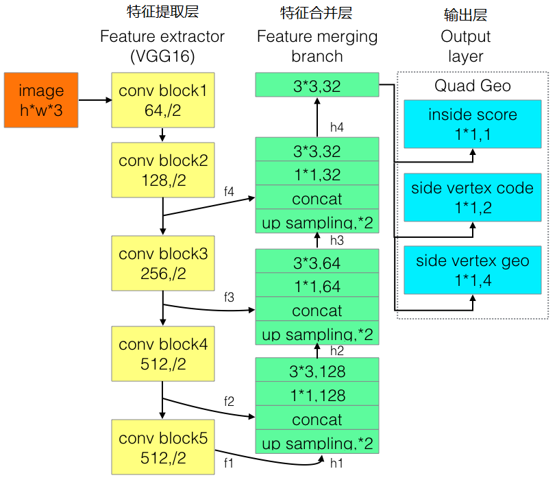

可以运行。

为改进EAST的长文本检测效果不佳的缺陷，有人提出了Advanced EAST，以VGG16作为网络结构的骨干，同样由特征提取层、特征合并层、输出层三部分构成。经实验，Advanced EAST比EAST的检测准确性更好，特别是在长文本上的检测。

网络结构如下：

# 参考
1. [文本检测算法三：EAST and AdvancedEAST](https://blog.csdn.net/sxlsxl119/article/details/97275789)]
2. 