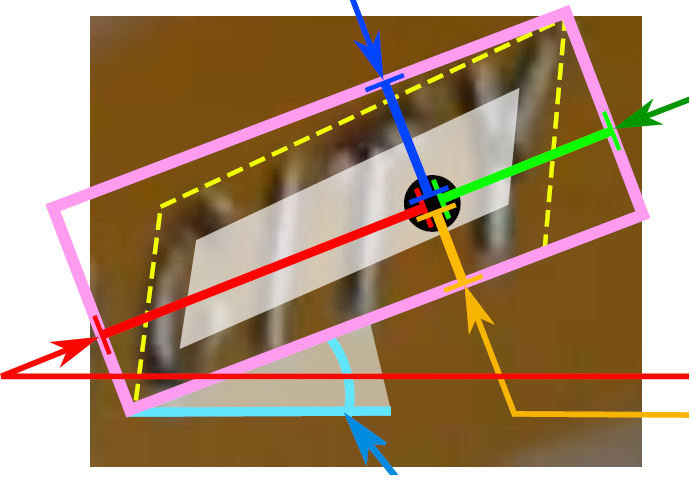

# 2 博客介绍
1. [文本检测之EAST](https://zhuanlan.zhihu.com/p/37504120)
2. [EAST结构分析+pytorch源码实现](https://www.cnblogs.com/wjy-lulu/p/11370520.html)
3. [文本检测算法三：EAST and AdvancedEAST](https://blog.csdn.net/sxlsxl119/article/details/97275789)
4. [EAST理解及实现](http://www.piginzoo.com/machine-learning/2019/08/28/east)

# 3 原理
过程简化为只有FCN阶段（全卷积网络）、NMS阶段（非极大抑制），中间过程大大缩减，而且输出结果支持文本行、单词的多个角度检测，既高效准确，又能适应多种自然应用场景。

## 3.1 特征提取层

基于PVANet（一种目标检测的模型）作为网络结构的骨干，分别从stage1，stage2，stage3，stage4的卷积层抽取出特征图，卷积层的尺寸依次减半，但卷积核的数量依次增倍，这是一种“金字塔特征网络”（FPN，feature pyramid network）的思想。通过这种方式，可抽取出不同尺度的特征图，以实现对不同尺度文本行的检测（大的feature map擅长检测小物体，小的feature map擅长检测大物体）。这个思想与前面文章介绍的SegLink模型很像；

## 3.2 特征融合层

将前面抽取的特征图按一定的规则进行合并，这里的合并规则采用了U-net方法，规则如下：

特征提取层中抽取的最后一层的特征图（f1）被最先送入unpooling层，将图像放大1倍
接着与前一层的特征图（f2）串起来（concatenate）
然后依次作卷积核大小为1x1，3x3的卷积
对f3，f4重复以上过程，而卷积核的个数逐层递减，依次为128，64，32
最后经过32核，3x3卷积后将结果输出到“输出层”

## 3.3 输出层

最终输出以下5部分的信息，分别是：

score map：检测框的置信度，1个参数；
text boxes：检测框的位置（x, y, w, h），4个参数；
text rotation angle：检测框的旋转角度，1个参数；
text quadrangle coordinates：任意四边形检测框的位置坐标，(x1, y1), (x2, y2), (x3, y3), (x4, y4)，8个参数。
其中，text boxes的位置坐标与text quadrangle coordinates的位置坐标看起来似乎有点重复，其实不然，这是为了解决一些扭曲变形文本行，如下图：

如果只输出text boxes的位置坐标和旋转角度（x, y, w, h,θ），那么预测出来的检测框就是上图的粉色框，与真实文本的位置存在误差。而输出层的最后再输出任意四边形的位置坐标，那么就可以更加准确地预测出检测框的位置（黄色框）。

## 3.4 EAST效果
EAST模型的优势在于简洁的检测过程，高效、准确，并能实现多角度的文本行检测。但也存在着不足之处，例如（1）在检测长文本时的效果比较差，这主要是由于网络的感受野不够大；（2）在检测曲线文本时，效果不是很理想。

