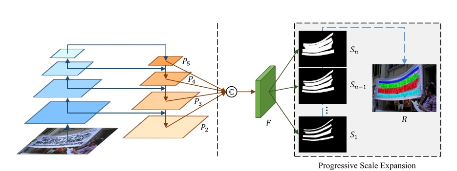
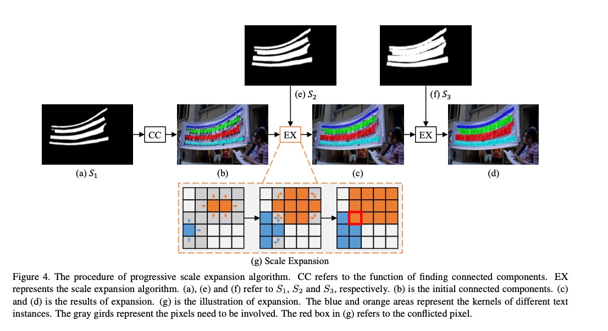
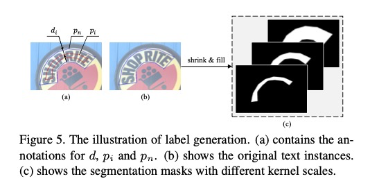

# 0 概要
自然场景文本检测有两个挑战：
- （1）四边形去定位任意形状；
- （2）文本接近时导致误检测。

基于分割的方法可以解决（1）但是不能解决（2）。
因此PSENET提出来解决做生意形状的文本检测。
psenet为每个文本生成不同尺度的核，逐渐扩展最小尺度核到完整尺寸的文本实例。
由于小尺寸核之间有大的几何间隔，psenet能使基于分割的方法有效分割邻近的文本。

# 1 介绍
文本检测可粗分为两种：（1）基于回归的方法；（2）基于分割的方法。
- 基于回归（regression-based）的方法不好处理任意形状的文本实例。
- 基于分割（segmentation-based）的方法很难处理靠近的文本。

论文里提出一种新奇的kernel-based框架——PSENet。
1. 类似基于分割的方法，PSENet执行一个像素级分割，它能够精确的定位任意形状的文本实例。
2. 我们提出一种先进的尺度扩张算法，来分辨邻近的文本实例。
3. 给每个文本实例分配多个预测分割区域，用核kernel来表示。
4. 为了获取最终的检测，我们采用一种基于BFS的先进尺度扩张算法。具体说有三步：
   1. 从最小尺度开始
   2. 在更大的核上使用更多像素扩张区域
   3. 直到最大的核结束。

有三个潜在的原因来设计先进尺度扩张算法：
1. 小尺度核容易分割，因为它们之间相互距离远。
2. 小尺度核不会覆盖全部文本区域。
3. 先进尺度扩张算法简单有效的扩张小核到完整文本区域。

# 2 相关工作
## 2.1 Regression-based 方法
1. 普通的物体检测：Faster R-CNN，SSD。
2. TextBoxes 修改了anchor的尺寸和形状来适应文本。
3. EAST使用FCN来直接输出score map，rotation angle 和文本框。
4. RRPN 采用Faster R-CNN，旋转的候选区域来检测任意朝向文本。
5. RRD 提取特征图来做文本分类和回归，来改善长文本检测。
   
缺点：
1. 设计复杂的anchor，笨重的多阶段，它需要详细的调节和局部优化。
2. 不能处理弯曲文本。

## 2.2 Segmentation-based 方法
1. Zhang 采用FCN来提取文本块，用MSER来检测候选区域。
2. Yao 利用FCN来预测对应的热力图。
3. Lyu 利用角点定位不规则四边形。
4. PixelLink 通过不同文本实例的像素级连接关系来分割文本。
5. TextSnake 
6. SPCNET使用实例分割框架和使用上下文信息来检测做任意形状文本，同时抑制false positives。

缺点：
1. 没有充分考虑弯曲文本。
2. TextSanke 需要耗时的复杂的后处理操作。PSENET只需要简单有效的步骤。

   
# 3 提出的方法
## 3.1 整体流程

1. 使用ResNet作为PSENet的基础网络。
2. 把低层纹理特征和高层语义特层连接到一起。
这些特征图融合在F中。
这种融合类似于利用不同尺寸kernel的产生。
3. F 投影n 个分支，产生多个分割结果，S1,S2,,,,Sn。每个Si代表特定尺寸所有文本实例分割的掩膜。S1给了最小尺寸的分割结果。Sn给了原图的分割结果。
4. 获取到这些分割掩膜后，用尺度扩张算法从S1到Sn，得到最终结果R。

## 3.2 网络设计
1. 基础的框架是FPN实现，我们首先获得四个256通道的特征图（P2,P3,P4,P5）。
2. 为了更好结合从低到高层的语义特征，混合四个特征图得到 F，F有1024通道。
$$ F = C(P2, P3, P4, P5) = P2 || UP(2) * P3 || UP(4) * P4 || UP(8) * P5 $$
3. F 喂给Conv(3,3)-BN-ReLU产生256通道。
4. 产生n个分割结果，S1,S2,,,,Sn。

## 3.3 尺寸扩张算法

假如有三个分割结果，S1,S2,S3。

处理冲突的像素，先到先得。

## 3.4 标签生成

不同尺度核由原始文本实例收缩生成。
1. 蓝线代表原始文本实例，对应最大的分割掩膜。
2. 使用Vatti clipping算法原始多边形。

## 3.5 损失函数

# 参考文章
- [whai362/PSENet](https://github.com/whai362/PSENet)
- [文本检测--PSENet-1s](https://zhuanlan.zhihu.com/p/63074253)
- [PSENet(Shape Robust Text Detection with Progressive Scale Expansion Network)论文详解](https://blog.csdn.net/liuxiaoheng1992/article/details/87646951)