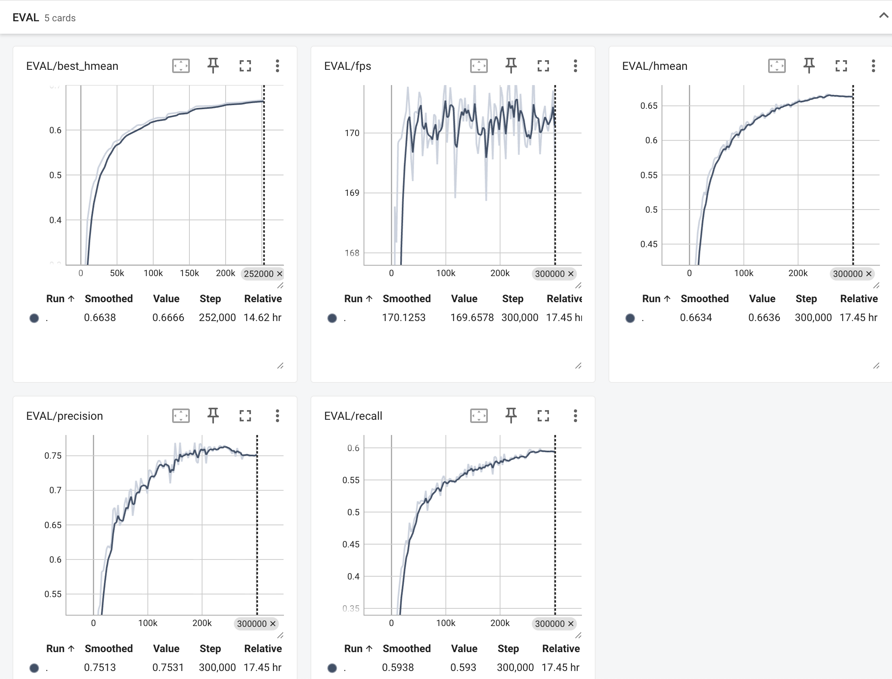
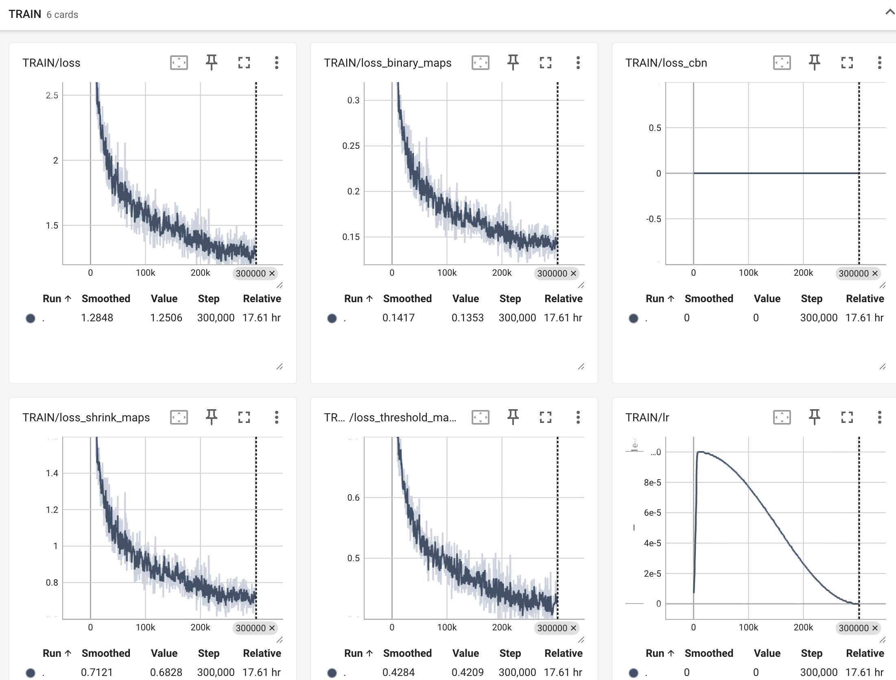
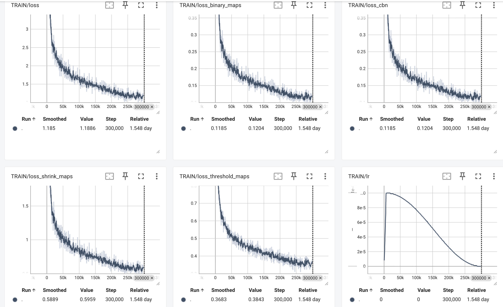

# 检测模型
python tools/train.py \
    -c /Users/zhangxin/github/LearnPractice/OCR/paddleocr/数据集/1_ICDAR2019-LSVT/PP-OCRv5_mobile_det.yml

python tools/train.py \
    -c /Users/zhangxin/github/LearnPractice/OCR/paddleocr/数据集/1_ICDAR2019-LSVT/PP-OCRv5_mobile_det_train_mps.yml

```bash
nohup python tools/train.py \
    -c configs/det/PP-OCRv5/PP-OCRv5_mobile_det.yml \
    -o Global.output_dir=./output/PP-OCRv5_mobile_det_1_ICDAR2019-LSVT \
    Global.use_gpu=true \
    Global.device=gpu \
    Global.use_tensorboard=true \
    Train.dataset.data_dir=/home/zhangxin/data_public/OCR/1_ICDAR2019-LSVT \
    Train.dataset.label_file_list="['/home/zhangxin/data_public/OCR/1_ICDAR2019-LSVT/train.txt']" \
    Eval.dataset.data_dir=/home/zhangxin/data_public/OCR/1_ICDAR2019-LSVT \
    Eval.dataset.label_file_list="['/home/zhangxin/data_public/OCR/1_ICDAR2019-LSVT/val.txt']" \
    >nohup.train.PP-OCRv5_mobile_det.1_ICDAR2019-LSVT.out &
```

[2025/12/29 09:03:24] torchocr INFO: best metric, hmean: 0.6665850972715037, precision: 0.7569002778635381, recall: 0.5955255423033012, fps: 170.0462786690767, best_epoch: 84

tensorboard --logdir output/PP-OCRv5_mobile_det_1_ICDAR2019-LSVT




```bash
nohup python tools/train.py \
    -c configs/det/PP-OCRv5/PP-OCRv5_server_det.yml \
    -o Global.output_dir=./output/PP-OCRv5_server_det_1_ICDAR2019-LSVT \
    Global.use_gpu=true \
    Global.device=gpu \
    Global.use_tensorboard=true \
    Train.dataset.data_dir=/home/zhangxin/data_public/OCR/1_ICDAR2019-LSVT \
    Train.dataset.label_file_list="['/home/zhangxin/data_public/OCR/1_ICDAR2019-LSVT/train.txt']" \
    Eval.dataset.data_dir=/home/zhangxin/data_public/OCR/1_ICDAR2019-LSVT \
    Eval.dataset.label_file_list="['/home/zhangxin/data_public/OCR/1_ICDAR2019-LSVT/val.txt']" \
    >nohup.train.PP-OCRv5_server_det.1_ICDAR2019-LSVT.out &
```

[2025/12/30 22:25:20] torchocr INFO: best metric, hmean: 0.726701953938848, precision: 0.8641400783420938, recall: 0.626982777467389, fps: 222.29796270468825, best_epoch: 84

tensorboard --logdir output/PP-OCRv5_server_det_1_ICDAR2019-LSVT





