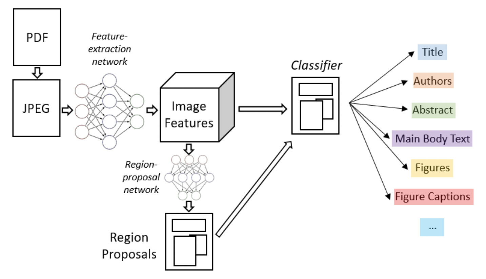

# 1. 版面分析
## 1.1 背景介绍
版面分析主要用于文档检索，关键信息提取，内容分类等，其任务主要是对文档图像进行内容分类，内容的类别一般可分为**纯文本、标题、表格、图片和列表**等。但是文档布局、格式的多样性和复杂性，文档图像质量差，大规模的带标注的数据集的缺少等问题使得版面分析仍然是一个很有挑战性的任务。 版面分析任务的可视化如下图所示:

现有的解决办法一般是基于目标检测或语义分割的方法，这类方法基将文档中不同的板式当做不同的目标进行检测或分割。

一些代表性论文被划分为上述两个类别中，具体如下表所示：

类别 | 主要论文
---|---
基于目标检测的方法 | Visual Detection with Context，Object Detection，VSR
基于语义分割的方法 | Semantic Segmentation

## 1.2 基于目标检测的方法
Soto Carlos[1]在目标检测算法Faster R-CNN的基础上，结合上下文信息并利用文档内容的固有位置信息来提高区域检测性能。Li Kai [2]等人也提出了一种基于目标检测的文档分析方法，通过引入了特征金字塔对齐模块，区域对齐模块，渲染层对齐模块来解决跨域的问题，这三个模块相互补充，并从一般的图像角度和特定的文档图像角度调整域，从而解决了大型标记训练数据集与目标域不同的问题。下图是一个基于目标检测Faster R-CNN算法进行版面分析的流程图。

## 1.3 基于语义分割的方法
Sarkar Mausoom[3]等人提出了一种基于先验的分割机制，在非常高的分辨率的图像上训练文档分割模型，解决了过度缩小原始图像导致的密集区域不同结构无法区分进而合并的问题。Zhang Peng[4]等人结合文档中的视觉、语义和关系提出了一个统一的框架VSR（Vision, Semantics and Relations）用于文档布局分析，该框架使用一个双流网络来提取特定模态的视觉和语义特征，并通过自适应聚合模块自适应地融合这些特征，解决了现有基于CV的方法不同模态融合效率低下和布局组件之间缺乏关系建模的局限性。

## 1.4 数据集
虽然现有的方法可以在一定程度上解决版面分析任务，但是该类方法依赖于大量有标记的训练数据。最近也有很多数据集被提出用于文档分析任务。

PubLayNet[5]: 该数据集包含50万张文档图像，其中40万用于训练，5万用于验证，5万用于测试,共标记了表格，文本，图像，标题和列表五种形式
HJDataset[6]: 数据集包含2271张文档图像, 除了内容区域的边界框和掩码之外，它还包括布局元素的层次结构和阅读顺序。
PubLayNet数据集样例如下图所示:

## 1.5 参考文献:
[1]：Soto C, Yoo S. Visual detection with context for document layout analysis[C]//Proceedings of the 2019 Conference on Empirical Methods in Natural Language Processing and the 9th International Joint Conference on Natural Language Processing (EMNLP-IJCNLP). 2019: 3464-3470.

[2]：Li K, Wigington C, Tensmeyer C, et al. Cross-domain document object detection: Benchmark suite and method[C]//Proceedings of the IEEE/CVF Conference on Computer Vision and Pattern Recognition. 2020: 12915-12924.

[3]：Sarkar M, Aggarwal M, Jain A, et al. Document Structure Extraction using Prior based High Resolution Hierarchical Semantic Segmentation[C]//European Conference on Computer Vision. Springer, Cham, 2020: 649-666.

[4]：Zhang P, Li C, Qiao L, et al. VSR: A Unified Framework for Document Layout Analysis combining Vision, Semantics and Relations[J]. arXiv preprint arXiv:2105.06220, 2021.

[5]：Zhong X, Tang J, Yepes A J. Publaynet: largest dataset ever for document layout analysis[C]//2019 International Conference on Document Analysis and Recognition (ICDAR). IEEE, 2019: 1015-1022.

[6]：Li M, Xu Y, Cui L, et al. DocBank: A benchmark dataset for document layout analysis[J]. arXiv preprint arXiv:2006.01038, 2020.

[7]：Shen Z, Zhang K, Dell M. A large dataset of historical japanese documents with complex layouts[C]//Proceedings of the IEEE/CVF Conference on Computer Vision and Pattern Recognition Workshops. 2020: 548-549.