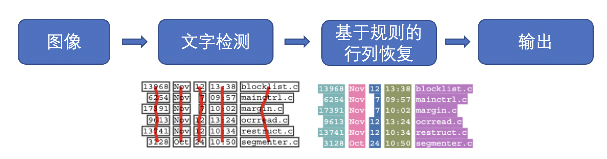
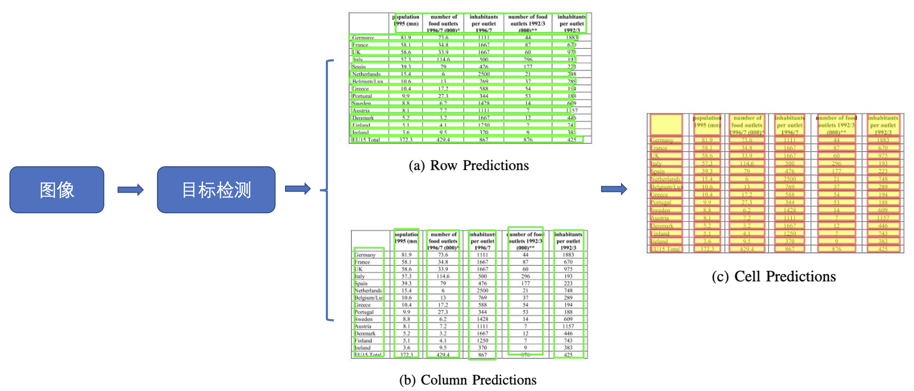
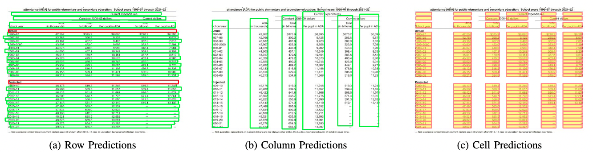
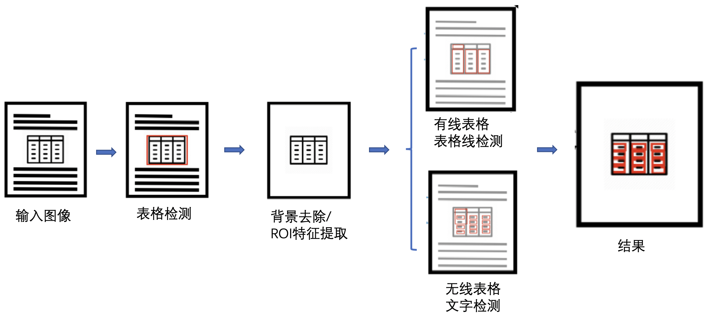
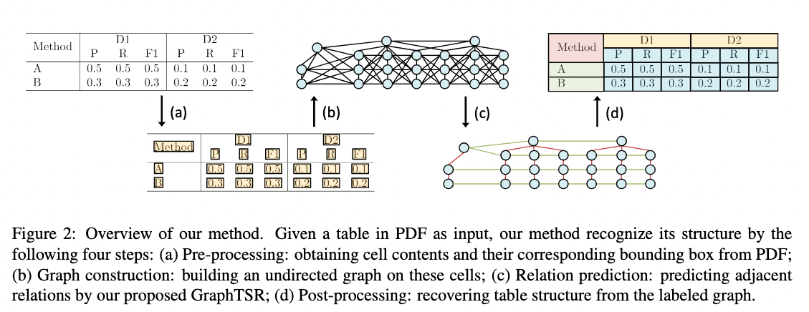
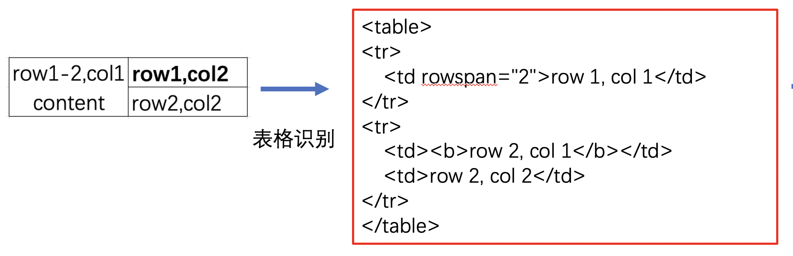
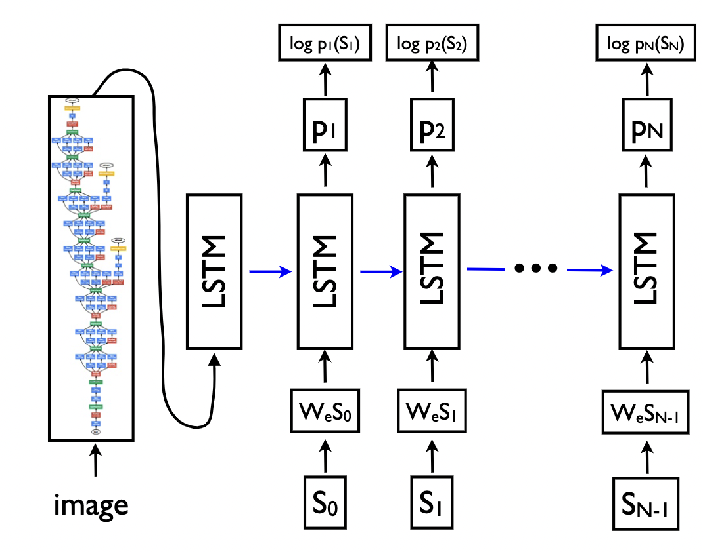
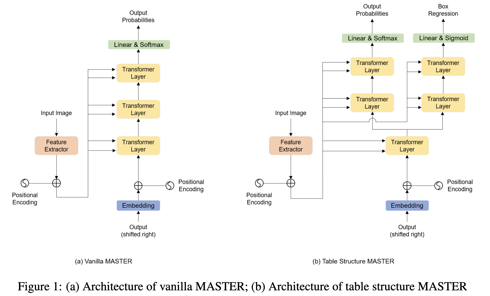

# 2. 表格识别
## 2.1 背景介绍
表格是各类文档中常见的页面元素，随着各类文档的爆炸性增长，如何高效地从文档中找到表格并获取内容与结构信息即表格识别，成为了一个亟需解决的问题。表格识别的难点总结如下：

1. 表格种类和样式复杂多样，例如不同的行列合并，不同的内容文本类型等。
2. 文档的样式本身的样式多样。
3. 拍摄时的光照环境等

表格识别的任务就是将文档里的表格信息转换到excel文件中，任务可视化如下：

现有的表格识别算法根据表格结构重建的原理可以分为下面四大类：

1. 基于启发式规则的方法
2. 基于CNN的方法
3. 基于GCN的方法
4. 基于End to End的方法

一些代表性论文被划分为上述四个类别中，具体如下表所示：

类别 | 思路 | 主要论文
---|---|---
基于启发式规则的方法 |	人工设计规则，连通域检测分析处理 | T-Rect，pdf2table
基于CNN的方法       |	目标检测，语义分割	           | CascadeTabNet, Multi-Type-TD-TSR, LGPMA, tabstruct-net, CDeC-Net, TableNet, TableSense, Deepdesrt, Deeptabstr, GTE, Cycle-CenterNet, FCN
基于GCN的方法       |	基于图神经网络，将表格识别看作图重建问题 |	GNN, TGRNet, GraphTSR
基于End to End的方法|	利用attention机制	           | Table-Master

## 2.2 基于启发式规则的传统算法
早期的表格识别研究主要是基于启发式规则的方法。例如由Kieninger[1]等人提出的T-Rect系统使用自底向上的方法对文档图像进行连通域分析，然后按照定义的规则进行合并，得到逻辑文本块。而之后由Yildiz[2]等人提出的pdf2table则是第一个在PDF文档上进行表格识别的方法，它利用了PDF文件的一些特有信息（例如文字、绘制路径等图像文档中难以获取的信息）来协助表格识别。而在最近的工作中，Koci[3]等人将页面中的布局区域表示为图（Graph）的形式，然后使用了Remove and Conquer(RAC)算法从中将表格作为一个子图识别出来。

## 2.3 基于深度学习CNN的方法
随着深度学习技术在计算机视觉、自然语言处理、语音处理等领域的飞速发展，研究者将深度学习技术应用到表格识别领域并取得了不错的效果。

Siddiqui Shoaib Ahmed[12]等人在DeepTabStR算法中，将表格结构识别问题表述为对象检测问题，并利用可变形卷积来进更好的进行表格单元格的检测。Raja Sachin[6]等人提出TabStruct-Net将单元格检测和结构识别在视觉上结合起来进行表格结构识别，解决了现有方法由于表格布局发生较大变化而识别错误的问题，但是该方法无法处理行列出现较多空单元格的问题。

之前的表格结构识别方法一般是从不同粒度（行/列、文本区域）的元素开始处理问题，容易忽略空单元格合并的问题。Qiao Liang[10]等人提出了一个新框架LGPMA，通过掩码重评分策略充分利用来自局部和全局特征的信息，进而可以获得更可靠的对齐单元格区域，最后引入了包括单元格匹配、空单元格搜索和空单元格合并的表格结构复原pipeline来处理表格结构识别问题。

除了以上单独做表格识别的算法外，也有部分方法将表格检测和表格识别在一个模型里完成，Schreiber Sebastian[11]等人提出了DeepDeSRT，通过Faster RCNN进行表格检测，通过FCN语义分割模型用于表格结构行列检测，但是该方法是用两个独立的模型来解决这两个问题。Prasad Devashish[4]等人提出了一种基于端到端深度学习的方法CascadeTabNet，使用Cascade Mask R-CNN HRNet模型同时进行表格检测和结构识别，解决了以往方法使用独立的两个方法处理表格识别问题的不足。Paliwal Shubham[8]等人提出一种新颖的端到端深度多任务架构TableNet，用于表格检测和结构识别，同时在训练期间向TableNet添加额外的空间语义特征，进一步提高了模型性能。Zheng Xinyi[13]等人提出了表格识别的系统框架GTE，利用单元格检测网络来指导表格检测网络的训练，同时提出了一种层次网络和一种新的基于聚类的单元格结构识别算法，该框架可以接入到任何目标检测模型的后面，方便训练不同的表格识别算法。之前的研究主要集中在从扫描的PDF文档中解析具有简单布局的，对齐良好的表格图像，但是现实场景中的表格一般很复杂，可能存在严重变形，弯曲或者遮挡等问题，因此Long Rujiao[14]等人同时构造了一个现实复杂场景下的表格识别数据集WTW，并提出了一种Cycle-CenterNet方法，它利用循环配对模块优化和提出的新配对损失，将离散单元精确地分组到结构化表中，提高了表格识别的性能。

基于CNN的方法对跨行列的表格无法很好的处理，因此在后续的方法中，分为了两个研究方法来解决表格中跨行列的问题。

## 2.4 基于深度学习GCN的方法
近些年来，随着图卷积神经网络（Graph Convolutional Network）的兴起，也有一些研究者尝试将图神经网络应用到表格结构识别问题上。Qasim Shah Rukh[20]等人将表格结构识别问题转换为与图神经网络兼容的图问题，并设计了一种新颖的可微架构，该架构既可以利用卷积神经网络提取特征的优点，也可以利用图神经网络顶点之间有效交互的优点，但是该方法只使用了单元格的位置特征，没有利用语义特征。Chi Zewen[19]等人提出了一种新颖的图神经网络GraphTSR，用于PDF文件中的表格结构识别，它以表格中的单元格为输入，然后通过利用图的边和节点相连的特性来预测单元格之间的关系来识别表格结构，一定程度上解决了跨行或者跨列的单元格识别问题。Xue Wenyuan[21]等人将表格结构识别的问题重新表述为表图重建，并提出了一种用于表格结构识别的端到端方法TGRNet，该方法包含单元格检测分支和单元格逻辑位置分支，这两个分支共同预测不同单元格的空间位置和逻辑位置，解决了之前方法没有关注单元格逻辑位置的问题。

GraphTSR表格识别算法示意图：

## 2.5 基于端到端的方法
和其他使用后处理完成表格结构的重建不同，基于端到端的方法直接使用网络完成表格结构的HTML表示输出

端到端的方法大多采用Image Caption(看图说话)的Seq2Seq方法来完成表格结构的预测，如一些基于Attention或Transformer的方法。

Ye Jiaquan[22]在TableMaster中通过改进基于Transformer的Master文字算法来得到表格结构输出模型。此外，还添加了一个分支进行框的坐标回归，作者并没有在最后一层将模型拆分为两个分支，而是在第一个 Transformer 解码层之后就将序列预测和框回归解耦为两个分支。其网络结构和原始Master网络的对比如下图所示：

## 2.6 数据集
由于深度学习方法是数据驱动的方法，需要大量的标注数据对模型进行训练，而现有的数据集规模偏小也是一个重要的制约因素，因此也有一些数据集被提出。

PubTabNet[16]: 包含568k表格图像和相应的结构化HTML表示。
PubMed Tables(PubTables-1M)[17]:表格结构识别数据集，包含高度详细的结构注释，460,589张pdf图像用于表格检测任务， 947,642张表格图像用于表格识别任务。
TableBank[18]: 表格检测和识别数据集，使用互联网上Word和Latex文档构建了包含417K高质量标注的表格数据。
SciTSR[19]: 表格结构识别数据集，图像大部分从论文中转换而来，其中包含来自PDF文件的15,000个表格及其相应的结构标签。
TabStructDB[12]: 包括1081个表格区域，这些区域用行和列信息密集标记。
WTW[14]: 大规模数据集场景表格检测识别数据集，该数据集包含各种变形，弯曲和遮挡等情况下的表格数据，共包含14,581 张图像。
数据集示例

## 2.7 参考文献

[1]：Kieninger T, Dengel A. A paper-to-HTML table converting system[C]//Proceedings of document analysis systems (DAS). 1998, 98: 356-365.

[2]：Yildiz B, Kaiser K, Miksch S. pdf2table: A method to extract table information from pdf files[C]//IICAI. 2005: 1773-1785.

[3]：Koci E, Thiele M, Lehner W, et al. Table recognition in spreadsheets via a graph representation[C]//2018 13th IAPR International Workshop on Document Analysis Systems (DAS). IEEE, 2018: 139-144.

[4]：Prasad D, Gadpal A, Kapadni K, et al. CascadeTabNet: An approach for end to end table detection and structure recognition from image-based documents[C]//Proceedings of the IEEE/CVF Conference on Computer Vision and Pattern Recognition Workshops. 2020: 572-573.

[5]：Fischer P, Smajic A, Abrami G, et al. Multi-Type-TD-TSR–Extracting Tables from Document Images Using a Multi-stage Pipeline for Table Detection and Table Structure Recognition: From OCR to Structured Table Representations[C]//German Conference on Artificial Intelligence (Künstliche Intelligenz). Springer, Cham, 2021: 95-108.

[6]：Raja S, Mondal A, Jawahar C V. Table structure recognition using top-down and bottom-up cues[C]//European Conference on Computer Vision. Springer, Cham, 2020: 70-86.

[7]：Agarwal M, Mondal A, Jawahar C V. Cdec-net: Composite deformable cascade network for table detection in document images[C]//2020 25th International Conference on Pattern Recognition (ICPR). IEEE, 2021: 9491-9498.

[8]：Paliwal S S, Vishwanath D, Rahul R, et al. Tablenet: Deep learning model for end-to-end table detection and tabular data extraction from scanned document images[C]//2019 International Conference on Document Analysis and Recognition (ICDAR). IEEE, 2019: 128-133.

[9]：Dong H, Liu S, Han S, et al. Tablesense: Spreadsheet table detection with convolutional neural networks[C]//Proceedings of the AAAI Conference on Artificial Intelligence. 2019, 33(01): 69-76.

[10]：Qiao L, Li Z, Cheng Z, et al. LGPMA: Complicated Table Structure Recognition with Local and Global Pyramid Mask Alignment[J]. arXiv preprint arXiv:2105.06224, 2021.

[11]：Schreiber S, Agne S, Wolf I, et al. Deepdesrt: Deep learning for detection and structure recognition of tables in document images[C]//2017 14th IAPR international conference on document analysis and recognition (ICDAR). IEEE, 2017, 1: 1162-1167.

[12]：Siddiqui S A, Fateh I A, Rizvi S T R, et al. Deeptabstr: Deep learning based table structure recognition[C]//2019 International Conference on Document Analysis and Recognition (ICDAR). IEEE, 2019: 1403-1409.

[13]：Zheng X, Burdick D, Popa L, et al. Global table extractor (gte): A framework for joint table identification and cell structure recognition using visual context[C]//Proceedings of the IEEE/CVF Winter Conference on Applications of Computer Vision. 2021: 697-706.

[14]：Long R, Wang W, Xue N, et al. Parsing Table Structures in the Wild[C]//Proceedings of the IEEE/CVF International Conference on Computer Vision. 2021: 944-952.

[15]：Siddiqui S A, Khan P I, Dengel A, et al. Rethinking semantic segmentation for table structure recognition in documents[C]//2019 International Conference on Document Analysis and Recognition (ICDAR). IEEE, 2019: 1397-1402.

[16]：Zhong X, ShafieiBavani E, Jimeno Yepes A. Image-based table recognition: data, model, and evaluation[C]//Computer Vision–ECCV 2020: 16th European Conference, Glasgow, UK, August 23–28, 2020, Proceedings, Part XXI 16. Springer International Publishing, 2020: 564-580.

[17]：Smock B, Pesala R, Abraham R. PubTables-1M: Towards a universal dataset and metrics for training and evaluating table extraction models[J]. arXiv preprint arXiv:2110.00061, 2021.

[18]：Li M, Cui L, Huang S, et al. Tablebank: Table benchmark for image-based table detection and recognition[C]//Proceedings of the 12th Language Resources and Evaluation Conference. 2020: 1918-1925.

[19]：Chi Z, Huang H, Xu H D, et al. Complicated table structure recognition[J]. arXiv preprint arXiv:1908.04729, 2019.

[20]：Qasim S R, Mahmood H, Shafait F. Rethinking table recognition using graph neural networks[C]//2019 International Conference on Document Analysis and Recognition (ICDAR). IEEE, 2019: 142-147.

[21]：Xue W, Yu B, Wang W, et al. TGRNet: A Table Graph Reconstruction Network for Table Structure Recognition[J]. arXiv preprint arXiv:2106.10598, 2021.

[22]：Ye J, Qi X, He Y, et al. PingAn-VCGroup's Solution for ICDAR 2021 Competition on Scientific Literature Parsing Task B: Table Recognition to HTML[J]. arXiv preprint arXiv:2105.01848, 2021.