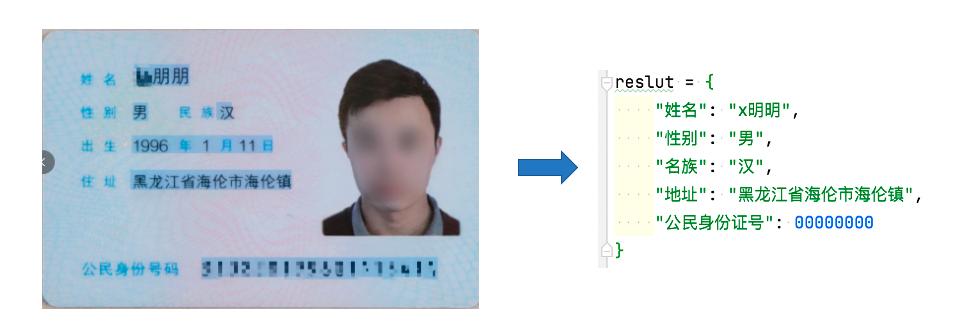
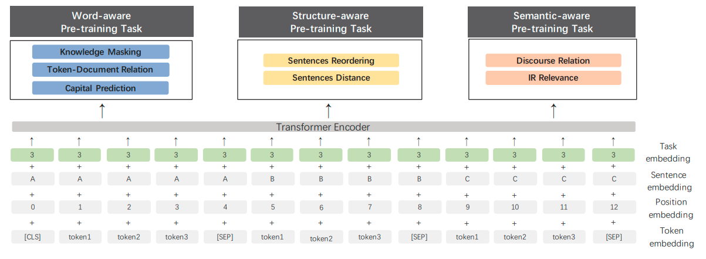
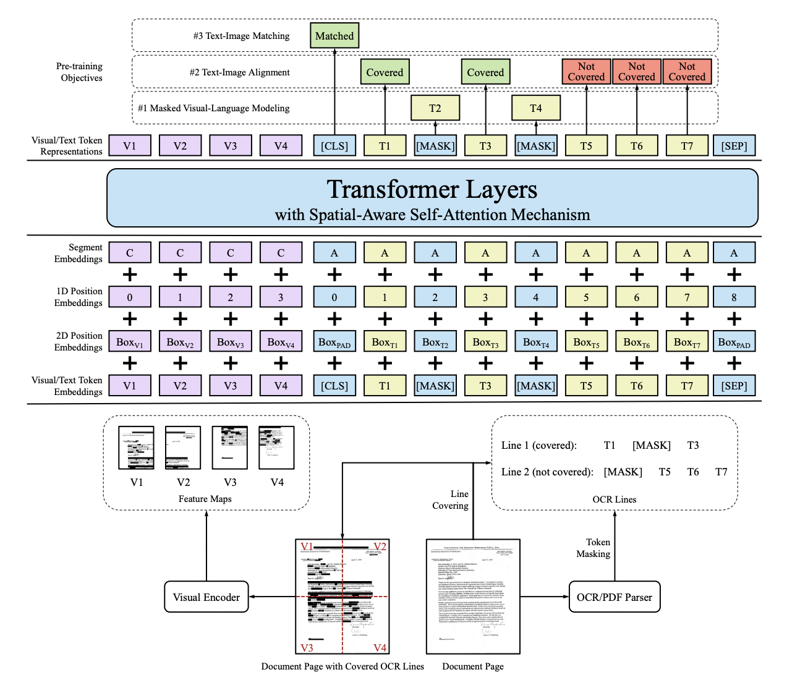

# 3. Document VQA
老板派任务：开发一个身份证识别系统

如何选择方案

1. 文字检测之后用规则来进行信息提取
2. 文字检测之后用规模型来进行信息提取
3. 外包出去

# 3.1 背景介绍
在VQA(Visual Question Answering)任务中，主要针对图像内容进行提问和回答，但是对于文本图像来说，关注的内容是图像中的文字信息，因此这类方法可以分为自然场景的Text-VQA和扫描文档场景的DocVQA，三者的关系如下图所示。

任务类型	| VQA               |	Text-VQA                |	DocVQA
---|---|---|---
任务描述	| 针对图片内容提出问题|	针对图片上的文字内容提出问题|	针对文档图像的文字内容提出问题

DocVQA由于其更加贴近实际应用场景，涌现出了大批学术界和工业界的工作。在常用的场景中，DocVQA里提问的问题都是固定的，比如身份证场景下的问题一般为

1. 公民身份号码是什么？
2. 姓名是什么？
3. 民族是什么?

基于这样的先验知识，DocVQA的 研究开始偏向Key Information Extraction(KIE)任务，本次我们也主要讨论KIE相关的研究，KIE任务主要从图像中提取所需要的关键信息，如从身份证中提取出姓名和公民身份号码信息。

KIE通常分为两个子任务进行研究

1. SER: 语义实体识别 (Semantic Entity Recognition)，对每一个检测到的文本进行分类，如将其分为姓名，身份证。如下图中的黑色框和红色框。
2. RE: 关系抽取 (Relation Extraction)，对每一个检测到的文本进行分类，如将其分为问题和的答案。然后对每一个问题找到对应的答案。如下图中的红色框和黑色框分别代表问题和答案，黄色线代表问题和答案之间的对应关系。

一般的KIE方法基于命名实体识别(Named Entity Recognition,NER)[4]来研究，但是这类方法只利用了图像中的文本信息，缺少对视觉和结构信息的使用，因此精度不高。在此基础上，近几年的方法都开始将视觉和结构信息与文本信息融合到一起，按照对多模态信息进行融合时所采用的的原理可以将这些方法分为下面三种：

1. 基于Grid的方法
2. 基于Token的方法
3. 基于GCN的方法
4. 基于End to End 的方法

一些代表性论文被划分为上述三个类别中，具体如下表所示：

类别	| 思路	| 主要论文
---|---|---
基于Grid的方法	        | 在图像上多模态信息的融合（文本，布局，图像）	| Chargrid
基于Token的方法	        | 利用Bert这类方法进行多模态信息的融合	       | LayoutLM, LayoutLMv2, StrucText,
基于GCN的方法	        | 利用图网络结构进行多模态信息的融合	       | GCN, PICK, SDMG-R，SERA
基于End to End的方法	| 将OCR和关键信息提取统一到一个网络	           | Trie

## 3.2 基于Grid的方法
基于Grid的方法在图像层面进行多模态信息的融合。Chargrid[5]首先对图像进行字符级的文字检测和识别，然后通过将类别的one-hot编码填充到对应的字符区域(下图中右图的非黑色部分)内来完成对网络输入的构建，输入最后通过encoder-decoder结构的CNN网络来进行关键信息的坐标检测和类别分类。

相比于传统的仅基于文本的方法，该方法能够同时利用文本信息和结构信息，因此能够取得一定的精度提升，但是该方法对文本和结构信息的融合只是做了简单的嵌入，并没有很好的将二者进行融合

## 3.3 基于Token的方法
LayoutLM[6]将2D位置信息和文本信息一起编码到BERT模型中，并且借鉴NLP中Bert的预训练思想，在大规模的数据集上进行预训练，在下游任务中，LayoutLM还加入了图像信息来进一步提升模型性能。LayoutLM虽然将文本，位置和图像信息做了融合，但是图像信息是在下游任务的训练中进行融合，这样对三种信息的多模态融合并不充分。LayoutLMv2[7]在LayoutLM的基础上，通过transformers在预训练阶段将图像信息和文本，layout信息进行融合，还在Transformer中加入空间感知自注意力机制辅助模型更好地融合视觉和文本特征。LayoutLMv2虽然在预训练阶段对文本，位置和图像信息做了融合，但是由于预训练任务的限制，模型学到的视觉特征不够精细。StrucTexT[8]在以往多模态方法的基础上，在预训练任务提出Sentence Length Prediction (SLP) 和Paired Boxes Direction (PBD)两个新任务来帮助网络学习精细的视觉特征，其中SLP任务让模型学习文本段的长度，PDB任务让模型学习Box方向之间的匹配关系。通过这两个新的预训练任务，能够加速文本、视觉和布局信息之间的深度跨模态融合。

## 3.4 基于GCN的方法
现有的基于GCN的方法[10]虽然利用了文字和结构信息，但是没有对图像信息进行很好的利用。PICK[11]在GCN网络中加入了图像信息并且提出graph learning module来自动学习edge的类型。SDMG-R [12]将图像编码为双模态图，图的节点为文字区域的视觉和文本信息，边表示相邻文本直接的空间关系，通过迭代地沿边传播信息和推理图节点类别，SDMG-R解决了现有的方法对没见过的模板无能为力的问题。

PICK流程图如下图所示：

SERA[10]将依存句法分析里的biaffine parser引入到文档关系抽取中，并且使用GCN来融合文本和视觉信息。

## 3.5 基于End to End 的方法
现有的方法将KIE分为两个独立的任务：文本读取和信息提取，然而他们主要关注于改进信息提取任务，而忽略了文本读取和信息提取是相互关联的，因此，Trie[9]提出了一个统一的端到端网络，可以同时学习这两个任务，并且在学习过程中相互加强。

## 3.6 数据集
用于KIE的数据集主要有下面两个：

1. SROIE: SROIE数据集[2]的任务3旨在从扫描收据中提取四个预定义的信息：公司、日期、地址或总数。数据集中有626个样本用于训练，347个样本用于测试。
2. FUNSD: FUNSD数据集[3]是一个用于从扫描文档中提取表单信息的数据集。它包含199个标注好的真实扫描表单。199个样本中149个用于训练，50个用于测试。FUNSD数据集为每个单词分配一个语义实体标签：问题、答案、标题或其他。
3. XFUN: XFUN数据集是微软提出的一个多语言数据集，包含7种语言，每种语言包含149张训练集，50张测试集。

## 3.7 参考文献：

[1]：Mathew M, Karatzas D, Jawahar C V. Docvqa: A dataset for vqa on document images[C]//Proceedings of the IEEE/CVF Winter Conference on Applications of Computer Vision. 2021: 2200-2209.

[2]：Huang Z, Chen K, He J, et al. Icdar2019 competition on scanned receipt ocr and information extraction[C]//2019 International Conference on Document Analysis and Recognition (ICDAR). IEEE, 2019: 1516-1520.

[3]：Jaume G, Ekenel H K, Thiran J P. Funsd: A dataset for form understanding in noisy scanned documents[C]//2019 International Conference on Document Analysis and Recognition Workshops (ICDARW). IEEE, 2019, 2: 1-6.

[4]：Lample G, Ballesteros M, Subramanian S, et al. Neural architectures for named entity recognition[J]. arXiv preprint arXiv:1603.01360, 2016.

[5]：Katti A R, Reisswig C, Guder C, et al. Chargrid: Towards understanding 2d documents[J]. arXiv preprint arXiv:1809.08799, 2018.

[6]：Xu Y, Li M, Cui L, et al. Layoutlm: Pre-training of text and layout for document image understanding[C]//Proceedings of the 26th ACM SIGKDD International Conference on Knowledge Discovery & Data Mining. 2020: 1192-1200.

[7]：Xu Y, Xu Y, Lv T, et al. LayoutLMv2: Multi-modal pre-training for visually-rich document understanding[J]. arXiv preprint arXiv:2012.14740, 2020.

[8]：Li Y, Qian Y, Yu Y, et al. StrucTexT: Structured Text Understanding with Multi-Modal Transformers[C]//Proceedings of the 29th ACM International Conference on Multimedia. 2021: 1912-1920.

[9]：Zhang P, Xu Y, Cheng Z, et al. Trie: End-to-end text reading and information extraction for document understanding[C]//Proceedings of the 28th ACM International Conference on Multimedia. 2020: 1413-1422.

[10]：Liu X, Gao F, Zhang Q, et al. Graph convolution for multimodal information extraction from visually rich documents[J]. arXiv preprint arXiv:1903.11279, 2019.

[11]：Yu W, Lu N, Qi X, et al. Pick: Processing key information extraction from documents using improved graph learning-convolutional networks[C]//2020 25th International Conference on Pattern Recognition (ICPR). IEEE, 2021: 4363-4370.

[12]：Sun H, Kuang Z, Yue X, et al. Spatial Dual-Modality Graph Reasoning for Key Information Extraction[J]. arXiv preprint arXiv:2103.14470, 2021.

# 4. 总结
本节我们主要介绍了文档分析技术相关的三个子模块的理论知识：版面分析、表格识别和信息提取。下面我们会基于PaddleOCR框架对这表格识别和DOC-VQA进行实战教程的讲解。