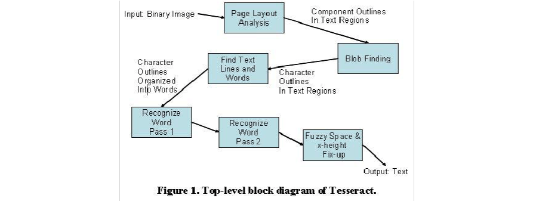
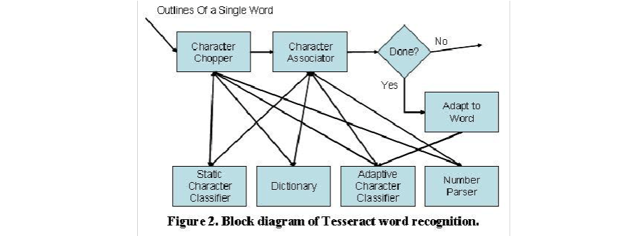

tesseract 
TesseractOCR（光学字符识别）引擎概述
tesseract ocr engine 中文文档

# 一：TesseractOCR简介
Tesseract是惠普布里斯托实验室在1985到1995年间开发的一个开源的OCR引擎，曾经在1995 UNLV精确度测试中名列前茅。但1996年后基本停止了开发。2005年，惠普将其对外开源，2006由Google对Tesseract进行改进、消除Bug、优化工作。项目地址为...

# 二：TsseractOCR 架构
Tesseract的识别步骤大致如下：
1. 连通区域分析,检测出字符区域（轮廓外形）,以及子轮廓。在此阶段轮廓线集成为块区域。
2. 由字符轮廓和块区域得出文本行，以及通过空格识别出单词。固定字宽文本通过字符单元分割出单个字符，而对百分号的文本（Proportional text）通过一定的间隔和模糊间隔就（fuzzy spaces）来分割；
3. 依次对每个单词进行分析，采用自适应分类器，分类器有学习能力，先分析的且满足条件的单词也作为训练样本，所以后面的字符（比如页尾）识别更准确；此时，页首的字符识别比较不准确，所以tesseract会再次对识别不太好的字符识别是其精度得到提高。
4. 最后，识别含糊不清的空格，及用其他方法，如由笔画高度（x-height），识别小写字母（small-cap）的文本。

# 三：文本行和单词的查找（Line and Word Finding）
> a. 假设页面布局分析（page layout analysis）大致确定了文本区域和文本尺寸，一个简单百分位高度过滤器（percentile height filter）可以将跨行大写字母及纵向粘连一起的字符过滤掉，利用字符的高度信息，选取所有字符的中值高度，通过高度的比例调节去掉一些无关的块，比如标点符号，变音符和噪声等；
> b. 对块区域的x坐标排序，利用坐标拟合直线（baseline），拟合方法：中位数最小方差拟合（least median of squares fit）
> c. 进一步，拟合文本行的形状，利用四次多项式，将文本行看成螺线形，采用最小二乘法拟合
> d. 检测出等距文本(fixed pitch text)，对粘连的文本进行分割(chopping)
> e. 对非等距字体如百分号，斜体等问题，利用中线、基准线之间的空白大小，来分割字符

有关函数：
1. PageIterator * tesseract::TessBaseAPI::AnalyseLayout()页面结构分析
2. Boxa * tesseract::TessBaseAPI::GetRegions(Pixa ** pixa)获取页面结构分析结果
3. Boxa * tesseract::TessBaseAPI::GetConnectedComponents ( Pixa ** pixa ) 连通域分析
4. void tesseract::TessBaseAPI::GetBlockTextOrientations ( int ** block_orientation, bool ** vertical_writing )
获取每一块（block由页面结构分析获得）中的文字方向。 
5. Boxa * tesseract::TessBaseAPI::GetStrips ( Pixa ** pixa, int ** blockids) 获得strip区域
6. Boxa * tesseract::TessBaseAPI::GetTextlines ( Pixa ** pixa,
int ** blockids
) 获得文本行
7. Boxa * tesseract::TessBaseAPI::GetWords(Pixa ** pixa)以Boxa格式获取文字。 
8. Boxa*tesseract::TessBaseAPI::GetComponentImages ( PageIteratorLevel level,
bool
Pixa **
int **
)
获得指定级别的元素（block，textline, word） text_only, pixa, blockids

9. voidtesseract::TessBaseAPI::DeleteBlockList(BLOCK_LIST * block_list)
删除Block

# 四：单词的识别（word recognition）
a. 分割粘连的字符，将凹进去的轮廓点作为备选分割点，分割后，进行识别，如果都失败，就认为字符破损不全，修补字符
b. 对破碎的字符，利用A*算法搜索最优的字符组合，直到达到满意的识别结果。（识别成功的基本是字符分类器可以很好的识别破碎的字符）

1. inttesseract::TessBaseAPI::Recognize(ETEXT_DESC * monitor)
识别 来自SetAndThresholdImage的图像，产生Tesseract内部结构数据。
2. int tesseract::TessBaseAPI::RecognizeForChopTest(ETEXT_DESC * monitor)
识别 来自SetAndThresholdImage，Recognize() or TesseractRect().的图像，测试chopper. 

3. booltesseract::TessBaseAPI::ProcessPages ( const char * filename,
const char * retry_config,
int timeout_millisec,
STRING *
)
识别指定文件的所有页面 

4. booltesseract::TessBaseAPI::ProcessPage ( Pix *
int text_out pix, page_index,
const char * filename, const char * retry_config,
int
STRING *
)
识别指定文件的单张页面

5. inttesseract::TessBaseAPI::IsValidWord(const char * word)
检查字符是否无效 timeout_millisec, text_out 

# 五:静态字符识别（ Static Character Classifier）

特征
a. 拓扑特征：与字体及大小无关，但问题是（引用文章看不到）？
b. 将字符近似为多边形作为特征：对破碎不连通的字符无效
c. 突破性方案：训练阶段的特征与识别的特征可以不尽相同。在训练阶段，将近似多边形作为特征，而在识别阶段，抽取字符的轮廓特征并归一化，然后将训练集中的原型特征再与之，进行多对一的方式匹配（tesseractOCR采用c方案进行特征提取）
The features extracted from the unknown：待识别字符的特征，3维数据（x, y坐标，角度），每个字符一般有50-100个特征
the prototype features：原型特征（训练集中的字符特征），4维数据（x, y坐标，角度，长度）一般有10-20个特征

分类，分为两个步骤：
a. 粗分，多个特征，将每个特征相近的字符列举出来 
b. 细分，对相近的字符，用特征距离进行细分
训练数据 94个字符，8种大小，4种字体（正常，粗体，斜体，斜粗体），每种20个样本，共60160个样本。
1. void tesseract::TessBaseAPI::GetFeaturesForBlob ( TBLOB *
const DENORM & blob, denorm,
INT_FEATURE_ARRAY int_features,
int *
int *
)
从Blob中获取特征 num_features, FeatureOutlineIndex

# 六：语法分析
训练集中有最常用的高频词，字典中的常用词，常用数字，常用大写、小写。
将分割出的、待识别的词与这些词进行比较计算，算法采用加权最小距离。
问题：不同的分割，会识别出不同的结果。两种结果都有可能，原因在于分割的不确定。用两个指标进行量化，一个是confidence，将未知字符到原型的归一化距离的负值为指标（confidence越大识别效果越好）；第二是（rating）将未知字符的轮廓长度与未知字符到原型的归一化的距离相乘作为指标。
1. int * tesseract::TessBaseAPI::AllWordConfidences()
以数组形式返回所有文字的置信值（confidence）
2. inttesseract::TessBaseAPI::MeanTextConf()
返回所有文字的平均置信值（confidence）

# 七：自适应分类器（Adaptive Classifier）
由于静态分类器涉及到多种字体，其区分相近字符、字符与非字符的能力被削弱。此时，由于每页文档内的字符的个数有限，利用静态分类器的结果可以训练出对字体更敏感的自适应分类器，可以提高分类能力。
tesseract不用模板分类器，但使用相同的特征和分类作为静态分类器。静态与自适应分类器的区别，除了训练集外，还有自适应分类器会将一行字符的基线（baseline）/x-高度（小写字母x的高度）归一化。归一化后，很容易区分字母大小写及噪声；而静态分类器仅利用字符归一化的一阶矩确定位置，二阶矩确定字符大小。
将字符的距归一化最大的好处是去除高宽比（ aspect ratio ）和字体笔画宽度（stroke width）的影响，且使上标、下标的区分简单。但需要额外的分类特征来区分字母大小写。（两种归一化：基线/x行高的归一化，单个字符距的归一化）
1. booltesseract::TessBaseAPI::AdaptToWordStr ( PageSegMode mode,
const char *
)
将给定的字应用到自适应分类器中。
2. wordstr
void tesseract::TessBaseAPI::RunAdaptiveClassifier ( TBLOB * blob,
const DENORM & denorm, int int * float * int * )
在Blob上运行自适应分类器
num_max_matches, unichar_ids, ratings,
num_matches_returned
tesseract还有学习能力，一般来说，整页的文章的识别率要比单个字符的识别率要高，而且速度要比单个字符识别（累加时间）要好。

在tesseract源码里，tesseract默认选取的特征是 bmp，分类器是Convolutional Neural Net classifier，即可演化的神经网络分类器（每一个结果都作为神经网络的输入，能提供反馈）。\tesseract_src\cube\conv_net_classifier.h是分类器的描述。
不仅如此，tesseract还提供了Hybrid Neural Net Char Classifier分类器，使用Hybrid特征数据。
\tesseract_src\cube\classifier_factory.cpp \tesseract_src\ccmain\cube_reco_context.cpp 里包含了tesseract分类器的实现。
