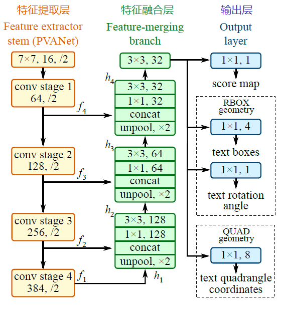

EAST: An Efficient and Accurate Scene Text Detector [论文地址](https://arxiv.org/abs/1704.03155)

# 概要
以前的场景文本检测方法已经在各种基准上取得了有希望的表现。然而，即使配备深层神经网络模型，它们通常不擅长处理具有挑战性的场景，因为整体性能由管道中多个阶段和组件的相互作用决定。在这项工作中，我们提出了一个简单而强大的流水线，可以在自然场景中产生快速准确的文本检测。管线直接预测完整图像中任意取向和四边形形状的单词或文本行，通过单个神经网络消除不必要的中间步骤（例如，候选聚合和单词分割）。我们的管道的简单性集中在设计损耗函数和神经网络架构上。包括ICDAR 2015，COCO-Text和MSRA-TD500在内的标准数据集的实验表明，所提出的算法在精度和效率方面都显着优于最先进的方法。在ICDAR 2015数据集上，提出的算法在720p分辨率下，以13.2fps的F值得到0.7820。

# 1 介绍
最近，提取和理解自然场景中体现的文字信息变得越来越重要和受欢迎，这得到了ICDAR系列比赛前所未有的大量参与者[30,16,15]以及NIST的TRAIT 2016评估的启动[1]。

文本检测作为后续流程的先决条件，在文本信息提取和理解的整个过程中起着至关重要的作用。 以前的文本检测方法[2，33，12，7，48]已经在这一领域的各种基准上获得了有希望的表现。 文本检测的核心是设计区分文本和背景的功能。 传统上，功能手动设计[5,25,40,10,26,45]以捕获场景文本的属性，而基于深度学习的方法[3,13,11,12,7,88]有效特征直接 从训练数据中学习。

然而，基于传统的或深层神经网络的现有方法主要由几个阶段和组件组成，这些阶段和组件可能是次优的和耗时的。 因此，这种方法的准确性和效率还远远不能令人满意。

在本文中，我们提出了一个快速准确的场景文本检测流水线，只有两个阶段。 该管道利用完全卷积网络（FCN）模型，直接产生单词或文本行级别预测，不包括冗余和缓慢的中间步骤。 产生的文本预测可以是旋转的矩形或四边形，被发送到非最大抑制以产生最终结果。 与现有方法相比，根据标准基准的定性和定量实验，提出的算法实现了显着提高的性能，同时运行更快。

# 2 相关工作

# 3 方法

The key component of the proposed algorithm is a neural network model, which is trained to directly predict the existence of text instances and their geometries from full images. The model is a fully-convolutional neural network adapted for text detection that outputs dense per-pixel predictions of words or text lines. This eliminates intermediate steps such as candidate proposal, text region formation and word partition. The post-processing steps only include **thresholding and NMS** on predicted geometric shapes. The detector is named as EAST, since it is an Efficient and Accuracy Scene Text detection pipeline.

所提算法的关键组件是神经网络模型，该模型经过训练可从完整图像中直接预测文本实例及其几何形状的存在。该模型是适用于文本检测的全卷积神经网络，可输出单词或文本行的密集逐像素预测。这消除了候选提议、文本区域形成和单词分割等中间步骤。后处理步骤仅包括对预测几何形状的**阈值化和 NMS**。该检测器被命名为 EAST，因为它是一种高效且准确的场景文本检测管道。

## 3.1 流程

A high-level overview of our pipeline is illustrated in Fig. 2(e). The algorithm follows the general design of DenseBox [9], in which an image is fed into the FCN and multiple channels of pixel-level text score map and geometry are generated.

One of the predicted channels is a score map whose pixel values are in the range of [0, 1]. The remaining channels represent geometries that encloses the word from the view of each pixel. The score stands for the confidence of the geometry shape predicted at the same location.

We have experimented with two geometry shapes for text regions, rotated box (RBOX) and quadrangle (QUAD), and designed different loss functions for each geometry. Thresholding is then applied to each predicted region, where the geometries whose scores are over the predefined threshold is considered valid and saved for later non-maximum-suppression. Results after NMS are considered the final output of the pipeline.

图 2(e) 显示了我们管道的高级概述。该算法遵循 DenseBox [9] 的一般设计，其中将图像输入 FCN，并生成像素级文本得分图和几何图形的多个通道。

预测通道之一是得分图，其像素值在 [0, 1] 范围内。其余通道表示从每个像素的视角包围单词的几何图形。得分代表在同一​​位置预测的几何形状的置信度。

我们已经尝试了两种文本区域的几何形状，旋转框 (RBOX) 和四边形 (QUAD)，并为每种几何图形设计了不同的损失函数。然后对每个预测区域应用阈值，其中得分超过预定义阈值的几何图形被视为有效并保存以供以后进行非最大抑制。NMS 之后的结果被视为管道的最终输出。

## 3.2 网络结构设计

Several factors must be taken into account when designing neural networks for text detection. Since the sizes of word regions, as shown in Fig. 5, vary tremendously, determining the existence of large words would require features from late-stage of a neural network, while predicting accurate geometry enclosing a small word regions need low-level information in early stages. Therefore the network must use features from different levels to fulfill these requirements. HyperNet [19] meets these conditions on features maps, but merging a large number of channels on large feature maps would significantly increase the computation overhead for later stages.

在设计用于文本检测的神经网络时，必须考虑几个因素。如图 5 所示，由于单词区域的大小差异很大，确定大单词的存在需要来自神经网络后期的特征，而预测包围小单词区域的准确几何形状则需要早期的低级信息。因此，网络必须使用不同级别的特征来满足这些要求。HyperNet [19] 在特征图上满足了这些条件，但在大型特征图上合并大量通道会显著增加后期的计算开销。

In remedy of this, we adopt the idea from U-shape [29] to merge feature maps gradually, while keeping the upsampling branches small. Together we end up with a network that can both utilize different levels of features and keep a small computation cost.

为了解决这个问题，我们采用了 U 形 [29] 的思想，逐步合并特征图，同时保持上采样分支较小。最终我们得到了一个既能利用不同层次特征又能保持较小计算成本的网络。

A schematic view of our model is depicted in Fig. 3. The model can be decomposed in to three parts: feature extractor stem, feature-merging branch and output layer.

图 3 描述了我们的模型示意图。该模型可以分解为三个部分：特征提取器主干、特征合并分支和输出层。

The stem can be a convolutional network pre-trained on ImageNet [4] dataset, with interleaving convolution and pooling layers. Four levels of feature maps, denoted as $f_i$ , are extracted from the stem, whose sizes are $\frac 1 {32}$ , $\frac 1 {16}$ , $\frac 1 8$ and $\frac 1 4$ of the input image, respectively. In Fig. 3, PVANet [17] is depicted. In our experiments, we also adopted the well-known VGG16 [32] model, where feature maps after pooling-2 to pooling-5 are extracted.

主干可以是在 ImageNet [4] 数据集上预训练的卷积网络，其中卷积层和池化层交错。从主干中提取四层特征图，记为 $f_i$，其大小分别为输入图像的 $\frac 1 {32}$ 、 $\frac 1 {16}$ 、 $\frac 1 8$ 和 $\frac 1 4$。图 3 描绘了 PVANet [17]。在我们的实验中，我们还采用了众所周知的 VGG16 [32] 模型，其中提取了池化 2 到池化 5 之后的特征图。

In the feature-merging branch, we gradually merge them:

where $g_i$ is the merge base, and $h_i$ is the merged feature map, and the operator [·; ·] represents concatenation along the channel axis. In each merging stage, the feature map from the last stage is first fed to an unpooling layer to double its size, and then concatenated with the current feature map. Next, a conv1×1 bottleneck [8] cuts down the number of channels and reduces computation, followed by a conv3×3 that fuses the information to finally produce the output of this merging stage. Following the last merging stage, a conv3×3 layer produces the final feature map of the merging branch and feed it to the output layer.

在特征合并分支中，我们逐渐地合并他们：

$g_i$是合并的基础，$h_i$ 是合并后的特征层，算子[.;.]表示不同通道沿着axis的连结。在每个合并阶段，最后一个特征层第一个送进非池化层并放大两倍尺寸，然后与当前特征层合并。 下一步，一个conv1x1瓶颈缩小通道数量和减小计算量，紧跟着最后一个合并阶段，一个conv3x3层产生最后一个合并分支的特征层，喂给输出层。

The number of output channels for each convolution is shown in Fig. 3. We keep the number of channels for convolutions in branch small, which adds only a fraction of computation overhead over the stem, making the network computation-efficient. The final output layer contains several conv1×1 operations to project 32 channels of feature maps into 1 channel of score map $F_s$ and a multi-channel geometry map $F_g$. The geometry output can be either one of RBOX or QUAD, summarized in Tab. 1

每个卷积层的输出通道数量如图3所示。我们保留在分支中卷积通道数小的，仅增加了一小部分开销，使得网络更高效。最后的输出层包含几个conv1x1算法子将特征层的32通道映射到一个$F_s$分数图和一个多通道的几何信息图$F_g$。几何输出可以是RBOX或者QUAD。

For RBOX, the geometry is represented by 4 channels of axis-aligned bounding box (AABB) R and 1 channel rotation angle θ. The formulation of R is the same as that in [9], where the 4 channels represents 4 distances from the pixel location to the top, right, bottom, left boundaries of the rectangle respectively.

对于RBOX来说，几何形状用四通道的轴对齐的边界框（AABB）R 和 一个通道的旋转角度 $\theta$ 表示。R的公式如[9]，四个通道代表4个距离，分别是像素点位置到上右下左边界的距离。

For QUAD Q, we use 8 numbers to denote the coordinate shift from four corner vertices ${p_i | i\in {1, 2, 3, 4}}$ of the quadrangle to the pixel location. As each distance offset contains two numbers $(\Delta x_i, \Delta y_i)$, the geometry output contains 8 channels.

对于QUAD Q来说，我们使用8个数字来表示四个顶点到像素点的坐标位移。 每个偏移距离包含 $\Delta x_i$ $\Delta y_i$ 两个数，几何输出包含8个通道。

## 3.3 标签生成
### 3.3.1 四边形的分数图生成

Without loss of generality, we only consider the case where the geometry is a quadrangle. The positive area of the quadrangle on the score map is designed to be roughly a shrunk version of the original one, illustrated in Fig. 4 (a).

不失一般性的情况下，我们只考虑几何是四边形的情况。得分图上四边形的正面积设计为大致为原始图形的缩小 版本。如图4所示。

对一个四边形$Q={p_i|i \in {1,2,3,4}}$, $p_i$是按顺时针顺序排列的四边形的顶点。对于缩小的Q，我们首先计算ri：
$$
r_i = \min(D(p_i, p_{(i \mod 4) + 1}) ,   
			D(p_i, p_{((i+2) \mod 4) + 1}))
$$

$D(p_i,p_j)$是两个顶点$p_i$和$p_j$之间的$L_2$距离。

我们首先收缩两个长点的边，再收缩两个短点的边。对于每对对边，我们通过比较平均长度值来确定长边。对于每个边$<p_i, p_{(i \mod 4) + 1}>$，我们分别通过沿边赂内移动两个端点收缩它。

### 3.3.2 几何形状图生成
如3.2节讨论的，几何图是RBOX或者QUAD。RBOX的生成过程如图4.

那些数据集的文本区域以QUAD形状标注，例如ICDAR2015，我们首先生成以最小面积覆盖区域的旋转矩形框。每个像素有一个正的分数值，我们计算它与文本框四边的距离，把它们放入四通道的RBOX 真值中。对于QUAD真值，8通道几何形状图每个像素的正分数值是它与四边形4个顶点的坐标偏移。

## 3.4 损失函数
损失表述为：
$$
L = L_s + \lambda_g L_g
$$
$L_s$ $L_g$分别表示分数图和几何形状，$\lambda_g$衡量两个权重的重要性。在我们的实验中，我们设置$\lambda_g$为1。

### 3.4.1 分数图的损失
在大多数最先进的检测流程中，训练图像通过 平衡采样和硬负挖掘  解决目标物体的不不平衡分布。做这些可能会提升网络的性能。然后，使用这些技术不可避免地引入 不可区分的阶段，更多要调的参数，更复杂的流程，与我们的设计原则相矛盾。

为了方便一个更简单的训练过程，我们使用类平衡交叉熵。
$$
L_s = {balanced-xent}(\hat{Y} , Y^*) \\
	  = -\beta Y^* log \hat{Y} - (1-\beta)(1-Y^*)log(1-\hat{Y})
$$
$\hat Y$ 是分数图的预测，$Y^*$ 是真实值。参数$\beta$是正样本与金曲榜之间的平衡因子，给出：
$$
\beta = 1 - \frac {\sum_{y^* \in Y^*} y^*} {|Y^*|}
$$

平衡交叉熵损失由 Yao 首次应用在文本检测作为分数图预测的目标函数。我们发现在实践中好使。

### 3.4.2 几何形状的损失
文本检测的一大挑战就是文本在自然场景中的尺寸变化极大。直接使用L1或者L2损失去回归文本区域将导致损失偏差朝更大更长。我们需要创建一个精确的几何形状预测能兼容大小文本区域，回归损失应该是尺寸不变的。因此，我们采用IoU损失在RBOX回归的AABB部分，尺度归一化的smoothed-L1损失在QUAD回归。

#### RBOX
对于AABB部分，我们使用IoU损失，因为相对目标的不同尺度它是尺度不变的。
$$
L_{AABB} = - log IoU(\hat R , R^*) = - log \frac {|\hat R \cap R^*|} {|\hat R \cup R^*|}
$$
$\hat R$ 代表预测的AABB几何位置，$R ^ *$ 是它的真值。 
明显交集矩形$ {|\hat R \cap R^*|}$的宽高是
$$
w_i = min(\hat d_2, d^*_2) + min(\hat d_4, d^*_4) \\
h_i = min(\hat d_1, d^*_1) + min(\hat d_3, d^*_3)
$$
d1 d2 d3 d4 分别代表一个像素到上右下左的四边形边界的距离。交集面积为：见下图中公式(9)。然而，交集或者并集的面积可以很早被计算。下一步，旋转角度计算如下图中(10)。$\hat \theta $ 是预测的旋转角度，$\theta ^ *$ 代表真值。最后，全部几何损失是带权重的AABB和旋转角度的和，如下图中(11)。在我们的实验中参数 设为10。

注意我们计算$L_{AABB}$忽略角度。这可以看作是在角度正确预测时四边形IoU的近似值。虽然在训练中不是这样，但是仍然可以为网络施加正确的梯度来学习预测$\hat R$.

#### QUAD
我们通过增加一个额外的标准化术语来扩展在文献[6]中提出的平滑L1损失，这个术语是为单个四边形设计的。 让Q的所有坐标值都是一个有序集合
$$
C_Q = {x1,y1,x2,y2,x3,y3,x4,y4}
$$
损失可以写为：
$$
L_g = L_{QUAD}(\hat Q, Q^*) \\
	  = \min_{\tilde{Q}\in P_{Q^*}} \sum_{c_i \in C_Q }_{ \bar c_i \in C_{\tilde Q}} \frac{smoothed_{L1}(c_i - \tilde {c_i})}{8 \times N_{Q^*}}
$$
这里正则化项$N_{Q^*}$ 是四边形的我在短边，给出
$$
N_{Q^*} = min ^ 4 _ {i = 1} D (p_i, p_{(i \mod 4) + 1})
$$
$P_Q$是顶点不同顺序等价四边形的集合。这种顺序排列是需要的因为公开数据集上四边形的标注是不一致的。

## 3.5 训练
网络使用ADAM优化器进行端到端的训练。为了加速学习，我们统一从图像中采样512*512构建批量为24。ADAM学习率从1e-3开始，每27300个小批量下降到10分之一，到1e-5停止。网络训练直至性能停止提升。

## 3.6 局部感知NMS
为了形成最终结果，阈值化后的几何图形应该由NMS合并。一个简单的NMS算法在O（n2）中运行，其中n是候选几何体的数量，这是不可接受的，因为我们正面临来自密集预测的成千上万个几何体。

在假定来自附近像素的几何图形倾向于高度相关的情况下，我们提出将行几何图形逐行合并，并且在合并同一行中的几何图形时，我们将迭代地合并当前遇到的几何图形。这种改进的技术在O（n）中以最佳方案运行。即使最坏的情况与最初的情况一样，只要局部性假设成立，算法在实践中运行得足够快。程序在算法1中总结。

值得一提的是，在WEIGHTEDMERGE（g，p）中，合并的四边形的坐标通过两个给定四边形的得分进行加权平均。具体而言，如果a = WEIGHTEDMERGE（g，p），则ai = V（g）gi + V（p）pi和V（a）= V（g）+ V下标i的坐标，V（a）是几何a的得分。
事实上，我们正在“平均”而不是“选择”几何形状，这是一个微妙的差别，因为在标准的NMS程序中，作为投票机制，反过来在馈送视频时引入稳定效应。尽管如此，我们仍然采用“NMS”这个词来描述功能。

# 4 实验
略