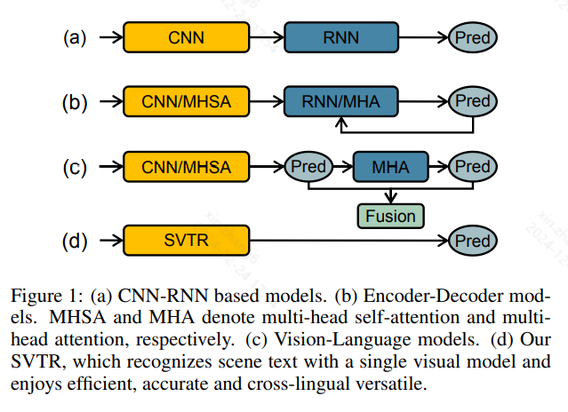
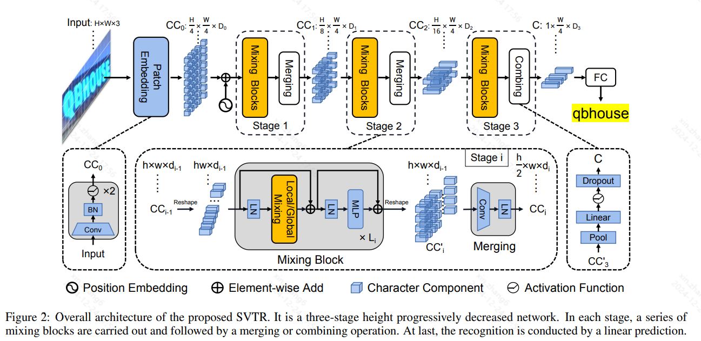
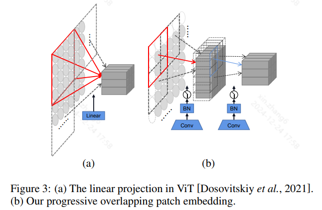
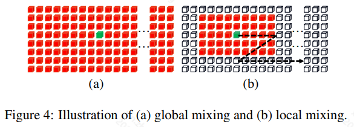

 
# 0 Abstract
Dominant scene text recognition models commonly contain two building blocks, a visual model for feature extraction and a sequence model for text transcription. This hybrid architecture, although accurate, is complex and less efficient. In this study, we propose a Single Visual model for Scene Text recognition within the patch-wise image tokenization framework, which dispenses with the sequential modeling entirely. 
The method, termed SVTR, firstly decomposes an image text into small patches named character components. 
Afterward, hierarchical stages are recurrently carried out by component-level mixing, merging and/or combining. 
Global and local mixing blocks are devised to perceive the inter-character and intra-character patterns, leading to a multi-grained character component perception. 
Thus, characters are recognized by a simple linear prediction. 
Experimental results on both English and Chinese scene text recognition tasks demonstrate the effectiveness of SVTR. SVTR-L (Large) achieves highly competitive accuracy in English and outperforms existing methods by a large margin in Chinese, while running faster. In addition, SVTR-T (Tiny) is an effective and much smaller model, which shows appealing speed at inference. The code is publicly available at https://github.com/PaddlePaddle/PaddleOCR.

主流场景文本识别模型通常包含两个构建模块，一个用于特征提取的视觉模型和一个用于文本转录的序列模型。这种混合架构虽然准确，但复杂且效率较低。在本研究中，我们提出了一种在逐块图像标记框架内用于场景文本识别的单一视觉模型，该模型完全省去了顺序建模。
这种方法称为 SVTR，首先将图像文本分解为称为字符组件的小块。
然后，通过组件级混合、合并和/或组合反复执行分层阶段。
全局和局部混合块被设计用于感知字符间和字符内模式，从而产生多粒度的字符组件感知。
因此，通过简单的线性预测即可识别字符。
在英语和中文场景文本识别任务上的实验结果证明了 SVTR 的有效性。SVTR-L（Large）在英语中实现了极具竞争力的准确率，在中文中的表现远远超过现有方法，同时运行速度更快。此外，SVTR-T (Tiny) 是一种有效且体积更小的模型，其推理速度非常快。代码已在 https://github.com/PaddlePaddle/PaddleOCR 上公开。

# 1 Introduction

Scene text recognition aims to transcript a text in natural image to digital character sequence, which conveys high-level semantics vital for scene understanding. The task is challenging due to variations in text deformations, fonts, occlusions, cluttered background, etc. In the past years, many efforts have been made to improve the recognition accuracy. Modern text recognizers, besides accuracy, also take factors like inference speed into account because of practical requirements.

场景文本识别旨在将自然图像中的文本转录为数字字符序列，从而传达对场景理解至关重要的高级语义。由于文本变形、字体、遮挡、背景杂乱等因素的变化，这项任务具有挑战性。在过去的几年中，人们付出了很多努力来提高识别准确率。现代文本识别器除了准确率之外，还考虑到推理速度等因素，以满足实际需求。

Methodologically, scene text recognition can be viewed as
a cross-modal mapping from image to character sequence.
Typically, the recognizer consists of two building blocks, a
visual model for feature extraction and a sequence model for
text transcription. For example, CNN-RNN based models
[Zhai et al., 2016; Shi et al., 2017] first employed CNN for
feature extraction. The feature was then reshaped as a sequence and modeled by BiLSTM and CTC loss to get the
prediction (Figure 1(a)). They are featured by efficiency and
remain the choice for some commercial recognizers. However, the reshaping is sensitive to text disturbances such as
deformation, occlusion, etc, limiting their effectiveness.

从方法论上讲，场景文本识别可以看作是从图像到字符序列的跨模态映射。
通常，识别器由两个构建块组成，一个用于特征提取的视觉模型和一个用于文本转录的序列模型。例如，基于 CNN-RNN 的模型 [Zhai et al., 2016; Shi et al., 2017] 首先采用 CNN 进行特征提取。然后将特征重塑为序列，并通过 BiLSTM 和 CTC 损失进行建模以获得预测（图 1(a)）。它们以效率为特色，仍然是一些商业识别器的选择。然而，重塑对文本干扰（如变形、遮挡等）很敏感，限制了它们的有效性。

Later, encoder-decoder based auto-regressive methods became popular [Sheng et al., 2019; Li et al., 2019; Zheng et al., 2021], the methods transform the recognition as an iterative decoding procedure (Figure 1(b)). As a result, improved accuracy was obtained as the context information was
considered. However, the inference speed is slow due to the
character-by-character transcription. The pipeline was further extended to vision-language based framework [Yu et al., 2020; Fang et al., 2021], where language knowledge was
incorporated (Figure 1(c)) and parallel prediction was conducted. However, the pipeline often requires a large capacity
model or complex recognition paradigm to ensure the recognition accuracy, restricting its efficiency.

后来，基于编码器-解码器的自回归方法开始流行[Sheng et al., 2019; Li et al., 2019; Zheng et al., 2021]，这些方法将识别转换为迭代解码过程（图 1(b)）。结果，由于考虑了上下文信息，获得了更高的准确率。然而，由于逐个字符转录，推理速度很慢。该流程进一步扩展到基于视觉语言的框架[Yu et al., 2020; Fang et al., 2021]，其中结合了语言知识（图 1(c)）并进行并行预测。然而，该流程通常需要大容量模型或复杂的识别范式来确保识别准确率，从而限制了其效率。

Recently, there are efforts emphasized developing simplified architectures to accelerate the speed.
For example, using complex training paradigm but simple model for inference. 
CRNN-RNN based solution was revisited in [Hu et al., 2020]. It utilized the attention mechanism and graph neural network to aggregate sequential features corresponding to the same character. At inference, the attention modeling branch was discarded to balance accuracy and speed.
PREN2D [Yan et al., 2021] further simplified the recognition by aggregating and decoding the 1D sub-character features simultaneously. [Wang et al., 2021] proposed VisionLAN. It introduced a character-wise occluded learning to endue the visual model with language capability. While at inference, the visual model was applied merely for speedup. 
In view of the simplicity of a single visual model based architecture, some recognizers were proposed by employing off-the-shelf CNN [Borisyuk et al., 2018] or ViT [Atienza, 2021] as the feature extractor. Despite being efficiency, their accuracy is less competitive compared to state-of-the-art methods.

最近，人们致力于开发简化的架构来加速速度。
例如，使用复杂的训练范式但使用简单的模型进行推理。
基于 CRNN-RNN 的解决方案在 [Hu et al., 2020] 中被重新审视。它利用注意力机制和图神经网络来聚合对应于同一字符的顺序特征。在推理时，注意力模型分支被丢弃以平衡准确性和速度。
PREN2D [Yan et al., 2021] 通过同时聚合和解码 1D 子字符特征进一步简化了识别。[Wang et al., 2021] 提出了 VisionLAN。它引入了逐字符遮挡学习，使视觉模型具有语言能力。而在推理时，视觉模型仅用于加速。
鉴于基于单一视觉模型的架构的简单性，一些识别器采用现成的 CNN [Borisyuk et al., 2018] 或 ViT [Atienza, 2021] 作为特征提取器。尽管效率很高，但与最先进的方法相比，它们的准确性竞争力较弱。

We argue that the single visual model based scheme is
effective only if discriminative character features could be
extracted. Specifically, the model could successfully catch
both intra-character local patterns and inter-character longterm dependence. The former encodes stroke-like features
that describe fine-grained features of a character, being a
critical source for distinguishing characters. While the latter records language-analogous knowledge that describes the
characters from a complementary aspect. However, the two
properties are not well modeled by previous feature extractors. For example, CNN backbones are good at modeling
local correlation rather than global dependence. Meanwhile,
current transformer-based general-purpose backbones would
not give privilege to local character patterns.

我们认为，基于单一视觉模型的方案只有在能够提取出有判别力的字符特征时才是有效的。具体来说，该模型可以成功捕捉字符内的局部模式和字符间的长期依赖性。前者编码了描述字符细粒度特征的笔画状特征，是区分字符的关键来源。而后者记录了从互补方面描述字符的语言类知识。然而，这两个属性在以前的特征提取器中并没有得到很好的建模。例如，CNN 主干擅长建模局部相关性而不是全局依赖性。同时，目前基于变压器的通用主干不会给予局部字符模式特权。

Motivated by the issues mentioned above, this work aims to enhance the recognition capability by reinforcing the visual model. To this end, we propose a visual-based model
SVTR for accurate, fast and cross-lingual versatile scene text
recognition. Inspired by the recent success of vision transformer [Dosovitskiy et al., 2021; Liu et al., 2021], SVTR
first decomposes an image text into small 2D patches termed
character components, as each of which may contain a part
of a character only. Thus, patch-wise image tokenization followed by self-attention is applied to capture recognition clues
among character components. Specifically, a text-customized
architecture is developed for this purpose. It is a three-stage
height progressively decreased backbone with mixing, merging and/or combining operations. Local and global mixing
blocks are devised and recurrently employed at each stage,
together with the merging or combining operation, acquiring
the local component-level affinities that represent the strokelike feature of a character, and long-term dependence among
different characters. Therefore, the backbone extracts component features of different distance and at multiple scales,
forming a multi-grained character feature perception. As a result, the recognition is reached by a simple linear prediction.
In the whole process only one visual model is employed. We
construct four architecture variants with varying capacities.
Extensive experiments are carried out on both English and
Chinese scene text recognition tasks. It is shown that SVTRL (large) achieves highly competitive results in English and
outperforms state-of-the-art models by a large margin in Chinese, while running faster. Meanwhile, SVTR-T (Tiny) is
also an effective and much smaller model yet with appealing
inference speed. The main contributions of this work can be
summarized as follows.

受上述问题的启发，本研究旨在通过强化视觉模型来提高识别能力。为此，我们提出了一个基于视觉的模型 SVTR，用于准确、快速和跨语言的多功能场景文本识别。受到视觉变换器最近成功的启发 [Dosovitskiy et al., 2021; Liu et al., 2021]，SVTR 首先将图像文本分解为称为字符组件的小 2D 块，因为每个块可能只包含字符的一部分。因此，应用逐块图像标记化，然后进行自我注意，以捕获字符组件之间的识别线索。具体而言，为此目的开发了一种文本定制架构。它是一个三阶段高度逐渐下降的主干，具有混合、合并和/或组合操作。设计局部和全局混合块并在每个阶段反复使用，结合合并或组合操作，获取表示字符笔画特征的局部组件级亲和力以及不同字符之间的长期依赖性。因此，主干提取不同距离和多个尺度的组件特征，形成多粒度字符特征感知。结果，通过简单的线性预测即可实现识别。
在整个过程中，只使用一个视觉模型。我们构建了四种具有不同容量的架构变体。
对英文和中文场景文本识别任务进行了广泛的实验。结果表明，SVTRL（large）在英文中取得了极具竞争力的结果，在中文中的表现远远超过最先进的模型，同时运行速度更快。同时，SVTR-T（Tiny）也是一种有效且小得多的模型，但具有吸引人的推理速度。这项工作的主要贡献可以总结如下。

• We demonstrate, for the first time, that a single visual model can achieve competitive or even higher accuracy as advanced vision-language models in scene text recognition. It is promising to practical applications due to its efficiency and cross-lingual versatility.
• We propose SVTR, a text-customized model for recognition. It introduces local and global mixing blocks for extracting stroke-like features and inter-character dependence, respectively, together with the multi-scale backbone, forming a multi-grained feature description.
• Empirical studies on public benchmarks demonstrate the superiority of SVTR. SVTR-L achieves the state-of-theart performance in recognizing both English and Chinese scene texts. While SVTR-T is effective yet efficient, with parameters of 6.03M and consuming 4.5ms per image text on average in one NVIDIA 1080Ti GPU.

• 我们首次证明，单一视觉模型在场景文本识别中可以达到与高级视觉语言模型相当甚至更高的准确率。由于其效率和跨语言通用性，它在实际应用中很有前景。
• 我们提出了 SVTR，一种用于识别的文本定制模型。它引入了局部和全局混合块，分别用于提取笔画特征和字符间依赖性，并与多尺度主干一起形成多粒度的特征描述。
• 在公共基准上的实证研究证明了 SVTR 的优越性。SVTR-L 在识别英文和中文场景文本方面取得了最佳表现。而 SVTR-T 既有效又高效，在一个 NVIDIA 1080Ti GPU 上，参数为 6.03M，平均每幅图像文本消耗 4.5ms。

# 2 Method
## 2.1 Overall Architecture
Overview of the proposed SVTR is illustrated in Figure 2. It is a three-stage height progressively decreased network dedicated to text recognition. For an image text of size $H × W × 3$, it is first transformed to $\frac H 4 × \frac W 4$ patches of dimension $D_0$ via a progressive overlapping patch embedding. The patches are termed character components, each associating with a fraction of text character in the image. Then, three stages, each composed of a series of mixing blocks followed by a merging or combining operation, are carried out at different scales for feature extraction. local and global mixing blocks are devised for stroke-like local pattern extraction and inter-component dependence capturing. With the backbone, component feature and dependence of different distance and at multiple scales are characterized, generating a representation referred to as $C$ of size $1 × \frac W 4 × D_3$, which perceives multi-grained character features. Finally, a parallel linear prediction with de-duplication is conducted to get the character sequence.

图 2 显示了所提出的 SVTR 的概述。它是一个三阶段高度逐步下降的网络，专用于文本识别。对于大小为 $H × W × 3$ 的图像文本，首先通过渐进重叠补丁嵌入将其转换为尺寸为 $D_0$ 的 $\frac H 4 × \frac W 4$ 个补丁。这些补丁称为字符组件，每个补丁与图像中的一小部分文本字符相关联。然后，在不同尺度上执行三个阶段以进行特征提取，每个阶段由一系列混合块组成，然后进行合并或组合操作。设计了局部和全局混合块，用于类似笔画的局部模式提取和组件间依赖性捕获。利用主干，对不同距离和多个尺度的组件特征和依赖性进行表征，生成大小为 $1 × \frac W 4 × D_3$ 的表示 $C$，该表示可感知多粒度字符特征。最后，进行并行线性预测和去重以获得字符序列。

## 2.2 Progressive Overlapping Patch Embedding
With an image text, the first task is to obtain feature patches which represent character components from $X ∈ R^{H×W×3}$ to $CC0 ∈ R^{\frac H 4 × \frac W 4 ×D_0}$. There exists two common one-step projections for this purpose, i.e., a 4×4 disjoint linear projection (see Figure 3(a)) and a 7 × 7 convolution with stride 4. Alternatively, we implement the patch embedding by using two consecutive 3 × 3 convolutions with stride 2 and batch normalization, as shown in Figure 3(b). The scheme, despite increasing the computational cost a little, adds the feature dimension progressively which is in favor of feature fusion. Ablation study in Section 3.3 shows its effectiveness.

对于图像文本，第一个任务是获取表示字符分量的特征块，从 $X ∈ R^{H×W×3}$ 到 $CC0 ∈ R^{\frac H 4 × \frac W 4 ×D_0}$。为此，存在两种常见的一步投影，即 4×4 不相交线性投影（见图 3(a)）和步长为 4 的 7×7 卷积。或者，我们使用两个连续的步长为 2 的 3×3 卷积和批量归一化来实现块嵌入，如图 3(b) 所示。该方案虽然稍微增加了计算成本，但逐步增加了特征维度，有利于特征融合。第 3.3 节中的消融研究显示了其有效性。

