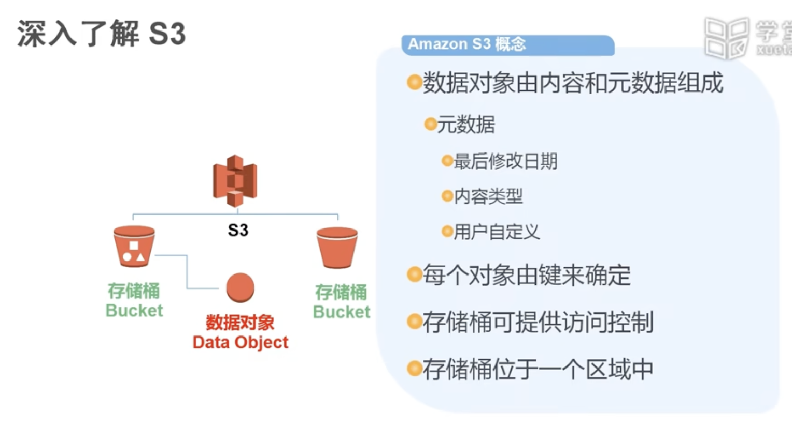

# 1 全球基础设施
- Region 区域
- Availability Zone 可用区

数分钟就可全球化部署

AWS中国区（北京）
- 2014年开始部署
- 现已正式商用
- http://amazonaws.cn

AWS全球部署的三个类别
- global Region
- 美国的Government Cloud
- 中国的

# 2 如何访问AWS
## 2.1 RESTful API接口

## 2.2 SDK开发工具包

## 2.3 Command Line Interface命令行工具

## 2.4 Management Console管理控制台

- 账户ID
- 登录的IAM的用户名
- Password

- 计算
- 存储
- 网络
- 数据库
- 安全
- 管理工具
- 开发人员工具
- 分析
- 移动服务
- 应用服务
- 物联网

# 3 做个大规模并发网站
- 如何处理静态内容
- 服务器哪里来
- 有多少客户？能否弹性地获得资源？

# 4 表态内容
- 静态内容
  - 图片
  - 视频
  - 

服务器压力增大
- 静态内容和动态内容全通过Web服务器
- 服务器压力会大大增加

需要海量、高并发、可靠的存储

- S3
  - S3 (Simple Storage Service)
  - AWS第一个公开提供的服务（2006）
  - 最多支持5T大小的单个对象
  - 设计为11个9的可靠性

- S3概念
  - 数据对象由内容和元数据组成
    - 元数据
      - 最后修改日期
      - 内容类型
      - 用户自定义
  - 每个对象由键来确定
  - 存储桶可提供访问控制
  - 存储桶位于一个区域中

在Web页面中直接嵌套进去
- URL方便和Web页面代码整合
- 无需担忧并发问题
- 可以后续使用CloudFront等CDN服务进行加速

S3无处不见
- 使用S3存储每天产生的log日志以及图片
- 每天生成1.2T日志文件
- 每天运行250个EMR job处理30+TB数据

