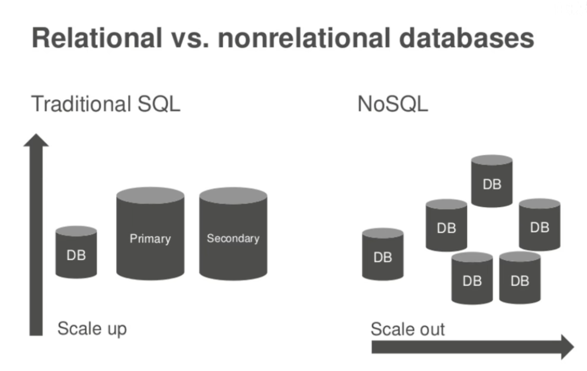
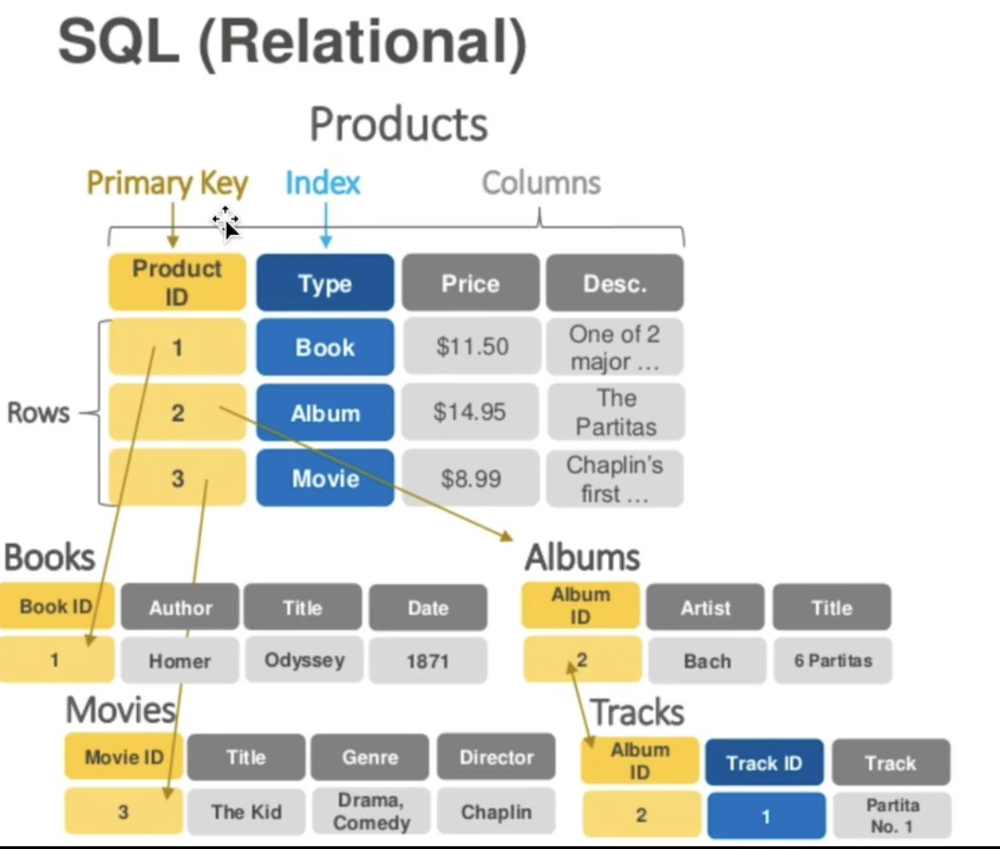
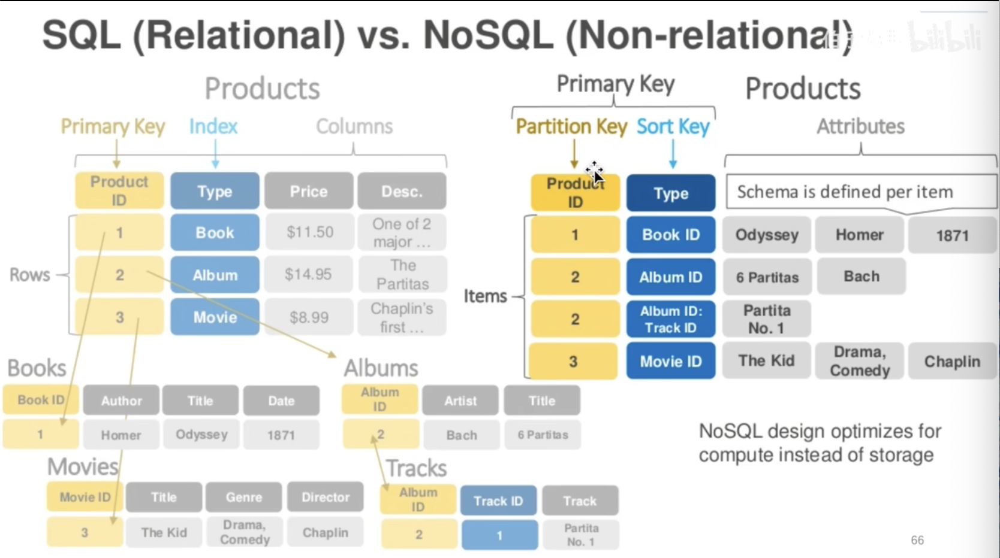
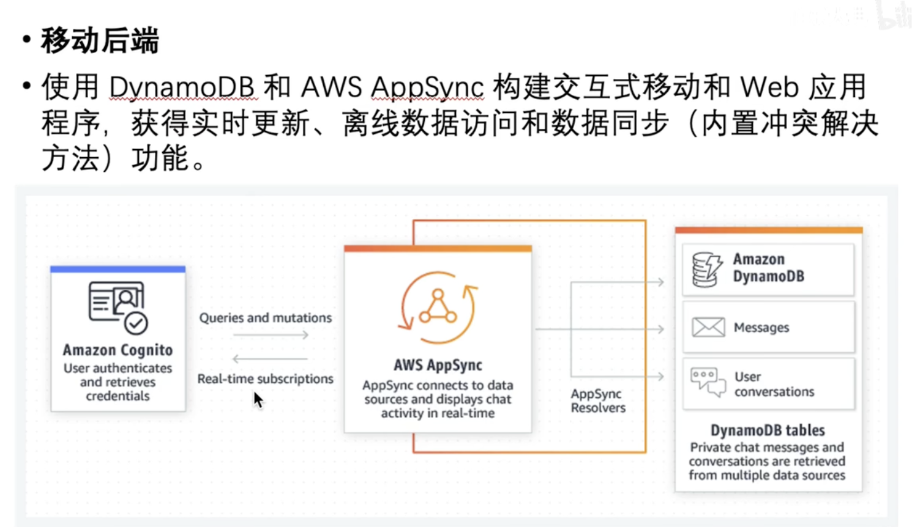
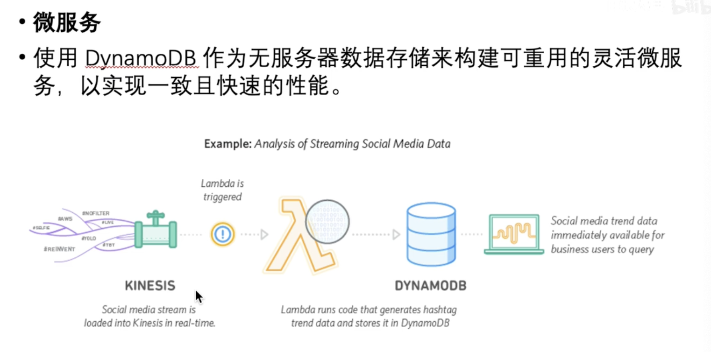
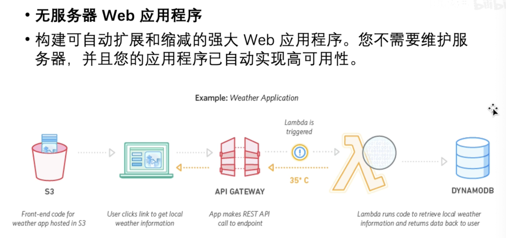
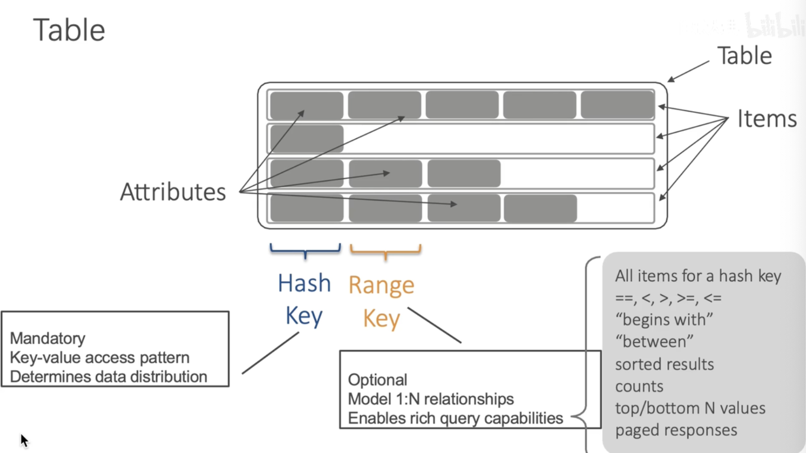

Relational vs. Nonrelational databases

### SQL (Relational)

### NoSQL (Non-relational)

### Amazon DynamoDB
- 适用于任何规模的快速灵活的 NoSQL 数据库服务
- Amazon DynamoDB是一个键/值和文档数据库，可以在任何规模的环境中提供个位数的毫秒级性能。它是一个完全托管、多区域多活动的持久数据库，具有适用于 Internet 规模应用程序的内置安全性、备份和恢复以及内存中缓存。

#### 移动后端

#### 微服务

#### 无服务器Web应用程序

## Table

