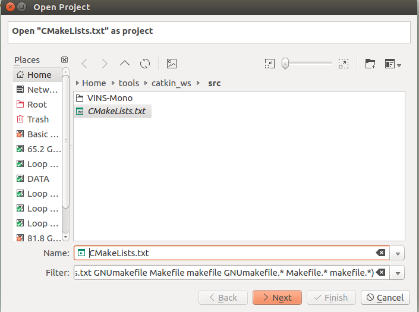
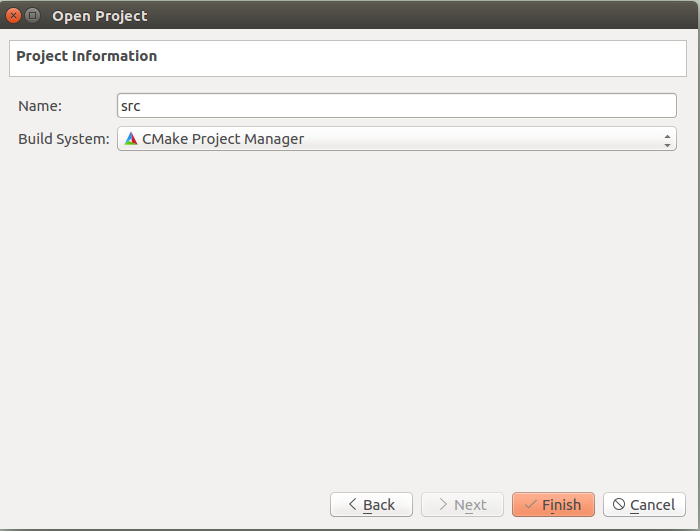
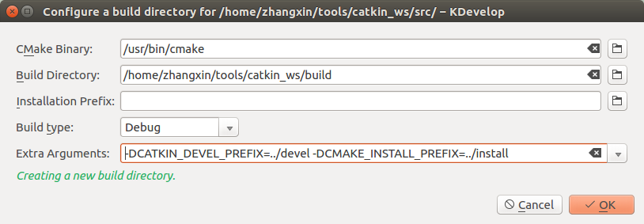

官方文档：[ROS KDevelop](http://wiki.ros.org/IDEs#KDevelop)

参考博客：　[ubuntu16.04 + Kdevelop + ROS开发](https://blog.csdn.net/p942005405/article/details/75715288)


# 1. Building catkin packages
## 1.1 Import catkin top-level workspace

0. 安装并且测试vins-mono。参考在 ROS上构建VINS-Mono，目录为catkin_ws（我的安装路径是/home/zhangxin/tools/catkin_ws）。
1. 删除build文件夹。
```bash
cd /home/zhangxin/tools/catkin_ws
rm -rf build
```
2. 启动KDevelop。Project --> Open/Image Project，打开catkin_ws/src下的CMakeLists.txt。build system 选择 CMake Project Manager，点击Finish。



3. 设置Build Directory 为catkin_ws/build。

4. 选择需要的Build type。
5. 添加 Extra Arguments
```bash
-DCATKIN_DEVEL_PREFIX=../devel -DCMAKE_INSTALL_PREFIX=../install
```


6. 点击build button。

「存在问题1」
```bash
/home/zhangxin/tools/catkin_ws/build> /usr/bin/cmake -DCMAKE_BUILD_TYPE=Debug -G 'Unix Makefiles' -DCATKIN_DEVEL_PREFIX=../devel -DCMAKE_INSTALL_PREFIX=../install /home/zhangxin/tools/catkin_ws/src/
-- The C compiler identification is GNU 5.4.0
-- The CXX compiler identification is GNU 5.4.0
-- Check for working C compiler: /usr/bin/cc
-- Check for working C compiler: /usr/bin/cc -- works
-- Detecting C compiler ABI info
-- Detecting C compiler ABI info - done
-- Detecting C compile features
-- Detecting C compile features - done
-- Check for working CXX compiler: /usr/bin/c++
-- Check for working CXX compiler: /usr/bin/c++ -- works
-- Detecting CXX compiler ABI info
-- Detecting CXX compiler ABI info - done
-- Detecting CXX compile features
-- Detecting CXX compile features - done
CMake Error at CMakeLists.txt:59 (message):
  find_package(catkin) failed.  catkin was neither found in the workspace nor
  in the CMAKE_PREFIX_PATH.  One reason may be that no ROS setup.sh was
  sourced before.


-- Configuring incomplete, errors occurred!
See also "/home/zhangxin/tools/catkin_ws/build/CMakeFiles/CMakeOutput.log".
*** Failure: Exit code 1 ***

```


# 2 运行和调试执行程序
## 2.1 配置执行程序
1. catkin工作空间引入和构建后，Run -> Configure Launches ...
2. 点击Add New...找到Project Excutables子菜单里的执行程序。
如果程序没有列出，可以手动添加，Add New ... -> compiled binary（指定执行程序的位置，比如"~/catkin_ws/devel/lib/package/node_name"）
3. 「可选」指定参数。
4. 点击ＯＫ，完成配置。

## 2.2 运行程序
点击Excute。如果有我我个配置的执行程序，通过Run->Current Launch configuration。

## 2.3 调试程序
在相关包代码文件里添加断点，点击Debug按钮。


