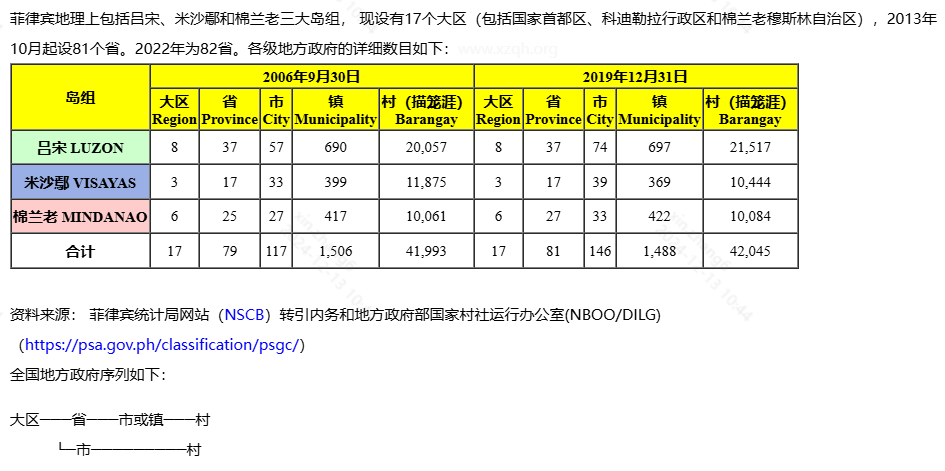
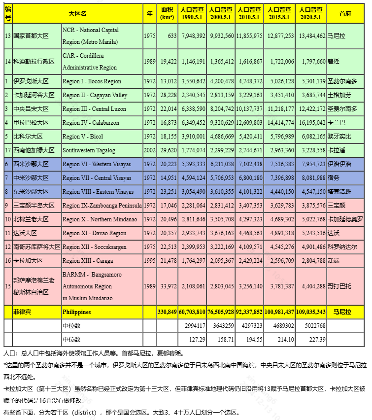

菲律宾共和国
Republic of the Philippines
____

菲律宾位于亚洲东南部。北隔巴士海峡与中国台湾省遥遥相对，南和西南隔苏拉威西海、巴拉巴克海峡与印度尼西亚、马来西亚相望，西濒南中国海，东临太平洋。共有大小岛屿7107个，其中吕宋岛、棉兰老岛、萨马岛等11个主要岛屿占全国总面积的96%。

首都：马尼拉

行政区划（大区）  转载行政区划网资料请保留本站域名“www.XZQH.org”
菲律宾地理上包括吕宋、米沙鄢和棉兰老三大岛组， 现设有17个大区（包括国家首都区、科迪勒拉行政区和棉兰老穆斯林自治区），2013年10月起设81个省。2022年为82省。各级地方政府的详细数目如下：www.xzqh.org



资料来源： 菲律宾统计局网站（NSCB）转引内务和地方政府部国家村社运行办公室(NBOO/DILG)（https://psa.gov.ph/classification/psgc/）
全国地方政府序列如下：
```
大区───省───市或镇───村
　　　└─市─────────村
```



人口：总人口中包括海外使领馆工作人员等。首都马尼拉，夏都碧瑶。
*这里的两个圣费尔南多并不是一个城市，伊罗戈斯大区的圣费尔南多位于吕宋岛西北南中国海滨，中央吕宋大区的圣费尔南多则位于马尼拉西北不远处。
卡拉加大区（第十三大区）虽然名称已经正式改定为第十三大区，但菲律宾标准地理代码仍旧沿用将13赋予马尼拉首都大区，卡拉加大区被赋予的代码是16并没有做修改。
有些省下面，分为若干区（district），那个是国会选区。大致3、4十万人口划分一个选区。

中国驻拉瓦格领馆的领区为第1、第2大区和CAR的全部。
中国驻宿务总领馆的领区为第7、第8大区全部，第6大区的伊洛伊洛省、西内格罗斯省。
中国驻达沃总领馆的领区为第9-13大区，以及BARMM的全部，即棉兰老岛及附近岛屿。

