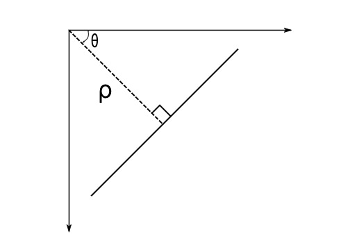

# 原理简介 
一条直线可以 表示成 $y = mx + c$，也可以表示成
$\rho=x\cos \theta + y\sin \theta$
其中 $\rho$ 表示真线到原点的垂直距离，
$\theta$ 表示垂线到水平轴的角度。

如果直线在原点下方，$\rho$为正，而$\theta$ 小于180度。
如果直线在原点上方，取一个小于180度的角，$\rho$为负。
垂直线都是零度，水平线都是90度。



## Hough Transform in OpenCV
```python
import cv2 as cv
import numpy as np
img = cv.imread('../data/sudoku.png')
gray = cv.cvtColor(img,cv.COLOR_BGR2GRAY)
edges = cv.Canny(gray,50,150,apertureSize = 3)
lines = cv.HoughLines(edges,1,np.pi/180,200)
for line in lines:
    rho,theta = line[0]
    a = np.cos(theta)
    b = np.sin(theta)
    x0 = a*rho
    y0 = b*rho
    x1 = int(x0 + 1000*(-b))
    y1 = int(y0 + 1000*(a))
    x2 = int(x0 - 1000*(-b))
    y2 = int(y0 - 1000*(a))
    cv.line(img,(x1,y1),(x2,y2),(0,0,255),2)
cv.imwrite('houghlines3.jpg',img)
```

# Probabilistic Hough Transform
概率霍夫变换的步骤：
1。从点集中随机选取一个像素点，对应的累加器加1
2。从点集中删除该点
3。更新累加器
4。若更新之后的累加器值大于阈值（检测到直线），则删除集合中位于该直线上的所有点
重复以上步骤，直到点集为空

```python
import cv2 as cv
import numpy as np
img = cv.imread('../data/sudoku.png')
gray = cv.cvtColor(img,cv.COLOR_BGR2GRAY)
edges = cv.Canny(gray,50,150,apertureSize = 3)
lines = cv.HoughLinesP(edges,1,np.pi/180,100,minLineLength=100,maxLineGap=10)
for line in lines:
    x1,y1,x2,y2 = line[0]
    cv.line(img,(x1,y1),(x2,y2),(0,255,0),2)
cv.imwrite('houghlines5.jpg',img)
```


# 参考
* OpenCV-Python Tutorials Image Processing in OpenCV [Hough Line Transform](https://docs.opencv.org/3.4.0/d6/d10/tutorial_py_houghlines.html)


# 生词
perpendicular       adj. 垂直的，正交的；直立的；陡峭的

