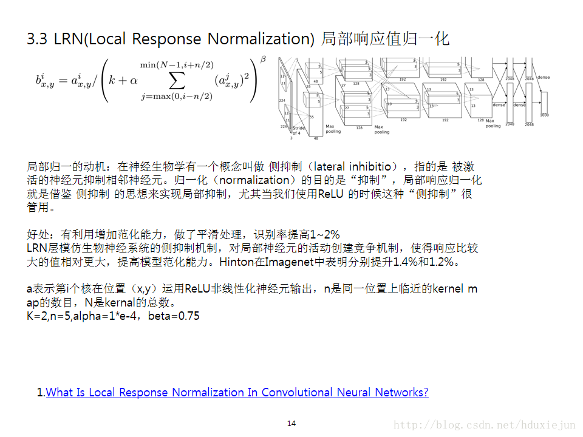

i表示第i个核在位置（x,y）运用激活函数ReLU后的输出，n是同一位置上临近的kernal map的数目，N是kernal的总数。参数K,n,alpha，belta都是超参数，一般设置k=2,n=5,aloha=1*e-4,beta=0.75。

# [Local Response Nomalization在CNN中设计是什么意图？](https://www.zhihu.com/question/36627458)

LRN和LCN都 是为了引入局部竞争机制，个人理解是：在相邻卷积核生成的feature map之间引入竞争，从而有些本来在feature map中显著的特征在A中更显著，而在相邻的其他feature map中被抑制，这样让不同卷积核产生的feature map之间的相关性变小。

# 参考资料
[【深度学习技术】LRN 局部响应归一化](https://blog.csdn.net/hduxiejun/article/details/70570086)
[深度学习的局部响应归一化LRN(Local Response Normalization)理解](https://blog.csdn.net/yangdashi888/article/details/77918311)