参考：[论文精读 | 目标检测之R-CNN](https://zhuanlan.zhihu.com/p/38946391)

RCNN
---------------------

# 导言
R-CNN作为R-CNN系列的开山鼻祖，其首次将CNN用于目标检测，在PASAL VOC 2010测试集上实现了 53.7%  mAP，也从此开启了R-CNN系列"统治"目标检测的时代......
R-CNN：Regions + CNN

# 创新点
* 使用CNN（ConvNet）对 region proposals 计算 feature vectors。从经验驱动特征（SIFT、HOG）到数据驱动特征（CNN feature map），提高特征对样本的表示能力。
* 采用大样本下（ILSVRC）有监督预训练和小样本（PASCAL）微调（fine-tuning）的方法解决小样本难以训练甚至过拟合等问题。

注：ILSVRC其实就是众所周知的ImageNet的挑战赛，数据量极大；PASCAL数据集（包含目标检测和图像分割等），相对较小。

# 结果
在VOC2012中，将mAP（mean average percision）提高了30%以上。
先看一下 PASCAL VOC历年（2007~2012）的检测冠军，可见 DPM 的统治力有多强大！（刚荣获CVPR 2018 Longuet-Higgins Prize）
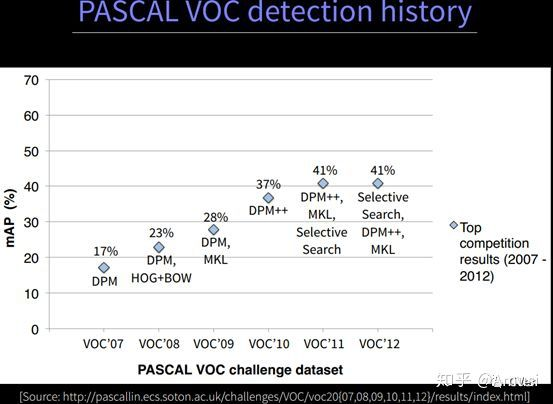

直到2013年 R-CNN的横空出世，一切都被打破了！之后目标检测领域就进入 R-CNN系列的疯狂统治中......
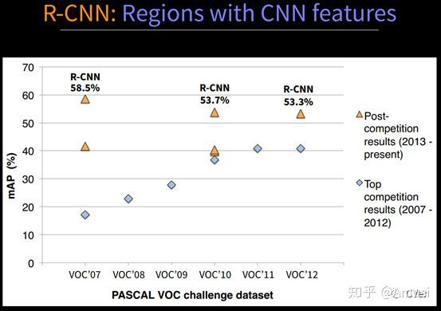

# R-CNN 流程
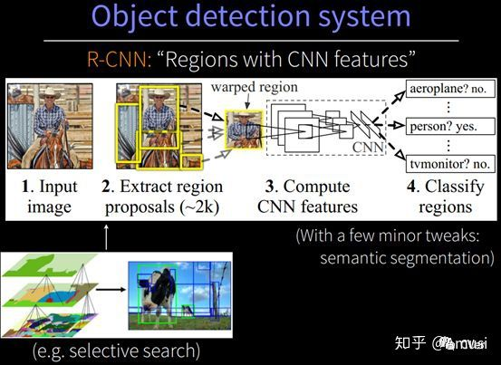

题外话：R-CNN作为R-CNN系列的第一代算法，其实没有过多的使用“深度学习”思想，而是将“深度学习”和传统的“计算机视觉”的知识相结合。
比如pipeline中的第二步和第四步其实就属于传统的“计算机视觉”技术。使用selective search提取region proposals，使用SVM实现分类。
而R-CNN系列的第三代算法：Faster R-CNN是使用RPN来提取 region proposals，而使用softmax实现分类。Faster R-CNN才是纯正的深度学习算法。

原论文中R-CNN pipeline只有4个步骤，光看上图无法深刻理解R-CNN处理机制，下面结合图示补充相应文字：
1. 预训练模型。选择一个预训练 （pre-trained）神经网络（如AlexNet、VGG）
2. 重新训练全连接层。使用需要检测的目标重新训练（re-train）最后全连接层（connected layer）
3. 提取 proposals并计算CNN 特征。利用选择性搜索（Selective Search）算法提取所有proposals（大约2000个 / image），调整（resize/warp）它们成固定大小，以满足 CNN输入要求（因为全连接层的限制），然后将feature map 保存到本地磁盘。
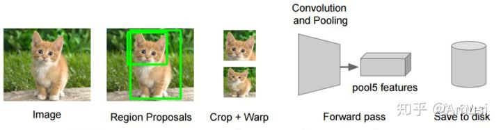
4. 训练SVM。利用feature map 训练SVM来对目标和背景进行分类（每个类一个二进制SVM）
5. 边界框回归（Bounding boxes Regression）。训练将输出一些校正因子的线性回归分类器
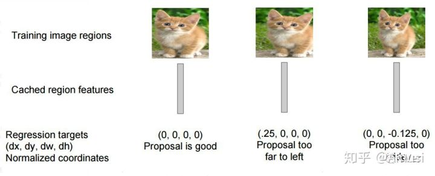

看完上述，如果你可能会存在疑问？深度学习明明分训练和测试两个阶段，为什么上述没有说明两者的区别？（很多解读性文章都忽略了这一点）
放心，作为小白而言，当然要一步步搞懂这个内容，下面将单独介绍训练过程和测试过程。

# 训练过程
1. 在大型数据集（ImageNet，即ILSVRC竞赛）上预训练用于图像分类的CNN。
2. 在小型目标数据集（PASAC VOC）上微调（fine-tuning）CNN。
3. 利用Selective Search提取2k多个region proposals并warp到同一size，然后输入训练好的CNN网络中，最后对每类训练SVM（因为SVM本身是二分类，如何通过对每类训练SVM而实现多分类呢？这个需要你百度自行了解。提示两个名词：one-versus-rest和one-versus-one）

训练过程如下所示
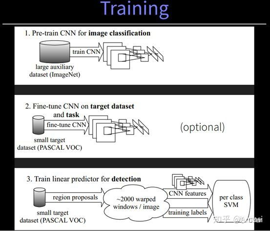

那么上述所说的CNN网络究竟长什么样子呢？

答：其实和AlexNet差不多，这里就不赘述，下面附上2012年ImageNet夺冠的AlexNet网络。
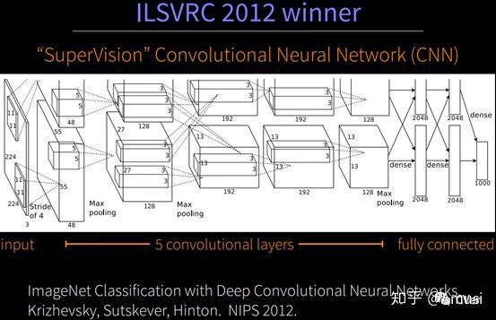

# 测试过程

1. 输入一张多目标图像，采用selective search算法提取约2000个建议框；
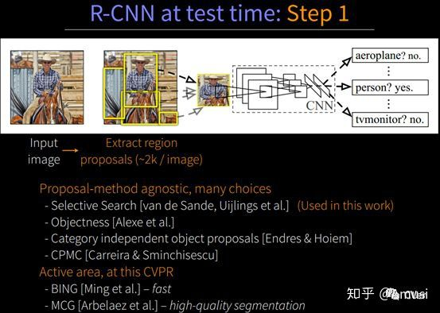

2. 先在每个建议框周围加上16个像素值，然后裁剪（crop），再直接 scale 为227×227的大小（AlexNet网络输入图像大小：227x227）；将所有建议框像素减去该建议框像素平均值后【预处理操作】，再依次将每个227×227的建议框输入AlexNet CNN网络获取4096维的特征【比以前的人工经验特征低两个数量级】，2000个建议框的CNN特征组合成2000×4096维矩阵；
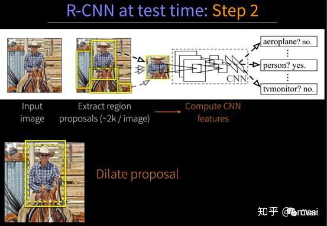
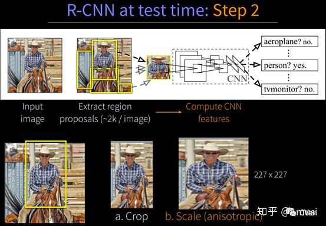
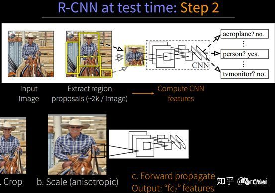

3. 将2000×4096维特征与20个SVM组成的权值矩阵4096×20相乘【20种分类，SVM是二分类器，则有20个SVM】，获得2000×20维矩阵表示每个建议框是某个物体类别的得分；分别对上述2000×20维矩阵中每一列即每一类进行非极大值抑制剔除重叠建议框，得到该列即该类中得分最高的一些建议框；
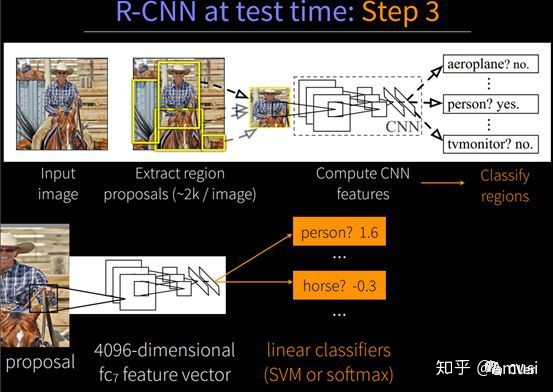

4. 分别用20个回归器对上述20个类别中剩余的建议框进行回归操作，最终得到每个类别的修正后的得分最高的bounding box。
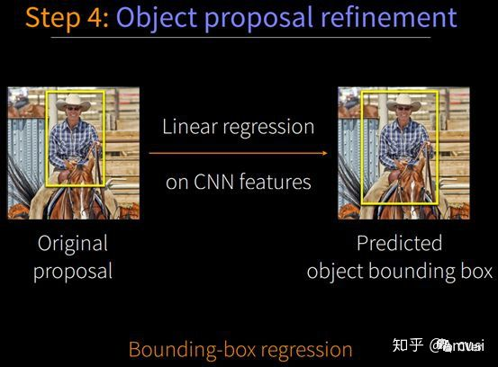

R-CNN 检测结果如下图所示
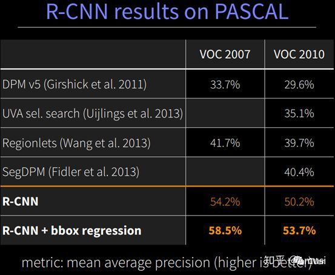
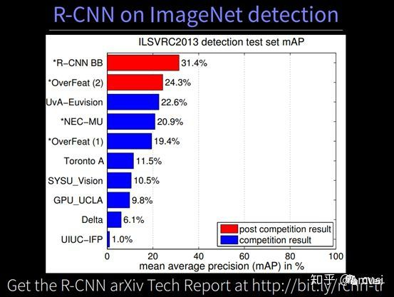

3 细节分析

此部分主要参考: https://blog.csdn.net/WoPawn/article/details/52133338

1. selective search

采取过分割手段，将图像分割成小区域，再通过颜色直方图，梯度直方图相近等规则进行合并，最后生成约2000个建议框的操作。

2. 为什么要将建议框变形为227×227？怎么做？

本文采用AlexNet CNN网络进行CNN特征提取，为了适应AlexNet网络的输入图像大小：227×227，故将所有建议框变形为227×227。
那么问题来了，如何进行变形操作呢？作者在补充材料中给出了四种变形方式：

- ① 考虑context【图像中context指RoI周边像素】的各向同性变形，建议框像素周围像素扩充到227×227，若遇到图像边界则用建议框像素均值填充，下图第二列；
- ② 不考虑context的各向同性变形，直接用建议框像素均值填充至227×227，下图第一行第三列；
- ③ 各向异性变形，简单粗暴对图像就行缩放至227×227，下图第一行第四列；
- ④ 变形前先进行边界像素填充【padding】处理，即向外扩展建议框边界，以上三种方法中分别采用padding=0下图第一行，padding=16下图第二行进行处理；

经过作者一系列实验表明采用padding=16的各向异性变形（anisotropically warp）即下图第二行第四列效果最好，能使mAP提升3-5%。
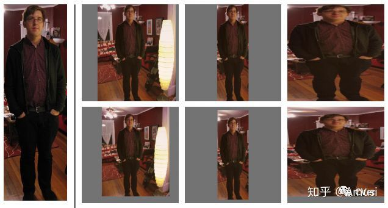

3. CNN特征如何可视化？

文中采用了巧妙的方式将AlexNet CNN网络中Pool5层特征进行了可视化。该层的size是6×6×256，即有256种表示不同的特征，这相当于原始227×227图片中有256种195×195的感受视野【相当于对227×227的输入图像，卷积核大小为195×195，padding=4，step=8，输出大小(227-195+2×4)/8+1=6×6】；

文中将这些特征视为”物体检测器”，输入10million的Region Proposal集合，计算每种6×6特征即“物体检测器”的激活量，之后进行非极大值抑制【下面解释】，最后展示出每种6×6特征即“物体检测器”前几个得分最高的Region Proposal，从而给出了这种6×6的特征图表示了什么纹理、结构，很有意思。

4. 为什么要进行非极大值抑制？非极大值抑制又如何操作？

先解释什么叫IoU。如下图所示IoU即表示(A∩B)/(A∪B)

在测试过程完成到第4步之后，获得2000×20维矩阵表示每个建议框是某个物体类别的得分情况，此时会遇到下图所示情况，同一个车辆目标会被多个建议框包围，这时需要非极大值抑制操作去除得分较低的候选框以减少重叠框。

具体怎么做呢？ 列（类）—> 框：
① 对2000×20维矩阵中每列按从大到小进行排序；
② 从每列（同一类）最大的得分建议框开始，分别与该列后面的得分建议框进行IoU计算，若IoU>阈值，则剔除得分较小的建议框（说明重叠率很大，两个建议框被视为描述一个目标，此时只保留最大得分建议框），否则（说明重叠率很小），则认为图像中存在多个同一类物体；
③ 从每列次大的得分建议框开始，重复步骤②（这里的次大得分建议框的起始位置应该是在大的得分建议框后，或者在满足”若IoU>阈值，则剔除得分较小的建议框“里的建议框后）；
④ 重复步骤③直到遍历完该列所有建议框；
⑤ 遍历完2000×20维矩阵所有列，即所有物体种类都做一遍非极大值抑制（保留了同一个目标最高的得分建议框，即剔除了同一目标满足重叠率非最大得分的建议框）；
⑥ 最后剔除各个类别中剩余建议框得分少于该类别阈值的建议框。【文中没有讲，博主觉得有必要做】

5.为什么要采用回归器？回归器是什么有什么用？如何进行操作？

首先要明确目标检测不仅是要对目标进行识别，还要完成定位任务，所以最终获得的bounding-box也决定了目标检测的精度。
这里先解释一下什么叫定位精度：定位精度可以用算法得出的物体检测框与实际标注的物体边界框的IoU值来近似表示。
如下图所示，绿色框为实际标准的卡宴车辆框，即Ground Truth；黄色框为selective search算法得出的建议框，即Region Proposal。即使黄色框中物体被分类器识别为卡宴车辆，但是由于绿色框和黄色框IoU值并不大，所以最后的目标检测精度并不高。采用回归器是为了对建议框进行校正，使得校正后的Region Proposal与selective search更接近， 以提高最终的检测精度。论文中采用bounding-box回归使mAP提高了3~4%。

# R-CNN 不足

- 重复计算。通过selective search 提取近2000左右的候选框，即今2000个ROI，RCNN对每个ROI，都跑一遍CNN，计算量很大，而且其实这些ROI之间是有overlap，显然有大量计算是重复的。（所以SPP-Net和Fast-RCNN对其进行改进）
- multiple-stage pipeline：训练分为多个阶段，region proposals、ConvNet、SVM、BB Regression。
- 训练耗时，占有磁盘空间大。卷积出来的特征数据还要保持至本地磁盘。

# 说点题外话
当初R-CNN也不是说只用于目标检测，其实语义分割也是杠杠的

# 思考
神经网络究竟学习到了什么？

# 参考
supp: http://people.eecs.berkeley.edu/~rbg/papers/r-cnn-cvpr-supp.pdf
slides: http://www.image-net.org/challenges/LSVRC/2013/slides/r-cnn-ilsvrc2013-workshop.pdf
slides: http://www.cs.berkeley.edu/~rbg/slides/rcnn-cvpr14-slides.pdf
github(caffe): https://github.com/rbgirshick/rcnn
notes: http://zhangliliang.com/2014/07/23/paper-note-rcnn/
caffe-pr("Make R-CNN the Caffe detection example"): https://github.com/BVLC/caffe/pull/482
（推荐阅读）R-CNN论文详解：
https://blog.csdn.net/WoPawn/article/details/52133338
R-CNN详解：
https://blog.csdn.net/shenxiaolu1984/article/details/51066975
R-CNN学习总结：
https://zhuanlan.zhihu.com/p/30316608

