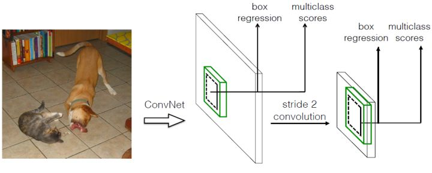

Single Shot MultiBox Detector

# 0 前言
目标检测主流算法分为两个类型：
（1）two-stage，如R-CNN系算法。主要思路是先通过启发式方法（selective search）或者CNN网络（RPN）产生 一系列的候选框，然后对候选框进行分类与回归，优势准确度高。
（2）one-stage，如yolo和SSD。主要思路是均匀的图片不同位置进行密集抽样，抽样时采用不同尺度和长宽比，然后利用CNN提取特征后真是抱歉进行分类与回归，整个过程只需要一步，优势是速度快。
均匀的密集采样的一个重要缺点是训练比较困难，主要因为正样本与负样本极其不均衡，导致模型准确度低。

SSD相对YOLO的改变：
（1）SSD提取了不同尺度的特征图做检测，大尺度特征图用来检测小物体，小尺度特征图用来检测大物体。
（2）SSD采用了不同尺度和长宽比的我喜欢你框（Prior boxes, Default boxes, 在Faster R-CNN中叫anchors）。

# 1 设计理念

## 1.1 采用多尺度特征图用于检测
比较大的特征图来用来检测相对较小的目标，而小的特征图负责检测大目标
## 1.2 采用卷积进行检测
SSD直接采用卷积对不同的特征图来进行提取检测结果。
对于形状为 $ m * n * p $ 的特征图，只需要采用 $ 3 * 3 * p $ 这样比较小的卷积核得到检测值。

## 1.3 设置先验框
Yolo v1需要在训练过程中自适应目标的形状。SSD借鉴了Faster R-CNN中anchor的理念，每个单元设置尺度或者长宽比不同的先验框，预测的边界框bounding box以这些先验框为基准，在一定程度上减少训练难度。

SSD与yolo-v1不同的地方在于：对于每个单元的每个先验框，都输出一套独立的检测值，对应一个边界框，分为两部分。
（1）各个类别 的置信度或评分，背景当作一个特殊的类别。
（2）边界框的location，包括（cx,cy,w,h）。真实预测值是边界框相对先验框的转换值（offset，transformation更合适）。
l是b对于d的转换值：
l_cx = (b_cx - d_cx) / d_w
l_cy = (b_cy - d_cy) / d_h
l_w  = log(b_w / d_w)
l_h  = log(b_h / d_h)

# 2 网络结构
(1) VGG16在ILSVRC CLS-LOC数据集预训练。
(2) fc6/fc7换成3x3卷积层conv6和1x1卷积层conv7
(3) conv6采用扩展卷积（带孔卷积）
(4) 移除fc8和dropout层
(5) Conv4_3用于检测的第一个特征图，大小是38x38。在其后面增加一个L2 Normalization。对每个像素点在channel维度做归一化。Batch Normalization是在【batch,width,height】三个维度做归一化。归一化后设置一个放缩变量gamma。
(6) 新增的卷积层中提取conv7,conv8_2,conv9_2,conv10_2,conv11_2作为检测用的特征图，算上conv4_3，共提取了6个特征图，大小分别是38x38,19x19,10x10,5x5,3x3,1x1。不同层设置先验框数目不同。
(7) 由于每个先验框都会预测一个边界框，所以SSD300一共可以预测 38\times38\times4+19\times19\times6+10\times10\times6+5\times5\times6+3\times3\times4+1\times1\times4=8732 个边界框，这是一个相当庞大的数字，所以说SSD本质上是密集采样。

# 3 训练过程
## 3.1 先验框匹配

## 3.2 损失函数

## 3.3 数据扩增

# 4 预测过程

# 5 性能评估

# 6 TensorFlow上的实现

# 7 小结
SSD在Yolo的基础上主要改进了三点：多尺度特征图，利用卷积进行检测，设置先验框。这使得SSD在准确度上比Yolo更好，而且对于小目标检测效果也相对好一点。

# 参考
[目标检测|SSD原理与实现](https://zhuanlan.zhihu.com/p/33544892)
[基于深度学习的目标检测算法：SSD](https://blog.csdn.net/u013989576/article/details/73439202)
[论文阅读：SSD: Single Shot MultiBox Detector](https://blog.csdn.net/u010167269/article/details/52563573)
[SSD（single shot multibox detector）算法及Caffe代码详解](https://blog.csdn.net/u014380165/article/details/72824889)