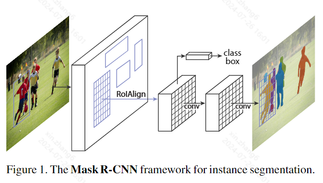

# 0 Abstract

We present a conceptually simple, flexible, and general framework for object instance segmentation. Our approach efficiently detects objects in an image while simultaneously generating a high-quality segmentation mask for each instance. The method, called Mask R-CNN, extends Faster R-CNN by adding a branch for predicting an object mask in parallel with the existing branch for bounding box recognition. Mask R-CNN is simple to train and adds only a small overhead to Faster R-CNN, running at 5 fps. Moreover, Mask R-CNN is easy to generalize to other tasks, e.g., allowing us to estimate human poses in the same framework. We show top results in all three tracks of the COCO suite of challenges, including instance segmentation, boundingbox object detection, and person keypoint detection. Without bells and whistles, Mask R-CNN outperforms all existing, single-model entries on every task, including the COCO 2016 challenge winners. We hope our simple and effective approach will serve as a solid baseline and help ease future research in instance-level recognition. Code has been made available at: https://github.com/facebookresearch/Detectron.

我们提出了一个概念简单、灵活且通用的对象实例分割框架。我们的方法可以高效地检测图像中的对象，同时为每个实例生成高质量的分割掩码。该方法称为 Mask R-CNN，它扩展了 Faster R-CNN，在现有的边界框识别分支的基础上添加了一个预测对象掩码的分支。Mask R-CNN 易于训练，运行速度为 5 fps，只会给 Faster R-CNN 带来很小的开销。此外，Mask R-CNN 很容易推广到其他任务，例如，允许我们在同一框架中估计人体姿势。我们在 COCO 系列挑战赛的所有三个赛道中都展示了最佳结果，包括实例分割、边界框对象检测和人物关键点检测。Mask R-CNN 没有任何花哨的花哨功能，但在每项任务上都胜过所有现有的单一模型参赛作品，包括 COCO 2016 挑战赛的获胜者。我们希望我们简单有效的方法可以作为坚实的基础，并有助于简化实例级识别的未来研究。代码已发布在：https://github.com/facebookresearch/Detectron。

# 1 Introduction

The vision community has rapidly improved object detection and semantic segmentation results over a short period of time. In large part, these advances have been driven by powerful baseline systems, such as the Fast/Faster RCNN [12, 36] and Fully Convolutional Network (FCN) [30] frameworks for object detection and semantic segmentation, respectively. These methods are conceptually intuitive and offer flexibility and robustness, together with fast training and inference time. Our goal in this work is to develop a comparably enabling framework for instance segmentation.

视觉社区在短时间内迅速改善了物体检测和语义分割结果。在很大程度上，这些进步是由强大的基线系统推动的，例如分别用于物体检测和语义分割的 Fast/Faster RCNN [12, 36] 和全卷积网络 (FCN) [30] 框架。这些方法在概念上直观，具有灵活性和鲁棒性，并且训练和推理时间快。我们在这项工作中的目标是开发一个类似的实例分割框架。

Instance segmentation is challenging because it requires the correct detection of all objects in an image while also precisely segmenting each instance. It therefore combines elements from the classical computer vision tasks of object detection, where the goal is to classify individual objects and localize each using a bounding box, and semantic segmentation, where the goal is to classify each pixel into a fixed set of categories without differentiating object instances.1 Given this, one might expect a complex method is required to achieve good results. However, we show that a surprisingly simple, flexible, and fast system can surpass prior state-of-the-art instance segmentation results.

实例分割具有挑战性，因为它需要正确检测图像中的所有对象，同时还要精确分割每个实例。因此，它结合了经典计算机视觉任务中的元素，即对象检测（其目标是对单个对象进行分类并使用边界框对每个对象进行定位）和语义分割（其目标是将每个像素归类为一组固定的类别而不区分对象实例）。1 鉴于此，人们可能会认为需要一种复杂的方法才能获得良好的结果。然而，我们表明，一个出奇简单、灵活且快速的系统可以超越之前最先进的实例分割结果。

Our method, called Mask R-CNN, extends Faster R-CNN [36] by adding a branch for predicting segmentation masks on each Region of Interest (RoI), in parallel with the existing branch for classification and bounding box regression (Figure 1). The mask branch is a small FCN applied to each RoI, predicting a segmentation mask in a pixel-topixel manner. Mask R-CNN is simple to implement and train given the Faster R-CNN framework, which facilitates a wide range of flexible architecture designs. Additionally, the mask branch only adds a small computational overhead, enabling a fast system and rapid experimentation.

我们的方法称为 Mask R-CNN，它扩展了 Faster R-CNN [36]，在每个感兴趣区域 (RoI) 上添加一个预测分割掩码的分支，与现有的分类和边界框回归分支并行（图 1）。掩码分支是一个应用于每个 RoI 的小型 FCN，以像素到像素的方式预测分割掩码。由于 Faster R-CNN 框架支持各种灵活的架构设计，因此 Mask R-CNN 易于实现和训练。此外，掩码分支仅增加少量计算开销，从而实现快速系统和快速实验。

In principle Mask R-CNN is an intuitive extension of Faster R-CNN, yet constructing the mask branch properly is critical for good results. Most importantly, Faster RCNN was not designed for pixel-to-pixel alignment between network inputs and outputs. This is most evident in how RoIPool [18, 12], the de facto core operation for attending to instances, performs coarse spatial quantization for feature extraction. To fix the misalignment, we propose a simple, quantization-free layer, called RoIAlign, that faithfully preserves exact spatial locations. Despite being a seemingly minor change, RoIAlign has a large impact: it improves mask accuracy by relative 10% to 50%, showing bigger gains under stricter localization metrics. Second, we found it essential to decouple mask and class prediction: we predict a binary mask for each class independently, without competition among classes, and rely on the network’s RoI classification branch to predict the category. In contrast, FCNs usually perform per-pixel multi-class categorization, which couples segmentation and classification, and based on our experiments works poorly for instance segmentation.

原则上，Mask R-CNN 是 Faster R-CNN 的直观扩展，但正确构建掩码分支对于获得良好结果至关重要。最重要的是，Faster RCNN 并非为网络输入和输出之间的像素到像素对齐而设计的。这在 **RoIPool** [18, 12]（事实上是处理实例的核心操作）如何执行粗略的空间量化以进行特征提取方面最为明显。为了修复错位，我们提出了一个简单的、无量化的层，称为 **RoIAlign**，它可以忠实地保留精确的空间位置。尽管 RoIAlign 似乎是一个很小的变化，但它的影响很大：它将掩码准确度提高了 10% 到 50%，在更严格的定位指标下显示出更大的收益。其次，我们发现将掩码和类预测分离至关重要：我们独立预测每个类的二进制掩码，不存在类之间的竞争，并依靠网络的 RoI 分类分支来预测类别。相比之下，FCN 通常执行逐像素多类分类，将分割和分类结合在一起，并且根据我们的实验，其在实例分割方面效果不佳。

Without bells and whistles, Mask R-CNN surpasses all previous state-of-the-art single-model results on the **COCO instance segmentation task** [28], including the heavily-engineered entries from the 2016 competition winner. As a by-product, our method also excels on the **COCO object detection task**. In ablation experiments, we evaluate multiple basic instantiations, which allows us to demonstrate its robustness and analyze the effects of core factors.

无需任何花哨的手段，Mask R-CNN 就超越了 COCO 实例分割任务 [28] 上所有之前最先进的单模型结果，包括 2016 年竞赛获胜者的精心设计作品。作为副产品，我们的方法在 COCO 对象检测任务上也表现出色。在消融实验中，我们评估了多个基本实例，这使我们能够展示其稳健性并分析核心因素的影响。

Our models can run at about 200ms per frame on a GPU, and training on COCO takes one to two days on a single 8-GPU machine. We believe the fast train and test speeds, together with the framework’s flexibility and accuracy, will benefit and ease future research on instance segmentation.

我们的模型在 GPU 上每帧的运行速度约为 200 毫秒，在一台 8-GPU 机器上对 COCO 进行训练需要一到两天时间。我们相信，快速的训练和测试速度，加上框架的灵活性和准确性，将有利于并简化未来对实例分割的研究。

Finally, we showcase the generality of our framework via the task of human pose estimation on the COCO keypoint dataset [28]. By viewing each keypoint as a one-hot binary mask, with minimal modification Mask R-CNN can be applied to detect instance-specific poses. Mask R-CNN surpasses the winner of the 2016 COCO keypoint competition, and at the same time runs at 5 fps. Mask R-CNN, therefore, can be seen more broadly as a flexible framework for instance-level recognition and can be readily extended to more complex tasks.

最后，我们通过 COCO 关键点数据集 [28] 上的人体姿势估计任务展示了我们框架的通用性。通过将每个关键点视为一个独热二进制掩码，只需进行少量修改，Mask R-CNN 便可用于检测特定于实例的姿势。Mask R-CNN 超越了 2016 年 COCO 关键点竞赛的获胜者，同时以 5 fps 的速度运行。因此，Mask R-CNN 可以更广泛地被视为用于实例级识别的灵活框架，并且可以轻松扩展到更复杂的任务。

We have released code to facilitate future research.

我们已经发布了代码以促进未来的研究。

# 2 Related Work

R-CNN: The Region-based CNN(R-CNN) approach [13] to bounding-box object detection is to attend to amanageable number of candidate object regions [42,20] and evalu- ate convolutional networks [25, 24] independently on each RoI. R-CNN was extended [18, 12] to allow attending to RoIs on feature maps using RoIPool, leading to fast speed and better accuracy. Faster R-CNN [36] advanced this streamby learning the attention mechanism with a **Region Proposal Network (RPN)**. Faster R-CNN is flexible and robust to many follow-up improvements (e.g., [38, 27, 21]), and is the current leading framework in several benchmarks.

R-CNN：基于区域的 CNN（R-CNN）方法 [13] 用于边界框对象检测，目的是关注可管理数量的候选对象区域 [42,20]，并在每个 RoI 上独立评估卷积网络 [25, 24]。R-CNN 进行了扩展 [18, 12]，允许使用 RoIPool 在特征图上关注 RoI，从而提高速度和准确性。Faster R-CNN [36] 通过使用**区域提议网络 (RPN)** 学习注意机制，推进了这一流程。Faster R-CNN 灵活且对许多后续改进（例如 [38, 27, 21]）具有鲁棒性，并且是当前多个基准测试中的领先框架。

Instance Segmentation: Driven by the effectiveness of R-CNN, many approaches to instance segmentation are based on segment proposals. Earlier methods [13, 15, 16, 9] resorted to bottom-up segments [42, 2]. DeepMask [33] and following works [34, 8] learn to propose segment candidates, which are then classified by Fast R-CNN. In these methods, segmentation precedes recognition, which is slow and less accurate. Likewise, Dai et al. [10] proposed a complex multiple-stage cascade that predicts segment proposals from bounding-box proposals, followed by classification. Instead, our method is based on parallel prediction of masks and class labels, which is simpler and more flexible.

实例分割：受 R-CNN 有效性的推动，许多实例分割方法都基于分割提议。早期方法 [13、15、16、9] 采用了自下而上的分割 [42、2]。DeepMask [33] 和后续工作 [34、8] 学习提出分割候选，然后由 Fast R-CNN 进行分类。在这些方法中，分割先于识别，速度慢且准确度低。同样，戴等人 [10] 提出了一种复杂的多阶段级联，从边界框提议预测分割提议，然后进行分类。相反，我们的方法基于掩模和类标签的并行预测，这更简单、更灵活。

Most recently, Li et al. [26] combined the segment proposal system in [8] and object detection system in [11] for “fully convolutional instance segmentation” (FCIS). The common idea in [8, 11, 26] is to predict a set of position-sensitive output channels fully convolutionally.  These channels simultaneously address object classes, boxes, and masks, making the system fast. But FCIS exhibits systematic errors on overlapping instances and creates spurious edges (Figure 6), showing that it is challenged by the fundamental difficulties of segmenting instances. 

最近，Li 等人 [26] 将 [8] 中的分割提议系统和 [11] 中的对象检测系统结合起来，实现了“全卷积实例分割”（FCIS）。[8、11、26] 中的常见想法是完全卷积地预测一组位置敏感的输出通道。这些通道同时处理对象类、框和蒙版，使系统运行速度更快。但 FCIS 在重叠实例上表现出系统性错误并产生虚假边缘（图 6），表明它面临着实例分割基本困难的挑战。

Another family of solutions [23,4,3,29] to instance segentation are driven by the success of semantic segmentation. Starting from per-pixel classification results (e.g., FCN outputs), these methods attempt to cut the pixels of the same category into different instances. In contrast to the segmentation-first strategy of these methods, MaskR-CNN is based on an instance-first strategy. We expect a deeper in-corporation of both strategies will be studied in the future.

另一类实例分割解决方案 [23,4,3,29] 是由语义分割的成功推动的。从逐像素分类结果（例如 FCN 输出）开始，这些方法尝试将同一类别的像素分割成不同的实例。与这些方法的分割优先策略相比，MaskR-CNN 基于实例优先策略。我们预计未来将研究更深入地结合这两种策略。

# 3 Mask R-CNN

Mask R-CNN is conceptually simple: Faster R-CNN has two outputs for each candidate object, **a class label** and **a bounding-box offset**; to this we add a third branch that outputs **the object mask**. Mask R-CNN is thus a natural and intuitive idea. But the additional mask output is distinct from the class and box outputs, requiring extraction of much finer spatial layout of an object. Next, we introduce the key elements of Mask R-CNN, including pixel-to-pixel alignment, which is the main missing piece of Fast/Faster R-CNN.

Mask R-CNN 的概念很简单：Faster R-CNN 对每个候选对象有两个输出，**类标签**和**边界框偏移**；在此基础上，我们添加了第三个分支，输出**对象掩码**。因此，Mask R-CNN 是一个自然而直观的想法。但额外的掩码输出与类和框输出不同，需要提取更精细的对象空间布局。接下来，我们介绍 Mask R-CNN 的关键元素，包括像素到像素对齐，这是 Fast/Faster R-CNN 的主要缺失部分。

Faster R-CNN: We begin by briefly reviewing the Faster R-CNN detector [36]. Faster R-CNN consists of two stages. The first stage, called a **Region Proposal Network (RPN)**, proposes candidate object bounding boxes. The second stage, which is in essence Fast R-CNN [12], extracts features using RoIPool from each candidate box and performs classification and bounding-box regression. The features used by both stages can be shared for faster inference. We refer readers to [21] for latest, comprehensive comparisons between Faster R-CNN and other frameworks.

Faster R-CNN：我们首先简要回顾一下 Faster R-CNN 检测器 [36]。Faster R-CNN 由两个阶段组成。第一阶段称为 **区域提议网络 (RPN)**，用于提出候选对象边界框。第二阶段本质上是 Fast R-CNN [12]，使用 RoIPool 从每个候选框中提取特征并执行分类和边界框回归。两个阶段使用的特征可以共享，以加快推理速度。我们请读者参阅 [21]，了解 Faster R-CNN 与其他框架的最新、全面比较。

Mask R-CNN: Mask R-CNN adopts the same two-stage procedure, with an identical first stage (which is RPN). In the second stage, in parallel to predicting the class and box offset, Mask R-CNN also outputs a binary mask for each RoI. This is in contrast to most recent systems, where classification depends on mask predictions (e.g. [33, 10, 26]). Our approach follows the spirit of Fast R-CNN [12] that applies bounding-box classification and regression in parallel (which turned out to largely simplify the multi-stage pipeline of original R-CNN [13]).

Mask R-CNN：Mask R-CNN 采用相同的两阶段程序，第一阶段相同（即 RPN）。在第二阶段，在预测类别和框偏移的同时，Mask R-CNN 还为每个 RoI 输出一个二进制掩码。这与大多数最新系统不同，其中分类取决于掩码预测（例如 [33, 10, 26]）。我们的方法遵循 Fast R-CNN [12] 的精神，并行应用边界框分类和回归（事实证明，这大大简化了原始 R-CNN [13] 的多阶段流程）。

Formally, during training, we define a multi-task loss on each sampled RoI as $L = L_{cls} + L_{box} + L_{mask}$. The classification loss $L_{cls}$ and bounding-box loss $L_{box}$ are identical as those defined in [12]. The mask branch has a $Km^2$ - dimensional output for each RoI, which encodes K binary masks of resolution m × m, one for each of the K classes. To this we apply a per-pixel sigmoid, and define $L_{mask}$ as the average binary cross-entropy loss. For an RoI associated with ground-truth class k, Lmask is only defined on the $k-th$ mask (other mask outputs do not contribute to the loss).

正式地，在训练期间，我们在每个采样的 RoI 上定义一个多任务损失 $L = L_{cls} + L_{box} + L_{mask}$。分类损失 $L_{cls}$ 和边界框损失 $L_{box}$ 与 [12] 中定义的相同。掩码分支对每个 RoI 都有一个 $Km^2$ 维输出，它编码了 K 个分辨率为 m × m 的二进制掩码，每个 K 个类别一个。对此，我们应用一个逐像素 S 型函数，并将 $L_{mask}$ 定义为平均二进制交叉熵损失。对于与真实类别 k 相关的 RoI，Lmask 仅在第 $k$ 个掩码上定义（其他掩码输出不会导致损失）。

Our definition of Lmask allows the network to generate masks for every class without competition among classes; we rely on the dedicated classification branch to predict the class label used to select the output mask. This decouples mask and class prediction. This is different from common practice when applying FCNs [30] to semantic segmentation, which typically uses a per-pixel softmax and a multinomial cross-entropy loss. In that case, masks across classes compete; in our case, with a per-pixel sigmoid and a binary loss, they do not. We show by experiments that this formulation is key for good instance segmentation results.

Mask Representation: A mask encodes an input object’s spatial layout. Thus, unlike class labels or box offsets that are inevitably collapsed into short output vectors by fully-connected (fc) layers, extracting the spatial structure of masks can be addressed naturally by the pixel-to-pixel correspondence provided by convolutions.

Specifically, we predict an m × m mask from each RoI using an FCN [30]. This allows each layer in the mask branch to maintain the explicit m × m object spatial layout without collapsing it into a vector representation that lacks spatial dimensions. Unlike previous methods that resort to fc layers for mask prediction [33, 34, 10], our fully convolutional representation requires fewer parameters, and is more accurate as demonstrated by experiments.

This pixel-to-pixel behavior requires our RoI features, which themselves are small feature maps, to be well aligned to faithfully preserve the explicit per-pixel spatial correspondence. This motivated us to develop the following RoIAlign layer that plays a key role in mask prediction.

RoIAlign: RoIPool [12] is a standard operation for extracting a small feature map (e.g., 7×7) from each RoI. RoIPool first quantizes a floating-number RoI to the discrete granularity of the feature map, this quantized RoI is then subdivided into spatial bins which are themselves quantized, and finally feature values covered by each bin are aggregated (usually by max pooling). Quantization is performed, e.g., on a continuous coordinate x by computing [x/16], where 16 is a feature map stride and [·] is rounding; likewise, quantization is performed when dividing into bins (e.g., 7×7). These quantizations introduce misalignments between the RoI and the extracted features. While this may not impact classification, which is robust to small translations, it has a large negative effect on predicting pixel-accurate masks.

To address this, we propose an RoIAlign layer that removes the harsh quantization of RoIPool, properly aligning the extracted features with the input. Our proposed change is simple: we avoid any quantization of the RoI boundaries or bins (i.e., we use x/16 instead of [x/16]). We use bilinear interpolation [22] to compute the exact values of the input features at four regularly sampled locations in each RoI bin, and aggregate the result (using max or average), see Figure 3 for details. We note that the results are not sensitive to the exact sampling locations, or how many points are sampled, as long as no quantization is performed.

RoIAlign leads to large improvements as we show in §4.2. We also compare to the RoIWarp operation proposed in [10]. Unlike RoIAlign, RoIWarp overlooked the alignment issue and was implemented in [10] as quantizing RoI just like RoIPool. So even though RoIWarp also adopts bilinear resampling motivated by [22], it performs on par with RoIPool as shown by experiments (more details in Table 2c), demonstrating the crucial role of alignment.

Network Architecture: To demonstrate the generality of our approach, we instantiate Mask R-CNN with multiple architectures. For clarity, we differentiate between: (i) the convolutional backbone architecture used for feature extraction over an entire image, and (ii) the network head for bounding-box recognition (classification and regression) and mask prediction that is applied separately to each RoI.

We denote the backbone architecture using the nomenclature network-depth-features. We evaluate ResNet [19] and ResNeXt [45] networks of depth 50 or 101 layers. The original implementation of Faster R-CNN with ResNets [19] extracted features from the final convolutional layer of the 4-th stage, which we call C4. This backbone with ResNet-50, for example, is denoted by ResNet-50-C4. This is a common choice used in [19, 10, 21, 39].

We also explore another more effective backbone recently proposed by Lin et al. [27], called a Feature Pyramid Network (FPN). FPN uses a top-down architecture with lateral connections to build an in-network feature pyramid from a single-scale input. Faster R-CNN with an FPN backbone extracts RoI features from different levels of the feature pyramid according to their scale, but otherwise the rest of the approach is similar to vanilla ResNet. Using a ResNet-FPN backbone for feature extraction with Mask R-CNN gives excellent gains in both accuracy and speed. For further details on FPN, we refer readers to [27].

For the network head we closely follow architectures presented in previous work to which we add a fully convolutional mask prediction branch. Specifically, we extend the Faster R-CNN box heads from the ResNet [19] and FPN [27] papers. Details are shown in Figure 4. The head on the ResNet-C4 backbone includes the 5-th stage of ResNet (namely, the 9-layer ‘res5’ [19]), which is computeintensive. For FPN, the backbone already includes res5 and thus allows for a more efficient head that uses fewer filters.

We note that our mask branches have a straightforward structure. More complex designs have the potential to improve performance but are not the focus of this work.

Figure 4. Head Architecture: We extend two existing Faster RCNN heads [19, 27]. Left/Right panels show the heads for the ResNet C4 and FPN backbones, from [19] and [27], respectively, to which a mask branch is added. Numbers denote spatial resolution and channels. Arrows denote either conv, deconv, or fc layers as can be inferred from context (conv preserves spatial dimension while deconv increases it). All convs are 3×3, except the output conv which is 1×1, deconvs are 2×2 with stride 2, and we use ReLU [31] in hidden layers. Left: ‘res5’ denotes ResNet’s fifth stage, which for simplicity we altered so that the first conv operates on a 7×7 RoI with stride 1 (instead of 14×14 / stride 2 as in [19]). Right: ‘×4’ denotes a stack of four consecutive convs.