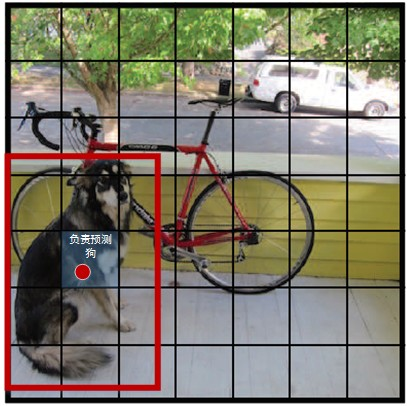

# v1
YOLO将输入图像分成SxS个格子，若某个物体 Ground truth 的中心位置的坐标落入到某个格子，那么这个格子就负责检测出这个物体。

每个格子预测B个bounding box及其置信度(confidence score)，以及C个类别概率。bbox信息(x,y,w,h)为物体的中心位置相对格子位置的偏移及宽度和高度,均被归一化.置信度反映是否包含物体以及包含物体情况下位置的准确性,定义为$Pr(Object)×IOU^truth_pred$,其中$Pr(Object)∈{0,1}$.

## 网络结构
YOLOv1网络借鉴了GoogLeNet分类网络结构。不同的是，YOLO未使用inception module，而是使用1x1卷积层（此处1x1卷积层的存在是为了跨通道信息整合）+3x3卷积层简单替代。
YOLOv1网络在最后使用全连接层进行类别输出，因此全连接层的输出维度是 S×S×(B×5+C)。
YOLOv1网络比VGG16快(浮点数少于VGG的1/3),准确率稍差。

缺馅:

* 输入尺寸固定：由于输出层为全连接层，因此在检测时，YOLO训练模型只支持与训练图像相同的输入分辨率。其它分辨率需要缩放成改分辨率.

* 占比较小的目标检测效果不好.虽然每个格子可以预测B个bounding box，但是最终只选择只选择IOU最高的bounding box作为物体检测输出，即每个格子最多只预测出一个物体。当物体占画面比例较小，如图像中包含畜群或鸟群时，每个格子包含多个物体，但却只能检测出其中一个。

## 损失函数
YOLO全部使用了均方和误差作为loss函数.由三部分组成:坐标误差、IOU误差和分类误差。
$$
loss=∑i=0s2coordErr+iouErr+clsErr
$$

* 简单相加时还要考虑每种loss的贡献率,YOLO给coordErr设置权重 $ λcoord=5 $.
* 在计算IOU误差时，包含物体的格子与不包含物体的格子，二者的IOU误差对网络loss的贡献值是不同的。若采用相同的权值，那么不包含物体的格子的confidence值近似为0，变相放大了包含物体的格子的confidence误差在计算网络参数梯度时的影响。为解决这个问题，YOLO 使用λnoobj=0.5修正iouErr。（此处的‘包含’是指存在一个物体，它的中心坐标落入到格子内）。
* 对于相等的误差值，大物体误差对检测的影响应小于小物体误差对检测的影响。这是因为，相同的位置偏差占大物体的比例远小于同等偏差占小物体的比例。YOLO将物体大小的信息项（w和h）进行求平方根来改进这个问题，但并不能完全解决这个问题。

综上，YOLO在训练过程中Loss计算如下式所示：

其中有宝盖帽子符号 $ (x̂ ,ŷ ,ŵ ,ĥ ,Ĉ ,p̂ ) $ 为预测值,无帽子的为训练标记值。$ 𝟙^obj_ij $ 表示物体落入格子i的第j个bbox内.如果某个单元格中没有目标,则不对分类误差进行反向传播;B个bbox中与GT具有最高IoU的一个进行坐标误差的反向传播,其余不进行.

训练过程
1）预训练。使用 ImageNet 1000 类数据训练YOLO网络的前20个卷积层+1个average池化层+1个全连接层。训练图像分辨率resize到224x224。

2）用步骤1）得到的前20个卷积层网络参数来初始化YOLO模型前20个卷积层的网络参数，然后用 VOC 20 类标注数据进行YOLO模型训练。检测通常需要有细密纹理的视觉信息,所以为提高图像精度，在训练检测模型时，将输入图像分辨率从224 × 224 resize到448x448。

训练时B个bbox的ground truth设置成一样的.
