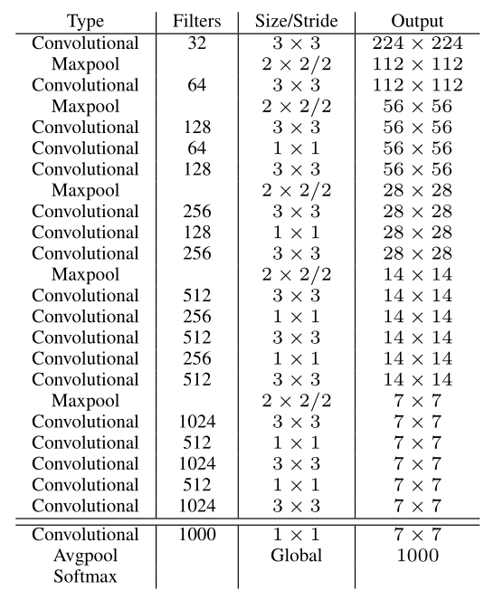
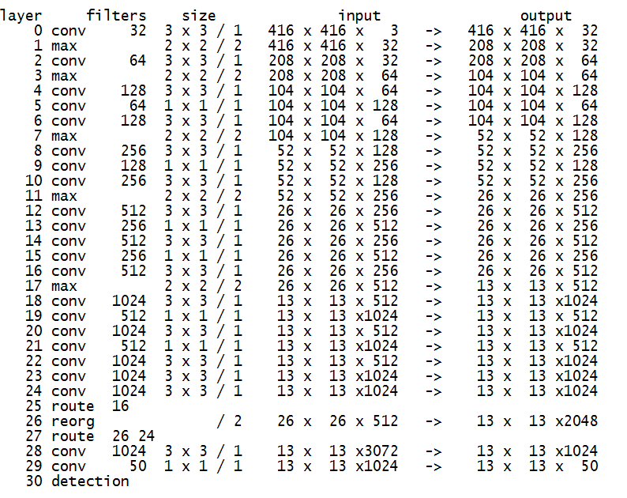

为提高物体定位精准性和召回率，YOLO作者提出了 《YOLO9000: Better, Faster, Stronger》 (Joseph Redmon, Ali Farhadi, CVPR 2017, Best Paper Honorable Mention)，相比v1提高了训练图像的分辨率；引入了faster rcnn中anchor box的思想，对网络结构的设计进行了改进，输出层使用卷积层替代YOLO的全连接层，联合使用coco物体检测标注数据和imagenet物体分类标注数据训练物体检测模型。相比YOLO，YOLO9000在识别种类、精度、速度、和定位准确性等方面都有大大提升。


# YOLOv2 改进之处
YOLO与Fast R-CNN相比有较大的定位误差，与基于region proposal的方法相比具有较低的召回率。因此YOLO v2主要改进是提高召回率和定位能力。下面是改进之处：

* Batch Normalization： v1中也大量用了Batch Normalization，同时在定位层后边用了dropout，v2中取消了dropout，在卷积层全部使用Batch Normalization。

* 高分辨率分类器：v1中使用224 × 224训练分类器网络，扩大到448用于检测网络。v2将ImageNet以448×448 的分辨率微调最初的分类网络，迭代10 epochs。

* Anchor Boxes：v1中直接在卷积层之后使用全连接层预测bbox的坐标。v2借鉴Faster R-CNN的思想预测bbox的偏移.移除了全连接层,并且删掉了一个pooling层使特征的分辨率更大一些.另外调整了网络的输入(448->416)以使得位置坐标是奇数只有一个中心点(yolo使用pooling来下采样,有5个size=2,stride=2的max pooling,而卷积层没有降低大小,因此最后的特征是416/(2^5)=13).v1中每张图片预测7x7x2=98个box,而v2加上Anchor Boxes能预测超过1000个.检测结果从69.5mAP,81% recall变为69.2 mAP,88% recall.

* YOLO v2对Faster R-CNN的手选先验框方法做了改进,采样k-means在训练集bbox上进行聚类产生合适的先验框.由于使用欧氏距离会使较大的bbox比小的bbox产生更大的误差，而IOU与bbox尺寸无关,因此使用IOU参与距离计算,使得通过这些anchor boxes获得好的IOU分值。距离公式：

$$
D(box,centroid)=1−IOU(box,centroid)
$$

* 使用聚类进行选择的优势是达到相同的IOU结果时所需的anchor box数量更少,使得模型的表示能力更强,任务更容易学习.k-means算法代码实现参考:k_means_yolo.py.算法过程是:将每个bbox的宽和高相对整张图片的比例(wr,hr)进行聚类,得到k个anchor box,由于darknet代码需要配置文件中region层的anchors参数是绝对值大小,因此需要将这个比例值乘上卷积层的输出特征的大小.如输入是416x416,那么最后卷积层的特征是13x13.

* 细粒度特征(fine grain features):在Faster R-CNN 和 SSD 均使用了不同的feature map以适应不同尺度大小的目标.YOLOv2使用了一种不同的方法，简单添加一个 pass through layer，把浅层特征图（26x26）连接到深层特征图(连接到新加入的三个卷积核尺寸为3 * 3的卷积层最后一层的输入)。 通过叠加浅层特征图相邻特征到不同通道（而非空间位置），类似于Resnet中的identity mapping。这个方法把26x26x512的特征图叠加成13x13x2048的特征图，与原生的深层特征图相连接，使模型有了细粒度特征。此方法使得模型的性能获得了1%的提升。

* Multi-Scale Training: 和YOLOv1训练时网络输入的图像尺寸固定不变不同，YOLOv2（在cfg文件中random=1时）每隔几次迭代后就会微调网络的输入尺寸。训练时每迭代10次，就会随机选择新的输入图像尺寸。因为YOLOv2的网络使用的downsamples倍率为32，所以使用32的倍数调整输入图像尺寸{320,352，…，608}。训练使用的最小的图像尺寸为320 x 320，最大的图像尺寸为608 x 608。 这使得网络可以适应多种不同尺度的输入.

# YOLOv2网络结构
YOLOv2对v1的基础网络做了更改.

## 分类网络

YOLOv2提出了一种新的分类模型Darknet-19.借鉴了很多其它网络的设计概念.主要使用3x3卷积并在pooling之后channel数加倍(VGG);global average pooling替代全连接做预测分类,并在3x3卷积之间使用1x1卷积压缩特征表示(Network in Network);使用 batch normalization 来提高稳定性,加速收敛,对模型正则化.
Darknet-19的结构如下表:



包含 19 conv + 5 maxpooling.

训练:使用Darknet框架在ImageNet 1000类上训练160 epochs,学习率初始为0.1,以4级多项式衰减.weight decay=0.0005 , momentum=0.9.使用标准的数据增广方法:random crops, rotations, (hue, saturation), exposure shifts.

之后将输入从224放大至448,学习率调整为0.001,迭代10 epochs.结果达到top-1 accuracy 76.5% , top-5 accuracy 93.3%.

## 检测网络

在分类网络中移除最后一个1x1的层,在最后添加3个3x3x1024的卷积层,再接上输出是类别个数的1x1卷积.
对于输入图像尺寸为Si x Si,最终3x3卷积层输出的feature map是Oi x Oi(Oi=Si/(2^5)),对应输入图像的Oi x Oi个栅格，每个栅格预测#anchors种boxes大小，每个box包含4个坐标值,1个置信度和#classes个条件类别概率，所以输出维度是Oi x Oi x #anchors x (5 + #classes)。

添加跨层跳跃连接（借鉴ResNet等思想）,融合粗细粒度的特征:将前面最后一个3x3x512卷积的特征图,对于416x416的输入,该层输出26x26x512,直接连接到最后新加的三个3x3卷积层的最后一个的前边.将26x26x512变形为13x13x1024与后边的13x13x1024特征按channel堆起来得到13x13x3072.从yolo-voc.cfg文件可以看到，第25层为route层，逆向9层拿到第16层26 * 26 * 512的输出，并由第26层的reorg层把26 * 26 * 512 变形为13 * 13 * 2048，再有第27层的route层连接24层和26层的输出，堆叠为13 * 13 * 3072，由最后一个卷积核为3 * 3的卷积层进行跨通道的信息融合并把通道降维为1024。

训练:作者在VOC07+12以及COCO2014数据集上迭代了160 epochs,初始学习率0.001,在60和90 epochs分别减小为0.1倍.
Darknet训练VOC的参数如下:
```
learning_rate=0.0001
batch=64
max_batches = 45000 # 最大迭代batch数
policy=steps # 学习率衰减策略
steps=100,25000,35000 # 训练到这些batch次数时learning_rate按scale缩放
scales=10,.1,.1 # 与steps对应
```
网络结构如下(输入416,5个类别,5个anchor box; 此结构信息由Darknet框架启动时输出):



YOLO v2-network
YOLO9000
提出了一种联合训练方法，能够容许同时使用目标检测数据集和分类数据集。使用有标记的检测数据集精确定位，使用分类数据增加类别和鲁棒性。

