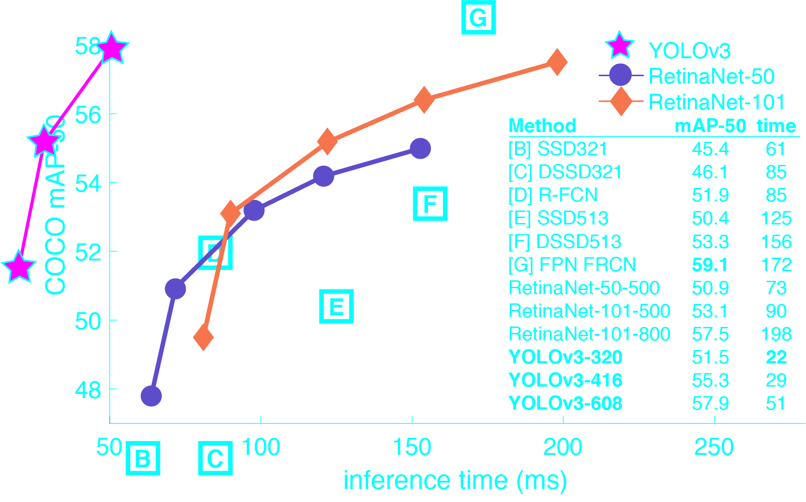
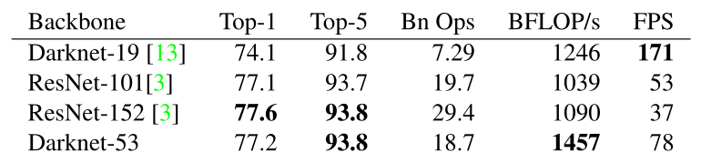
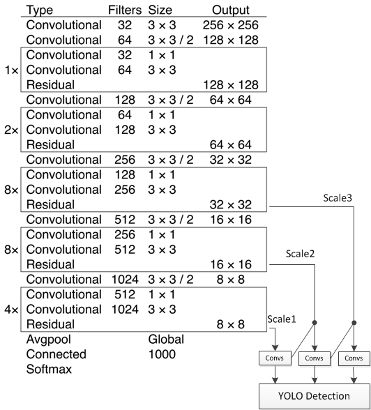
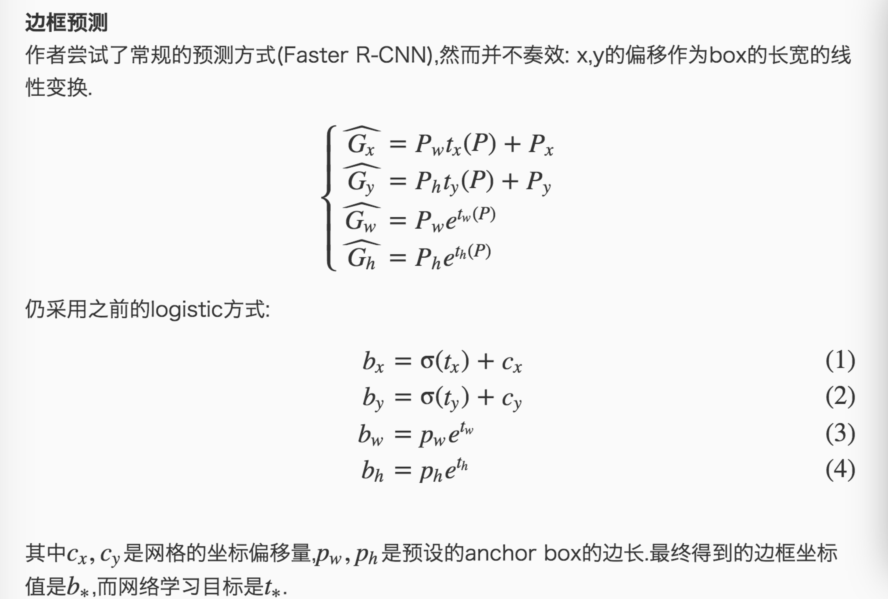
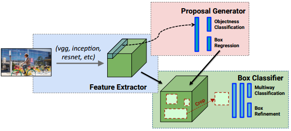

YOLOv3在Pascal Titan X上处理608x608图像速度达到20FPS，在 COCO test-dev 上 mAP@0.5 达到 57.9%，与RetinaNet（FocalLoss论文所提出的单阶段网络）的结果相近，并且速度快4倍.

YOLO v3的模型比之前的模型复杂了不少，可以通过改变模型结构的大小来权衡速度与精度。

速度对比如下：

## 改进之处：
* 多尺度预测 （类FPN）
* 更好的基础分类网络（类ResNet）和分类器

## 分类器-类别预测：
YOLOv3不使用Softmax对每个框进行分类，主要考虑因素有两个：

1. Softmax使得每个框分配一个类别（score最大的一个），而对于Open Images这种数据集，目标可能有重叠的类别标签，因此Softmax不适用于多标签分类。
2. Softmax可被独立的多个logistic分类器替代，且准确率不会下降。
分类损失采用binary cross-entropy loss.

## 多尺度预测
每种尺度预测3个box, anchor的设计方式仍然使用聚类,得到9个聚类中心,将其按照大小均分给3中尺度.

* 尺度1: 在基础网络之后添加一些卷积层再输出box信息.
* 尺度2: 从尺度1中的倒数第二层的卷积层上采样(x2)再与最后一个16x16大小的特征图相加,再次通过多个卷积后输出box信息.相比尺度1变大两倍.
* 尺度3: 与尺度2类似,使用了32x32大小的特征图.
参见网络结构定义文件yolov3.cfg

## 基础网络 Darknet-53
仿ResNet, 与ResNet-101或ResNet-152准确率接近,但速度更快.对比如下:

网络结构如下：

YOLOv3在mAP@0.5及小目标APS上具有不错的结果,但随着IOU的增大,性能下降,说明YOLOv3不能很好地与ground truth切合.

## 边框预测
作者尝试了常规的预测方式(Faster R-CNN),然而并不奏效: x,y的偏移作为box的长宽的线性变换.

其中cx,cy是网格的坐标偏移量,pw,ph是预设的anchor box的边长.最终得到的边框坐标值是b∗,而网络学习目标是t∗.
## 优缺点
### 优点

* 快速,pipline简单.
* 背景误检率低。
* 通用性强。YOLO对于艺术类作品中的物体检测同样适用。它对非自然图像物体的检测率远远高于DPM和RCNN系列检测方法。

### 但相比RCNN系列物体检测方法，YOLO具有以下缺点：

* 识别物体位置精准性差。
* 召回率低。在每个网格中预测两个bbox这种约束方式减少了对同一目标的多次检测(R-CNN使用的region proposal方式重叠较多),相比R-CNN使用Selective Search产生2000个proposal（RCNN测试时每张超过40秒）,yolo仅使用7x7x2个.

## YOLO v.s. Faster R-CNN
1. 统一网络:
YOLO没有显示求取region proposal的过程。Faster R-CNN中尽管RPN与fast rcnn共享卷积层，但是在模型训练过程中，需要反复训练RPN网络和fast rcnn网络.
相对于R-CNN系列的"看两眼"(候选框提取与分类，图示如下),YOLO只需要Look Once.
2. YOLO统一为一个回归问题
而R-CNN将检测结果分为两部分求解：物体类别（分类问题），物体位置即bounding box（回归问题）。

# Darknet 框架
Darknet 由 C 语言和 CUDA 实现, 对GPU显存利用效率较高(CPU速度差一些, 通过与SSD的Caffe程序对比发现存在CPU较慢,GPU较快的情况). Darknet 对第三方库的依赖较少,且仅使用了少量GNU linux平台C接口,因此很容易移植到其它平台,如Windows或嵌入式设备.
参考Windows 版 Darknet (YOLOv2) 移植, 代码在此.

region层:参数anchors指定kmeans计算出来的anchor box的长宽的绝对值(与网络输入大小相关),num参数为anchor box的数量,
另外还有bias_match,classes,coords等参数.在parser.c代码中的parse_region函数中解析这些参数,并保存在region_layer.num参数保存在l.n变量中;anchors保存在l.biases数组中.region_layer的前向传播中使用for(n = 0; n < l.n; ++n)这样的语句,因此,如果在配置文件中anchors的数量大于num时,仅使用前num个,小于时内存越界.

* region层的输入和输出大小与前一层(1x1 conv)的输出大小和网络的输入大小相关.

* Detection层: 坐标及类别结果输出层.

# 参考

YOLO主页 https://pjreddie.com/darknet/yolo/
YOLOv3: An Incremental Improvement
YOLO9000: Better, Faster, Stronger
You Only Look Once: Unified, Real-Time Object Detection
