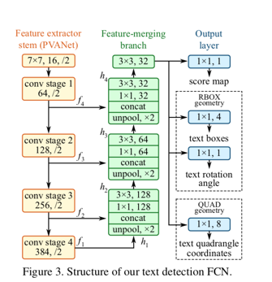
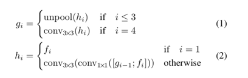

# EAST: An Efficient and Accurate Scene Text Detector
[论文地址](https://arxiv.org/abs/1704.03155)

# 概要
以前的场景文本检测方法已经在各种基准上取得了有希望的表现。然而，即使配备深层神经网络模型，它们通常不擅长处理具有挑战性的场景，因为整体性能由管道中多个阶段和组件的相互作用决定。在这项工作中，我们提出了一个简单而强大的流水线，可以在自然场景中产生快速准确的文本检测。管线直接预测完整图像中任意取向和四边形形状的单词或文本行，通过单个神经网络消除不必要的中间步骤（例如，候选聚合和单词分割）。我们的管道的简单性集中在设计损耗函数和神经网络架构上。包括ICDAR 2015，COCO-Text和MSRA-TD500在内的标准数据集的实验表明，所提出的算法在精度和效率方面都显着优于最先进的方法。在ICDAR 2015数据集上，提出的算法在720p分辨率下，以13.2fps的F值得到0.7820。

# 1 介绍
最近，提取和理解自然场景中体现的文字信息变得越来越重要和受欢迎，这得到了ICDAR系列比赛前所未有的大量参与者[30,16,15]以及NIST的TRAIT 2016评估的启动[1]。

文本检测作为后续流程的先决条件，在文本信息提取和理解的整个过程中起着至关重要的作用。 以前的文本检测方法[2，33，12，7，48]已经在这一领域的各种基准上获得了有希望的表现。 文本检测的核心是设计区分文本和背景的功能。 传统上，功能手动设计[5,25,40,10,26,45]以捕获场景文本的属性，而基于深度学习的方法[3,13,11,12,7,88]有效特征直接 从训练数据中学习。


然而，基于传统的或深层神经网络的现有方法主要由几个阶段和组件组成，这些阶段和组件可能是次优的和耗时的。 因此，这种方法的准确性和效率还远远不能令人满意。

在本文中，我们提出了一个快速准确的场景文本检测流水线，只有两个阶段。 该管道利用完全卷积网络（FCN）模型，直接产生单词或文本行级别预测，不包括冗余和缓慢的中间步骤。 产生的文本预测可以是旋转的矩形或四边形，被发送到非最大抑制以产生最终结果。 与现有方法相比，根据标准基准的定性和定量实验，提出的算法实现了显着提高的性能，同时运行更快。

# 2 相关工作

# 3 方法
## 3.1 流程
一个高级的概述见图2。此算法遵循一般DenseBox的设计，其中图像被送进FCN，生成我多做点像素级文本分类图和几何的通道。

预测通道的其中之一是分数图，像素值在[0,1]。其余通道表示从每个像素的视图中包围单词的几何尺寸。分数代表了在同样的位置预测的几何尺寸的置信度。

我们深度了两种文本的几何形状，旋转框（RBOX）和四边形（QUAD），并为每种几何形状设计了不同的损失函数。然后阈值应用于每个区域，其中分数超过预定义阈值的几何形状被认为是有效的，并且保存为稍后的非极大值抵制。NMS之后的结果被认为是管道的最终输出。



## 3.2 网络结构设计
设计用于文本检测的神经网络设计必须考虑几个因素。如图5所示，由于单词区域尺寸的变化很大，大单词的存在需来自神经网络后层的特征，同时预测预测小单词区域需要早期层中的低层特征。因此网络必须使用来自不同级别的特征来满足这些要求。HyperNet在特征图上满足这些条件，但是大特征图上合并大量通道显著增加后期的计算开销。

我们采用了U-shape的思想逐步合并特征层，同时保持上采样分支较小。我们以一个同时利用不同层特征和保持小计算量的网络结束。

我们的模型都示意图如图3所描画。模型可以分为三个部分：特征提取器，特征合并分支和输出层。

特征提取器可以是一个使用ImageNet数据集预训练的卷积层与池化层交替的卷积神经网络。四个级别的特征层用fi表示，从特征提取器里提取得到，它们的尺寸分别是输入图像的1/32,1/16,1/8,1/4。在我们的试验中我们采用众所周知的VGG16模型，它的特征提取层从池化层2到池化层5被提取出来。

在特征合并分支中，我们逐渐地合并他们：


```
if i <= 3  gi = unpool(hi)
if i == 4 gi = conv_3x3(hi)

if i == 1 hi = fi
else hi = conv_3x3( conv_1x1( [g(i-1);fi] ) )
```
gi是合并的基础，hi是合并后的特征层，算子[.;.]表示不同通道沿着axis的连结。在每个合并阶段，最后一个特征层第一个送进非池化层并放大两倍尺寸，然后与当前特征层合并。 下一步，一个conv1x1瓶颈缩小通道数量和减小计算量，紧跟着最后一个合并阶段，一个conv3x3层产生最后一个合并分支的特征层，喂给输出层。

每个卷积层的输出通道数量如图3所示。我们保留在分支中卷积通道数小的，仅增加了一小部分开销，使得网络更高效。最后的输出层包含几个conv1x1算法子将特征层的32通道映射到一个Fs分数图和一个多通道的几何信息图Fg。几何输出可以是RBOX或者QUAD。

对于RBOX来说，几何形状用四通道的轴对齐的边界框（AABB）R 和 一个通道的旋转角度 $\theta$ 表示。R的公式如[9]，四个通道代表4个距离，分别是像素点位置到上右下左边界的距离。
对于QUAD Q来说，我们使用8个数字来表示四个顶点到像素点的坐标位移。 每个偏移距离包含 $\delta x_i$ $\delta y_i$ 两个数，几何输出包含8个通道。


## 3.3 标签生成
### 3.3.1 四边形的分数图生成
不失一般性的情况下，我们只考虑几何是四边形的情况。得分图上四边形的正面积设计为大致为原始图形的缩小 版本。如图4所示。

对一个四边形Q={pi|i属于1,2,3,4},pi是按顺时针顺序排列的四边形的顶点。对于缩小的Q，我们首先计算ri：
$$
r_i = min(D(p_i, p_{(i mod 4) + 1}), D(p_i, p_{((i+2) mod 4) + 1}))
$$
D(pi,pj)是两个顶点pi和pj之间的L2距离。

我们首先收缩两个长点的边，再收缩两个短点的边。对于每对对边，我们通过比较平均长度值来确定长边。