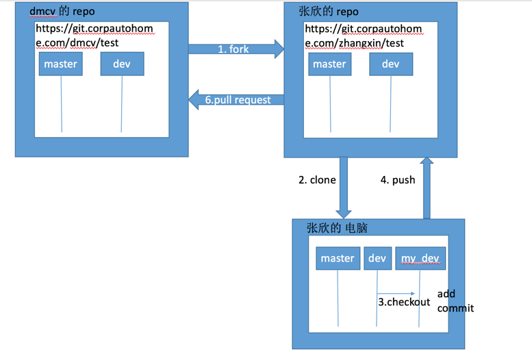
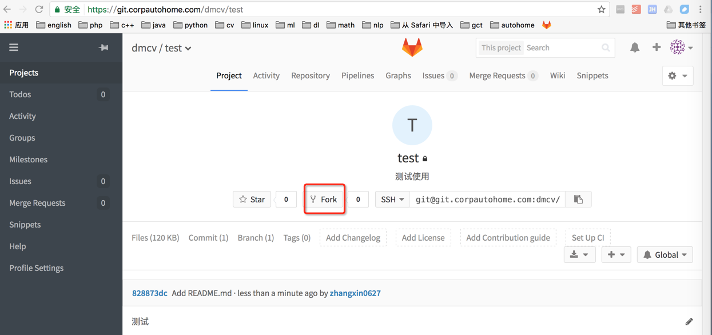
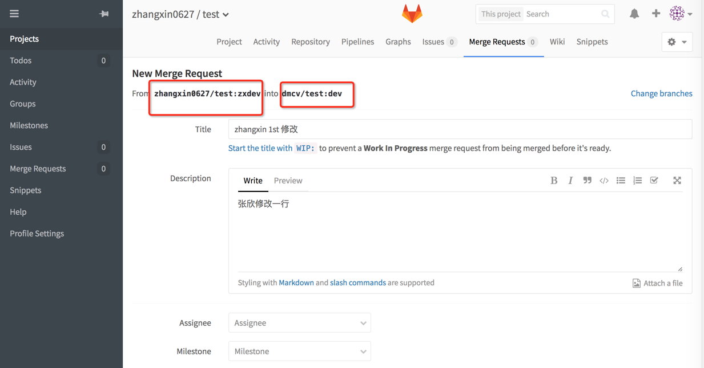
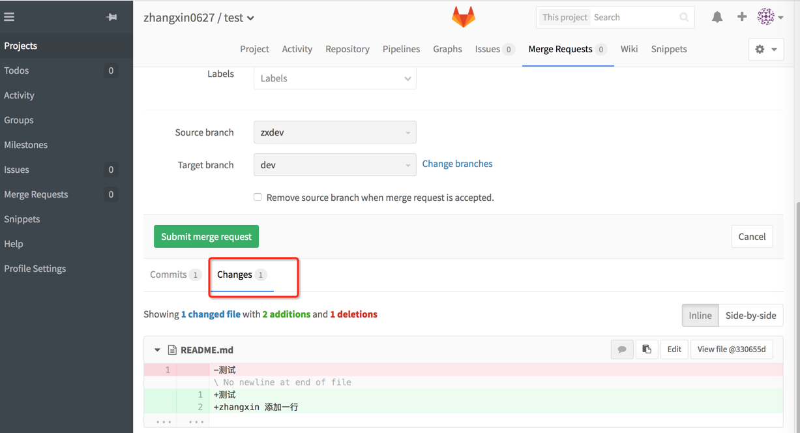
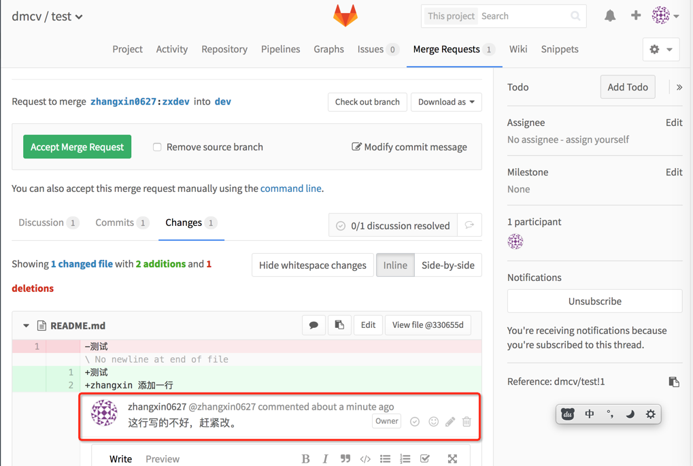
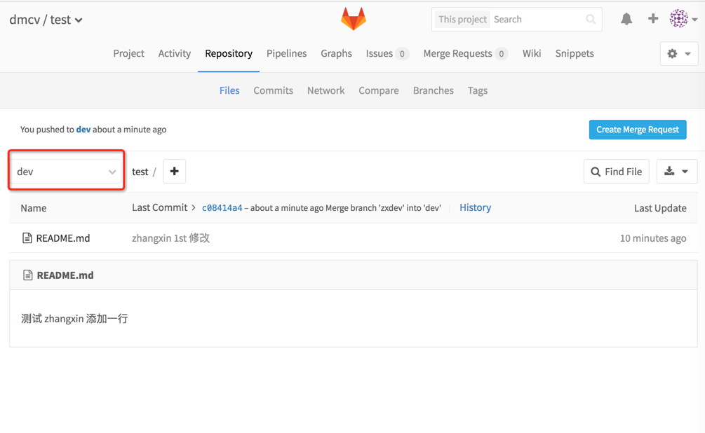

# 3 使用git的三种境界这三——和全世界的朋友一块玩

## 0 注意：

> 首先应该fork项目到自己的仓库，而不要向dmcv上直接push分支。

> master分支作为主分支，即发布分支（线上在用的代码）。

> dev分支作为开发分支，即预发布分支，作为下一版将上线的版本。必须 经过众人review并测试方可向master合并、上线。

> 每次开发 时根据需要（比如添加新功能、修改bug）从某个分支checkout创建新分支，个人在这个分支上可以随意修改，并push到自己仓库。如果要向上游提pr，则必须先合并代码、解决冲突、经过自己充分测试没问题。

> 不参与线上代码开发 的，可以不用这个工作流。只要掌握clone, add, commit, push, fetch，checkout 就足够了。




## 1. fork 这个项目（从网页上点fork）
首先是fork这个项目。这样在自己的仓库里也有同样的一份代码。


## 2. clone 到本地 (git clone .....)
### 2.1 clone到本地
```
➜ gitlab_autohome git clone git@git.corpautohome.com:zhangxin0627/test.git
Cloning into 'test'...
remote: Counting objects: 3, done.
remote: Total 3 (delta 0), reused 0 (delta 0)
Receiving objects: 100% (3/3), done.
Checking connectivity... done.
```
### 2.2 查看本地分支
```
➜ test git:(master) git branch -a
* master
remotes/origin/HEAD -> origin/master
remotes/origin/dev
remotes/origin/master
```
### 2.3 查看远程仓库
```
➜ test git:(master) git remote -v
origin git@git.corpautohome.com:zhangxin0627/test.git (fetch)
origin git@git.corpautohome.com:zhangxin0627/test.git (push)
```
### 2.4 设置远程仓库
```
➜ test git:(master) git remote add upstream git@git.corpautohome.com:dmcv/test.git
➜ test git:(master) git branch -a
* master
remotes/origin/HEAD -> origin/master
remotes/origin/dev
remotes/origin/master
➜ test git:(master) git fetch upstream
From git.corpautohome.com:dmcv/test
* [new branch] dev -> upstream/dev
* [new branch] master -> upstream/master
➜ test git:(master) git remote -v
origin git@git.corpautohome.com:zhangxin0627/test.git (fetch)
origin git@git.corpautohome.com:zhangxin0627/test.git (push)
upstream git@git.corpautohome.com:dmcv/test.git (fetch)
upstream git@git.corpautohome.com:dmcv/test.git (push)
```
## 3. 创建自己的开发 分支 (git checkout -b my_dev)
```
➜ test git:(master) git checkout -b zxdev origin/dev
Branch zxdev set up to track remote branch dev from origin.
Switched to a new branch 'zxdev'
➜ test git:(zxdev) git branch -a
master
* zxdev
remotes/origin/HEAD -> origin/master
remotes/origin/dev
remotes/origin/master
remotes/upstream/dev
remotes/upstream/master
```
## 4. 修改完代码后，提供自己的开发 分支到自己的仓库 （git push origin my_dev）
### 4.1 修改文件
```
vim README.md
zhangxin # 添加一行
```
### 4.2 add + commit
➜ test git:(zxdev) ✗ git add README.md
➜ test git:(zxdev) ✗ git commit -m 'zhangxin 1st 修改'
[zxdev 330655d] zhangxin 1st 修改
1 file changed, 2 insertions(+), 1 deletion(-)
### 4.3 push
```
➜ test git:(zxdev) git push origin zxdev
Counting objects: 3, done.
Writing objects: 100% (3/3), 292 bytes | 0 bytes/s, done.
Total 3 (delta 0), reused 0 (delta 0)
remote:
remote: Create merge request for zxdev:
remote: https://git.corpautohome.com/zhangxin0627/test/merge_requests/new?merge_request%5Bsource_branch%5D=zxdev
remote:
To git@git.corpautohome.com:zhangxin0627/test.git
* [new branch] zxdev -> zxdev
```
## 5. 提pr (从见面上点操作）




## 6. 大家review代码，修改没问题后，管理员会merge到上游dev 或者master分支





## 7. fetch 上游代码(git fetch upstream)，更新本地代码（例如git merge upstream/master）,将更新后的分支push 到自己的仓库(例如 git push origin master)
```
➜ test git:(zxdev) git fetch upstream
remote: Counting objects: 1, done.
remote: Total 1 (delta 0), reused 0 (delta 0)
Unpacking objects: 100% (1/1), done.
From git.corpautohome.com:dmcv/test
828873d..c08414a dev -> upstream/dev
➜ test git:(dev) git merge upstream/dev
Updating 828873d..c08414a
Fast-forward
README.md | 3 ++-
1 file changed, 2 insertions(+), 1 deletion(-)
```
## 8. 删除分支
之前 的开发 分支my_dev已经没用了，可以删掉（git branch -d my_dev），根据需要创建新的分支(git checkout -b fix_bug123)
