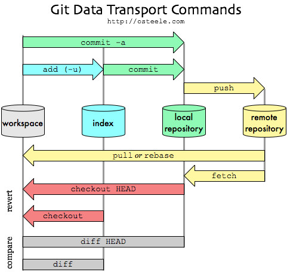

# Git 核心概念

## 工作区
- 工作目录（Working Directory）指当前目录受Git控制的目录。
- 暂存区（Staging Area）/ 索引 （Index）指当前目录受Git控制的目录内文件改动。
- 仓库（Repository）仓库分两种，本地仓库、远程仓库。
  - 本地仓库（Loacl Repository）指本地电脑上建立的Git仓库，通过git commit命令提交文件到本地仓库。
  - 远程仓库（Remote Repository）指非本地电脑上建立的Git仓库（服务器建立的Git仓库），通过git push命令提交文件远程仓库。

## 文件状态

- 已跟踪（Tracked）当前目录下的文件已受git版本控制。已跟踪分三种，未修改、已修改、已暂存。
  - 未修改（Unmodified）已跟踪文件已经保存在本地git数据库中。
  - 已修改（Modified）已跟踪文件有改动，但还没有提交保存。
  - 已暂存（Staged）已跟踪文件中的已修改文件放在下次提交时要保存的清单中。
  - 未跟踪（Untracked）当前目录下的文件未受git版本控制。

## 分支
允许相同项目拆开成多个版本并行开发，互不影响。
- 引用（Refs）指向提交id的指针，包括头（heads）、标签（tags）、远程（remotes）
- 头（Head）指向提交分支的指针，正在查看的最后一次提交对象。
- 分离头（Detached Head）HEAD指针没有指向分支，而指向某次提交。

# 参考资料
* [Git工具水很深，你根本把握不住（一）](https://zhuanlan.zhihu.com/p/376488061)