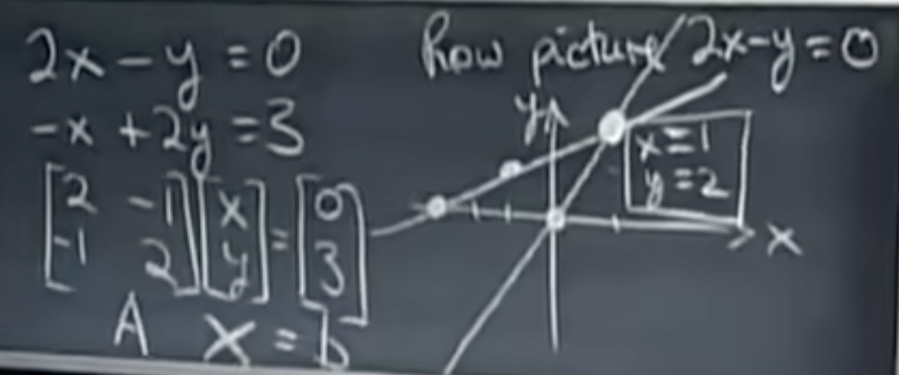
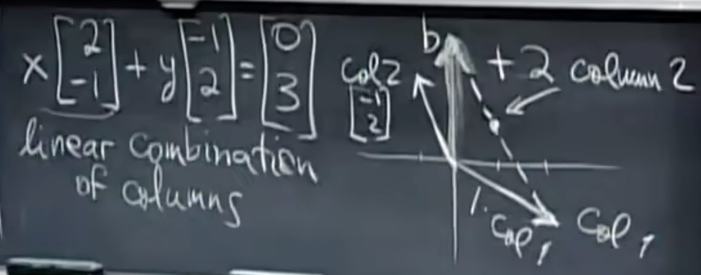
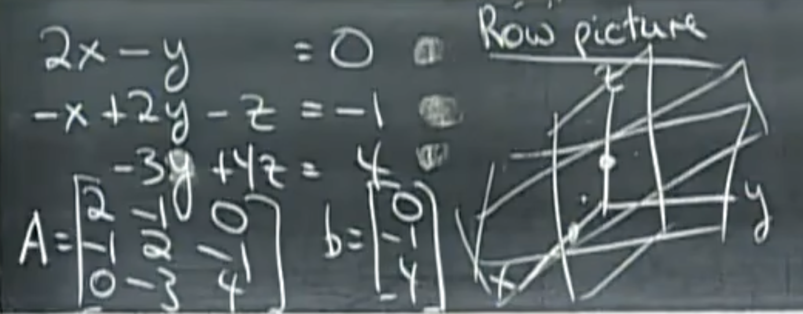
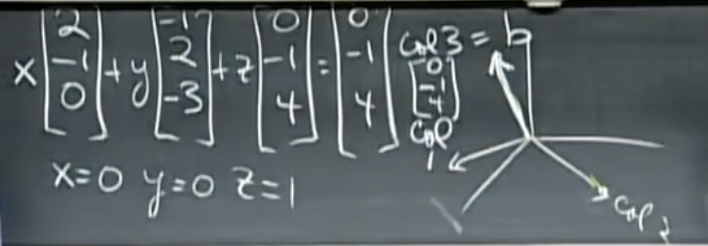

Linear Algebra

Lecture #1

W. Gilbert Strang

_______

n linear equations, n unknowns
- row picture
- **col picture**
- Matrix form

$$
\left\{\begin{matrix}
2x - y = 0 \\
-x + 2y = 3
\end{matrix}\right.
$$

# 1 Row Picture

# 2 Column Picture

What are all combinations ? The whole plane.

# 3 Matrix form

matrix form:
$$
\begin{bmatrix}
2 & -1 \\
-1 & 2 \\
\end{bmatrix}

\begin{bmatrix}
x \\
y \\
\end{bmatrix}
=
\begin{bmatrix}
0 \\
3 \\
\end{bmatrix}
$$

$AX=b$

# 4 3 unknowns and 3 equations

# 5 Can I solve $Ax=b$ for every b ?

Do the linear combinations of the columns fill three dimentional space ?

A non-singular matrix or an invertible matrix.

**非奇异矩阵** (又称 **可逆矩阵** 或 **正则矩阵**) 是一种存在逆元的方块矩阵。相反的，若方阵不存在逆元，则称为 **奇异矩阵**。

$$Ax=b$$

$$
\begin{bmatrix}
2 & 5 \\
1 & 3 \\
\end{bmatrix}
\begin{bmatrix}
1 \\
2
\end{bmatrix}
=
1
\begin{bmatrix}
2 \\
1
\end{bmatrix}
+
2
\begin{bmatrix}
5 \\
3
\end{bmatrix}
=
\begin{bmatrix}
12 \\
7
\end{bmatrix}
$$
