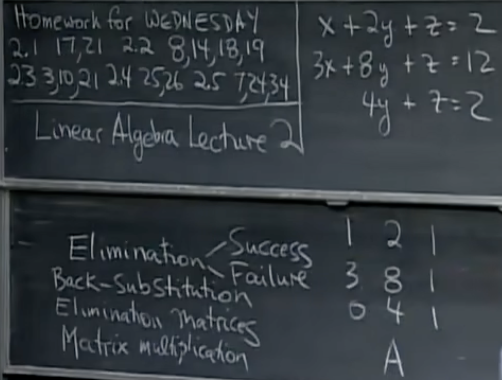

# 1. Elimination
pivot 主元

$$
\begin{bmatrix}
1 & 2 & 1\\
3 & 8 & 1\\
0 & 4 & 1\\
\end{bmatrix}
->
\begin{bmatrix}
1 & 2 & 1 \\
0 & 2 & -2 \\
0 & 4 & 1 \\
\end{bmatrix}
->
\begin{bmatrix}
1 & 2 & 1 \\
0 & 2 & -2\\
0 & 0 & 5\\
\end{bmatrix}
$$

# 2. Back-substitution

augumented matrix 增广矩阵

$$
\begin{bmatrix}
1 & 2 & 1 & 2  \\
3 & 8 & 1 & 12 \\
0 & 4 & 1 & 2  \\
\end{bmatrix}
->
\begin{bmatrix}
1 & 2 & 1  & 2\\
0 & 2 & -2 & 6\\
0 & 4 & 1  & 2\\
\end{bmatrix}
->
\begin{bmatrix}
1 & 2 & 1 & 2  \\
0 & 2 & -2& 6  \\
0 & 0 & 5 & -10\\
\end{bmatrix}
$$

# 3. Elimination matrices

- identity matrix   单位矩阵
- elementary matrix 初等矩阵
- associative law   结合律
- par·en·thesis n.   /pəˈrenθəsɪs/= bracket
- permutation matrix    置换矩阵
- Inverse

## Step 1: Matries: subtract 3 x row1 from row2

$$
\begin{bmatrix}
1  & 0 & 0 \\
-3 & 1 & 0 \\
0  & 0 & 1 \\
\end{bmatrix}

\begin{bmatrix}
1 & 2 & 1 & 2  \\
3 & 8 & 1 & 12 \\
0 & 4 & 1 & 2  \\
\end{bmatrix}
=
\begin{bmatrix}
1 & 2 & 1  & 2   \\
0 & 2 & -2 & 6   \\
0 & 4 & 1  & 2   \\
\end{bmatrix}
$$

## Step 2: Subtract 2 x row2 from row3
$$
\begin{bmatrix}
1 & 0 & 0 \\
0 & 1 & 0 \\
0 & -2& 1 \\
\end{bmatrix}
\begin{bmatrix}
1 & 2 & 1  & 2   \\
0 & 2 & -2 & 6   \\
0 & 4 & 1  & 2   \\
\end{bmatrix}
=
\begin{bmatrix}
1 & 2 & 1  & 2   \\
0 & 2 & -2 & 6   \\
0 & 0 & 5  & -10 \\
\end{bmatrix}
$$

$$
E_{32} (E_{21} A) = U
\\
(E_{32} E_{21}) A = U
$$

# 4. Matrix Multiplication

矩阵乘以一个列向量，相当于矩阵的列的线性组合。
一个行向量乘以一个矩阵，相当于矩阵的行的线性组合。

## Permutation
Exchange row1 and row2

$$
\begin{bmatrix}
0 & 1 \\
1 & 0 \\
\end{bmatrix}

\begin{bmatrix}
a & b \\
c & d \\
\end{bmatrix}
=
\begin{bmatrix}
c & d \\
a & b \\
\end{bmatrix}
$$

$$
\begin{bmatrix}
a & b \\
c & d \\
\end{bmatrix}

\begin{bmatrix}
0 & 1 \\
1 & 0 \\
\end{bmatrix}
=
\begin{bmatrix}
b & a \\
d & c \\
\end{bmatrix}
$$

## Inverses
$$
\begin{bmatrix}
1 & 0 & 0 \\
3 & 1 & 0 \\
0 & 0 & 1 \\
\end{bmatrix}
\begin{bmatrix}
1 & 0 & 0 \\
-3 & 1 & 0 \\
0 & 0 & 1 \\
\end{bmatrix}
=
\begin{bmatrix}
1 & 0 & 0 \\
0 & 1 & 0 \\
0 & 0 & 1 \\
\end{bmatrix}
$$