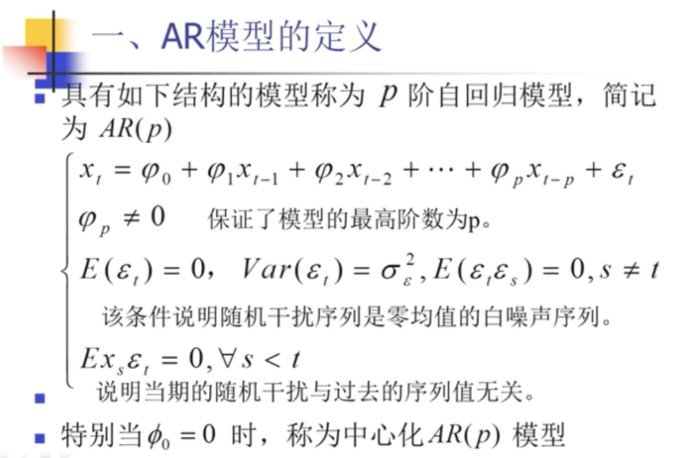
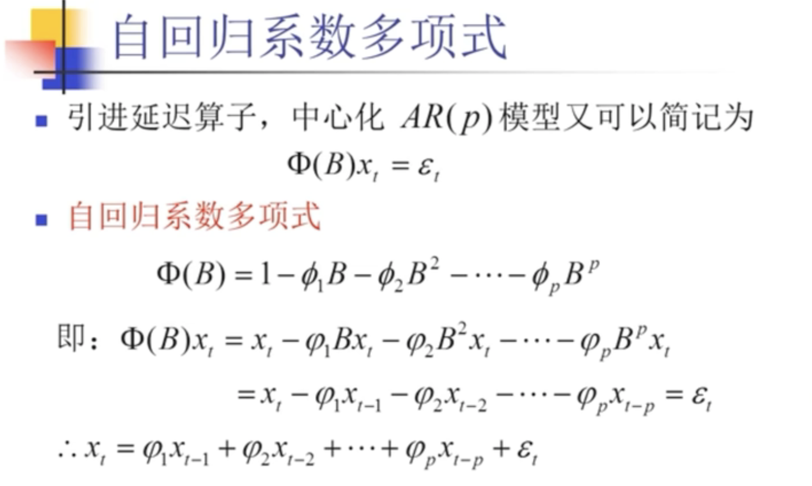

第三章 平稳时间序列分析
______

1. 拿到一个时间序列，首先做平稳性检验。
2. 如果是平稳序列，则做白噪声检验。
   1. 如果是白噪声的平稳时间序列，则分析结束。
   2. 如果是一个平稳的非白噪声的序列，就表明这个序列具有不变的统计规律、相关关系。
3. 研究的目的 就是寻找时序的相关关系、统计规律。

## 3.1 方法性工具

### 3.1.1 差分运算

1. 差分

一阶差分
$$
\Delta x_t = x_t - x_{t-1}
$$

二阶差分
$$
\Delta ^ 2 x_t = \Delta x_t - \Delta x_{t - 1}
$$

p阶差分
$$
\Delta ^ p x_t = \Delta^{p-1} x_t - \Delta^{p-1} x_{t - 1}
$$

2. K步差分

相距K期的两个序列值之间的减法运算称为K步差分运算，记$\Delta_k x_t$为$x_t$的K步差分：
$$
\Delta_k x_t = x_t - x_{t - k}
$$

### 3.1.2 延迟算子

延迟算子类似于一个时间指针，当前序列值乘以一个延迟算子，就相当于把当前序列值的时间向过去拔了一个时刻。
记B为延迟算子，有
$$
x_{t-1} = B x_t
\\
x_{t-2} = B^2 x_t
\\
...
\\
x_{t-p} = B^p x_t
$$

延迟算子的性质
$$
B^0 = 1
$$
$$
B(c \cdot x_t) = c \cdot B(x_t) = c \cdot x_{t-1}
$$
$$
B(x_t \pm y_t) = x_{t-1} \pm y_{t - 1}
$$
$$
B^n x_t = x_{t - n}
$$
$$
(1-B)^n = \Sigma_{t=0}^n (-1)^n C_n^1 B^i, 其中C_n^i = \frac {n!} {i! (n-1)!}
$$

B不是一个函数，它是一个算子，可以理解为一种新引入的运算符号，上角标就表示向后推移几阶。
不能理解为关于x_t的函数。但是如果觉得算子不好理解的话，可以理解为关于时间t的函数，然后作用在x上。
比如说对于一个和t无关的变量Y ，那么BY ＝ Y。

3. 用延迟算子表示差分运算

p阶差分：
$$
\Delta ^p x_t = (1-B)^p x_t = \Sigma_{i=0}^p(-1)^i C_p^i x_{t - i}
$$

k步差分：
$$
\Delta _k = x_t - x_{t - k} = (1 - B^k) x_t
$$

### 3.1.3 线性差分方程

1. 定义

称 
$$
z_t + a_1 z_{t-1} + a_2 z_{t-2} + ... + a_p z_{t-p} = h(t)
$$
为序列 $\{z_t, t=0, \pm 1, \pm 2, ...\}$ 的线性差分方程。

   其中，$p >= 1$, $a_t$ 为实数，h(t) 为 t 已知函数。当h(t)=0时，齐次方程为：
   $$
   z_t + a_1 z_{t-1} + a_2 z_{t-2} + ... + a_p z_{t-p} = 0
   $$
2. 

## 3.2 ARMA模型（重点、难点、考点）

ARMA模型的性质：
* AR模型（Auto Regression Model）
* MA模型（Moving Average Model）
* ARMA模型（Auto Regression Moving Average Model）

1. AR模型的定义

2. 

## 3.3 平稳序列建模

## 3.4 序列预测

