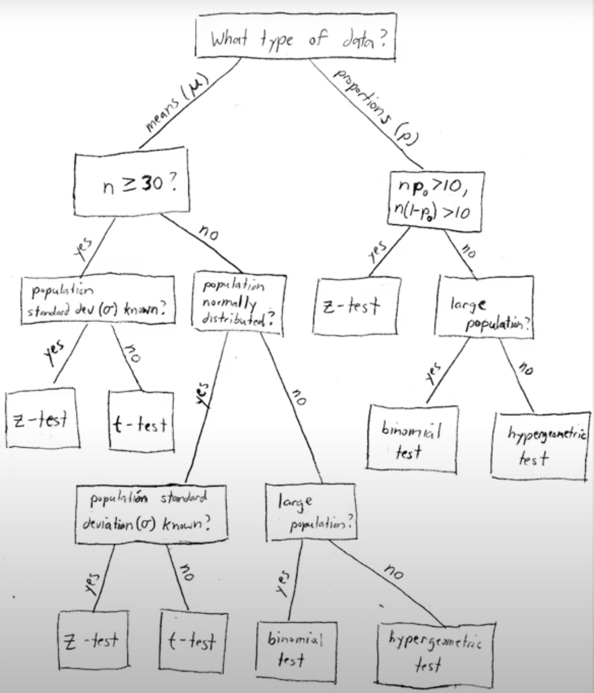

从均值为$\mu$，为$\sigma ^2$的住意一个总体中抽取样本量为$n$的样本，当$n$充分大的时候，样本均值$X$的抽样分布近似服从均值为$\mu$，方差为$\sigma ^2/n$的正态分布。

# z值
当我们想要检验：
样本均值 $x$ 与总体平均数 $\mu$ 的差异是否显著时，可以通过计算 $Z$ 值来进行检验。

$$
z
=
\frac {\bar X - \mu} {\sigma_{\bar X}}
=
\frac {\bar X - \mu} {\frac {\sigma} {\sqrt{n}}}
$$
- \sigma 总体的标准差

1. 样本数量（也就是n）足够大（$n>=30$）
2. 需要知道总体的标准差$\sigma$

才能完成z值的计算。

# t值
当我们想要检验：
样本均值 $x$ 与总体平均数 $\mu$ 的差异是否显著时

$$
t
=
\frac {\left | \bar X - \mu _0 \right |} {S_{\bar X}}
=
\frac {{\bar X} - \mu _0} {\frac s {\sqrt{n}}}
$$
- s 样本的标准差

# 不同情况
## 情况1
- 当样本数量>=30，中心极限定理成立；
- 我们想要计算 $z$ 值，但不知道总体标准差 $\sigma$

解决办法：用样本的标准差 $s$ 近似替代总体标准差 $\sigma$

## 情况2
- 样本数量<30，中心极限定理不能够随时成立。
  - 1. 总体服从正态分布么？
  - 2. 总体标准差 $\sigma$ 已知么？

解决方法：
1. 当总体服从正态分布 + 总体标准差 $\sigma$ 已知的时候，我们仍然可以使用z检验，并计算z值。
2. 当总体服从正态分布 + 总体标准差 $\sigma$ 未知的时候，我们需要使用t检验，并计算t值。
3. 当总体不服从正态分布，需要使用其他检验方法。

# t分布

t分布特点：
1. 和正态分布一样，t分布是对称的。
2. 如果在均值将其对折，两侧是相同的。
3. t分布均值为0，但不假设总体标准差是已知的。
4. 随着自由度的增加，t分布越来越接近均值为0标准差为1的标准正态分布。

# 自由度
自由度（degree of freedom, df） = n - k
其中，n是样本数量，k是为被限制的条件数或变量个数。

在总体平均数未知时，用样本平均数去计算标准差会受到一个限制，即：要计算样本标准差S就必须先知道样本平均数X，而样本平均数X和n都知道的情况下，数据的总和是一个常数。所以，“最后一个”样本数据就不可以变。

