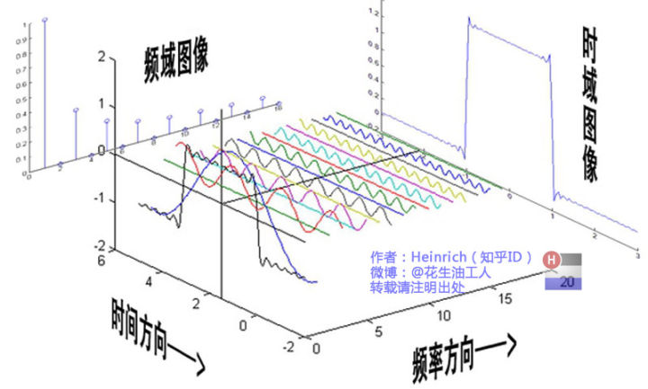

# 1 变换
A(2, 1)
B(1, 2)
C = A + B = (3, 3)

内积：
$$
\vec e_x \vec e_x = \vec e_y \vec e_y = 1
$$

$$
\vec e_x \vec e_y = 0
$$
标准正交积

# 2 傅立叶级数

周期性函数f(t)写成一系列正（余）弦函数的组合。

时域：
频域：
相位：起始点位置
振幅：

$$
f(t) = \frac {a_0} 2 + \sum_{n}^{1}a_n \sin(n \omega t + \varphi_n) = \frac {a_0} 2 + \sum_{n}^{1}a_n \sin(n \omega t) + \sum_{n}^{1}a_n \sin(n \omega t)
$$

# 3 傅立叶变换

欧拉公式：
$$
e^{i\theta} = \cos \theta + i \sin \theta
$$

$\theta=\omega t$ 
--》》 
$e^{i\theta} = e^{i \omega t}$

不含$\omega$
$$
\int_{-\infty}^{+\infty} e^{-j \omega t} \dot dt = 0
$$
含$\omega$
$$
\int_{-\infty}^{+\infty} e^{-j \omega t} \dot dt \neq 0
$$

# 4 应用
## 4.1 声音

## 4.2 图像

