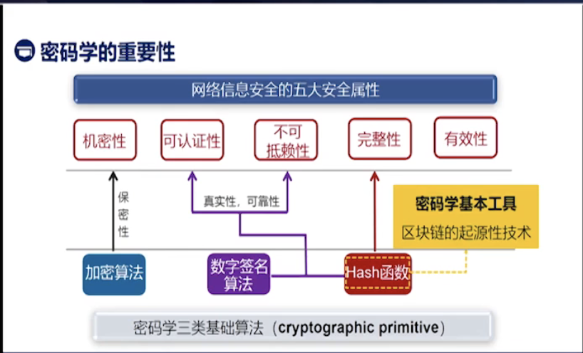
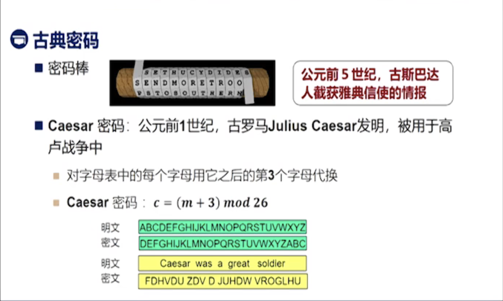
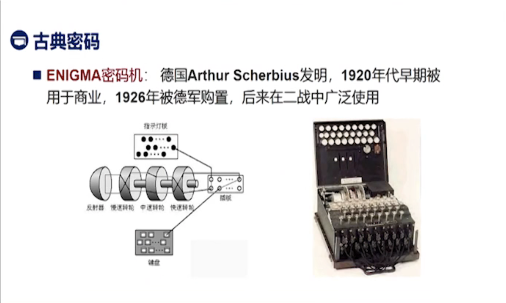
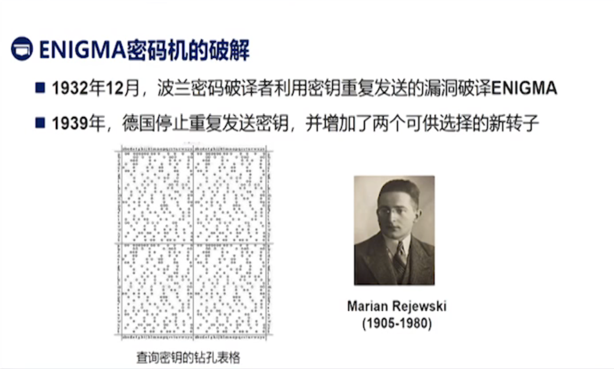
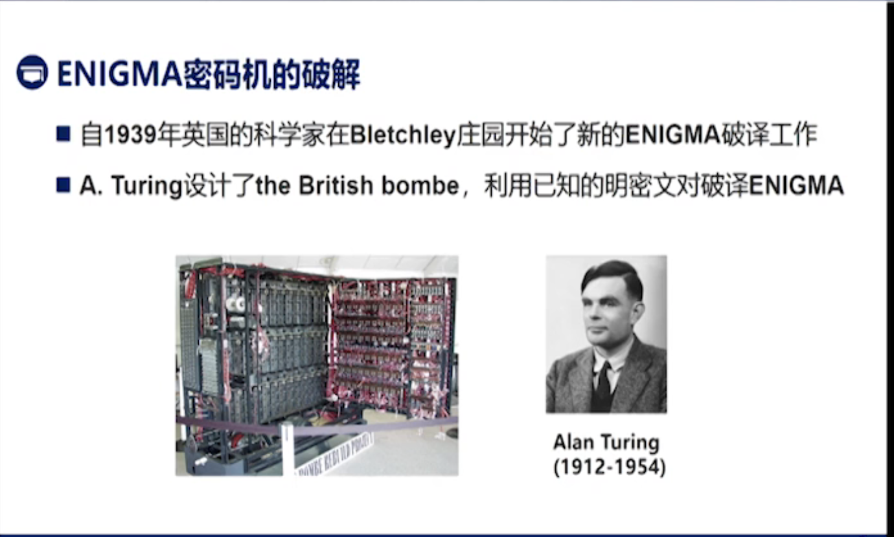
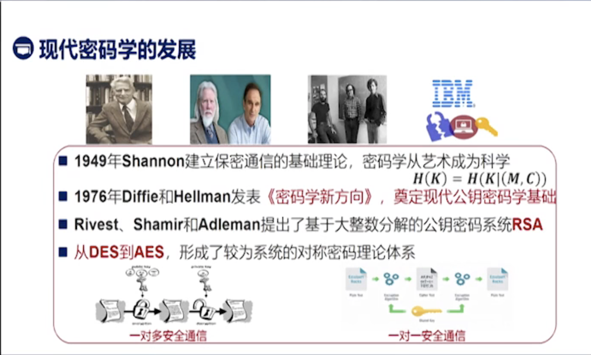
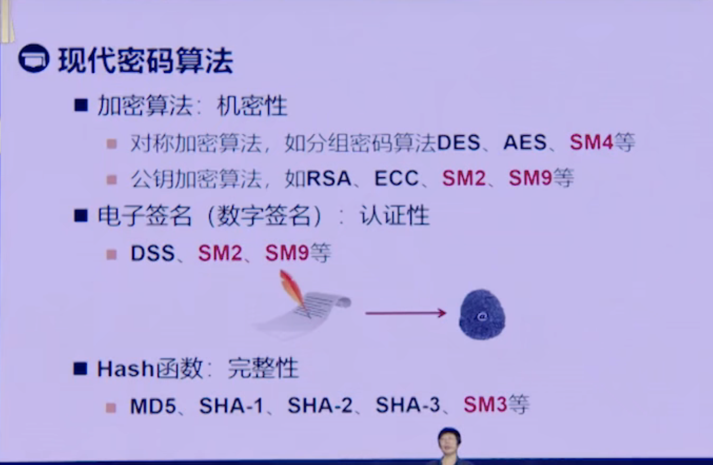
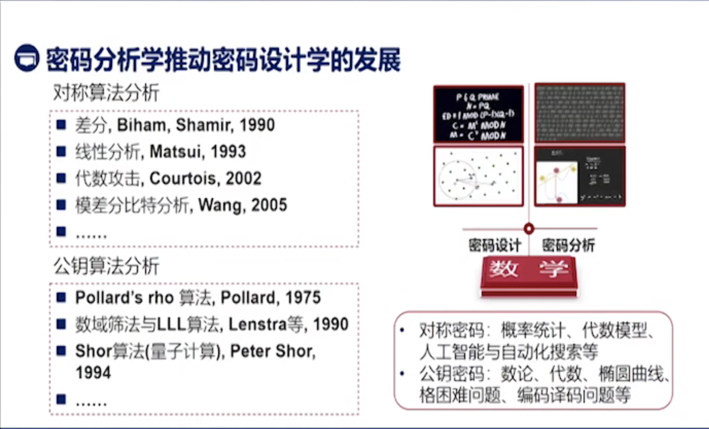
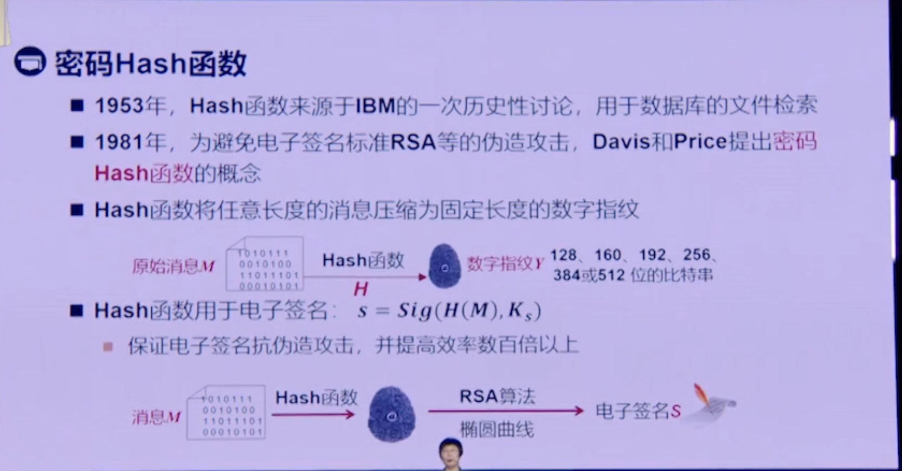
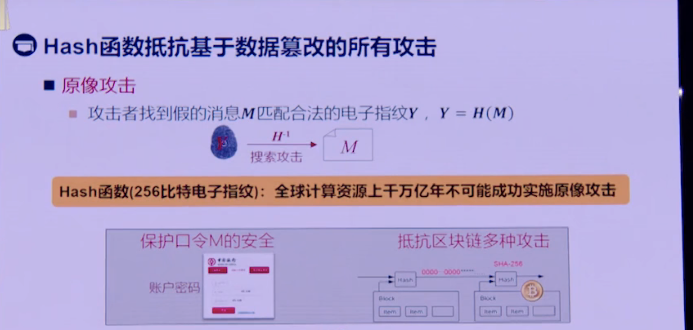

# 1 密码学简介
## 1.1 密码学的重要性

密码是保障网络与信息安全的核心技术与基础支撑，关键科学问题为数学问题。
- 计算机网络
- 移动网络
- 物联网
- 大数据云计算

## 1.2 密码学发展的三个阶段
### 1.2.1 古典密码
手工、机械阶段

古代-1949年

### 1.2.2 近代密码
计算机阶段

1949-1975

### 1.2.3 现代密码
多学科交叉

1976-至今

## 密码分析学推动密码设计学的发展

## 密码HASH函数

