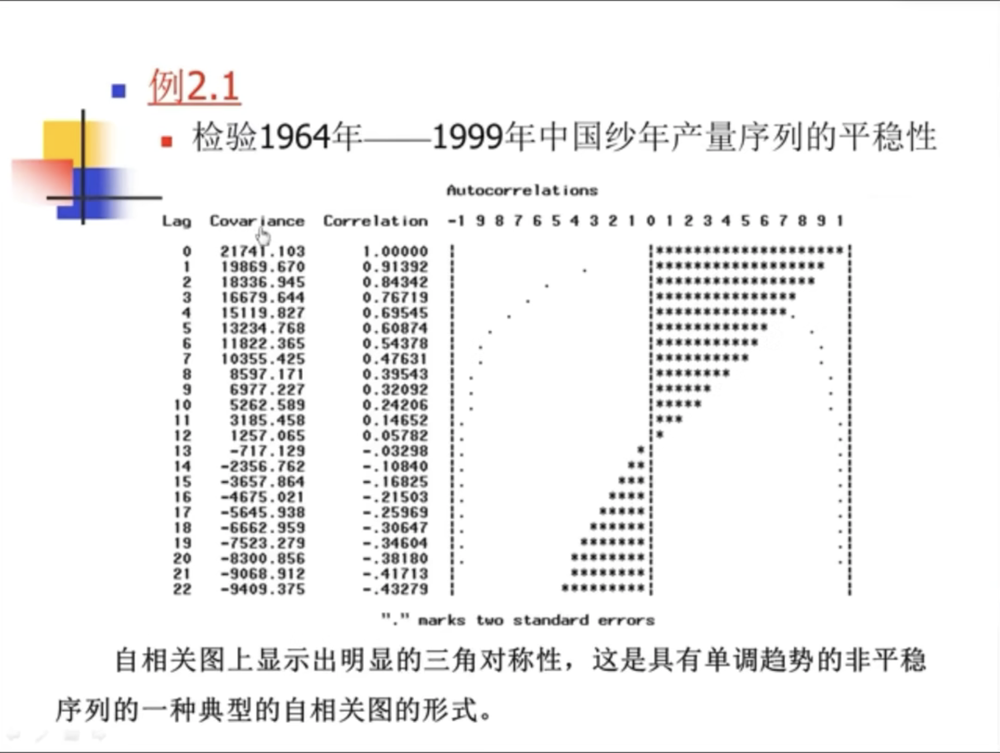
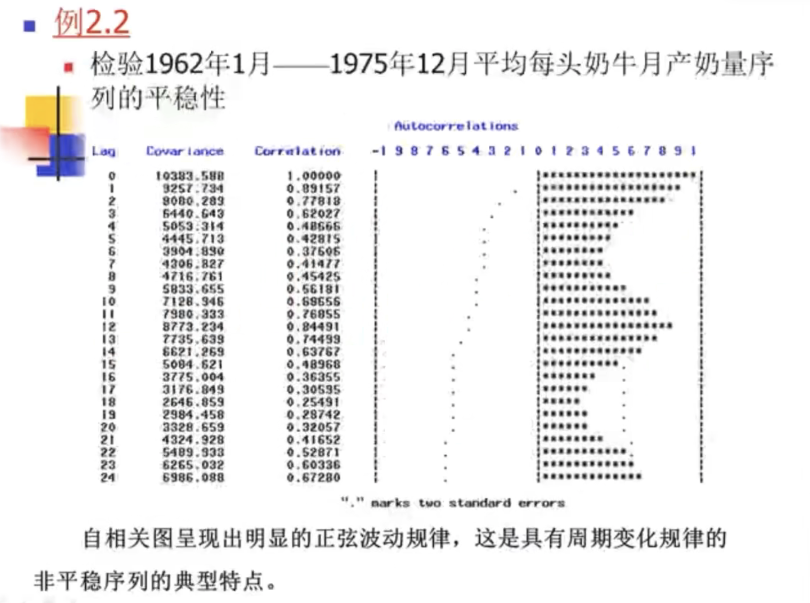
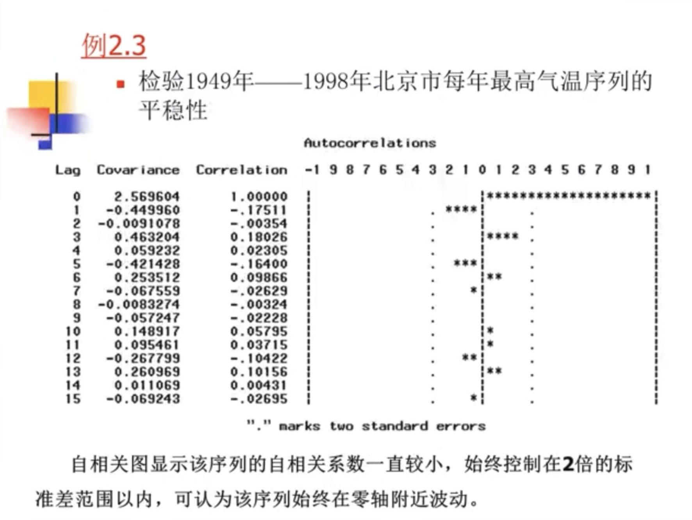
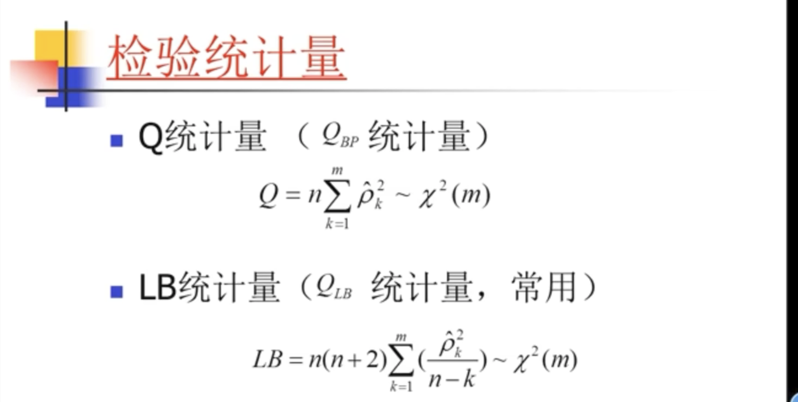
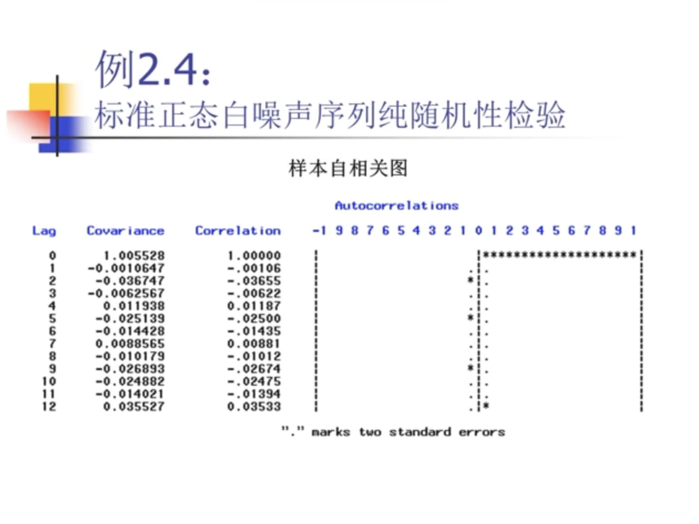
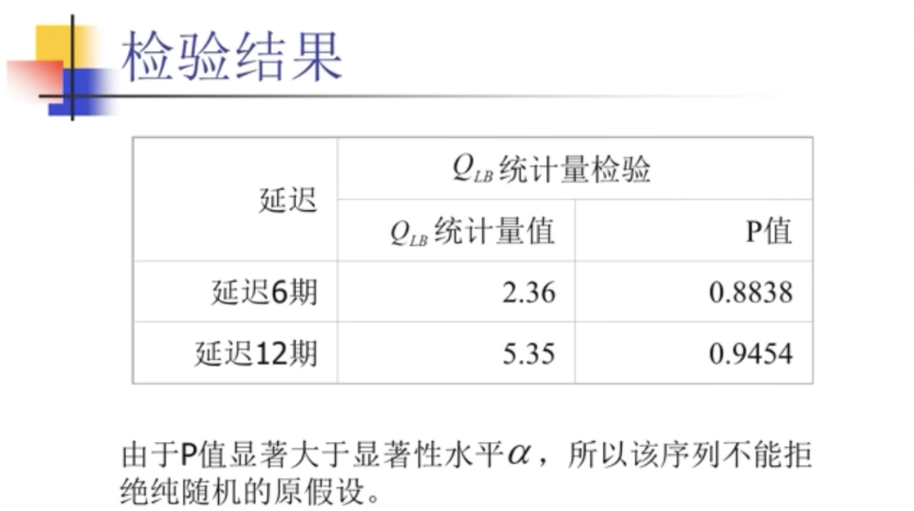
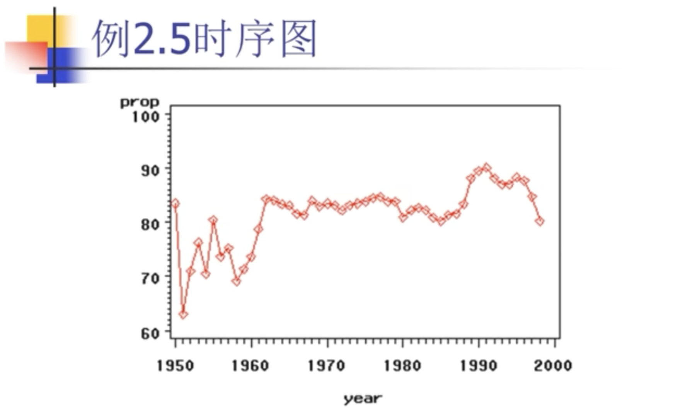
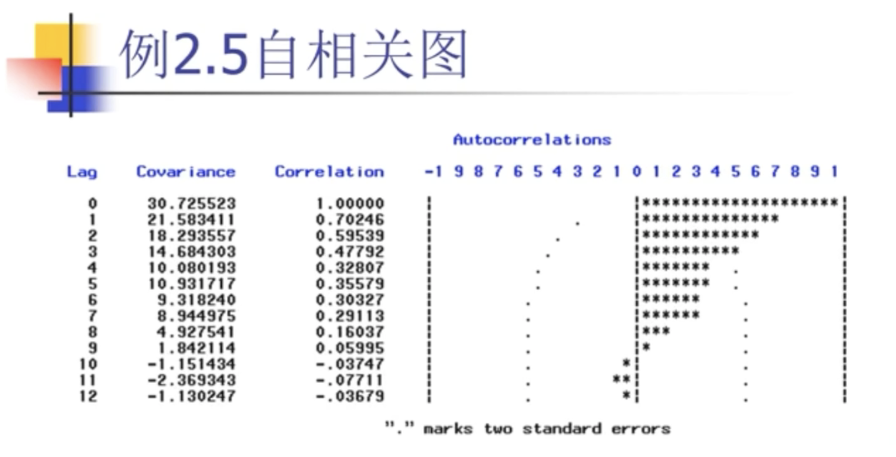
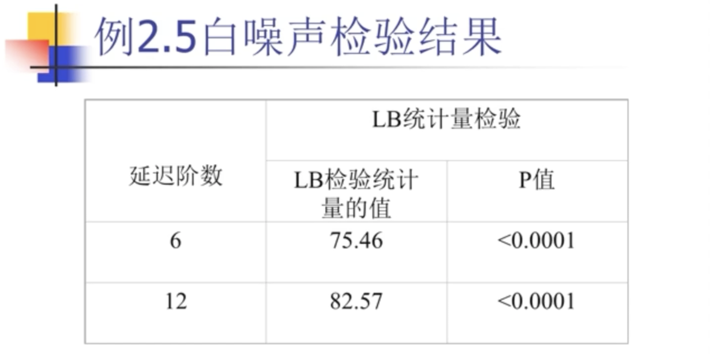

第二章 时间序列的预处理
_____

[toc]

## 2.1 平稳性检测
### 2.1.1 特征统计量
#### 2.1.1.1 概率分布

时间序列$\{X_t\}$的概率分布族。
实际应用有局限性。

#### 2.1.1.2 特征统计量
1. 均值函数
$$
    \mu_t = EX_t=\int_{-\infty}^{\infty} xdF_t(x)
$$
均值函数序列$\{\mu_t, t \in T\}$，反映时间序列$\{X_t\}$每时每刻的平均水平。

2. 方差函数
$$
DX_t = E(X_t - \mu_t)^2 = \int_{-\infty}^{\infty} (x-\mu_t)^2 dF_t(x)
$$
当t取遍所有的观察时刻时，可得到一个方差序列 $\{ \sigma_t^2, t\in T \}$。

3. 自协方差函数
$$
\gamma(t,s) = E(X_t - \mu_t)(X_s - \mu_s) = E(X_t X_s) - E(X_t) E(X_s)
$$

4. 自相关系数（ACF）
$$
\rho(t,s) = \frac {\gamma(t,s)} {\sqrt {D X_t \cdot D X_s}}
$$
> 【注意】
通常的协方差函数和相关系数度量的是**两个不同事件**彼此之间的相互影响程度。
而自协方差函数和自相关系数度量的是**同一个事件**在**两个不同时期**之间的相关程度，即度量自己过去的行为对自己现在的影响。

### 2.1.2 平稳时间序列的定义
平稳代表没有明显趋势且波动范围有限。

1. 严平稳
   严平稳是一种条件比较苛刻的平稳性定义，它认为只有当序列所有的统计性质都不会随着时间的推移而发生变化时，该序列才能被认为平稳。
   定义1：
   > 设 $\{X_t\}$ 为一时间序列，$\forall m \in Z^+$， $\forall t_1,t_2,...,t_m \in T$，则 $\forall \tau \in Z$, 有$F_{t_1, t_2, ..., t_m}(x_1, x_2, ..., x_m) = F_{t_{1+\tau}, t_{2+\tau}, ..., t_{m+\tau}}(x_1, x_2, ..., x_m)$

2. 宽平稳
   宽平稳是使用序列的特征统计量来定义的一种平稳性。它认为序列的统计性质主要由它的低阶矩决定，所以只要保证序列低阶平稳（二阶），就能保证序列的主要性质近似稳定。

- 定义2：
  - (1) $\forall t \in T$, 有$EX_t^2 < \infty$。方差是存在的。
  - (2) $\forall t \in T$, 有$EX_t = \mu$（常数）。均值是常数。
  - (3) $\forall t,s,k \in T$，且$k+s-t \in T$，$\gamma(t,s)=\gamma(k, k+s-t)$。反映的是：两个相距为s-t的时间序列的相关关系。
  - 则称$X_t$为宽平稳时间序列，或弱平稳、二阶平稳。
  - 均值（期望）是一阶原点矩，方差是二阶中心矩，自协方差是二阶混合中心矩。

3. 严平稳与宽平稳的关系
- 一般关系
  - 严平稳条件比宽平稳条件苛刻，通常情况下，严平稳（低阶矩存在）能推出宽平稳成立，而宽平稳序列不能反推严平稳成立。
- 特例
  - 不存在低阶矩的严平稳序列不满足宽平稳条件，例如服务柯西分布的严平稳序列就不是宽平稳序列。柯西分布不存在期望和方差，因为柯分分布期望值不收敛。
  - 当序列服从多元正太分布时，宽平稳可以推出严平稳。

* 二阶矩有限的严平稳为宽平稳。
* 宽平稳一般不是严平稳。
* 正态平稳列既是宽平稳也是严平稳。
* 平稳序列=宽平稳序列=弱平稳序列。
* 严平稳序列=强平稳序列。

### 2.1.3 平稳时间序列的统计性质
1. 常数均值 
   $$
   E(X_t)=\mu, \forall t \in T
   $$

2. 自协方差函数和自相关函数只依赖于时间的平移长度而与时间的起止点无关。
$$
r(t,s)=r(k,s+k-t), \forall t,s,k \in T
$$
由此，可将二维的自协方差函数转化为一维函数，即：
$$
r(t,s)=r(s-t), \forall t,s \in T
$$
相关关系具有对称性：
$$
r(s,t)=r(t-s), \forall t,s \in T
$$

3. **延迟K阶自协方差函数**：
   对于平稳时间序列$\{X_t, t \in T\}$，任取$\forall t (t+k \in T)$, 定义$r(k)$为时间序列$\{X_t\}$的延迟K阶自协方差函数：
$$
r(k) = r(t, t+k), \forall k \in Z
$$
从而容易推出时间序列的常数方差的性质，即：
$$
D(X_t)=r(t, t)=r(0)
$$

自相关系数具有如下三个性质：
* 规范性 $\rho_0 = 1, 且|\rho_k|<=1, \forall K \in Z$
* 对称性 $\rho_k=\rho_{-k}$
* 非负定性：自相关系数矩阵为对称非负定阵（特征根>=0）。
* 特别性质：对应模型的非唯一性

### 2.1.4 平稳时间序列的意义

1. 传统统计的数据结构
2. 时间序列的数据结构
   * 任意t时刻的序列值$X_t$是一随机变量；
   * 变量$X_t$在任一时刻只能获得唯一的样本观察值
   * 缺点是样本信息少，需要借助其他信息或辅助办法。
3. 平稳性的重大意义
   
（1) 平稳序列的常数均值性使得$\{\mu_t, t \in T\}$变成常数序列$\{\mu, t \in T\}$。
原来每个$X_t$的均值$\mu_t$只依靠唯一的一个观测值$x_t$去估计。但由于$\mu_t=\mu(\forall t \in T)$，所以每个样本的观测值$x_1, x_2, x_3,..., x_t, ...$都变成了常数均值$\mu$的样本观测值。
$$
\hat \mu = \bar x = \frac 1 n \sum_{i=1}^n x_i
$$
故平稳序列极大地减少了随机变量的个数，并增加了待估变量的样本容易。即极大简化了时序分析的难度，同时也提高了对待特征统计量的估计精度。

（2）同理，根据平稳序列二阶矩平稳的性质，可以得到延迟K阶自协方差函数的估计值：
$$
\hat r(k) = \frac {\sum_{t=1}^{n-k} (x_t - \bar x)(x_{t+k} - \bar x)} {n-k},
\forall 0 < k < n
$$
并进一步推导出总体方差的估计值：
$$
\hat r(0) = \frac {\sum_{t=1}^{n}(x_t - \bar x)^2} {n-1}
$$

【注意】
使用n-1 是无偏的方差估计值。

延迟K阶自相关系数的估计值：
$$
\hat \rho_k = \frac {\hat r(k)} {\hat r(0)},
\forall 0 < k < n
$$
若延迟阶数K远小于样本容易n时，
$$
\hat \rho_k = \frac {\sum_{t=1}^{n-k} (x_t - \bar x)(x_{t+k} - \bar x)} {\sum_{1}^{n} (x_t - \bar x)^2},
\forall 0 < k < n
$$

### 2.1.5 平稳性的检测(图检验方法)

1. 时序图检验
   根据平稳时间序列均值、方差为常数的性质，平稳序列的时序图应该显示出该序列始终在一个常数附近随机波动，而且波动的范围有界、无明显趋势及周期特征。

2. 自相关图检测
   平稳序列通常具有短期相关性。该性质用自相关系数来描述就是随着延迟期数的增加，平稳序列的自相关系数会很快地衰减向零。
   
   - lag            延迟阶数
   - Covariance     自协方差
   - Correlation    自相关系数
星号（*）部分落在点（.）之外，则认为具有相关性，
   自相关图上显示出明显的三角对称性，这是单调趋势的非平稳序列的一种典型的自相关图的形式。

3. 单位根检测
   DF检验
   ADF检验
   PP检验

## 2.2 纯随机性检测

### 2.2.1 纯随机序列的定义
纯随机序列也称为白噪声序列，它满足如下两条性质：

（1）$EX_t = \mu, \forall t \in T$
（2）
$$
\gamma(t,s) = 
\left\{\begin{matrix}
\sigma ^ 2, t = s
\\ 
0, t \neq s
\end{matrix}\right.

\forall t,s \in T
$$

### 2.2.2 纯随机序列的性质
1. 纯随机性

$$
\gamma(k) = 0, \forall k \neq 0
$$

各序列之间没有任何相关关系，即为"没有记忆"的序列。此时，序列在进行完全无序的随机波动。
从统计分析的角度，如果一个序列呈现出随机波动的特征，就认为该序列没有任何值得提取的有用信息，就应该终止分析了。

反之，若序列之间呈现出某种显著的相关关系：
$$
\gamma(k) \neq 0, \forall k \neq 0
$$
则说明该序列不是随机序列，该序列间隔K期的序列值之间存在着一定程度的相互影响关系，统计上称为**相关信息**。

时间序列分析的目的就是把相关关系提取出来，一旦观察值序列中的这种相关关系充分提取出来了，那么剩下的残差序列就应该呈现纯随机的性质。因此，纯随机性还是判断相关信息是否提取充分的一个判别标准。

2. 方差齐性
$$
DX_t = \gamma(0) = \sigma^2
$$

根据马尔可夫定理，只有方差齐性假定成立时，用最小二乘法得到的未知参数估计值才是准确的、有效的方差最小线性无偏估计。否则拟合模型的精度会受到很大的影响。

在进行模型拟合时，对拟合模型的残差序列是否满足方差齐性假定也需要进行检验。如果不满足，则说明残差序列还不是白噪声序列，即拟合模型还没有充分提取随机序列中的相关信息，这时拟合模型的精度是值得怀疑的。

### 2.2.3 纯随机性检验

#### 2.2.3.1 检验原理
如果一个序列是白噪声序列，那么它必然满足纯随机性的性质，即它的序列值之间没有任何的相关关系：
$$
\gamma (k) = 0, \forall k \neq 0
$$
实际上由于观察值的有限性，导致纯随机序列的样本自相关系数不会绝对为零，而是会在零值附近以一个很小的幅度随机波动。

#### 2.2.3.2 假设条件
原假设：
延迟期数小于或者等于m期的序列值之间相互独立
$$
\rho_1 = \rho_2 = ...= \rho_m = 0, \forall m \geqslant 1
$$

备择假设：延迟期数小于或等于m期的序列值之间有相关性
$$
至少存在某个\rho_k \neq 1, \forall m \geqslant 1, k \leqslant m
$$

实践中m一般取6或者12。

本例中只检验了前6期和前12期延迟的LB统计量就直接判断该序列是白噪声序列？

因为平稳序列通常具有**短期相关性**，若序列值之间存在显著的相关关系，通常只存在与延迟时期比较短的序列值之间。所以若一个平稳序列短期延迟的序列值之间都不存在显著相关，通常长期延迟之间更不会显著相关。

另一方面，假如一个平稳序列显示出显著的短期相关性，则该序列一定不会是白噪声序列。若考虑的延迟时期数太长，可能**淹没**了该序列的短期相关性。因为平稳序列只要延迟时期足够长，自相关系数都会收敛于零。

#### 2.2.3.3 检验统计量
Q统计量（$Q_{BP}统计量$）：

LB统计量（$Q_{LB}$统计量，常用）：

#### 2.2.3.4 判别原则

* 拒绝原假设
  当检验统计量大于$\chi_{1-a}^2(m)$ 分位点，或该统计量的P值小于$\alpha$时，则可以以$1-\alpha$的置信水平拒绝原假设，认为该序列为非白噪声序列。
* 不拒绝原假设
  当检验统计量小于$\chi_{1-a}^2(m)$ 分位点，或该统计量的P值大于$\alpha$时，则可以以$1-\alpha$的置信水平无法拒绝原假设，即不能显著拒绝序列为纯随机序列的假定。

只要有一个P值小于$\alpha$时，就可拒绝原假设。

例2.5 时序图

例2.5 自相关图

$\rho_1,\rho_2,\rho_3$落在两倍标准差之外，显著不等于0。从第4期开始，迅速的落在两倍标准差范围以内。也就是说从第4期开始，所有的$\rho_k$就没有显著性区别了。所以这个序列向着零值靠拢的速度是非常快的。它满足平稳序列的短期自相关性。

例2.5 白噪声检验结果

