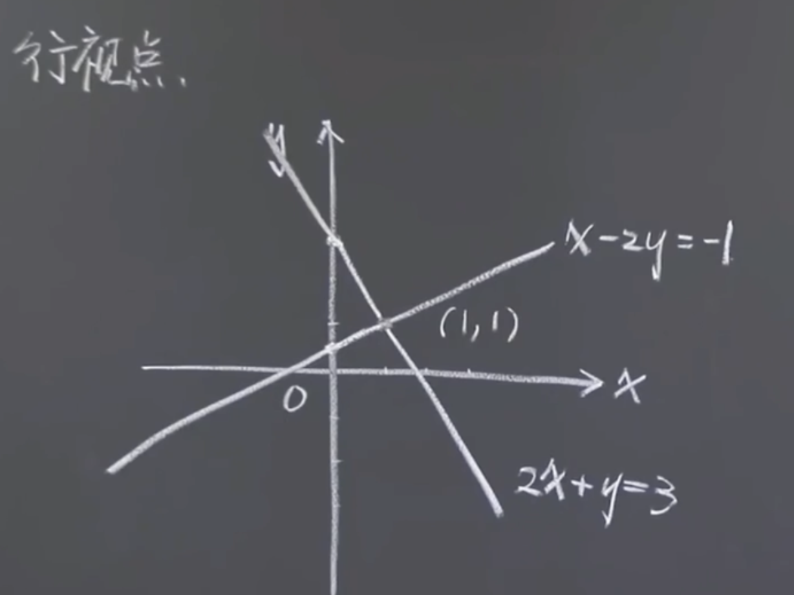
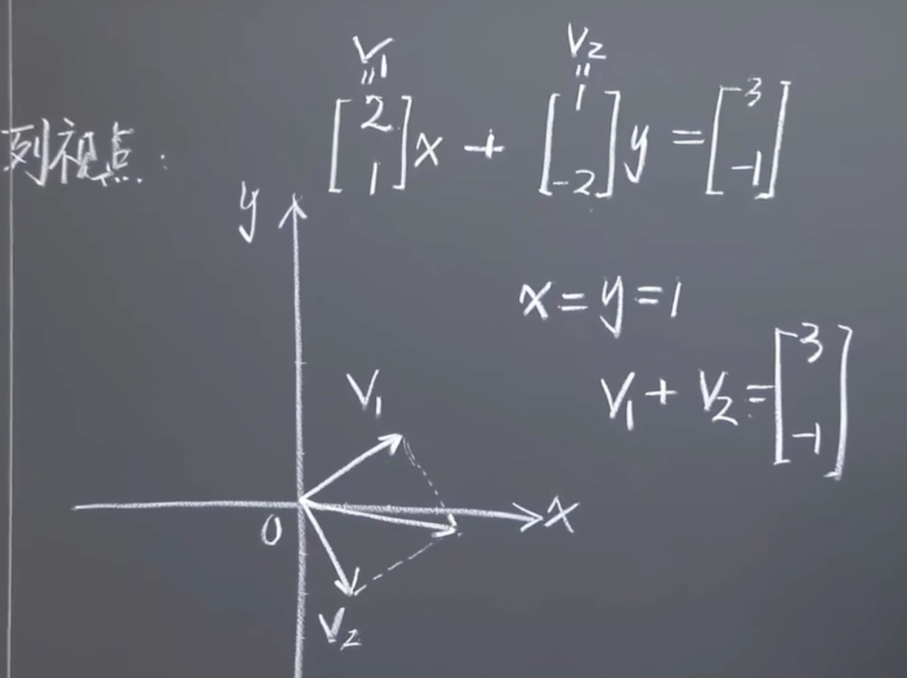
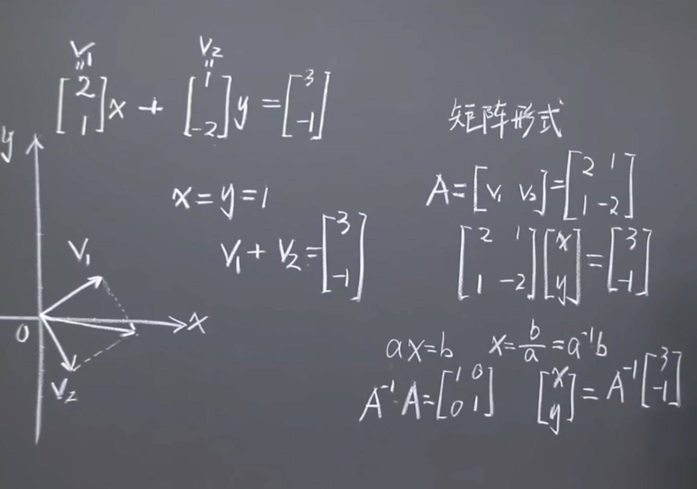

求解
$$
\left\{\begin{matrix}
2x + y = 3  \\
x - 2y = -1  \\
\end{matrix}\right. 
$$

并画出“行视点”和“列视点”。

# 行视点
把两个方程分别当作两条直线，两线直线的交点即解。

# 列视点
把每个未知数的系数组合成一个列向量。
等号右边的值组合成常数列向量。
求解多元线性方程组就是把系数组成的列向量组合成常数列向量。

# 矩阵形式

