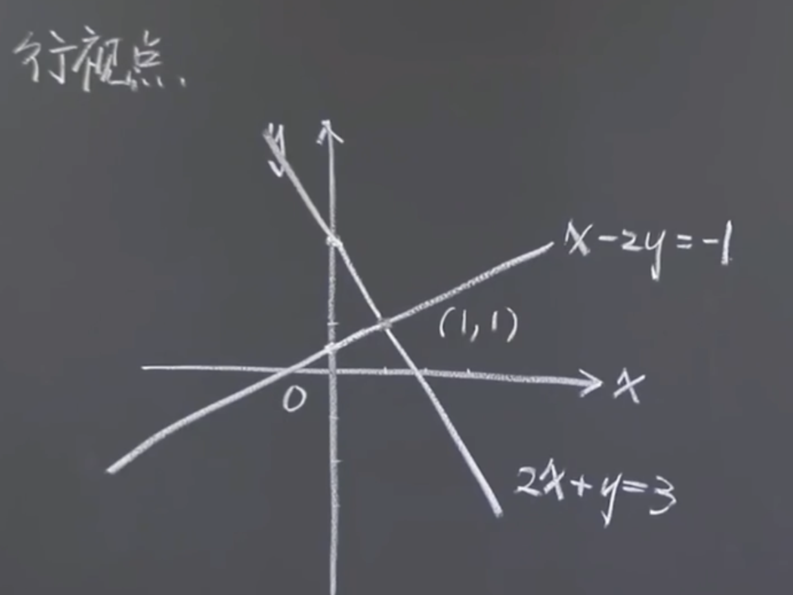

18.06SC, Fall 2011

Linear Algebra

Linan Chen, Teaching Assistant

Geometry of Linear Algebra
______


Solve 求解
$$
\left\{\begin{matrix}
2x + y = 3  \\
x - 2y = -1  \\
\end{matrix}\right. 
$$
and find out its "row picture" and "column picture" 并画出“行视点”和“列视点”。

# Row Picture 行视点
把两个方程分别当作两条直线，两线直线的交点即解。


# Column Picture 列视点
把每个未知数的系数组合成一个列向量。
等号右边的值组合成常数列向量。
求解多元线性方程组就是把系数组成的列向量组合成常数列向量。


# Matrix form 矩阵形式


```
sketch   /sketʃ/  n.&v.
1. to make a quick drawing of sb/sth画素描；画速写
[ VN ]
• He quickly sketched the view from the window.他很快勾勒出了窗外的风景。
[ alsoV ]
2. [ VN ] ~ sth (out)to give a general description of sth, giving only the basic facts概述；简述
SYN outline
• She sketched out her plan for tackling the problem.她简要叙述了解决问题的计划。


co·ord·in·ate /kəʊˈɔːdɪnət/ n.&v.
1. [ C ]either of two numbers or letters used to fix the position of a point on a map or graph坐标
• the x, y coordinates of any point on a line一条线上任意一点的x、y 坐标
2. coordinates[ pl. ] ( used in shops/stores etc.商店等用 ) pieces of clothing that can be worn together because, for example, the colours look good together（颜色协调的）配套服装，套装

co·ef·fi·cient n.   /ˌkəʊɪˈfɪʃnt/ 
1. ( mathematics 数 )a number which is placed before another quantity and which multiplies it, for example 3 in the quantity 3x系数
2. ( physics 物 )a number that measures a particular property (= characteristic) of a substance（测定物质某种特性的）系数
• the coefficient of friction摩擦系数
```