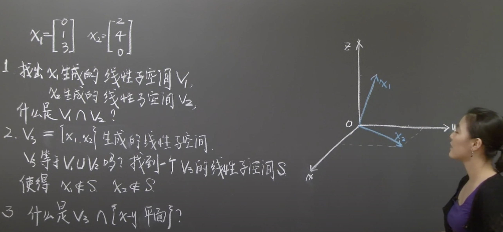
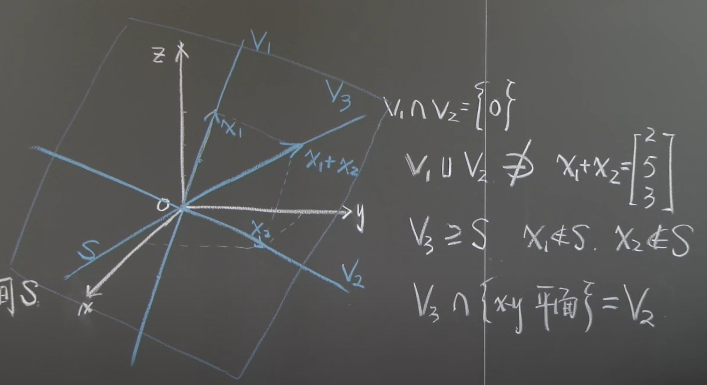

# 线性空间 & 线性子空间

概念：在讨论一个空间时，实际是讨论的一个集合，集合里有很多元素。
要成为一个线性空间，这些元素要满足两个条件：
1. 对空间中任何一个元素乘以一个常数，仍然在此空间中。
2. 两个元素求和，仍然在此空间中。

如果在这个集合中找到一个子集，在这个子集中这两个条件仍然成立的话，这个子集就称为该线性空间的一个线性子空间。

1. $\overrightarrow{v_1} \cap \overrightarrow{v_2} = {0}$
2. 是的。但是v1+v2并不在v1并v2空间里。
3. v3子空间与z=0平面相交的直线。其实这里就是v2。

