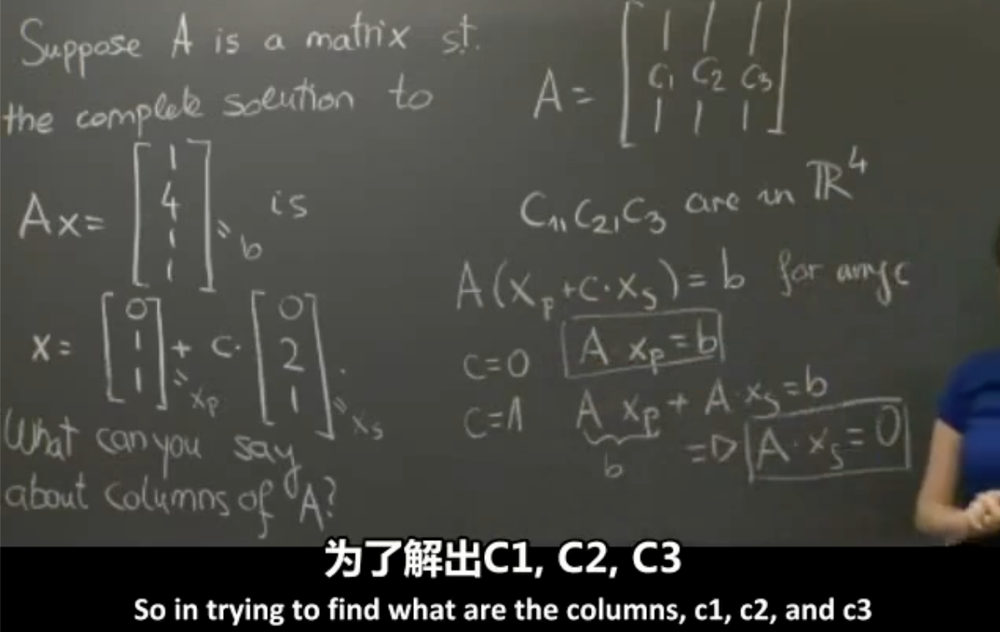
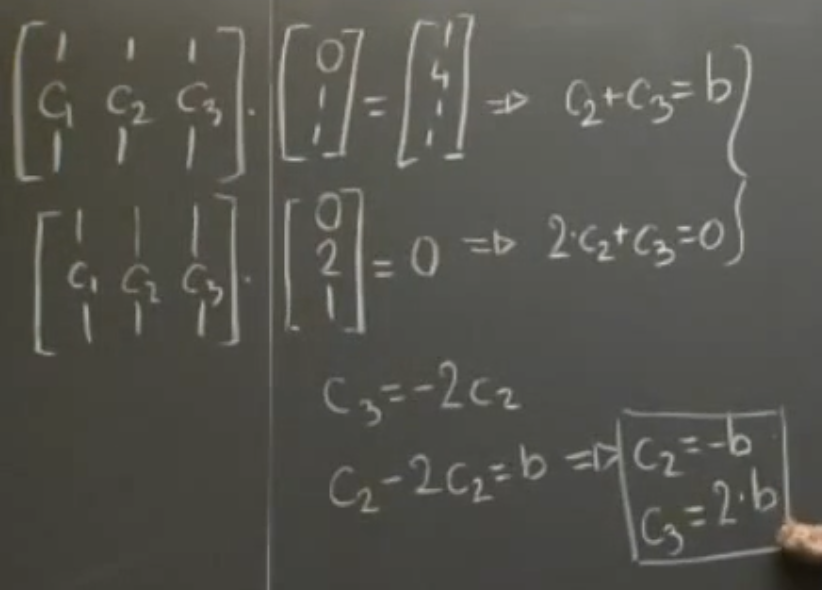
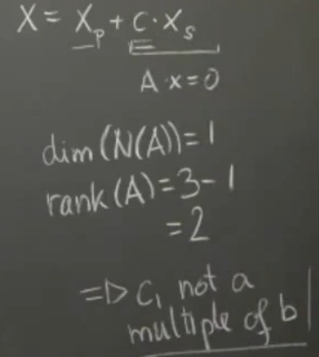

18.06SC, Fall 2011

Linear Algebra

Martina Balagovic, Teaching Assistant

An Overview Of Key Ideas
______

Suppose A is a matrix 
the complete solution to 
$$
Ax=
\begin{bmatrix}
1 \\
4 \\
1 \\
1 \\
\end{bmatrix}
=b
\\
x=
\begin{bmatrix}
0 \\
1 \\
1 \\
\end{bmatrix}
+
c
\begin{bmatrix}
0 \\
2 \\
1 \\
\end{bmatrix}
$$

What can you say about columns of A ?

