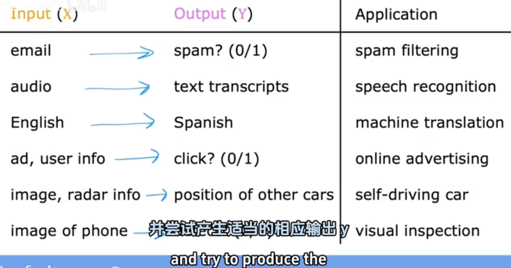
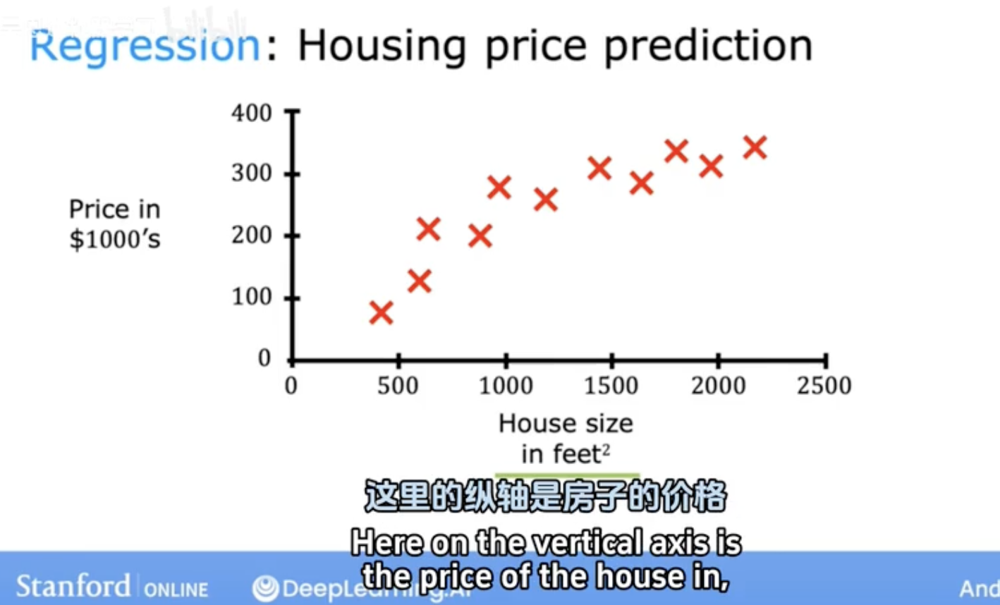
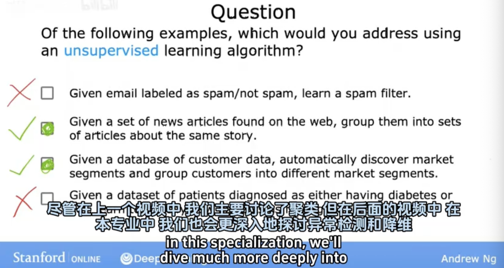

Machine Learning Overview
______

## 2.1 What is machine learning ?

"Field of study that gives computers the ability to learn without being explicitly programmed." (Arthur Samuel, 1959)

Question
- If the checkers program had been allowed to play only ten games (instead of tens of thousands) against itself, a much smaller number of games, how would this have affected its performance ?
  - Would have made it better
  - Would have made it worse

Machine Learning algorithms
- Supervised learning
- Unsupervised learning
- Reinforcement learning
- practical advice for applying learning algorithms

## 2.2 Supervised Learning Part 1

Regression: Housing price prediction

## 2.3 Supervised Learning Part 2

Classification: Breast cancer detection

Classification:
- predict categories
- small number of possible output

Supervised learning: learns from being given "right answers"
- Regression
  - Predict a number
  - infinitely many possible outputs
- Classification
  - predict categories
  - small number of possible output

## 2.4 Unsupervised Learning Part 1

Unsupervised learning: find something interesting in unlabeled data.

Clustering: Google news/Grouping customers/

## 2.5 Unsupervised Learning Part 2

- Clustering
  - Group similar data points together.
- Anomaly detection
  - Find unusual data points
- Dimensionality reduction
  - compress data using fewer numbers

Question

## 2.6 Jupyter Notebooks

