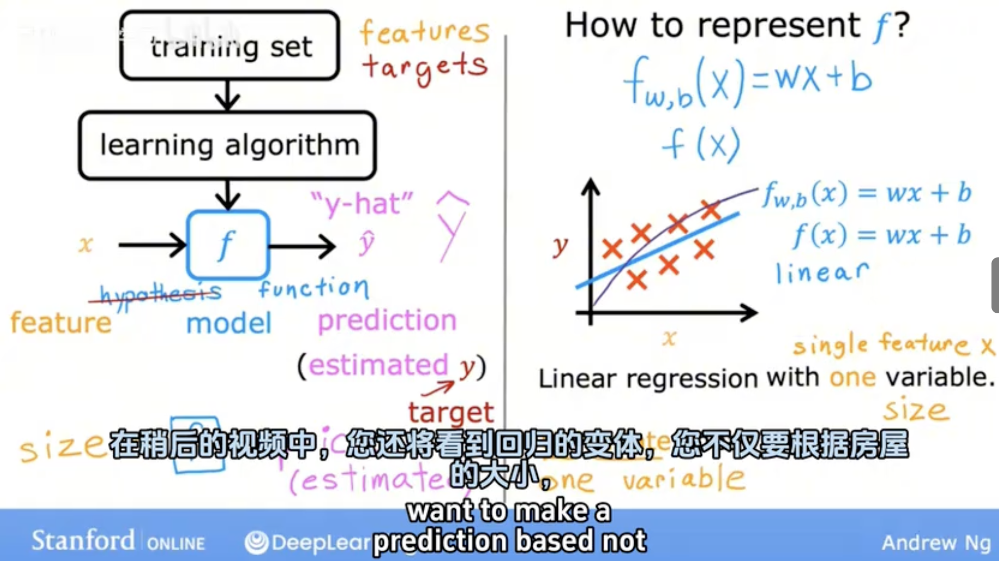
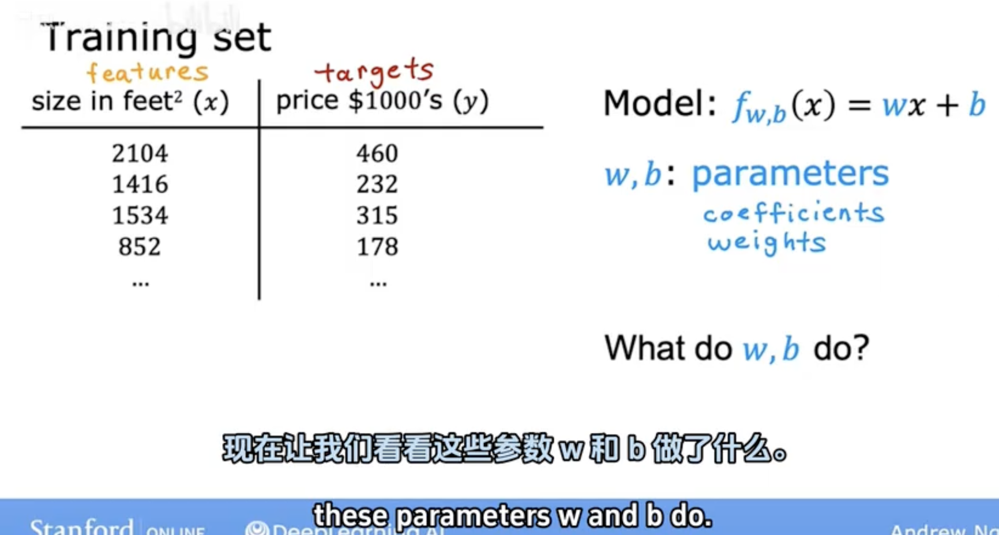
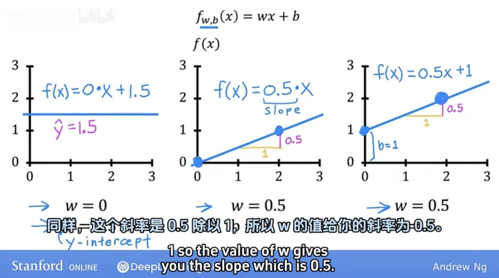
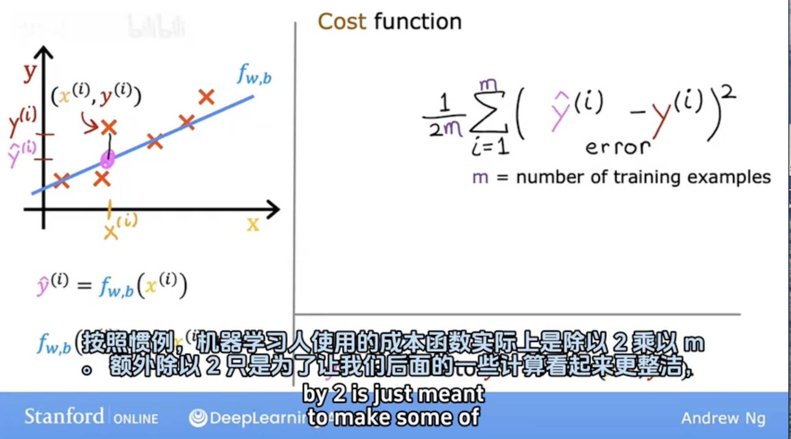
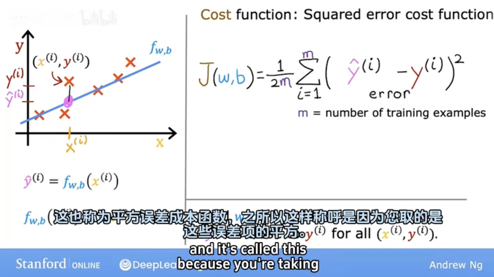
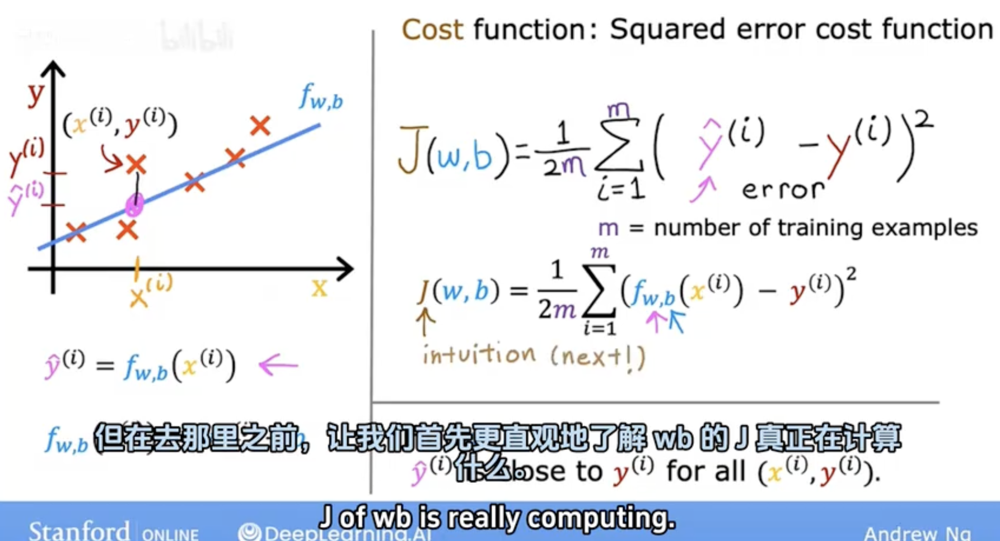
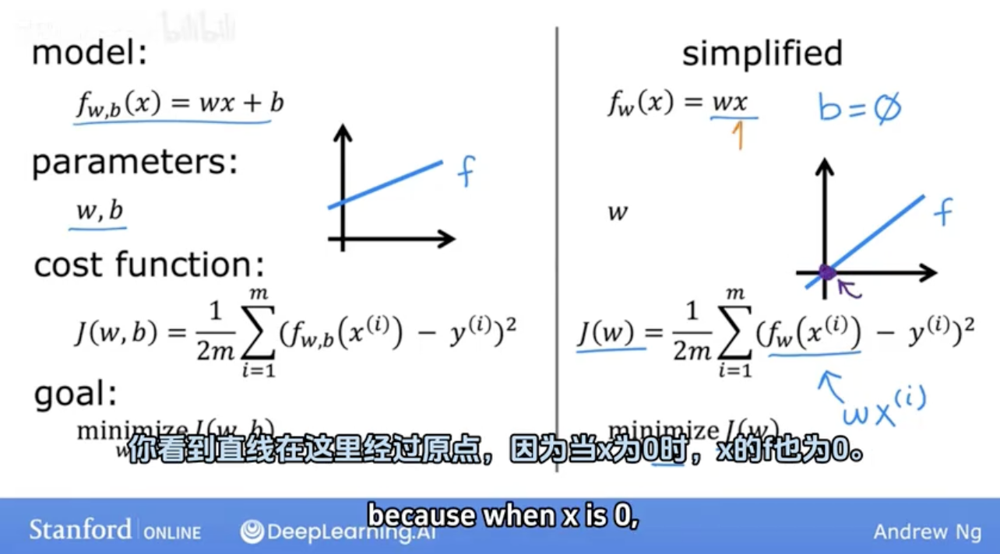
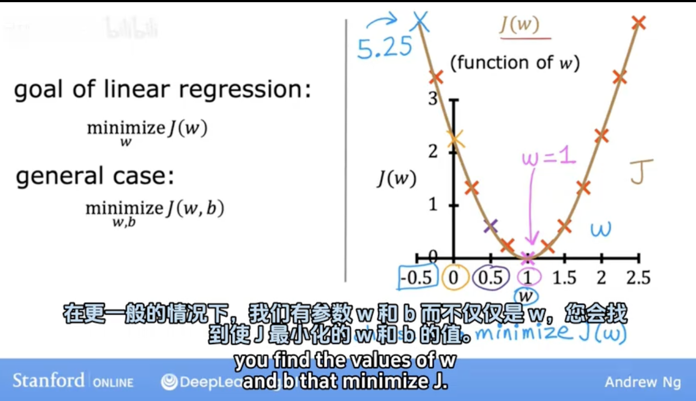

## 3.1 线性回归模型 Part 1

Terminology
- $x$ = "input" variable feature
- $y$ = "output" variable ("target" variable)
- $m$ = number of training examples
- $(x,y)$ = single training example
- $(x^i,y^i)$ = $i^{th}$ training example

## 3.2 线性回归模型 Part 2

- training set
  - features
  - targets
- learning algorithm
- $function$
  - feature:    $x$
  - prediction: $\hat y$ (estimated y, target)
- How to represent $f$ ?

## 3.3 Cost Function 代价函数
Linear Regression with One Variable

## 3.4 Cost Function Intuition 代价函数的直观理解

- model
- parameters
- cost function
- goal

## 3.5 Visualizing the cost function 可视化代价函数

## 3.6 可视化的例子

