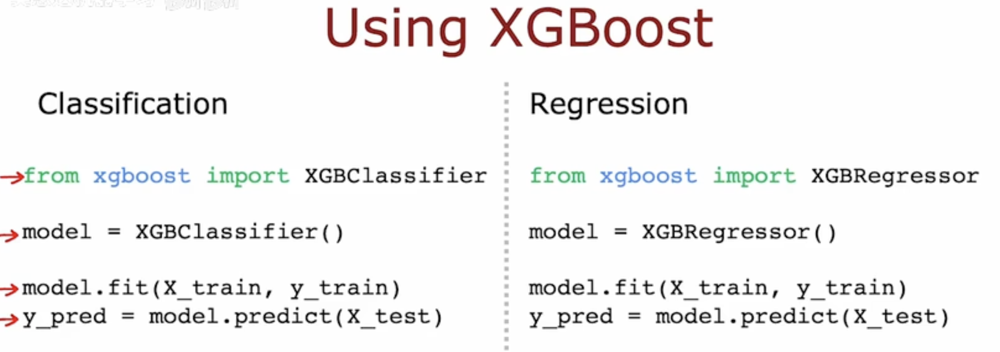

# Boosted trees intuition
增强树直觉

Given training set of size $m$
```
For $b=1$ to $B$
    Use sampling with replacement to create a new training set of size $m$
        But instead of picking from all examples with equal (1/m) probability, make it more likely to pick examples that the previously trained trees misclassify.
        但不是以相等（1/m）的概率从所有例子中进行选择，而是更有可能选择先前训练的树错误分类的例子。
    Train a decision tree on the new dataset.
```

# XGBoost (eXtreme Gradient Boosting)
- Open source implementation of boosted trees
- Fast efficient implementation
- Good choice of default splitting criteria and criteria for when to stop splitting
- Built in regularization to prevent overfitting
- Highly competitive algorithm for machine learning competitions (eg: Kaggle competitions)





de·lib·er·ate /dɪˈlɪbərət/  adj. 
1. done on purpose rather than by accident故意的；蓄意的；存心的
SYNintentionalplanned
• a deliberate act of vandalism故意毁坏的行为
• The speech was a deliberate attempt to embarrass the government.这一发言蓄意使政府难堪。
OPP unintentional
2. ( of a movement or an action动作或行为 ) done slowly and carefully不慌不忙的；小心翼翼的；从容不迫的
• She spoke in a slow and deliberate way.她说话慢条斯理不慌不忙。


de·lib·er·ate /dɪˈlɪbəreɪt/ v.
/dɪˈlɪbəreɪt/ to think very carefully about sth, usually before making a decision仔细考虑；深思熟虑；反复思考
[ V ]
• The jury deliberated for five days before finding him guilty.陪审团认真讨论了五天才裁定他有罪。
• They deliberated on whether to continue with the talks.他们仔细考虑了是否继续谈判的问题。