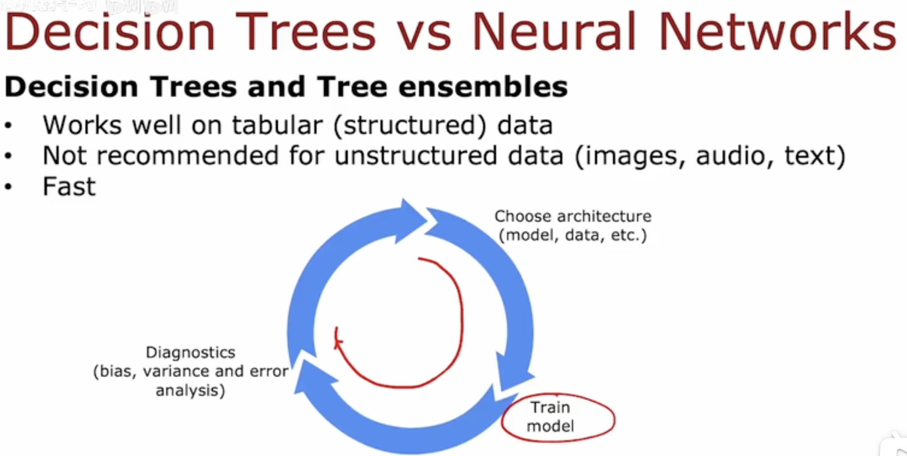

Conclusion

When to use decision trees?

_____

# Decision Trees vs Neural Networks

- Decision Trees and ensemble trees
  - works well on tabular (structured) data
  - not recommended for unstructured data(images, audio, text)
  - Fast
  - Small decision trees may be human interpretable.
- Neural network
  - Works well on all types of data, including tabular and unstructured data
  - May be slower than a decision tree
  - Works well transfer learning
  - When building a system of multiple models working together, it might be easier to string together multiple neural network.

