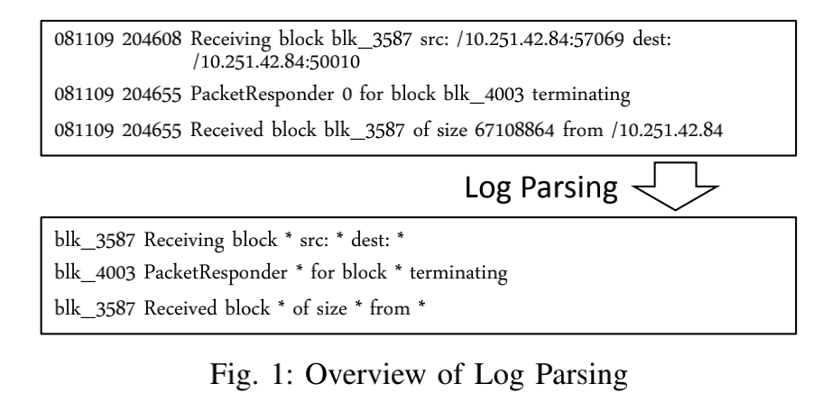
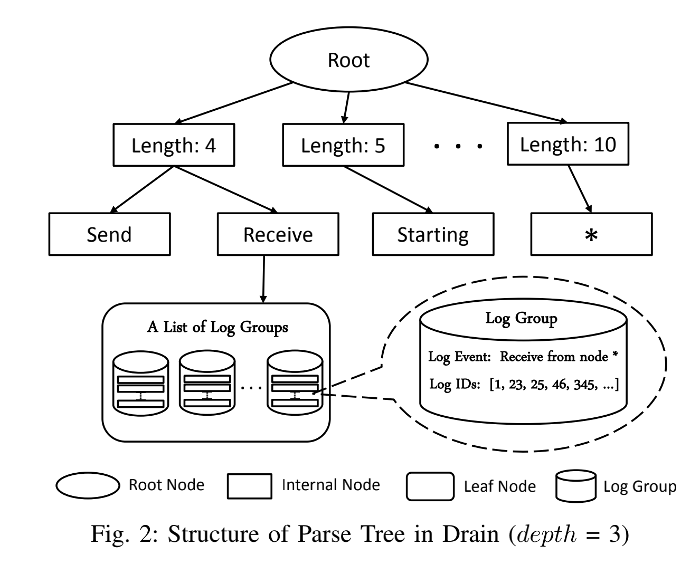

Drain: An Online Log Parsing Approach with Fixed Depth Tree

Drain：一种固定深度树的在线日志解析方法

_____

# 0 摘要 Abstract
Logs, which record valuable system runtime information, have been widely employed in Web service management by service providers and users. A typical log analysis based Web service management procedure is to first parse raw log messages because of their unstructured format; and then apply data mining models to extract critical system behavior information, which can assist Web service management. Most of the existing log parsing methods focus on offline, batch processing of logs. However, as the volume of logs increases rapidly, model training of offline log parsing methods, which employs all existing logs after log collection, becomes time consuming. To address this problem, we propose an online log parsing method, namely Drain, that can parse logs in a streaming and timely manner. To accelerate the parsing process, Drain uses a fixed depth parse tree, which encodes specially designed rules for parsing. We evaluate Drain on five real-world log data sets with more than 10 million raw log messages. The experimental results show that Drain has the highest accuracy on four data sets, and comparable accuracy on the remaining one. Besides, Drain obtains 51.85%∼81.47% improvement in running time compared with the state-of-the-art online parser. We also conduct a case study on an anomaly detection task using Drain in the parsing step, which determines the effectiveness of Drain in log analysis.

日志记录了有价值的系统运行时信息,已被服务提供者和用户广泛应用于Web服务管理中。一个典型的基于日志分析的 Web 服务管理过程是（1）首先解析原始日志消息，因为它们的格式是非结构化的；（2）然后应用数据挖掘模型提取关键系统行为信息，辅助Web服务管理。现有的日志解析方法大多侧重于日志的离线、批处理。然而，随着日志量的快速增长，离线日志解析方法的模型训练，即在日志收集后使用所有现有日志，变得非常耗时。针对这个问题，我们提出了一种在线日志解析方法，即 Drain，可以流式、及时地解析日志。为了加速解析过程，Drain 使用了一个固定深度的解析树，它编码了专门设计的解析规则。我们在包含超过 1000 万条原始日志消息的五个真实日志数据集上评估 Drain。实验结果表明，Drain 在四个数据集上的准确率最高，在其余一个数据集上的准确率相当。此外，与最先进的在线解析器相比，Drain 的运行时间提高了 51.85%~81.47%。我们还对在解析步骤中使用 Drain 的异常检测任务进行了案例研究，这决定了 Drain 在日志分析中的有效性。

## 关键字 Index Terms
Log parsing; Online algorithm; Log analysis; Web service management;

日志解析； 在线算法； 日志分析； 网络服务管理；


# 1 介绍

The prevalence of cloud computing, which enables on-demand service delivery, has made Service-oriented Architecture (SOA) a dominant architectural style. Nowadays, more and more developers leverage existing Web services to build their own systems because of their rich functionality and “plug-and-play” property. Although developing Web service based system is convenient and lightweight, Web service management is a significant challenge for both service providers and users. Specifically, service providers (e.g., Amazon EC2 [1]) are expected to provide services with no failures or SLA (service-level agreement) violations to a large number of users. Similarly, service users need to effectively and efficiently manage the adopted services, which have been discussed in many recent works (e.g., Web service monitoring [2]). In this context, log analysis based service management techniques, which employ service logs to achieve automatic or semiautomatic service management, have been widely studied.

支持按需服务交付的云计算的盛行使面向服务的架构 (SOA) 成为主导的架构风格。如今，由于其丰富的功能和“即插即用”特性，越来越多的开发人员利用现有的 Web 服务来构建自己的系统。尽管开发基于Web 服务的系统既方便又轻量，但Web 服务管理对服务提供者和用户来说都是一项重大挑战。具体来说，服务提供商（例如，Amazon EC2 [1]）应向大量用户提供没有故障或违反 SLA（服务级别协议）的服务。同样，服务用户需要有效和高效地管理所采用的服务，这在最近的许多工作（例如，Web 服务监控 [2]）中已经讨论过。
**在此背景下，基于日志分析的服务管理技术，即利用服务日志实现自动或半自动服务管理的技术得到了广泛的研究。**


Logs are usually the only data resource available that records service runtime information. In general, a log message is a line of text printed by logging statements (e.g., printf(), logging.info()) written by developers. Thus, log analysis techniques, which apply data mining models to get insights of system behaviors, are in widespread use for service management. For service providers, there are studies in anomaly detection [3], [4], fault diagnosis [5], [6] and performance improvement [7]. For service users, typical examples include business model mining [8], [9] and user behavior analysis [10], [11].

**日志通常是记录服务运行时信息的唯一可用数据资源。**
 通常，日志消息是由开发人员编写的日志语句（例如 printf()、logging.info()）打印的一行文本。 因此，应用数据挖掘模型来深入了解系统行为的日志分析技术广泛用于服务管理。 对于服务提供商，有异常检测[3]、[4]、故障诊断[5]、[6]和性能改进[7]方面的研究。 对于服务用户，典型的例子包括商业模型挖掘[8]、[9]和用户行为分析[10]、[11]。

Most of the data mining models used in these log analysis techniques require structured input (e.g., an event list or a matrix). However, raw log messages are usually unstructured, because developers are allowed to write free-text log messages in source code. Thus, the first step of log analysis is log parsing, where unstructured log messages are transformed into structured events. An unstructured log message, as in the following example, usually contains various forms of system runtime information: timestamp (records the occurring time of an event), verbosity level (indicate the severity level of an event, e.g., INFO), and raw message content (free-text description of a service operation).

这些日志分析技术中使用的大多数数据挖掘模型都需要结构化输入（例如，事件列表或矩阵）。 但是，原始日志消息通常是非结构化的，因为允许开发人员在源代码中编写自由文本日志消息。 
因此，**日志分析的第一步是日志解析，将非结构化日志消息转换为结构化事件。**
如下例所示，非结构化日志消息通常包含各种形式的系统运行时信息：时间戳（记录事件的发生时间）、详细级别（表示事件的严重级别，例如 INFO）和原始消息 内容（服务操作的自由文本描述）。

```
081109 204655 556 INFO dfs.DataNode$PacketResponder: Received block blk_3587508140051953248 of size 67 108864 from /10.251.42.84
```


Traditionally, log parsing relies heavily on regular expressions [12], which are designed and maintained manually by developers. However, this manual method is not suitable for logs generated by modern services for the following three reasons. First, the volume of logs is increasing rapidly, which makes the manual method prohibitive. For example, a largescale service system can generate 50 GB logs (120∼200 million lines) per hour [13]. Second, as open-source platforms (e.g., Github) and Web service become popular, a system often consists of components written by hundreds of developers globally [3]. Thus, people in charge of the regular expressions may not know the original logging purpose, which makes manual management even harder. Third, logging statements in modern systems updates frequently (e.g., hundreds of new logging statements every month [14]). In order to maintain a correct regular expression set, developers need to check all logging statements regularly, which is tedious and error-prone.

**传统上，日志解析严重依赖于正则表达式 [12]，这些正则表达式由开发人员手动设计和维护。但是，这种手动方式不适用于现代服务生成的日志，原因有以下三个。**
首先，日志量在快速增长，这使得手动方法望而却步。例如，一个大型服务系统每小时可以生成 50 GB 的日志（120∼2 亿行）[13]。
其次，随着开源平台（例如 Github）和 Web 服务变得流行，一个系统通常由全球数百名开发人员编写的组件组成 [3]。因此，负责正则表达式的人可能不知道最初的日志记录目的，这使得手动管理更加困难。
第三，现代系统中的日志语句更新频繁（例如，每月有数百条新的日志语句 [14]）。为了维护正确的正则表达式集，开发人员需要定期检查所有的日志记录语句，既繁琐又容易出错。


Log parsing is widely studied to parse the raw log messages automatically. Most of existing log parsers focus on offline, batch processing. For example, Xu et al. [3] design a method to automatically generate regular expressions based on source code. However, source code is often inaccessible in practice (e.g., Web service components). For general log parsing, recent studies propose data-driven methods [4], [15], which directly extract log templates from raw log messages. These log parsers are offline, and limited by the memory of a single computer. Besides, they fail to align with the log collecting manner. A typical log collection system has a log shipper installed on each node to forward log entries in a streaming manner to a centralized server that contains a log parser [16]. The offline log parsers need to employ all logs after log collection for a certain period (e.g., 1h) for the parser training. In contrast, an online log parser parses logs in a streaming manner, and it does not require an offline training step. Thus, current systems highly demand online log parsing, which is only studied in a few preliminary works [16], [17]. However, we observe that the parsers proposed in these works are not accurate and efficient enough, which make them not eligible for log parsing in modern Web service or Web service based systems.


日志解析被广泛研究以自动解析原始日志消息。大多数现有的日志解析器都专注于离线、批处理。
例如，徐等人[3]设计了一种基于源代码自动生成正则表达式的方法。然而，源代码在实践中通常是不可访问的（例如，Web 服务组件）。
对于一般的日志解析，最近的研究提出了数据驱动的方法 [4]、[15]，它们直接从原始日志消息中提取日志模板。这些日志解析器是离线的，并且受单台计算机内存的限制。此外，它们与日志收集方式不一致。典型的日志收集系统在每个节点上安装了一个日志传送器，以流式方式将日志条目转发到包含日志解析器的集中式服务器 [16]。离线日志解析器需要使用日志收集一段时间（例如，1h）后的所有日志进行解析器训练。
相比之下，在线日志解析器以流式方式解析日志，并且不需要离线训练步骤。因此，当前系统对在线日志解析的要求很高，这仅在少数初步工作中进行了研究[16]，[17]。然而，我们观察到这些作品中提出的解析器不够准确和高效，这使得它们不适合在现代 Web 服务或基于 Web 服务的系统中进行日志解析。


In this paper, we propose an online log parsing method, namely Drain, that can accurately and efficiently parse raw log messages in a streaming manner. Drain does not require source code or any information other than raw log messages.Drain can automatically extract log templates from raw log messages and split them into disjoint log groups. It employs a parse tree with fixed depth to guide the log group search process, which effectively avoids constructing a very deep and unbalanced tree. Besides, specially designed parsing rules are compactly encoded in the parse tree nodes. We evaluate Drain on five real-world log data sets with more than 10 million raw log messages. Drain demonstrates the highest accuracy on four data sets, and comparable accuracy on the remaining one. Besides, Drain obtains 51.8%∼81.47% improvement in running time compared with the state-of-the-art online parser [16]. We also demonstrate the effectiveness of Drain in log analysis by tackling a real-world anomaly detection task [3].

在本文中，我们提出了一种在线日志解析方法，即 Drain，它可以以流的方式准确高效地解析原始日志消息。 Drain 不需要源代码或除原始日志消息以外的任何信息。Drain 可以自动从原始日志消息中提取日志模板并将它们拆分为不相交的日志组。它采用固定深度的解析树来指导日志组搜索过程，有效避免了构建非常深且不平衡的树。此外，专门设计的解析规则被紧凑地编码在解析树节点中。我们在包含超过 1000 万条原始日志消息的五个真实日志数据集上评估 Drain。 Drain 在四个数据集上展示了最高的准确度，而在其余数据集上展示了相当的准确度。此外，与最先进的在线解析器[16]相比，Drain 的运行时间提高了 51.8%~81.47%。我们还通过处理现实世界的异常检测任务 [3]，证明了 Drain 在日志分析中的有效性。

In summary, our paper makes the following contributions:
* This paper presents the design of an online log parsing method (Drain), which encodes specially designed parsing rules in a parse tree with fixed depth.
* Extensive experiments have been conducted on five real-world log data sets, which determine the superiority of Drain in terms of accuracy and efficiency.
* The source code of Drain has been publicly released [18], allowing for easy use by researchers and practitioners for future study.

The remainder of this paper is organized as follows. Section II presents the overview of log parsing process. Section III describes our online log parsing method, Drain. We evaluate the performance of Drain in Section IV. Related work is introduced in Section V. Finally, we conclude this paper in Section VI.


总之，我们的论文做出了以下贡献：
* 本文介绍了一种在线日志解析方法（Drain）的设计，该方法将专门设计的解析规则编码在具有固定深度的解析树中。
* 对五个真实世界的日志数据集进行了广泛的实验，确定了 Drain 在准确性和效率方面的优势。
* Drain 的源代码已公开发布[18]，方便研究人员和从业人员使用，以备将来研究之用。

本文的其余部分安排如下。 第二节介绍了日志解析过程的概述。 第三节描述了我们的在线日志解析方法，Drain。 我们在第四节评估 Drain 的性能。 第五节介绍了相关工作。最后，我们在第六节总结了本文。


# 2 日志解析概述

The goal of log parsing is to transform raw log messages into structured log messages, as described in Figure 1. Specifically, raw log messages are unstructured data, including timestamps and raw message contents. The raw log messages in Figure 1 are simplified HDFS raw log messages collected on the Amazon EC2 platform [3]. In the parsing process, a parser distinguishes between the constant part and variable part of each raw log message. The constant part is tokens that describe a system operation template (i.e., log event), such as “Receiving block * src: * dest: *” in Figure 1; while the variable part is the remaining tokens (e.g, “blk 3587”) that carry dynamic runtime system information. A typical structured log message contains a matched log event and fields of interest (e.g, the HDFS block ID “blk 3587”). Typical log parsers [4], [15], [16], [17] regard log parsing as a clustering problem, where they cluster raw log messages with the same log event into a log group. The following section introduces our proposed log parser, which clusters the raw log messages into different log groups in a streaming manner.

日志解析的目标是将原始日志消息转换为结构化日志消息，如图 1 所示。具体而言，原始日志消息是非结构化数据，包括时间戳和原始消息内容。图 1 中的原始日志消息是在 Amazon EC2 平台 [3] 上收集的简化的 HDFS 原始日志消息。在解析过程中，解析器区分每个原始日志消息的常量部分和变量部分。
**常量部分**是描述系统操作模板（即日志事件）的token，例如图1中的“Receiving block * src: * dest: *”；
而**可变部分**是携带动态运行时系统信息的剩余标记（例如，“blk 3587”）。
典型的结构化日志消息包含匹配的日志事件和感兴趣的字段（例如，HDFS 块 ID “blk 3587”）。典型的日志解析器 [4]、[15]、[16]、[17] 将日志解析视为一个集群问题，它们将具有相同日志事件的原始日志消息聚集到一个日志组中。以下部分介绍我们提出的日志解析器，它将原始日志消息以流式方式聚集到不同的日志组中。

解析前
```
081109 204608 Receiving block blk_3587 src: /10.251.42.84:57069 dest: /10.251.42.84:50010 
081109 204655 PacketResponder 0 for block blk_4003 terminating 
081109 204655 Received block blk_3587 of size 67108864 from /10.251.42.84
```
解析后：
```
blk_3587 Receiving block * src: * dest: * 
blk_4003 PacketResponder * for block * terminating 
blk_3587 Received block * of size * from *
```




# 3 方法

In this section, we briefly introduce Drain, a fixed **d**epth t**r**ee b**a**sed onl**i**ne log parsi**n**g method. When a new raw log message arrives, Drain will preprocess it by simple regular expressions based on domain knowledge. Then we search a log group (i.e., leaf node of the tree) by following the specially-designed rules encoded in the internal nodes of the tree. If a suitable log group is found, the log message will be matched with the log event stored in that log group. Otherwise, a new log group will be created based on the log message. In the following, we first introduce the structure of the fixed depth tree (i.e., parse tree). Then we explain how Drain parses raw log messages by searching the nodes of the parse tree.

本节我们简单介绍 Drain，一种基于固定深度树的在线日志解析方法（a fixed **d**epth t**r**ee b**a**sed onl**i**ne log parsi**n**g method）。 
(1) 当新的原始日志消息到达时，Drain 会根据领域知识通过简单的正则表达式对其进行预处理。 
(2) 然后我们通过遵循在树的内部节点中编码的特殊设计的规则来搜索日志组（即树的叶节点）。如果找到合适的日志组，则日志消息将与存储在该日志组中的日志事件匹配。 否则，将根据日志消息创建一个新的日志组。
下面，我们首先介绍固定深度树（即解析树）的结构。 然后我们解释 Drain 如何通过搜索解析树的节点来解析原始日志消息。

## 3.1  Overall Tree Structure

When a raw log message arrives, an online log parser needs to search the most suitable log group for it, or create a new log group. In this process, a simple solution is to compare the raw log message with log event stored in each log group one by one. However, this solution is very slow because the number of log groups increases rapidly in parsing. To accelerate this process, we design a parse tree with fixed depth to guide the log group search, which effectively bounds the number of log groups that a raw log message needs to compare with.

当原始日志消息到达时，在线日志解析器需要为其搜索最合适的日志组，或者创建一个新的日志组。 在这个过程中，一个简单的解决方案是将原始日志消息与存储在每个日志组中的日志事件一一进行比较。 但是，这种解决方案非常慢，因为日志组的数量在解析中迅速增加。 为了加速这个过程，我们设计了一个**固定深度的解析树**来指导日志组搜索，它有效地限制了原始日志消息需要比较的日志组的数量。



The parse tree is illustrated in Figure 2. The root node is in the top layer of the parse tree; the bottom layer contains the leaf nodes; other nodes in the tree are internal nodes. Root node and internal nodes encode specially-designed rules to guide the search process. They do not contain any log groups. Each path in the parse tree ends with a leaf node, which stores a list of log groups, and we only plot one leaf node here for simplicity. Each log group has two parts: log event and log IDs. Log event is the template that best describes the log messages in this group, which consists of the constant part of a log message. Log IDs records the IDs of log messages in this group. One special design of the parse tree is that the depth of all leaf nodes are the same and are fixed by a predefined parameter depth. For example, the depth of the leaf nodes in Figure 2 is fixed to 3. This parameter bounds the number of nodes Drain visits during the search process, which greatly improves its efficiency. Besides, to avoid tree branch explosion, we employ a parameter maxChild, which restricts the maximum number of children of a node. In the following, for clarity, we define an n-th layer node as a node whose depth is n. Besides, unless otherwise stated, we use the parse tree in Figure 2 as an example in following explanation.

解析树如图 2 所示。根节点位于解析树的顶层；底层包含叶节点；树中的其他节点是内部节点。
**根节点和内部节点编码专门设计的规则来指导搜索过程。它们不包含任何日志组。**
解析树中的每条路径都以一个叶子节点结束，该叶子节点存储了一个日志组列表，为了简单起见，我们在这里只绘制一个叶子节点。
每个日志组有两部分：**日志事件**和**日志 ID**。
* 日志事件是最能描述该组中的日志消息的模板，它由日志消息的常量部分组成。 
* Log IDs 记录了该组中日志消息的 ID。

解析树的一种特殊设计是所有叶节点的深度相同，并由预定义的参数深度（depth）固定。
比如图2中叶子节点的深度固定为3，这个参数限制了搜索过程中节点Drain访问的次数，大大提高了它的效率。
此外，为了避免树分支爆炸，我们使用了一个参数 maxChild，它限制了节点的最大子节点数。
下面，为了清楚起见，我们将第 n 层节点定义为深度为 n 的节点。
此外，除非另有说明，我们以图 2 中的解析树为例进行说明。

## 3.2 第一步：Preprocess by Domain Knowledge

According to our previous empirical study on existing log parsing methods [19], preprocessing can improve parsing accuracy. Thus, before employing the parse tree, we preprocess the raw log message when it arrives. Specifically, Drain allows users to provide simple regular expressions based on domain knowledge that represent commonly-used variables, such as IP address and block ID. Then Drain will remove the tokens matched from the raw log message by these regular expressions. For example, block IDs in Figure 1 will be removed by “blk [0-9]+”.

根据我们之前对现有日志解析方法的实证研究[19]，预处理可以提高解析精度。 
因此，在使用解析树之前，我们会在原始日志消息到达时对其进行预处理。 
具体来说，Drain 允许用户提供基于领域知识的简单正则表达式，这些表达式代表常用变量，例如 IP 地址和块 ID。
然后 Drain 将通过这些正则表达式从原始日志消息中删除匹配的令牌（token）。 
例如，图 1 中的块 ID 将被“blk [0-9]+”删除。


The regular expressions employed in this step are often very simple, because they are used to match tokens instead of log messages. Besides, a data set usually requires only a few such regular expressions. For example, the data sets used in our evaluation section require at most two such regular expressions.

此步骤中使用的正则表达式通常非常简单，因为它们用于匹配标记而不是日志消息。 
此外，一个数据集通常只需要几个这样的正则表达式。 
例如，我们评估部分中使用的数据集最多需要两个这样的正则表达式。

## 3.3 第二步：Search by Log Message Length

In this step and step 3, we explain how we traverse the parse tree according to the encoded rules and finally find a leaf node.

在这一步和第三步中，我们解释了我们如何根据编码规则遍历解析树，最终找到一个叶子节点。

Drain starts from the root node of the parse tree with the preprocessed log message. The 1-st layer nodes in the parse tree represent log groups whose log messages are of different log message lengths. By log message length, we mean the number of tokens in a log message. In this step, Drain selects a path to a 1-st layer node based on the log message length of the preprocessed log message. For example, for log message “Receive from node 4”, Drain traverse to the internal node “Length: 4” in Figure 2. This is based on the assumption that log messages with the same log event will probably have the same log message length. Although it is possible that log messages with the same log event have different log message lengths, it can be handled by simple postprocessing. Besides, our experiments in Section IV-B demonstrate the superiority of Drain in terms of parsing accuracy even without postprocessing.

Drain 从带有预处理日志消息的解析树的根节点开始。
解析树中的第 1 层节点表示日志组，其日志消息具有不同的日志消息长度。
日志消息长度是指日志消息中的令牌数。 
在此步骤中，Drain 根据预处理后的日志消息的日志消息长度选择到第 1 层节点的路径。 
例如，对于日志消息“Receive from node 4”，Drain 遍历到图 2 中的内部节点“Length: 4”。
【假设】这是基于具有相同日志事件的日志消息可能具有相同的日志消息长度的假设。
尽管具有相同日志事件的日志消息可能具有不同的日志消息长度，但可以通过简单的后处理来处理。
此外，我们在第 IV-B 节中的实验证明了即使没有后处理，Drain 在解析精度方面的优势。

## 3.4 第三步：Search by Preceding Tokens

In this step, Drain traverses from a 1-st layer node, which is searched in step 2, to a leaf node. This step is based on the assumption that tokens in the beginning positions of a log message are more likely to be constants. Specifically, Drain selects the next internal node by the tokens in the beginning positions of the log message. For example, for log message “Receive from node 4”, Drain traverses from 1-st layer node “Length: 4” to 2-nd layer node “Receive” because the token in the first position of the log message is “Receive”. Then Drain will traverse to the leaf node linked with internal node “Receive”, and go to step 4.

在此步骤中，Drain 从步骤 2 中搜索到的第 1 层节点遍历到叶节点。
【假设】此步骤基于日志消息开始位置中的标记更可能是常量的假设。
具体来说，**Drain 通过日志消息开始位置的标记来选择下一个内部节点**。
例如，对于日志消息“Receive from node 4”，Drain 从第一层节点“Length: 4”遍历到第二层节点“Receive”，因为日志消息的第一个位置的令牌是“Receive”。
然后 Drain 会遍历到与内部节点“Receive”链接的叶子节点，然后进行第 4 步。

The number of internal nodes that Drain traverses in this step is (depth − 2), where depth is the parse tree parameter restricting the depth of all leaf nodes. Thus, there are (depth−2) layers that encode the first (depth − 2) tokens in the log messages as search rules. In the example above, we use the parse tree in Figure 2 for simplicity, whose depth is 3, so we search by only the token in the first position. In practice, Drain can consider more preceding tokens with larger depth settings. Note that if `depth` is 2, Drain only considers the first layer used by step 2.

这一步 Drain 遍历的内部节点数为 `(depth − 2)`，其中 `depth` 是限制所有叶节点深度的解析树参数。
因此，有 `(depth-2)` 层将日志消息中的第一个 `(depth-2)` 标记编码为搜索规则。
在上面的示例中，为简单起见，我们使用图 2 中的解析树，其深度为 3，因此我们仅搜索第一个位置的标记。
在实践中，Drain 可以考虑更多具有更大深度设置的前面的令牌。
请注意，如果深度（depth）为 2，则 Drain 仅考虑步骤 2 使用的第一层。


In some cases, a log message may start with a parameter, for example, “120 bytes received”. These kinds of log messages can lead to branch explosion in the parse tree because each parameter (e.g., 120) will be encoded in an internal node. To avoid branch explosion, we only consider tokens that do not contain digits in this step. If a token contains digits, it will match a special internal node “*”. For example, for the log message above, Drain will traverse to the internal node “*” instead of “120”. Besides, we also define a parameter maxChild, which restricts the maximum number of children of a node. If a node already has maxChild children, any non-matched tokens will match the special internal node “*” among all its children.

在某些情况下，日志消息可能以参数开头，例如“120 bytes received”。
这些类型的日志消息可能导致解析树中的分支爆炸，因为每个参数（例如，120）都将被编码在一个内部节点中。
为了避免分支爆炸，我们在这一步只考虑不包含数字的标记。
如果令牌包含数字，它将匹配一个特殊的内部节点“*”。
例如，对于上面的日志消息，Drain 将遍历内部节点“*”而不是“120”。
此外，我们还定义了一个参数 `maxChild`，它限制了一个节点的最大子节点数。
如果一个节点已经有 maxChild 子节点，则任何不匹配的标记都将匹配其所有子节点中的特殊内部节点“*”。

## 3.5 Step 4: Search by Token Similarity

Before this step, Drain has traversed to a leaf node, which contains a list of log groups. The log messages in these log groups comply with the rules encoded in the internal nodes along the path. For example, the log group in Figure 2 has log event “Receive from node *”, where the log messages contain 4 tokens and start with token “Receive”.

在这一步之前，Drain 已经遍历到一个叶子节点，其中包含一个日志组列表。 这些日志组中的日志消息符合路径上内部节点中编码的规则。 例如，图 2 中的日志组具有日志事件“Receive from node *”，其中日志消息包含 4 个令牌，并以令牌“Receive”开头。

In this step, Drain selects the most suitable log group from the log group list. We calculate the similarity simSeq between the log message and the log event of each log group. simSeq is defined as following:

在此步骤中，Drain 从日志组列表中选择最合适的日志组。 我们计算每个日志组的日志消息和日志事件之间的相似度 simSeq。 simSeq 定义如下：

$$
simSeq = \frac {\Sigma_{i=1}^n equ(seq_1(i), seq_2(i))} {n}
$$


where seq1 and seq2 represent the log message and the log event respectively; `seq(i)` is the `i-th` token of the sequence; `n` is the log message length of the sequences; function `equ` is defined as following:

其中 seq1 和 seq2 分别代表日志消息和日志事件； `seq(i)` 是序列的第 i 个标记； `n` 是序列的日志消息长度； 函数`equ`定义如下：

$$
equ(t_1, t_2) = \begin{cases}
1 & \text{ if } t_1=t_2 \\ 
0 & \text{ otherwise } 
\end{cases}
$$

where t1 and t2 are two tokens. After finding the log group with the largest `simSeq`, we compare it with a predefined similarity threshold st. If `simSeq ≥ st`, Drain returns the group as the most suitable log group. Otherwise, Drain returns a flag (e.g., None in Python) to indicate no suitable log group.

其中 t1 和 t2 是两个标记。 在找到具有最大 simSeq 的日志组后，我们将其与预定义的相似度阈值 st 进行比较。 如果 `simSeq ≥ st`，则 Drain 将该组作为最合适的日志组返回。 否则，Drain 会返回一个标志（例如 Python 中的 None）以指示没有合适的日志组。

## 3.6 Step 5: Update the Parse Tree

If a suitable log group is returned in step 4, Drain will add the log ID of the current log message to the log IDs in the returned log group. Besides, the log event in the returned log group will be updated. Specifically, Drain scans the tokens in the same position of the log message and the log event. If the two tokens are the same, we do not modify the token in that token position. Otherwise, we update the token in that token position by wildcard (i.e., *) in the log event.


如果第 4 步返回了合适的日志组，Drain 会将当前日志消息的日志 ID 添加到返回的日志组中的日志 ID 中。此外，返回的日志组中的日志事件将被更新。具体来说，Drain 会扫描日志消息和日志事件相同位置的令牌。如果两个token相同，我们不修改那个token位置的token。否则，我们在日志事件中通过通配符（即 *）更新该标记位置中的标记。

If Drain cannot find a suitable log group, it creates a new log group based on the current log message, where log IDs contains only the ID of the log message and log event is exactly the log message. Then, Drain will update the parse tree with the new log group. Intuitively, Drain traverses from the root node to a leaf node that should contain the new log group, and adds the missing internal nodes and leaf node accordingly along the path. For example, assume the current parse tree is the tree in the left-hand side of Figure 3, and a new log message “Receive 120 bytes” arrives. Then Drain will update the parse tree to the right-hand side tree in Figure 3. Note that the new internal node in the 3-rd layer is encoded as “*” because the token “120” contains digits.


如果 Drain 找不到合适的日志组，它会根据当前的日志消息创建一个新的日志组，其中 log IDs 仅包含日志消息的 ID，而 log event 正是该日志消息。然后，Drain 将使用新的日志组更新解析树。直观地说，Drain 从根节点遍历到应该包含新日志组的叶节点，并沿路径相应地添加缺失的内部节点和叶节点。例如，假设当前解析树是图 3 左侧的树，并且新的日志消息“Receive 120 bytes”到达。然后 Drain 会将解析树更新为图 3 中的右侧树。请注意，第 3 层中的新内部节点被编码为“*”，因为标记“120”包含数字。


