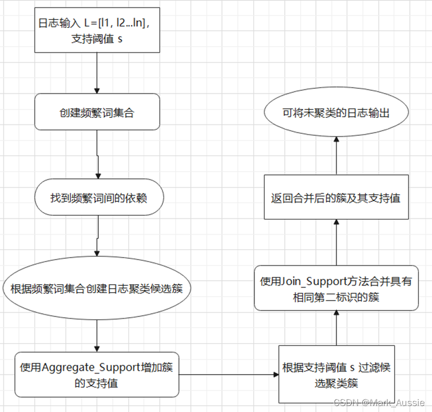

LogCluster - A Data Clustering and Pattern Mining Algorithm for Event Logs

LogCluster - 事件日志的数据聚类和模式挖掘算法

Risto Vaarandi and Mauno Pihelgas

TUT 数字取证和网络安全中心
塔林科技大学
爱沙尼亚塔林
______

# 0 概要
Abstract—Modern IT systems often produce large volumes of event logs, and event pattern discovery is an important log management task. For this purpose, data mining methods have been suggested in many previous works. In this paper, we present the LogCluster algorithm which implements data clustering and line pattern mining for textual event logs. The paper also describes an open source implementation of LogCluster.

Keywords—event log analysis; mining patterns from event logs; event log clustering; data clustering; data mining

摘要——现代 IT 系统通常会产生大量的事件日志，而事件模式发现是一项重要的日志管理任务。 为此，在许多以前的工作中已经提出了数据挖掘方法。 在本文中，我们提出了 LogCluster 算法，该算法实现了文本事件日志的数据聚类和线型挖掘。 该论文还描述了 LogCluster 的开源实现。

关键词——事件日志分析； 从事件日志中挖掘模式； 事件日志集群； 数据聚类； 数据挖掘

# 1 介绍

During the last decade, data centers and computer networks have grown significantly in processing power, size, and complexity. As a result, organizations commonly have to handle many gigabytes of log data on a daily basis. For example, in our recent paper we have described a security log management system which receives nearly 100 million events each day [1]. In order to ease the management of log data, many research papers have suggested the use of data mining methods for discovering event patterns from event logs [2–20]. This knowledge can be employed for many different purposes like the development of event correlation rules [12–16], detection of system faults and network anomalies [6–9, 19], visualization of relevant event patterns [17, 18], identification and reporting of network traffic patterns [4, 20], and automated building of IDS alarm classifiers [5].

在过去十年中，数据中心和计算机网络在处理能力、规模和复杂性方面都显着增长。 因此，组织通常必须每天处理数 GB 的日志数据。 例如，在我们最近的论文中，我们描述了一个安全日志管理系统，它每天接收近 1 亿个事件 [1]。 为了简化日志数据的管理，许多研究论文建议使用数据挖掘方法从事件日志中发现事件模式[2-20]。 这些知识可以用于许多不同的目的，例如开发事件关联规则 [12-16]、检测系统故障和网络异常 [6-9、19]、可视化相关事件模式 [17、18]、识别和 报告网络流量模式 [4, 20]，以及自动构建 IDS 警报分类器 [5]。

In order to analyze large amounts of textual log data without well-defined structure, several data mining methods have been proposed in the past which focus on the detection of line patterns from textual event logs. Suggested algorithms have been mostly based on data clustering approaches [2, 6, 7, 8, 10, 11]. The algorithms assume that each event is described by a single line in the event log, and each line pattern represents a group of similar events. 

为了分析大量没有明确结构的文本日志数据，过去已经提出了几种数据挖掘方法，这些方法侧重于从文本事件日志中检测线条模式。 建议的算法主要基于数据聚类方法 [2, 6, 7, 8, 10, 11]。 算法假设每个事件在事件日志中由一行描述，每个行模式代表一组相似的事件。


In this paper, we propose a novel data clustering algorithm called LogCluster which discovers both frequently occurring line patterns and outlier events from textual event logs. The remainder of this paper is organized as follows – section II provides an overview of related work, section III presents the LogCluster algorithm, section IV describes the LogCluster prototype implementation and experiments for evaluating its performance, and section V concludes the paper.

在本文中，我们提出了一种新的数据聚类算法，称为 LogCluster，它可以从文本事件日志中发现频繁出现的线条模式和异常事件。 本文的其余部分组织如下——第二部分概述了相关工作，第三部分介绍了 LogCluster 算法，第四部分描述了 LogCluster 原型实现和评估其性能的实验，第五部分总结了本文。


# 2 相关工作
## 2.1 SLCT

One of the earliest event log clustering algorithms is SLCT that is designed for mining line patterns and outlier events from textual event logs [2]. During the clustering process, SLCT assigns event log lines that fit the same pattern (e.g., Interface * down) to the same cluster, and all detected clusters are reported to the user as line patterns. For finding clusters in log data, the user has to supply the support threshold value s to SLCT which defines the minimum number of lines in each cluster. SLCT begins the clustering with a pass over the input data set, in order to identify frequent words which occur at least in s lines (word delimiter is customizable and defaults to whitespace). Also, each word is considered with its position in the line. For example, if s=2 and the data set contains the lines

最早的事件日志聚类算法之一是 SLCT，它设计用于从文本事件日志中挖掘行模式和异常事件 [2]。 在聚类过程中，SLCT 将符合相同模式（例如，Interface * down）的事件日志行分配给同一个类簇，并将所有检测到的类簇作为行模式报告给用户。 为了在日志数据中查找类簇，用户必须向 SLCT 提供支持阈值 s，SLCT 定义了每个类簇中的最小行数。 SLCT 通过对输入数据集的传递开始聚类，以识别至少在 s 行中出现的频繁单词（单词分隔符是可定制的，默认为空格）。 此外，每个单词都考虑其在行中的位置。 例如，如果 s=2 并且数据集包含行

Interface eth0 down
Interface eth1 down
Interface eth2 up


then words (Interface,1) and (down,3) occur in three and two lines, respectively, and are thus identified as frequent words. SLCT will then make another pass over the data set and create cluster candidates. When a line is processed during the data pass, all frequent words from the line are joined into a set which will act as a candidate for this line. After the data pass, candidates generated for at least s lines are reported as clusters together with their supports (occurrence times). Outliers are identified during an optional data pass and written to a user-specified file. For example, if s=2 then two cluster candidates {(Interface,1), (down,3)} and {(Interface,1)} are detected with supports 2 and 1, respectively. Thus, {(Interface,1), (down,3)} is the only cluster and is reported to the user as a line pattern Interface * down (since there is no word associated with the second position, an asterisk is printed for denoting a wildcard).Reported cluster covers the first two lines, while the line Interface eth2 up is considered an outlier.

（1）那么单词 (Interface,1) 和 (down,3) 分别出现在三行和两行中，因此被识别为频繁词。
（2）然后，SLCT 将再次遍历数据集并创建候选类簇。当在数据传递期间处理一行时，该行中的所有频繁词都被加入到一个集合中，该集合将作为该行的候选词。
（3）数据通过后，为至少 s 行生成的候选与它们的支持（出现次数）一起报告为类簇。在可选数据传递期间识别异常值并将其写入用户指定的文件。例如，如果 s=2，则检测到两个候选簇 {(Interface,1), (down,3)} 和 {(Interface,1)}，分别支持 2 和 1。因此，{(Interface,1), (down,3)} 是唯一的簇，并以行模式 Interface * down 的形式报告给用户（因为没有与第二个位置关联的单词，所以打印一个星号表示通配符）。报告的类簇覆盖了前两行，而 Interface eth2 up 行被认为是异常值。

SLCT has several shortcomings which have been pointed out in some recent works. Firstly, it is not able to detect wildcards after the last word in a line pattern [11]. For instance, if s=3 for three example lines above, the cluster {(Interface,1)} is reported to the user as a line pattern Interface, although most users would prefer the pattern Interface * *. Secondly, since word positions are encoded into words, the algorithm is sensitive to shifts in word positions and delimiter noise [8]. For instance, the line Interface HQ Link down would not be assigned to the cluster Interface * down, but would rather generate a separate cluster candidate. Finally, low support thresholds can lead to overfitting when larger clusters are split and resulting patterns are too specific [2].


SLCT 有几个缺点，在最近的一些工作中已经指出。 首先，它无法检测行模式中最后一个单词之后的通配符[11]。 例如，如果上面三个示例行的 s=3，集群 {(Interface,1)} 将作为行模式 Interface 报告给用户，尽管大多数用户更喜欢模板 Interface * *。 其次，由于单词位置被编码为单词，因此该算法对单词位置的变化和分隔符噪声很敏感[8]。 例如，Line Interface HQ Link down 不会分配给类簇 Interface * down，而是生成一个单独的类簇候选。 最后，当更大的集群被分割并且结果模式过于具体时，低支持阈值会导致过度拟合[2]。

自动日志解析，分配符合**相同模式**的事件日志行到相同簇中，所有检测的簇都被作为行模式。用户需要提供支持阈值 s 以便SLCT定义每个簇中**最少行数量**。在日志处理期间，所有来自日志的频繁词放入集合作为此日志的候选。

1. 建立单词字典，对所有日志建立包含单词频率和坐标的字典；
2. 建立日志簇；
3. 生成日志模板。

## 2.2 SLCT的修改版本
Reidemeister, Jiang, Munawar and Ward [6, 7, 8] developed a methodology that addresses some of the above shortcomings. The methodology uses event log mining techniques for diagnosing recurrent faults in software systems. First, a modified version of SLCT is used for mining line patterns from labeled event logs. In order to handle clustering errors caused by shifts in word positions and delimiter noise, line patterns from SLCT are clustered with a single-linkage clustering algorithm which employs a variant of the Levenshtein distance function. After that, a common line pattern description is established for each cluster of line patterns. According to [8], single-linkage clustering and post-processing its results add minimal runtime overhead to the clustering by SLCT. The final results are converted into bit vectors and used for building decision-tree classifiers, in order to identify recurrent faults in future event logs.


Reidemeister、Jiang、Munawar 和 Ward [6, 7, 8] 开发了一种方法来解决上述一些缺点。 该方法使用事件日志挖掘技术来诊断软件系统中的经常性故障。 首先，SLCT 的修改版本用于从标记的事件日志中挖掘行模式。 为了处理由单词位置偏移和分隔符噪声引起的聚类错误，来自 SLCT 的线条模式使用单链接聚类算法进行聚类，该算法采用 Levenshtein 距离函数的变体。 之后，为每个线型集群建立一个共同的线型描述。 根据[8]，单链接聚类和后处理其结果为 SLCT 的聚类增加了最小的运行时开销。 最终结果被转换为位向量并用于构建决策树分类器，以识别未来事件日志中的重复故障。

## 2.3 IPLoM
Another clustering algorithm that mines line patterns from event logs is IPLoM by Makanju, Zincir-Heywood and Milios [10, 11]. Unlike SLCT, IPLoM is a hierarchical clustering algorithm which starts with the entire event log as a single partition, and splits partitions iteratively during three steps. Like SLCT, IPLoM considers words with their positions in event log lines, and is therefore sensitive to shifts in word positions. During the first step, the initial partition is split by assigning lines with the same number of words to the same partition. During the second step, each partition is divided further by identifying the word position with the least number of unique words, and splitting the partition by assigning lines with the same word to the same partition. During the third step, partitions are split based on associations between word pairs. At the final stage of the algorithm, a line pattern is derived for each partition. Due to its hierarchical nature, IPLoM does not need the support threshold, but takes several other parameters (such as partition support threshold and cluster goodness threshold) which impose fine-grained control over splitting of partitions [11]. As argued in [11], one advantage of IPLoM over SLCT is its ability to detect line patterns with wildcard tails (e.g., Interface * *), and the author has reported higher precision and recall for IPLoM.

另一种从事件日志中挖掘线型的聚类算法是 Makanju、Zincir-Heywood 和 Milios [10, 11] 的 IPLoM。与 SLCT 不同，IPLoM 是一种层次聚类算法，它从整个事件日志作为单个分区开始，并在三个步骤中迭代地拆分分区。与 SLCT 一样，IPLoM 考虑单词及其在事件日志行中的位置，因此对单词位置的变化很敏感。在第一步中，通过将具有相同字数的行分配给同一分区来拆分初始分区。在第二步中，通过识别具有最少唯一词数的词位置来进一步划分每个分区，并通过将具有相同单词的行分配给同一分区来划分分区。在第三步中，根据词对之间的关​​联划分分区。在算法的最后阶段，为每个分区导出一个线型。由于其分层性质，IPLoM 不需要支持阈值，而是采用其他几个参数（例如分区支持阈值和集群良好度阈值），这些参数对分区的拆分进行了细粒度控制 [11]。正如 [11] 中所述，IPLoM 优于 SLCT 的一个优势是它能够检测带有通配符尾部的线条模式（例如，接口 * *），并且作者报告了 IPLoM 的更高精度和召回率。


# 3 LogCluster 算法
$L = [l_1, l_2, ..., l_n]$是文本事件日志，由 n 行组成，每行 $l_i (1<=i<=n)$ 是事件的完全表征，i 是行唯一标识；

每行 $l_i$ 是 k 个词的序列，$l_i = (w_{i,1}, w_{i,2}, ..., w_{i,k_i})$。

LogCluster 使用支持阈值 $s(1<=s<=n)$ 作为输入参数，将日志划分到 $C_1, C_2, ..., C_m$ 簇中，每簇至少 s 条日志，O是离群簇。

LogCluster 将日志聚类问题视作模式挖掘问题，每簇 $C_j$ 通过模式 $p_j$ 标识为唯一的，类簇内所有行与之匹配。
为检测簇，LogCluster 从日志中挖掘模式 $p_j$。
模式 $p_j$ 和簇 $C_j$ 的支持值定义为 $C_j$ 中日志的数量，每种模式由词（wrods）和通配符（wildcards）组成。
例如：通配符$*\{1, 3\}$ 表示匹配1到3个单词。


## 3.1 构建频繁词
为找到达到支持阈值的模式，每种模式的所有词至少要发生在 s 条事件日志中。

LogCluster 考虑日志中的每个词但是**不包括位置信息**。$I_w$ 是包含单词 w 的行标识的集合。如果 $I_w$ 大于等于阈值 s ，则 w 是频繁词，所有频繁词的集合使用 F 表示。

LogCluster 使用一个 h 大小的框架计数器。在预先处理事件日志时，每条事件日志行的去重词散列到 0 到 h-1 的整数，增加对应的计数数量。(构建词表，统计词频)。

设想的实现方式：每行日志分词后，词汇去重，统计所有词汇的词频，超过阈值 s 的为频繁词

## 3.2 生成候选簇
频繁词集合构建后，LogCluster 产生簇的候选。
对事件日志中的每行，LogCluster 从日志提取所有频繁词，将词处理为元组，保留原始行中原始位置，元组会作为候选簇的标识，所在行会被归为对应的候选。

如果给定的候选不存在，则初始化并将支持计数设为1，从行中创建其行模式。如果候选存在，其支持计数增加，行模式调整以覆盖当前行。

Log Cluster不记录分配给候选簇的日志。

举例：事件日志“Interface DMZ-link down at node router2”，频繁词是“Interface, down, at, node”，该行被分配给识别的候选元组(Interface, down, at, node)。如果候选不存在，则设置行模式初始化为“Interface *{1,1} down at node *{1,1}”，计数设为 1，通配符 *{1，1}可匹配任何单一词汇。如果下一行产生同样的候选标识“Interface HQ link down at node router2”，候选支持计数增加到 2。行模式设置为“Interface *{1,2} down at node *{1,1}”，为使模式匹配，至少一个但不超过2个在 interface和down之间。

设想的实现方式：根据每条日志中的频繁词(保持其原有词序)，将有相同频繁词的日志归并，并提取对应的模式，提取后模式数量小于 s 的模式删除，之后即可获得模式提取结果。

```c
Procedure : Generate_Candidates
Input   : event log L = {l1, l2, l3, ..., ln}     事件日志
        set of frequent words F                 频繁词
Output  : set of cluster candidates X


X := Null
for (id = 1; id <= n; ++id) do
    tuple := ()
    vars := ()
    i := 0; v := 0
    for each w in (w_{id,1},…,w_{id,kid}) do
        if (w \in F) then
            tuple[i] := w           # 第i个频繁词
            vars[i] := v            # 第i个频繁词前有几个非频繁词
            ++i; v := 0
        else
            ++v
        fi
    done

    vars[i] := v
    k := # of elements in tuple
    if (k > 0) then
        if (\exists Y \in X, Y.tuple == tuple) then
            # 此行的频繁词列表已经存在候选簇中，则支持度加一
            ++Y.support
            for (i := 0; i < k+1; ++i) do
                if (Y.varmin[i] > vars[i]) then
                    Y.varmin[i] := vars[i]
                fi
                if (Y.varmax[i] < vars[i]) then
                    Y.varmax[i] := vars[i]
                fi
            done
        else
            # 初始化候选簇
            initialize new candidate Y
            Y.tuple := tuple
            Y.support := 1
            for (i := 0; i < k+1; ++i) do
                Y.varmin[i] := vars[i]
                Y.varmax[i] := vars[i]
            done
            X := X $\cup$ { Y }
        fi
        Y.pattern = ()
        j: = 0
        for (i := 0; i < k; ++i) do
            if (Y.varmax[i] > 0) then
                min := Y.varmin[i]
                max := Y.varmax[i]
                Y.pattern[j] := “*{min,max}”
                ++j
            fi
            Y.pattern[j] := tuple[i]
            ++j
        done

        if (Y.varmax[k] > 0) then
            min := Y.varmin[k]
            max := Y.varmax[k]
            Y.pattern[j] := "*{min,max}"
        fi
    fi
    done
    return X
```


## 3.3 优化方法

通过所有数据完成簇候选构建后，LogCluster 将所有支持计数小于支持阈值 s 的候选排除，保留剩余的。
当模式挖掘使用较小的支持阈值执行时，LogCluster 与 SLCT 相似，倾向于过拟合，即较大的簇可能会被划分为较小的簇，有过于详细的行模式。

### 3.3.1 Aggregate_support
第一种减少过拟合的启发式策略叫 Aggregate_Support ，在候选簇生成后，簇选择前使用。这种启发涉及发现对每种候选有更详细行模式的候选，增加在给定候选中的支持。此种模式可以重叠。

例如，三个候选簇“User bob login from 10.1.1.1”, “User *{1,1} login from 10.1.1.1”, and“User *{1,1} login from *{1,1}”，支持度分别为 5，10，100，候选簇 “User *{1,1} login from *{1,1}”的支持度可合并为 115；Aggregate_Support 允许簇重合。

### 3.3.2 Join_Cluster
第二种启发称为 Join_Cluster，在簇已经从候选中选择后使用。$C_w$ 包含所有高频词共现的词汇。
$$
dep(w, w') = \frac {|I_w \cap I_{w'}|} {|I_w|}
$$
代表 w' 在含有 w 的日志行中发生的频繁度。换言之，$dep(w,w')$ 代表出现 $w$ 的日志里出现 $w'$ 的频率。

词 w' 在该模式中的权重计算公式：
$$
weights(w_i) = \frac {\Sigma_{j=1}^k dep(w_j, w_i)}  k
$$
直觉上说，在这个pattern中，这个词与其他词的相关性有多强。词的权重代表了词与模式中其他词之间关联的强度。

The Join_Clusters heuristic takes the user supplied word weight threshold t as its input parameter (0 < t ≤ 1). For each cluster, a secondary identifier is created and initialized to the cluster’s regular identifier tuple. Also, words with weights smaller than t are identified in the cluster’s line pattern, and each such word is replaced with a special token in the secondary identifier. Finally, clusters with identical secondary identifiers are joined. When two or more clusters are joined, the support of the joint cluster is set to the sum of supports of original clusters, and the line pattern of the joint cluster is adjusted to represent the lines in all original clusters.

Join_Clusters 启发式将用户提供的词权阈值 t 作为其输入参数 (0 < t ≤ 1)。 对于每个类簇，都会创建一个辅助标识符并将其初始化为集群的常规标识符元组。 此外，权重小于 t 的单词在集群的线条模式中被识别，并且每个这样的单词在辅助标识符中被替换为一个特殊的标记。 最后，加入具有相同辅助标识符的集群。 当两个或多个簇连接时，将联合簇的支持度设置为原始簇的支持度之和，调整联合簇的线型以表示所有原始簇中的线。


例如，假设模式是 “Daemon testd killed”，Daemon 和 killed 总是同时出现，testd从未和 Daemon和killed一起出现，Daemon和killed的权重是 1，如果只有 2.5%的日志同时含有 Daemon和killed及testd，testd 的权重为 (1 + 0.025 + 0.025) / 3 = 0.35

流程图：


可使用规则表达式过滤日志，移除过滤的内容。

在挖掘过程中，现有的挖掘模式将词作为原子处理，不尝试发现词内部的潜在结构。

为解决上述问题，Log Cluster 遮盖特定词，创建词类。

如果一个词时非频繁的，但其所属词类时频繁的，在挖掘过程中词类替代词，并视之为频繁词

```
Procedure: Join_Clusters
Input: set of clusters C = {C1,…,Cp}
    word weight threshold t
    word weight function W()
Output: set of clusters C’ = {C’1,…,C’m}, m ≤ p
C’ := 
for (j = 1; j <= p; ++j) do
    tuple := Cj.tuple
    k := # of elements in tuple
    for (i := 0; i < k; ++i) do
        if (W(tuple, i) < t) then
            tuple[i] := TOKEN
        fi
    done
    if (\exists Y \in C’, Y.tuple == tuple) then
        # 处理后如果有相同的pattern，则进行合并
        Y.support := Y.support + Cj.support
        for (i := 0; i < k+1; ++i) do
            if (Y.varmin[i] > Cj.varmin[i]) then
                Y.varmin[i] := Cj.varmin[i]
            fi
            if (Y.varmax[i] < Cj.varmax[i]) then
                Y.varmax[i] := Cj.varmax[i]
            fi
        done
    else
        initialize new cluster Y
        Y.tuple := tuple
        Y.support := Cj.support
        for (i := 0; i < k+1; ++i) do
            Y.varmin[i] := Cj.varmin[i]
            Y.varmax[i] := Cj.varmax[i]
            if (i < k AND Y.tuple[i] == TOKEN) then
                Y.wordlist[i] := \varnothing
            fi
        done
        C’ := C’ \cup { Y }
    fi
    Y.pattern := ()
    j: = 0
    for (i := 0; i < k; ++i) do
        if (Y.varmax[i] > 0) then
            min := Y.varmin[i]
            max := Y.varmax[i]
            Y.pattern[j] := “*{min,max}”
            ++j
        fi
        if (Y.tuple[i] == TOKEN) then
            if (Cj.tuple[i]  Y.wordlist[i]) then
                Y.wordlist[i] := Y.wordlist[i]  { Cj.tuple[i] }
            fi
            Y.pattern[j] := “( elements of Y.wordlist[i] separated by | )”
        else
            Y.pattern[j] := Y.tuple[i]
        fi
        ++j
    done
    if (Y.varmax[k] > 0) then
        min := Y.varmin[k]
        max := Y.varmax[k]
        Y.pattern[j] := “*{min,max}”
    fi
    done
    return C’
```

## 3.4 LogCluster整个流程
```
Procedure: LogCluster
Input:
    event log L = {l1,…,ln}
    support threshold s
    word sketch size h (optional)
    word weight threshold t (optional)
    word weight function W() (optional)
    boolean for invoking Aggregate_Supports
    procedure A (optional)
    file of outliers ofile (optional)
Output:
    set of clusters C = {C1,…,Cm} the cluster of outliers O (optional)

1. if (defined(h)) then 
    make a pass over L and build the word sketch
    of size h for filtering out infrequent words
    at step 2
2. make a pass over L and find the set of
    frequent words: F := {w | |Iw| ≥ s}
3. if (defined(t)) then
    make a pass over L and find dependencies for
    frequent words: {dep(w, w’) | w \in F, w’ \in Cw}
4. make a pass over L and find the set of cluster
    candidates X: X := Generate_Candidates(L, F)
5. if (defined(A) AND A == TRUE) then 
    invoke Aggregate_Supports() procedure
6. find the set of clusters C
    C := {Y \in X | supp(Y) ≥ s}
7. if (defined(t)) then
    join clusters: C := Join_Clusters(C, t, W)
8. report line patterns and their supports
    for clusters from set C
9. if (defined(ofile)) then
    make a pass over L and write outliers to ofile
```

1. 如果定义了h，创建一个词表，过滤非频繁词。
2. 找到大于s的频繁词集合：$F = \{w | |I_w| >= s\}$
3. 如果定义了t，找到频繁词之间的相关关系。${dep(w, w’) | w \in F, w’ \in Cw}$
4. 生成候选类簇。$X := Generate_Candidates(L, F)$
5. 如果A == TRUE，调用 Aggregate_Supports()
6. 生成类族C，类簇支持度大于s。 $C := {Y \in X | supp(Y) ≥ s}$
7. 如果定义了t，$C := Join_Clusters(C, t, W)$
8. 汇总行pattern和它们的支持度。
9. 如果定义了ofile，则输出到文件。


# 4 LogCluster 实现和性能
```bash
--lfiters       过滤特定行
--template      
--separator     正则表达式，匹配上的话作为单词的定界符
--wfilter
--wsearch


```


# 5 结论


# 6 开源实现
## 6.1 logparser
python部分代码流程：
1. 生成调用perl的命令行，包括参数，并且指定perl的临时输入输出文件路径。
2. 生成日志格式的正则表达式。
```python
headers, regex = self.generate_logformat_regex(self.log_format)
```
3. 处理后的日志放入临时输入文件中。
4. 调用 perl 程序，输出文件中为生成的行模板。
```bash
perl ../logparser/LogCluster/logcluster.pl --input LogCluster_result.log_10000.-0.1-/logcluster_input.log -rsupport 0.1 -aggrsup > LogCluster_result.log_10000.-0.1-/logcluster_output.txt
```
5. 根据临时输出文件，得到事件模板、日志情况聚类等。


# 参考资料

1. [Log Cluster：日志数据聚类和模式挖掘算法](https://blog.csdn.net/MarkAustralia/article/details/122242966)
2. [https://github.com/ristov/logcluster](https://github.com/ristov/logcluster)
3. [https://github.com/logpai/logparser](https://github.com/logpai/logparser.git)
4. [https://github.com/zhugegy/LogClusterC](https://github.com/zhugegy/LogClusterC)

