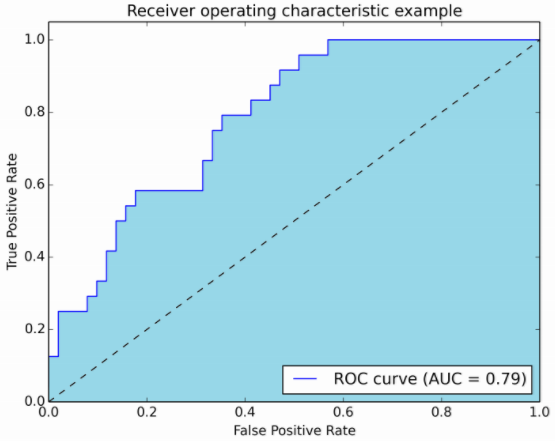

1. IoU (Intersection over Union)，交集并集比

2. ROI (region of interest) , 感兴趣区域

3. ROC (Receiver Operating Characteristic curve) 受试者工作特征曲线

4. AUC (Area Under the Curve) ， 曲线下区域

TP作为纵坐标，FP作为横坐标，就是一个类别的ROC曲线了 ：

曲线下的蓝色区域就是曲线下区域AUC (Area Under the Curve)了 如果AUC的面积为1，恭喜你，在这个类别上你的准确率是最高的。AUC一般越大越好，说明某个类别的分类准确度越高。