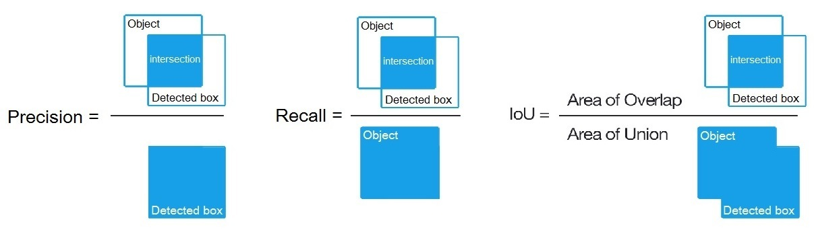

# 召回率(Recall) 和 精确率(Precision) 

```
                     Condition: A        Not A

  Test says “A”      True positive   |   False positive
                     ----------------------------------
  Test says “Not A”  False negative  |    True negative
```


召回率 Recall = TP / (TP + FN)

准确率 Precision = TP / (TP + FP)

召回率是从数据集的同一标签的样本抽样；
而准确率是从已经预测为同一类别的样本抽样。

在机器视觉目标检测领域也是一样的，recall和precision只是分母抽样的方式不同：


# AP
为了更好地评估一个模型的准确率，人们提出的单个类别平均精度（AP），把准确率在recall值为Recall = {0, 0.1, 0.2, 0.3, 0.4, 0.5, 0.6, 0.7, 0.8, 0.9, 1}时（总共11个rank水平上），求平均值：

AP = 1/11 ∑ recall∈{0,0.1,…,1} Precision(Recall)

# mAP
另一个平均精度均值(mAP)，只是把每个类别的AP都算了一遍，再取平均值：

mAP = AVG(AP for each object class)

因此，AP是针对单个类别的，mAP是针对所有类别的。

在机器视觉目标检测领域，AP和mAP分界线并不明显，只要IoU > 0.5的检测框都可以叫做AP0.5，这时AP和mAP表达都是多类检测的精度，关注点在检测框的精度上。