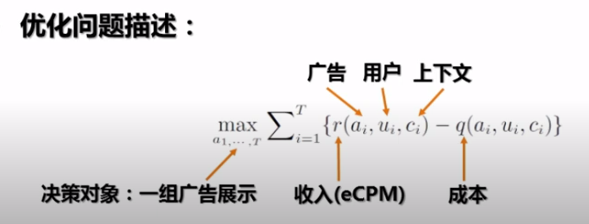
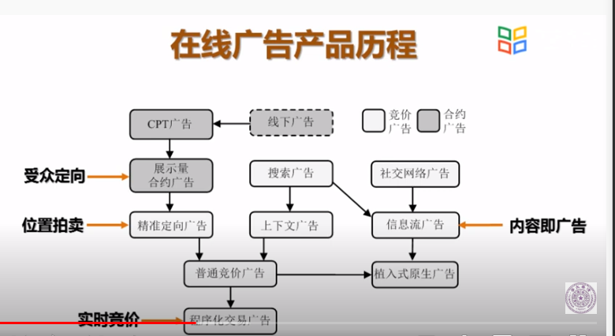
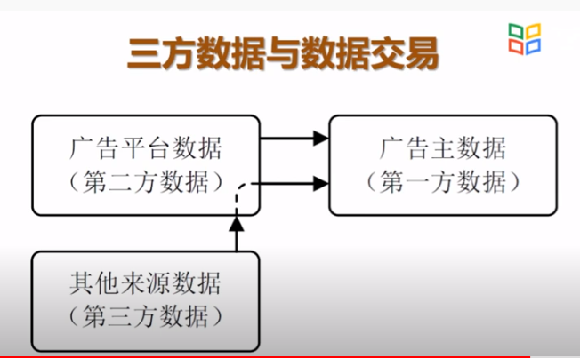
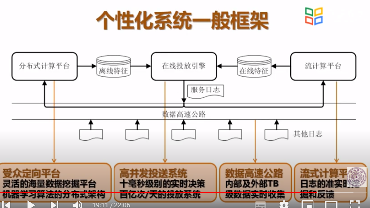
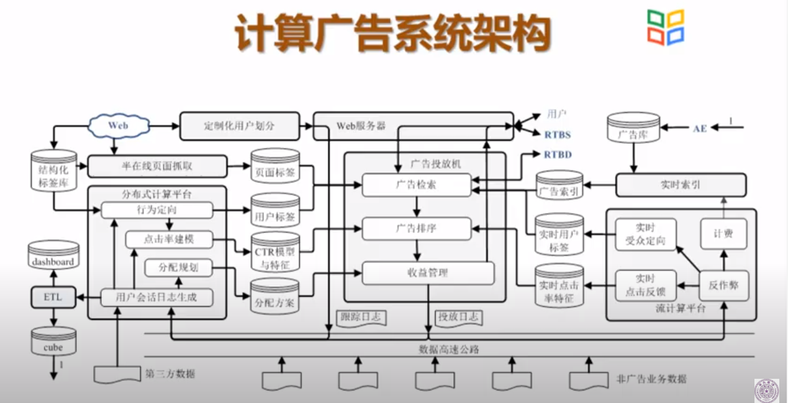

# 1 互联网与商业化 

戏说互联网思维之“三个不要”
1. 不要钱
   1. 免费倾销加**后向变现**的商业模式
      1. 流量
      2. 数据
   2. 所有能够传播信息的商品，售价都会趋向其边际成本
2. 不要脸
   1. 无底线迎合用户的产品与营销方式
3. 不要命
   1. 用期权和价值观让程序猿在疯狂状态下全天候工作。

与商业化相关的产品问题
1. 商业模式探索
2. 流量变现
3. 数据变现
4. 商业产品建设与运营

# 2 大数据与计算广告

大数据与计算广告的关系
- 典型大数据问题，解决问题的效果随着采样采样率降低显著降低，例如计算广告、个性化推荐等
- 一般数据分析，非大数据问题，解决问题的效果在采样率降低时变化很小，例如各种洞察、单维度统计等
- 过渡类型问题，解决问题的效果随采样率降低温和下降，例如文本主题分析等。

两类数据应用：洞察与自动化
- 洞察（Insight）
  - 全局或局部统计性的信息（统计数据）
  - 例：财务报表、人口统计、百度迁徙地图等
  - 主要用于宏观决策支持，面向领导和运营人员
- 自动化（Automation）
  - 个体的行为特征信息（行为数据）
  - 例：定向广告、个人信用、企业信息等
  - 主要用于微观业务实施，面向机器和销售人员
  - 无底线迎合用户的产品与营销方式

数据变现基本原理
流量价值
数据价值

关于在线广告
- 在线广告支撑了互联网行业的大半壁江山。不了解互联网广告，就不可能深入了解互联网。
- 在线广告是迄今为止，大数据领域唯一形成规模化营收的应用。
- 在线广告是结合了计算技术、心理学、经济学、营销学等的综合应用。

- 品牌广告（Brand Awareness）
  - 创造独特良好的品牌或产品形象，目的在于提升较长时期内的离线转化率。
  - 能拉动利润率。
- 效果广告（Direct Response）
  - 有短期内明确用户转化行为诉求的广告。用户转化行为例如：购买、注册、投标、捐款等。
  - 数字广告适合。

# 3 计算广告介绍
计算广告核心挑战
- 计算广告的核心问题，是为一系列用户与环境的组合，找到最合适的广告投放策略以优化整体广告活动的利润。
- 优化问题描述：
  - $\max \Sigma_{i=1}^T \{r(a_i,u_i,c_i) - q(a_i,u_i,c_i)\}$
  - 决策对象：一组效果展示
  - r：收入（eCPM）
  - q：成本
  - a：广告
  - u：用户
  - c：上下文

广告收入的分解
展现页->**点击**->落地页->**转化**->转化页
$$
eCPM = r(a,u,c)=\mu(a,u,c)\cdot v(a,u)
$$
点击率：    $\mu(a,u,c)$
点击价值：  $v(a,u)$

