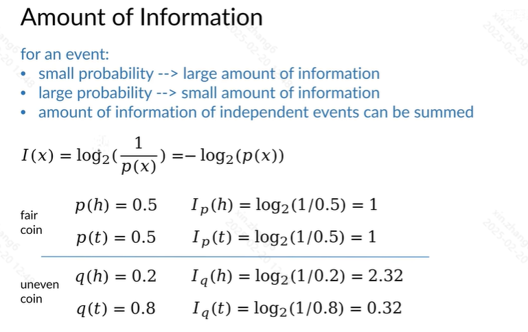
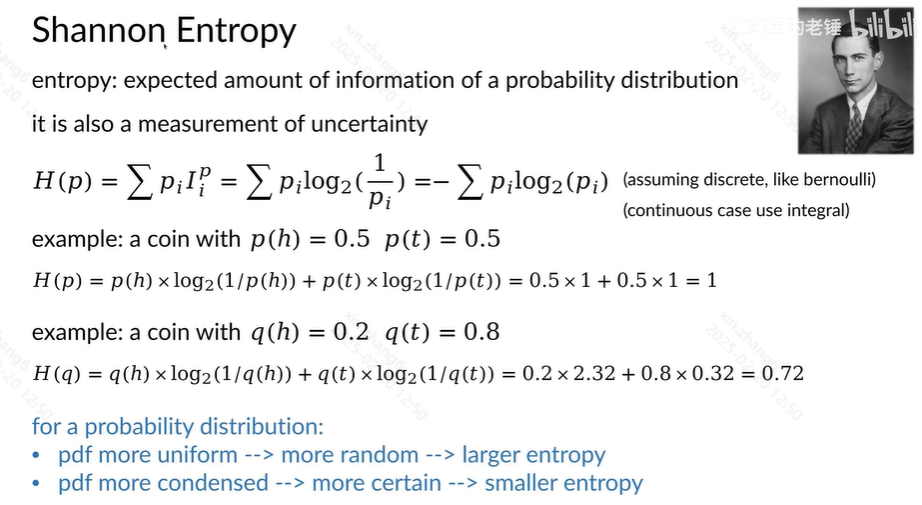
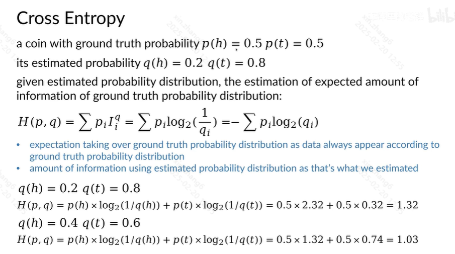
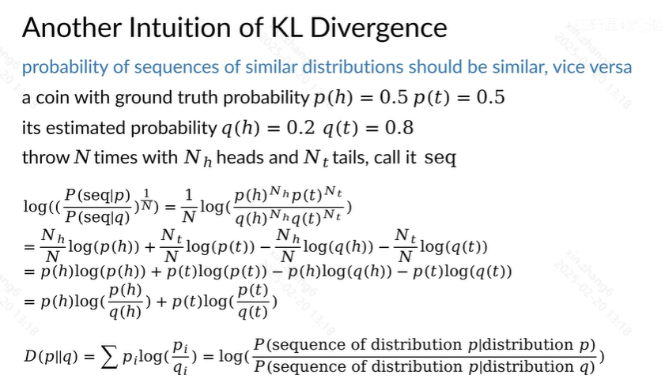
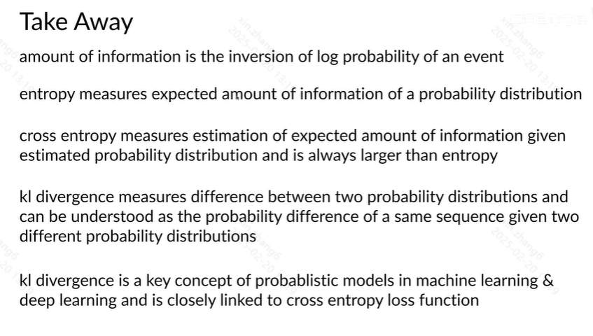

# 1 Amount of Information 信息量
for an event:
- small probability --> large amount information 小概率事件带来了很大的信息量
- large probability --> small amount information
- amount of information of independent events can be assummed

$$
I(x) = \log_2{\frac 1 {p(x)}} = - \log_2 {p(x)}
$$

# 2 Shannon Entropy 香农熵

熵：概率分布的预期信息量

# 3 Cross Entropy 交叉熵

# 4 KL Divergence

# 5 Another Intuition of KL Divergence

# 6 Take Away

