谢翔：矩阵元算法科学家

# 1 隐私计算的兴起
数据是支撑AI发展的“能源”，但原始数据的滥用带来一系列问题。

隐私计算：从技术的角度解决AI对数据使用中的隐私问题。
- 契合旨在构建更加以人为本的responsible AI潮流方向。
- 未来市场潜力巨大，促进数据作为价值要素的自由流动。

概念：隐私计算是指在保证数据提供方不泄露原始数据的前提下，对数据进行搜集、处理，完成数据价值挖掘的技术体系，保障数据在流通和融合过程中的“可用不可见”，有广泛的应用前景，也面临诸多挑战。

# 2 隐私计算的主要技术路线
技术方向 | 主要特点 | 主要优势 | 主要劣势
--|--|--|--
可信执行环境    | 硬件安全“飞地”        | 性能高效、容易切换                    | 需要信任硬件厂商；目前计算、存储能力有限
联邦学习        | 数据不动模型动        | 相对高效、分布式机器学习的延伸            | 安全性没有得到充分研究，一般仍需要结合加密技术
密码学          | 可证明安全            | 相对高效，能够适配各种类场景以及安全需求  | 具有一定性能瓶颈，使用和理解门槛较高。

## 2.1 安全多方计算（MPC）
姚期智 1982年
多个参与方在不泄露隐私数据的提前下，对等的进行协同计算。
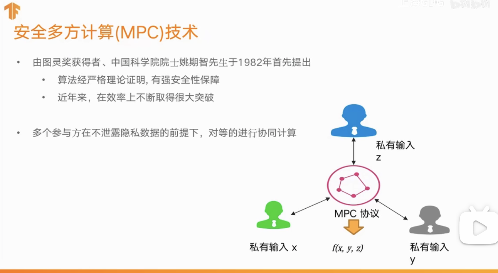

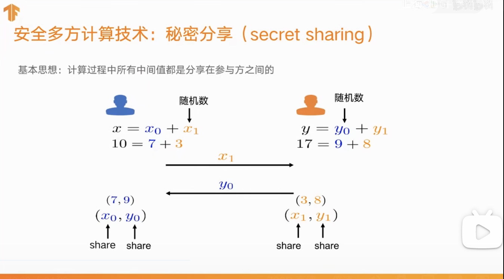

隐私计算的落地：隐私AI开源框架
- 工程技术挑战
  - 系统易用性：面向AI，不需要了解密码学等技术
  - 系统高效性：优化密码算法的计算和通讯
  - 系统可扩展性：快速集成新的隐私计算协议
- 再有框架还处于早期探索阶段
- Rosetta的特色：
  - 使用上：修改几行代码完成切换
  - 架构上：前端python和后端C++都进行改造

## 2.2 秘密分享

# 3 Rosetta的使用：一个例子
一个Matmul demo
三方运行同一份代码：
1. import rosetta，选择MPC协议
2. 处理私有数据
3. 复用TF中API表达计算逻辑
4. 部署执行
   1. 进行网络拓扑等的配置
   2. 多方本地启动程序运行

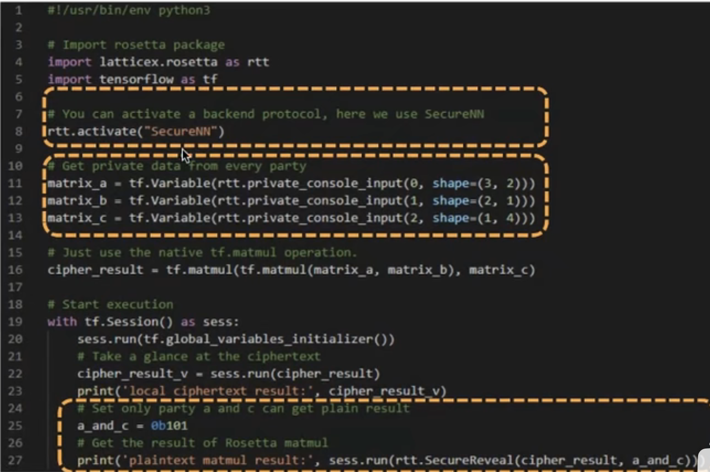

# 4 Rosetta的TF架构设计
Rosetta目前基于TF 1.14版本。

- TF快速回顾：核心概念
  - Tensor      封装同一类型数据的高维数组，承载数据的流动
  - Operation   封装对Tensor进行计算的逻辑，如矩阵乘法matmul
  - Graph       以Operation等为Node，Tensor等为Edge构成的有向无环图（DAG）
  - Session     Graph运行时的上下文环境
- TF快速回顾：宏观处理过程
  - 前向图          用户调用 算子API时自动构建
  - 反向（梯度）图   在训练中调用 优化器（Optimizer）的minimize接口时，TF找到前向图中各算子对应的梯度算法，根据链式求导法则则自动的添加反向梯度子图。
  - 图的并行化招行   在调动tf.Session.run时进一步分析图、优化图，并最终在当前上下文的控制下在多设备有序并发执行。
- TF快速回顾：对自定义算法的扩展支持
  - 使用custom c++ op 扩展方式的好处
    - 表达更加复杂的逻辑
    - 更高效的进行内部实现

## 4.1 数据流图的自动化构建

处理过程详解：基于Static Pass构建图
- import rosetta时，替换原生算子为对应的RttOp，以构建支持密文Tensor的前向图
  - RttOp：与后端MPC隐私计算完全无关的辅助中间层，一系列的“浮标”置位算子，支持自定义的Tensor类型
- 调用 session.run 时
  - 前向图：将RttOp进一步替换为对应的SecureOp
    - 替换规则：    只要Op输入的Tensor不全是本地const明文时就进行替换
    - SecureOP：    完整的前后端算子库，具有对应的梯度算子；在内部实现中调用 隐私协议 层的抽象算子接口实现和TF的对接。
  - 反向图：如果程序中调用了优化器Optimizer，通过对tf中自动求导机制的改造，仍可自动得到梯度反向图
    - 自动求导改造方案：在tf.python.ops.gradients_util等入口处hook原生函数，使得支持tf.string类型的自动求导。

## 4.2 数据流图的执行时优化

处理过程详解：基于Dynamic Pass执行图
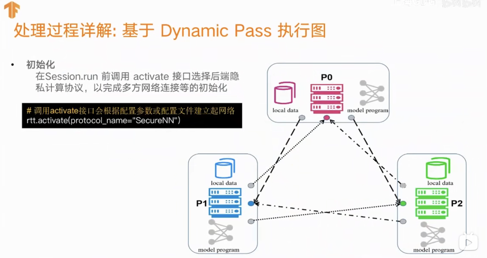

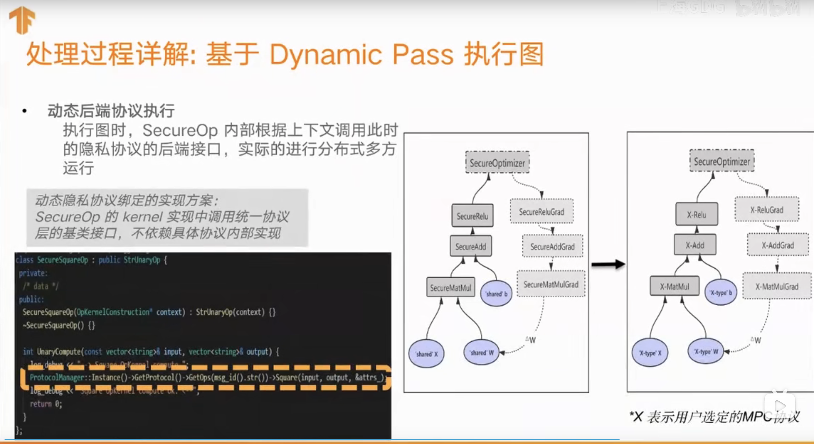

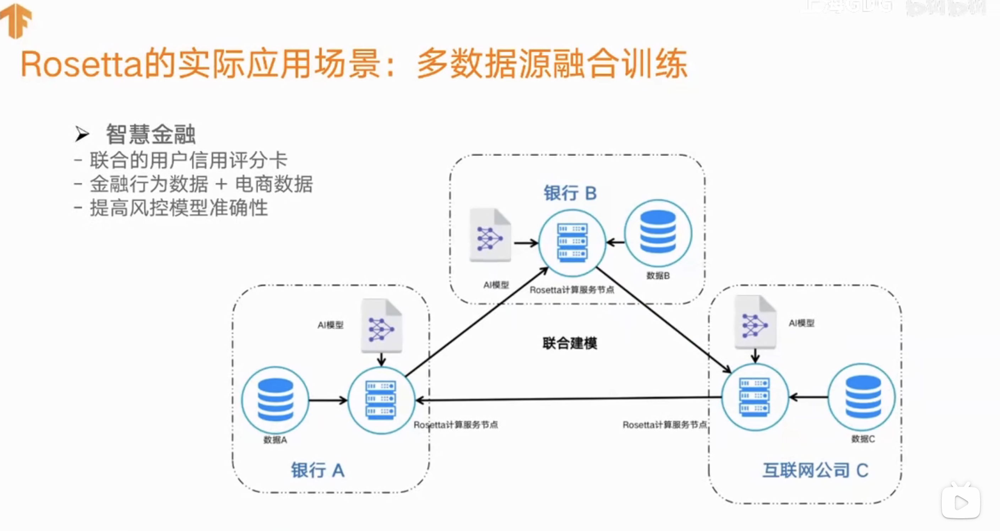
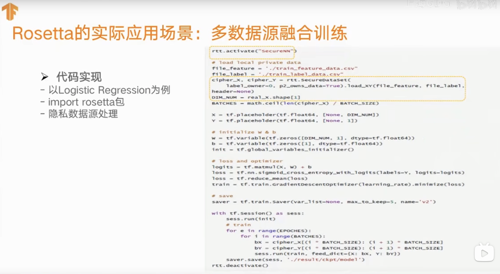

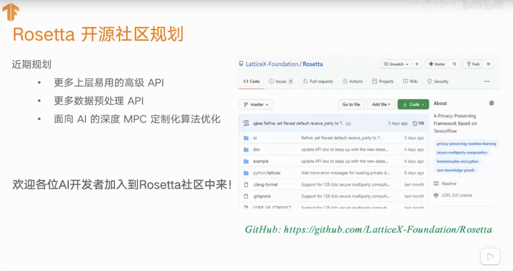

# 5 Rosetta的下一步

Rosetta的实际应用场景：多数据源融合训练
- 智慧金融
  - 联合的用户信用评分表
  - 金融行为数据+电商数据
  - 提高风控模型准确性

# 6 产品介绍
Rosetta是支持主流深度学习框架Tensorflow的隐私AI开源框架，承载和结合隐私计算、区块链和AI三种典型技术，最终支撑起完备的隐私AI解决方案。 以AI工程师为目标人群，可以快速无门槛的从传统模式切换为隐私计算的模式。 其基于椭圆曲线算法、全同态加密算法、秘密分享和不经意传输算法、门限密码学综合应用的安全多方计算技术，可支持联合查询、联合建模、模型训练等。

# 7 产品架构

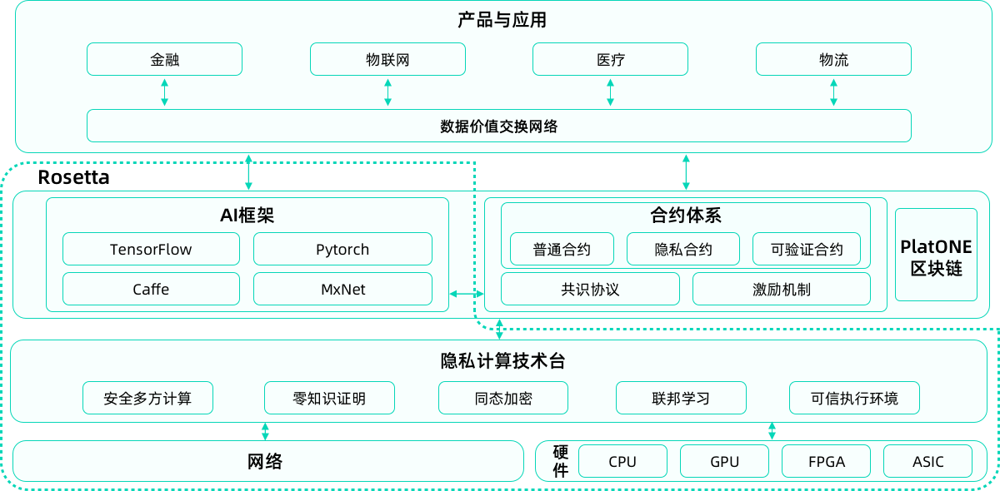
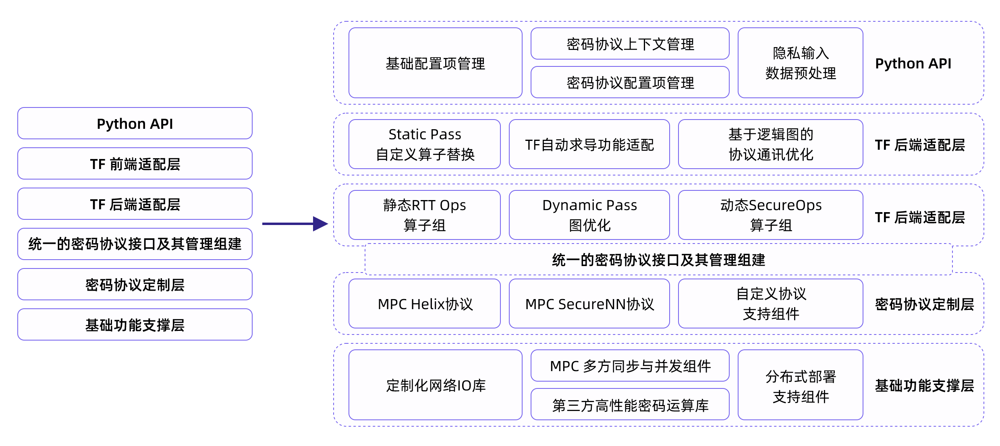

# 8 产品特性
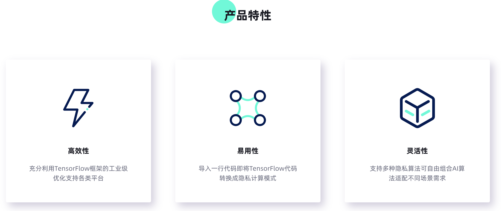

## 8.1 多方联合建模
- 场景描述
  - 两个或者多个企业之间拥有不同类型的数据，希望利用各自的数据共同建立/训练同一个AI模型。联合建模的前提是数据安全匹配，参考PSI系列。
- 方案优势
  - 可由Rosetta部署确定的模型框架。
  - 预测性能要远高于联合训练性能。
  - 可以按照需求指定预测结果的获得方。
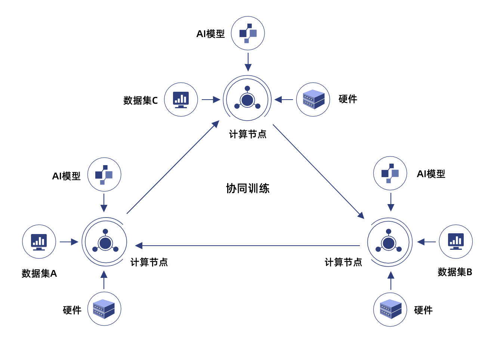

## 8.2 安全模型应用
- 场景描述
  - 一个企业拥有模型，另一个企业或者个人拥有数据。通过MPC和HE进行模型的安全使用，输出预测结果。保证模型方不会泄露任何模型的信息，数据方不会泄露数据的信息。
- 方案优势
  - 通过MPC和HE等技术可以保证多方数据的安全性。
  - 开源的Rosetta使得开发者不需要了解密码算法，直接复用原先代码。
  - 可以按照需求指定最后数据或模型获得方。

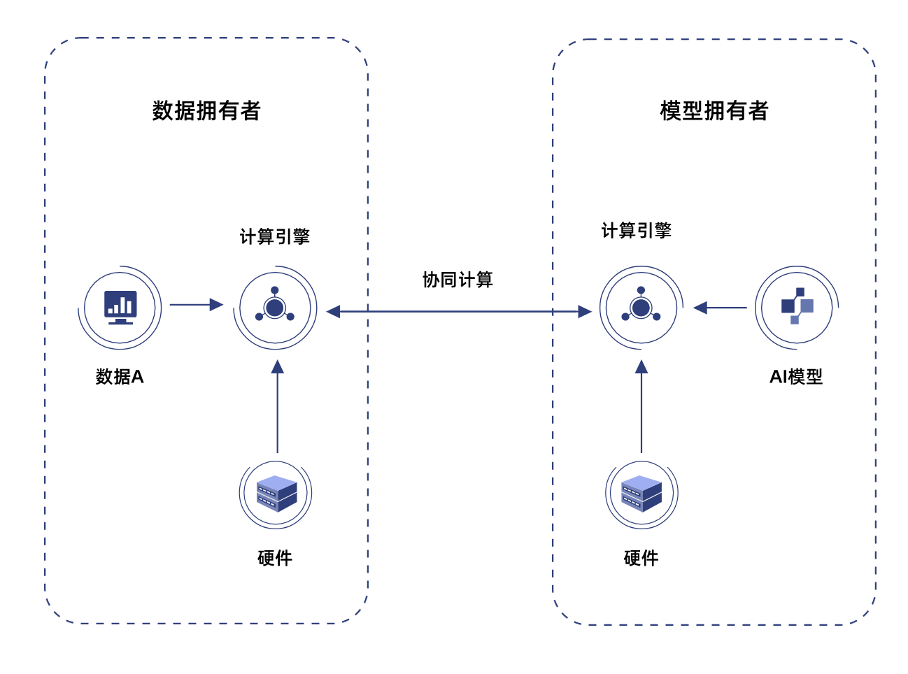
